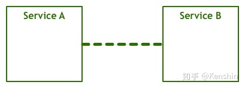
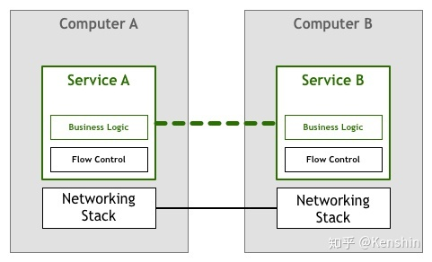
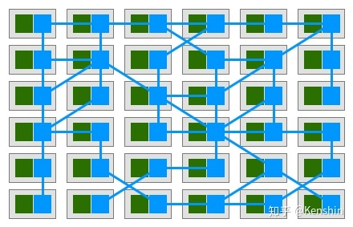
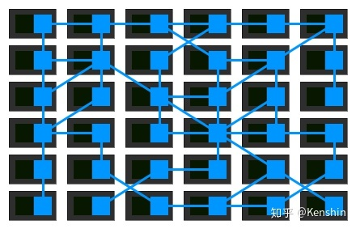

+++

title = "ServiceMesh"
description = "ServiceMesh"
tags = ["it","cn"]

+++

# ServiceMesh

https://zhuanlan.zhihu.com/p/61901608

https://link.zhihu.com/?target=http%3A//philcalcado.com/2017/08/03/pattern_service_mesh.html

## 发展历史

这里通过微服务和ServiceMesh技术的历史发展脉络来进行了解

### 抽象

不同服务间通信，开发人员想象中的抽象表示如下

### 原始通信时代

现实远比想象的复杂，实际情况中，通信需要底层能够传输字节码和电子信号的物理层来完成，在TCP协议出现之前，服务需要自己处理网络通信所面临的丢包、乱序、重试等一系列流控问题，因此服务实现中，除了业务逻辑外，还夹杂着对网络传输问题的处理逻辑。

### TCP时代

为了避免每个服务都需要自己实现一套相似的网络传输处理逻辑，TCP协议出现了，它解决了网络传输中通用的流量控制问题，将技术栈下移，从服务的实现中抽离出来，成为操作系统网络层的一部分。

### 第一代微服务

在TCP出现之后，机器之间的网络通信不再是一个难题，以GFS/BigTable/MapReduce为代表的分布式系统得以蓬勃发展。这时，分布式系统特有的通信语义又出现了，如熔断策略、负载均衡、服务发现、认证和授权、quota限制、trace和监控等等，于是服务根据业务需求来实现一部分所需的通信语义。

### 第二代微服务

为了避免每个服务都需要自己实现一套分布式系统通信的语义功能，随着技术的发展，一些面向微服务架构的开发框架出现了，如Twitter的[Finagle](https://link.zhihu.com/?target=https%3A//finagle.github.io/)、Facebook的[Proxygen](https://link.zhihu.com/?target=https%3A//code.facebook.com/posts/1503205539947302)以及Spring Cloud等等，这些框架实现了分布式系统通信需要的各种通用语义功能：如负载均衡和服务发现等，因此一定程度上屏蔽了这些通信细节，使得开发人员使用较少的框架代码就能开发出健壮的分布式系统。

### 第一代ServiceMesh

第二代微服务模式看似完美，但开发人员很快又发现，它也存在一些本质问题：

- 其一，虽然框架本身屏蔽了分布式系统通信的一些通用功能实现细节，但开发者却要花更多精力去掌握和管理复杂的框架本身，在实际应用中，去追踪和解决框架出现的问题也绝非易事；
- 其二，开发框架通常只支持一种或几种特定的语言，回过头来看文章最开始对微服务的定义，一个重要的特性就是语言无关，但那些没有框架支持的语言编写的服务，很难融入面向微服务的架构体系，想因地制宜的用多种语言实现架构体系中的不同模块也很难做到；
- 其三，框架以lib库的形式和服务联编，复杂项目依赖时的库版本兼容问题非常棘手，同时，框架库的升级也无法对服务透明，服务会因为和业务无关的lib库升级而被迫升级；

因此以Linkerd，Envoy，NginxMesh为代表的代理模式（边车模式）应运而生，这就是第一代Service Mesh，它将分布式服务的通信抽象为单独一层，在这一层中实现负载均衡、服务发现、认证授权、监控追踪、流量控制等分布式系统所需要的功能，作为一个和服务对等的代理服务，和服务部署在一起，接管服务的流量，通过代理之间的通信间接完成服务之间的通信请求，这样上边所说的三个问题也迎刃而解。

如果我们从一个全局视角来看，就会得到如下部署图：

如果我们暂时略去服务，只看Service Mesh的单机组件组成的网络：

限制已经理解何所谓Service Mesh，也就是服务网格了。它看起来确实就像是一个由若干服务代理所组成的错综复杂的网格。

### 第二代ServiceMesh

第一代Service Mesh由一系列独立运行的单机代理服务构成，为了提供统一的上层运维入口，演化出了集中式的控制面板，所有的单机代理组件通过和控制面板交互进行网络拓扑策略的更新和单机数据的汇报。这就是以Istio为代表的第二代Service Mesh。

只看单机代理组件(数据面板)和控制面板的Service Mesh全局部署视图如下：

## 总结

再回过头来看Buoyant的CEO William Morgan，也就是Service Mesh这个词的发明人，对Service Mesh的定义：

服务网格是一个**基础设施层**，用于处理服务间通信。云原生应用有着复杂的服务拓扑，服务网格保证**请求在这些拓扑中可靠地穿梭**。在实际应用当中，服务网格通常是由一系列轻量级的**网络代理**组成的，它们与应用程序部署在一起，但**对应用程序透明**。

**基础设施层**+**请求在这些拓扑中可靠穿梭**：这两个词加起来描述了Service Mesh的定位和功能，是不是似曾相识？没错，你一定想到了TCP；

**网络代理**：这描述了Service Mesh的实现形态；

**对应用透明**：这描述了Service Mesh的关键特点，正是由于这个特点，Service Mesh能够解决以Spring Cloud为代表的第二代微服务框架所面临的三个本质问题；

总结一下，Service Mesh具有如下优点：

- 屏蔽分布式系统通信的复杂性(负载均衡、服务发现、认证授权、监控追踪、流量控制等等)，服务只用关注业务逻辑；
- 真正的语言无关，服务可以用任何语言编写，只需和Service Mesh通信即可；
- 对应用透明，Service Mesh组件可以单独升级；

当然，Service Mesh目前也面临一些挑战：

- Service Mesh组件以代理模式计算并转发请求，一定程度上会降低通信系统性能，并增加系统资源开销；
- Service Mesh组件接管了网络流量，因此服务的整体稳定性依赖于Service Mesh，同时额外引入的大量Service Mesh服务实例的运维和管理也是一个挑战；

历史总是惊人的相似。为了解决端到端的字节码通信问题，TCP协议诞生，让多机通信变得简单可靠；微服务时代，Service Mesh应运而生，屏蔽了分布式系统的诸多复杂性，让开发者可以回归业务，聚焦真正的价值。