+++

title = "Kubernetes.base"
description = "Kubernetes.base"
tags = ["it", "cloudnative"]

+++


# Kubernetes.base

文章出自：https://draveness.me/，这里拷贝方便学习

## 架构设计与实现原理

Kubernetes 为软件工程师提供了强大的容器编排能力，模糊了开发和运维之间的边界，让我们开发、管理和维护一个大型的分布式系统和项目变得更加容易

### 介绍

Kubernetes 被定义成一个用于自动化部署、扩容和管理容器应用的开源系统；它将一个分布式软件的一组容器打包成一个个更容易管理和发现的逻辑单元。Kubernetes 目前是 Cloud Native Computing Foundation (CNCF) 的项目并且是很多公司管理分布式系统的解决方案。

Kubernetes 将已经打包好的应用镜像进行编排，所以如果没有容器技术的发展和微服务架构中复杂的应用关系，其实也很难找到合适的应用场景去使用，所以在这里我们会简单介绍 Kubernetes 的两大『依赖』——容器技术和微服务架构

#### 容器技术

Docker 已经是容器技术的事实标准了，作者在前面的文章中 [Docker 核心技术与实现原理](https://draveness.me/docker) 曾经介绍过 Docker 的实现主要依赖于 Linux 的 namespace、cgroups 和 UnionFS

它让开发者将自己的应用以及依赖打包到一个可移植的容器中，让应用程序的运行可以实现环境无关。

我们能够通过 Docker 实现进程、网络以及挂载点和文件系统隔离的环境，并且能够对宿主机的资源进行分配，这能够让我们在同一个机器上运行多个不同的 Docker 容器，任意一个 Docker 的进程都不需要关心宿主机的依赖，都各自在镜像构建时完成依赖的安装和编译等工作，这也是为什么 Docker 是 Kubernetes 项目的一个重要依赖。

#### 微服务架构

如果今天的软件并不是特别复杂并且需要承载的峰值流量不是特别多，那么后端项目的部署其实也只需要在虚拟机上安装一些简单的依赖，将需要部署的项目编译后运行就可以了。

但是随着软件变得越来越复杂，一个完整的后端服务不再是单体服务，而是由多个职责和功能不同的服务组成，服务之间复杂的拓扑关系以及单机已经无法满足的性能需求使得软件的部署和运维工作变得非常复杂，这也就使得部署和运维大型集群变成了非常迫切的需求。

#### 小结

Kubernetes 的出现不仅主宰了容器编排的市场，更改变了过去的运维方式，不仅将开发与运维之间边界变得更加模糊，而且让 DevOps 这一角色变得更加清晰，每一个软件工程师都可以通过 Kubernetes 来定义服务之间的拓扑关系、线上的节点个数、资源使用量并且能够快速实现水平扩容、蓝绿部署等在过去复杂的运维操作。

### 设计

这一小节我们将介绍 Kubernetes 的一些设计理念，这些关键字能够帮助了解 Kubernetes 在设计时所做的一些选择：


这里将按照顺序分别介绍声明式、显式接口、无侵入性和可移植性这几个设计的选择能够为我们带来什么

#### 声明式

声明式（Declarative）的编程方式一直都会被工程师们拿来与命令式（Imperative）进行对比，这两者是完全不同的编程方法。我们最常接触的其实是命令式编程，它要求我们描述为了达到某一个效果或者目标所需要完成的指令，常见的编程语言 Go、Ruby、C++ 其实都为开发者了命令式的编程方法，

在 Kubernetes 中，我们可以直接使用 YAML 文件定义服务的拓扑结构和状态：

```yaml
apiVersion: v1
kind: Pod
metadata:
  name: rss-site
  labels:
    app: web
spec:
  containers:
    - name: front-end
      image: nginx
      ports:
        - containerPort: 80
    - name: rss-reader
      image: nickchase/rss-php-nginx:v1
      ports:
        - containerPort: 88
```

这种声明式的方式能够大量地减少使用者的工作量，极大地增加开发的效率，这是因为声明式能够简化需要的代码，减少开发人员的工作，如果我们使用命令式的方式进行开发，虽然在配置上比较灵活，但是带来了更多的工作

```sql
SELECT * FROM posts WHERE user_id = 1 AND title LIKE 'hello%';
```

SQL 其实就是一种常见的声明式『编程语言』，它能够让开发者自己去指定想要的数据是什么，Kubernetes 中的 YAML 文件也有着相同的原理，我们可以告诉 Kubernetes 想要的最终状态是什么，而它会帮助我们从现有的状态进行迁移。


如果 Kubernetes 采用命令式编程的方式提供接口，那么工程师可能就需要通过代码告诉 Kubernetes 要达到某个状态需要通过哪些操作，相比于更关注状态和结果声明式的编程方式，命令式的编程方式更强调过程。

总而言之，Kubernetes 中声明式的 API 其实指定的是集群期望的运行状态，所以在出现任何不一致问题时，它本身都可以通过指定的 YAML 文件对线上集群进行状态的迁移，就像一个水平触发的系统，哪怕系统错过了相应的事件，最终也会根据当前的状态自动做出做合适的操作。

#### 显式接口

第二个 Kubernetes 的设计规范其实就是 —— 不存在内部的私有接口，所有的接口都是显示定义的，组件之间通信使用的接口对于使用者来说都是显式的，我们都可以直接调用。


当 Kubernetes 的接口不能满足工程师的复杂需求时，我们需要利用已有的接口实现更复杂的特性，在这时 Kubernetes 的这一设计就不会成为自定义需求的障碍。

#### 无侵入性

为了尽可能满足用户（工程师）的需求，减少工程师的工作量与任务并增强灵活性，Kubernetes 为工程师提供了无侵入式的接入方式，每一个应用或者服务一旦被打包成了镜像就可以直接在 Kubernetes 中无缝使用，不需要修改应用程序中的任何代码。


Docker 和 Kubernetes 就像包裹在应用程序上的两层，它们两个为应用程序提供了容器化以及编排的能力，在应用程序内部却不需要任何的修改就能够在 Docker 和 Kubernetes 集群中运行，这是 Kubernetes 在设计时选择无侵入带来最大的好处，同时无侵入的接入方式也是目前几乎所有应用程序或者服务都必须考虑的一点。

#### 可移植性

在微服务架构中，我们往往都会让所有处理业务的服务变成无状态的服务，以前在内存中存储的数据、Session 等缓存，现在都会放到 Redis、ETCD 等数据库中存储，微服务架构要求我们对业务进行拆分并划清服务之间的边界，所以有状态的服务往往会对架构的水平迁移带来障碍。

然而有状态的服务其实是无可避免的，我们将每一个基础服务或者业务服务都变成了一个个只负责计算的进程，但是仍然需要有其他的进程负责存储易失的缓存和持久的数据，Kubernetes 对这种有状态的服务也提供了比较好的支持。

**PersistentVolume**：Kubernetes 引入了 `PersistentVolume` 和 `PersistentVolumeClaim` 的概念用来屏蔽底层存储的差异性，目前的 Kubernetes 支持下列类型的 `PersistentVolume`：


这些不同的 `PersistentVolume` 会被开发者声明的 `PersistentVolumeClaim` 分配到不同的服务中，对于上层来讲所有的服务都不需要接触 `PersistentVolume`，只需要直接使用 `PersistentVolumeClaim` 得到的卷就可以了。

### 架构

**架构**：Kubernetes 遵循非常传统的客户端服务端架构，客户端通过 RESTful 接口或者直接使用 kubectl 与 Kubernetes 集群进行通信，这两者在实际上并没有太多的区别，后者也只是对 Kubernetes 提供的 RESTful API 进行封装并提供出来


**组成**：每一个 Kubernetes 集群都由一组 Master 节点和一系列的 Worker 节点组成，其中 Master 节点主要负责存储集群的状态并为 Kubernetes 对象分配和调度资源。

#### Master

作为管理集群状态的 Master 节点，它主要负责接收客户端的请求，安排容器的执行并且运行控制循环，将集群的状态向目标状态进行迁移，Master 节点内部由三个组件构成：


**API Server**：负责处理来自用户的请求，其主要作用就是对外提供 RESTful 的接口，包括用于查看集群状态的读请求以及改变集群状态的写请求，也是唯一一个与 etcd 集群通信的组件。

**Controller**：管理器运行了一系列的控制器进程，这些进程会按照用户的期望状态，在后台不断地调节整个集群中的对象，当服务的状态发生了改变，控制器就会发现这个改变并且开始向目标状态迁移。

**Scheduler**：调度器为 Kubernetes 中运行的 Pod 选择部署的 Worker 节点，它会根据用户的需要选择最能满足请求的节点来运行 Pod，它会在每次需要调度 Pod 时执行。

#### Worker

其它的 Worker 节点实现就相对比较简单了，它主要由 kubelet 和 kube-proxy 两部分组成：


**kubelet**：是一个节点上的主要服务，它周期性地从 API Server 接受新的或者修改的 Pod 规范，并且保证节点上的 Pod 和其中容器的正常运行，还会保证节点会向目标状态迁移，该节点仍然会向 Master 节点发送宿主机的健康状况。

**kube-proxy**：是一个运行在各个节点上的代理服务，负责宿主机的子网管理，同时也能将服务暴露给外部，其原理就是在多个隔离的网络中把请求转发给正确的 Pod 或者容器。

### 实现原理

到现在，我们已经对 Kubernetes 有了一些简单的认识和了解，也大概清楚了 Kubernetes 的架构，在这一小节中我们将介绍 Kubernetes 中的一些重要概念和实现原理。

#### 对象

**Kubernetes 对象**：是系统中的持久实体，它使用这些对象来表示集群中的状态，这些对象能够描述：容器化应用，应用资源，重启/升级 策略。


这些对象描述了哪些应用应该运行在集群中，它们请求的资源下限和上限以及重启、升级和容错的策略。每一个创建的对象其实都是我们对集群状态的改变，这些对象描述的其实就是集群的期望状态，Kubernetes 会根据我们指定的期望状态不断检查对当前的集群状态进行迁移。

```go
type Deployment struct {
	metav1.TypeMeta `json:",inline"`
	metav1.ObjectMeta `json:"metadata,omitempty" protobuf:"bytes,1,opt,name=metadata"`

	Spec DeploymentSpec `json:"spec,omitempty" protobuf:"bytes,2,opt,name=spec"`
	Status DeploymentStatus `json:"status,omitempty" protobuf:"bytes,3,opt,name=status"`
}
```

每一个对象都包含两个嵌套对象来描述规格（Spec）和状态（Status），对象的规格其实就是我们期望的目标状态，而状态描述了对象的当前状态，这部分一般由 Kubernetes 系统本身提供和管理，是我们观察集群本身的一个接口。

#### Pod

Pod 是 Kubernetes 中最基本的概念，它也是 Kubernetes 对象模型中我们可以创建或者部署的最小并且最简单的单元。


它将应用的容器、存储资源以及独立的网络 IP 地址等资源打包到了一起，表示一个最小的部署单元，但是每一个 Pod 中的运行的容器可能不止一个，这是因为 Pod 最开始设计时就能够在多个进程之间进行协调，构建一个高内聚的服务单元，这些容器能够共享存储和网络，非常方便地进行通信。

#### Controller

最后要介绍的就是 Kubernetes 中的控制器，它们其实是用于创建和管理 Pod 的实例，能够在集群的层级提供复制、发布以及健康检查的功能，这些控制器其实都运行在 Kubernetes 集群的主节点上。

在 Kubernetes 的 [kubernetes/pkg/controller/](https://github.com/kubernetes/kubernetes/tree/master/pkg/controller) 目录中包含了官方提供的一些常见控制器，我们可以通过下面这个函数看到所有需要运行的控制器：

```go
func NewControllerInitializers(loopMode ControllerLoopMode) map[string]InitFunc {
	controllers := map[string]InitFunc{}
	controllers["endpoint"] = startEndpointController
	controllers["replicationcontroller"] = startReplicationController
	controllers["podgc"] = startPodGCController
	controllers["resourcequota"] = startResourceQuotaController
	controllers["namespace"] = startNamespaceController
	controllers["serviceaccount"] = startServiceAccountController
	controllers["garbagecollector"] = startGarbageCollectorController
	controllers["daemonset"] = startDaemonSetController
	controllers["job"] = startJobController
	controllers["deployment"] = startDeploymentController
	controllers["replicaset"] = startReplicaSetController
	controllers["horizontalpodautoscaling"] = startHPAController
	controllers["disruption"] = startDisruptionController
	controllers["statefulset"] = startStatefulSetController
	controllers["cronjob"] = startCronJobController
	// ...

	return controllers
}
```

这些控制器会随着控制器管理器的启动而运行，它们会监听集群状态的变更来调整集群中的 Kubernetes 对象的状态，在后面的文章中我们会展开介绍一些常见控制器的实现原理。

### 总结

作为 Kubernetes 系列文章的开篇，我们已经了解了它出现的背景、依赖的关键技术，同时我们也介绍了 Kubernetes 的架构设计，主节点负责处理客户端的请求、节点的调度，最后我们提到了几个 Kubernetes 中非常重要的概念：对象、Pod 和控制器，在接下来的文章中我们会深入介绍 Kubernetes 的实现原理。


## Kubernetes 对象

上一篇文章中，我们其实介绍了 Kubernetes 的对象其实就是系统中持久化的实体，Kubernetes 用这些实体来表示集群中的状态，它们描述了集群中运行的容器化应用以及这些对象占用的资源和行为。


不过当我们想要了解 Kubernetes 的实现原理时，绕不开的其实就是 Kubernetes 中的对象，而在 Kubernetes 中，规格（Spec）和状态（Status）是用于描述 Kubernetes 对象的两个最重要的嵌套对象，在这篇文章中会重点介绍对象的规格和状态的使用方式和实现原理。

### 简介

在真正展开介绍对象的规格和状态之前，我们首先需要介绍 Kubernetes 中所有对象都有的三个字段 `apiVersion`、`kind` 和 `metadata`，我们从一个常见的对象描述文件来展开介绍：

```yaml
apiVersion: v1
kind: Pod
metadata:
  name: nginx
  labels:
    name: nginx
spec:
  # ...
```

YAML

#### API 组和类型

`apiVersion` 和 `kind` 共同决定了当前的 YAML 配置文件应该由谁来进行处理，前者表示描述文件使用的 API 组，后者表示一个 API 组中的一个资源类型，这里的 `v1` 和 `Pod` 表示的就是核心 API 中组 `api/v1` 中的 `Pod` 类型对象。

除了一些 Kubernetes 的核心 API 组和资源之外，还有一些 Kubernetes 官方提供的扩展 API 组 `apis/batch/v1`、`apis/extensions/v1beta1` 等等，除此之外，我们也可以通过 `CustomResourceDefinition` 或者实现 apiserver 来定义新的对象类型。

#### 元数据

`apiVersion` 和 `kind` 描述了当前对象的一些最根本信息，而 `metadata` 能够为我们提供一些用于唯一识别对象的数据，包括在虚拟集群 `namespace` 中唯一的 `name` 字段，用于组织和分类的 `labels` 以及用于扩展功能的注解 `annotations`。

```go
type ObjectMeta struct {
	Name string
	Namespace string
	Labels map[string]string
	Annotations map[string]string
	// ...
}
```

Go

上述的结构体嵌入在 Kubernetes 的每一个对象中，为所有的对象提供类似命名、命名空间、标签和注解等最基本的支持，让开发者能够更好地管理 Kubernetes 集群。

##### 标签和选择器

每一个 Kubernetes 对象都可以被打上多个标签，这些标签可以作为过滤项帮助我们选择和管理集群内部的 Kubernetes 对象，下面的命令可以获取到生产环境中的所有前端项目：

```bash
kubectl get pods -l environment=production,tier=frontend
```

Bash

除了使用 kubectl 直接与 Kubernetes 集群通信获取其中的对象信息之外，我们也可以在 YAML 文件中使用选择器来达到相同的效果：

```yaml
selector:
  matchLabels:
    environment: production
    tier: frontend
```

YAML

标签的主要作用就是对 Kubernetes 对象进行分类，这里我们可以简单给一些常见的分类方法：


这些标签能够帮助我们在复杂的集群中快速选择一系列的 Kubernetes 对象，用好标签能够为管理集群带来非常大的帮助。

##### 命名空间

Kubernetes 支持通过命名空间在一个物理集群中划分出多个虚拟集群，这些虚拟集群就是单独的命名空间。不同的命名空间可以对资源进行隔离，它们没有办法直接使用 `name` 访问其他命名空间的服务，而是需要使用 FQDN(fully qualified domain name)。


也就是说当我们创建一个 Service 时，它实际上在集群中加入了类似 `<service>.<namespace>.svc.cluster.local` 的 DNS 记录，在同一个命名空间中，我们可以直接使用 `service` 来访问目标的服务，但是在访问其他命名空间中的服务时却没有办法这么做。

#### 对象接口

Kubernetes 中的对象其实并不是 `struct`，而是一个 `interface`，其中定义了一系列的 Getter/Setter 接口：

```go
type Object interface {
	GetNamespace() string
	SetNamespace(namespace string)
	GetName() string
	SetName(name string)
	GetGenerateName() string
	SetGenerateName(name string)
	GetUID() types.UID
	SetUID(uid types.UID)
	// ...
}
```

Go

这些 Getter/Setter 接口获取的字段基本都是 `ObjectMeta` 结构体中定义的一些字段，这也是为什么 Kubernetes 对象都需要嵌入一个 `ObjectMeta` 结构体。

### Spec

对象的规格（Spec）描述了某一个实体的期望状态，每一个对象的 Spec 基本都是由开发或者维护当前对象的工程师指定的，以下面的 busybox 举例：

```yaml
apiVersion: v1
kind: Pod
metadata:
  name: busybox
  labels:
    app: busybox
spec:
  containers:
  - image: busybox
    command:
      - sleep
      - "3600"
    imagePullPolicy: IfNotPresent
    name: busybox
  restartPolicy: Always
```

YAML

作为一个 Pod 对象，它其实就是一个在 Kubernetes 中运行的最小、最简单的单元，所以它的 Spec 声明的就是其中包含的容器以及容器的镜像、启动命令等信息。

但是另一种对象 Service 就有着完全不同的 Spec 参数，作为一个一组 Pod 访问方式的抽象，它需要指定流量转发的 Pod 以及目前的端口号：

```yaml
kind: Service
apiVersion: v1
metadata:
  name: nginx
spec:
  selector:
    app: nginx
  ports:
  - protocol: TCP
    port: 80
    targetPort: 80
```

YAML

我们可以看出，不同的 Kubernetes 对象基本上有着完全不同的 Spec，接下来我们按照 Kubernetes 项目中的源代码分别介绍如何描述几种不同的 Kubernetes 对象。

#### Pod

作为一个 Kubernetes 对象，结构体 `Pod` 中嵌入了 `metav1.TypeMeta` 和 `metav1.ObjectMeta` 两个结构，这两个结构体中包含了 `Object` 接口中需要的函数：

```go
type Pod struct {
	metav1.TypeMeta `json:",inline"`
	metav1.ObjectMeta `json:"metadata,omitempty" protobuf:"bytes,1,opt,name=metadata"`
	Spec PodSpec `json:"spec,omitempty" protobuf:"bytes,2,opt,name=spec"`
	Status PodStatus `json:"status,omitempty" protobuf:"bytes,3,opt,name=status"`
}

type PodSpec struct {
	InitContainers []Container `json:"initContainers,omitempty" patchStrategy:"merge" patchMergeKey:"name" protobuf:"bytes,20,rep,name=initContainers"`
	Containers []Container `json:"containers" patchStrategy:"merge" patchMergeKey:"name" protobuf:"bytes,2,rep,name=containers"`
	RestartPolicy RestartPolicy `json:"restartPolicy,omitempty" protobuf:"bytes,3,opt,name=restartPolicy,casttype=RestartPolicy"`
	// ...
}
```

Go

`Pod` 结构体中的 `PodSpec` 就是我们在 YAML 文件中定义的嵌套对象了，由于该结构体非常复杂（加上注释有 180 行），在这一节中我们只会简单介绍其中的几个字段。


`InitContainers` 是当前 Pod 启动时需要首先执行的一系列容器，这些容器没有生命周期，也没有探针，它们的主要作用就是在容器启动时进行一些资源和依赖的初始化配置；接下来的 `Containers` 数组就是 Pod 正常运行时包含的一系列容器了，这些容器会共享网络和进程，运行在同一个『虚拟机』上，所以也可以相互通信。

最后的 `RestartPolicy` 其实就整个 Pod 的重启策略，我们可以选择不重启 `Never`、在出现错误时重启 `OnFailure` 或者总是重启 `Always`。

#### Service

Kubernetes 中另一个常见对象 Service 的规格就有很大的不同了，虽然他们两者有着完全相同的嵌入结构 `metav1.TypeMeta` 和 `metav1.ObjectMeta` 以及字段 `Spec` 和 `Status`，但是它们的规格和状态却完全不同：

```go
type Service struct {
	metav1.TypeMeta `json:",inline"`
	metav1.ObjectMeta `json:"metadata,omitempty" protobuf:"bytes,1,opt,name=metadata"`
	Spec ServiceSpec `json:"spec,omitempty" protobuf:"bytes,2,opt,name=spec"`
	Status ServiceStatus `json:"status,omitempty" protobuf:"bytes,3,opt,name=status"`
}

type ServiceSpec struct {
	Ports []ServicePort `json:"ports,omitempty" patchStrategy:"merge" patchMergeKey:"port" protobuf:"bytes,1,rep,name=ports"`
	Selector map[string]string `json:"selector,omitempty" protobuf:"bytes,2,rep,name=selector"`
	// ...
}
```

Go

Service 都会通过选择器 `Selector` 将流量导入对应的 Pod 的指定 `Ports` 端口，这两个字段也是使用 Service 时最常用的两个字段，前者能够根据 Pod 的标签选择 Service 背后的一组 Pod，而 `Ports` 会将端口的流量转发到目标 Pod 的指定端口上。

#### 小结

Kubernetes 中对象的 Spec 其实描述了对象的期望状态，也就是工程师直接指定运行在 Kubernetes 集群中对象的表现和行为，同时 Kubernetes 会通过控制器不断帮助对象向期望状态迁移。

### Status

对于很多使用 Kubernetes 的工程师来说，它们都会对对象的 Spec 比较了解，但是很多人都不太会了解对象的状态（Status）；对象的 Spec 是工程师向 Kubernetes 描述期望的集群状态，而 Status 其实就是 Kubernetes 集群对外暴露集群内对象运行状态的一个接口：

```yaml
apiVersion: v1
kind: Pod
metadata:
  // ...
spec:
  // ...
status:
  conditions:
  - lastProbeTime: null
    lastTransitionTime: 2018-12-09T02:40:37Z
    status: "True"
    type: Initialized
  - lastProbeTime: null
    lastTransitionTime: 2018-12-09T02:40:38Z
    status: "True"
    type: Ready
  - lastProbeTime: null
    lastTransitionTime: 2018-12-09T02:40:33Z
    status: "True"
    type: PodScheduled
  containerStatuses:
  - containerID: docker://99f668a89db97342d7bd603471dfad5be262d7708b48cb6c5c8e374e9a13cf4f
    image: busybox:latest
    imageID: docker-pullable://busybox@sha256:915f390a8912e16d4beb8689720a17348f3f6d1a7b659697df850ab625ea29d5
    lastState: {}
    name: busybox
    ready: true
    restartCount: 0
    state:
      running:
        startedAt: 2018-12-09T02:40:37Z
  hostIP: 10.128.0.18
  phase: Running
  podIP: 10.4.0.28
  qosClass: Burstable
  startTime: 2018-12-09T02:40:33Z
```

YAML

当我们将对象运行到 Kubernetes 集群中时，Kubernetes 会将 Pod 的运行信息展示到 Status 上，接下来我们分别介绍 Pod 和 Service 的 Status 都包含哪些数据。

#### Pod

每一个 Pod 的 Status 其实包含了阶段、当前服务状态、宿主机和 Pod IP 地址以及其中内部所有容器的状态信息：

```go
type PodStatus struct {
	Phase PodPhase `json:"phase,omitempty" protobuf:"bytes,1,opt,name=phase,casttype=PodPhase"`
	Conditions []PodCondition `json:"conditions,omitempty" patchStrategy:"merge" patchMergeKey:"type" protobuf:"bytes,2,rep,name=conditions"`
	Message string `json:"message,omitempty" protobuf:"bytes,3,opt,name=message"`
	Reason string `json:"reason,omitempty" protobuf:"bytes,4,opt,name=reason"`
	HostIP string `json:"hostIP,omitempty" protobuf:"bytes,5,opt,name=hostIP"`
	PodIP string `json:"podIP,omitempty" protobuf:"bytes,6,opt,name=podIP"`
	StartTime *metav1.Time `json:"startTime,omitempty" protobuf:"bytes,7,opt,name=startTime"`
	InitContainerStatuses []ContainerStatus `json:"initContainerStatuses,omitempty" protobuf:"bytes,10,rep,name=initContainerStatuses"`
	ContainerStatuses []ContainerStatus `json:"containerStatuses,omitempty" protobuf:"bytes,8,rep,name=containerStatuses"`
	// ...
}
```

Go

上述的信息中，`PodCondition` 数组包含了一系列关于当前 Pod 状态的详情，其中包含了 Pod 处于当前状态的类型和原因以及 Kubernetes 获取该信息的时间；而另一个比较重要的 `ContainerStatus` 结构体中包含了容器的镜像、重启次数等信息。

#### Service

Service 的状态其实就更加的简单了，只有在当前的 Service 类型是 LoadBalancer 的时候 `Status` 字段才不会为空：

```go
type ServiceStatus struct {
	LoadBalancer LoadBalancerStatus `json:"loadBalancer,omitempty" protobuf:"bytes,1,opt,name=loadBalancer"`
}

type LoadBalancerStatus struct {
	Ingress []LoadBalancerIngress `json:"ingress,omitempty" protobuf:"bytes,1,rep,name=ingress"`
}

type LoadBalancerIngress struct {
	IP string `json:"ip,omitempty" protobuf:"bytes,1,opt,name=ip"`
	Hostname string `json:"hostname,omitempty" protobuf:"bytes,2,opt,name=hostname"`
}
```

Go

其中可能会包含为当前负载均衡分配的 IP 地址或者 Hostname，并不会包含更加复杂的数据了。

#### 小结

Kubernetes 对象的 Status 不仅能够用来观察目前集群中对象的运行状态，还能帮助我们对集群中出现的问题进行排查以及修复，并能提供一些信息辅助优化集群中资源的利用率，我们在使用 Kubernetes 对象时也应该多多关注集群内的对象 Status 字段。

### 总结

一个个 Kubernetes 对象组成了 Kubernetes 集群的期望状态，集群中的控制器会不断获取集群的运行状态与期望状态进行对比，保证集群向期望状态进行迁移，在接下来的文章中，我们会继续介绍 Kubernetes 集群是如何对常见的 Kubernetes 对象进行管理的。


## Kubernetes Pod

Pod、Service、Volume 和 Namespace 是 Kubernetes 集群中四大基本对象，它们能够表示系统中部署的应用、工作负载、网络和磁盘资源，共同定义了集群的状态。Kubernetes 中很多其他的资源其实只对这些基本的对象进行了组合。


Pod 是 Kubernetes 集群中能够被创建和管理的最小部署单元，想要彻底和完整的了解 Kubernetes 的实现原理，我们必须要清楚 Pod 的实现原理以及最佳实践。

在这里，我们将分两个部分对 Pod 进行解析，第一部分主要会从概念入手介绍 Pod 中必须了解的特性，而第二部分会介绍 Pod 从创建到删除的整个生命周期内的重要事件在源码层面是如何实现的。

### 概述

作为 Kubernetes 集群中的基本单元，Pod 就是最小并且最简单的 Kubernetes 对象，这个简单的对象其实就能够独立启动一个后端进程并在集群的内部为调用方提供服务。在上一篇文章 [从 Kubernetes 中的对象谈起](https://draveness.me/kubernetes-object-intro) 中，我们曾经介绍过简单的 Kubernetes Pod 是如何使用 YAML 进行描述的：

```yaml
apiVersion: v1
kind: Pod
metadata:
  name: busybox
  labels:
    app: busybox
spec:
  containers:
  - image: busybox
    command:
      - sleep
      - "3600"
    imagePullPolicy: IfNotPresent
    name: busybox
  restartPolicy: Always
```

YAML

这个 YAML 文件描述了一个 Pod 启动时运行的容器和命令以及它的重启策略，在当前 Pod 出现错误或者执行结束后是否应该被 Kubernetes 的控制器拉起来，除了这些比较显眼的配置之外，元数据 `metadata` 的配置也非常重要，`name` 是当前对象在 Kubernetes 集群中的唯一标识符，而标签 `labels` 可以帮助我们快速选择对象。

在同一个 Pod 中，有几个概念特别值得关注，首先就是容器，在 Pod 中其实可以同时运行一个或者多个容器，这些容器能够共享网络、存储以及 CPU、内存等资源。在这一小节中我们将关注 Pod 中的容器、卷和网络三大概念。

#### 容器

每一个 Kubernetes 的 Pod 其实都具有两种不同的容器，两种不同容器的职责其实十分清晰，一种是 `InitContainer`，这种容器会在 Pod 启动时运行，主要用于初始化一些配置，另一种是 Pod 在 Running 状态时内部存活的 `Container`，它们的主要作用是对外提供服务或者作为工作节点处理异步任务等等。


通过对不同容器类型的命名我们也可以看出，`InitContainer` 会比 `Container` 优先启动，在 `kubeGenericRuntimeManager.SyncPod` 方法中会先后启动两种容器。

```go
func (m *kubeGenericRuntimeManager) SyncPod(pod *v1.Pod, _ v1.PodStatus, podStatus *kubecontainer.PodStatus, pullSecrets []v1.Secret, backOff *flowcontrol.Backoff) (result kubecontainer.PodSyncResult) {
	// Step 1: Compute sandbox and container changes.
	// Step 2: Kill the pod if the sandbox has changed.
	// Step 3: kill any running containers in this pod which are not to keep.
	// Step 4: Create a sandbox for the pod if necessary.
	// ...

	// Step 5: start the init container.
	if container := podContainerChanges.NextInitContainerToStart; container != nil {
		msg, _ := m.startContainer(podSandboxID, podSandboxConfig, container, pod, podStatus, pullSecrets, podIP, kubecontainer.ContainerTypeInit)
	}

	// Step 6: start containers in podContainerChanges.ContainersToStart.
	for _, idx := range podContainerChanges.ContainersToStart {
		container := &pod.Spec.Containers[idx]
		
		msg, _ := m.startContainer(podSandboxID, podSandboxConfig, container, pod, podStatus, pullSecrets, podIP, kubecontainer.ContainerTypeRegular)
	}

	return
}
```

Go

通过分析私有方法 `startContainer` 的实现我们得出：容器的类型最终只会影响在 Debug 时创建的标签，所以对于 Kubernetes 来说两种容器的启动和执行也就只有顺序先后的不同。

#### 卷

每一个 Pod 中的容器是可以通过 [卷（Volume）](https://draveness.me/kubernetes-volume) 的方式共享文件目录的，这些 Volume 能够存储持久化的数据；在当前 Pod 出现故障或者滚动更新时，对应 Volume 中的数据并不会被清除，而是会在 Pod 重启后重新挂载到期望的文件目录中：


kubelet.go 文件中的私有方法 `syncPod` 会调用 `WaitForAttachAndMount` 方法为等待当前 Pod 启动需要的挂载文件：

```go
func (vm *volumeManager) WaitForAttachAndMount(pod *v1.Pod) error {
	expectedVolumes := getExpectedVolumes(pod)
	uniquePodName := util.GetUniquePodName(pod)

	vm.desiredStateOfWorldPopulator.ReprocessPod(uniquePodName)

	wait.PollImmediate(
		podAttachAndMountRetryInterval,
		podAttachAndMountTimeout,
		vm.verifyVolumesMountedFunc(uniquePodName, expectedVolumes))

	return nil
}
```

Go

我们会在 [后面的章节](https://draveness.me/kubernetes-volume) 详细地介绍 Kubernetes 中卷的创建、挂载是如何进行的，在这里我们需要知道的是卷的挂载是 Pod 启动之前必须要完成的工作：

```go
func (kl *Kubelet) syncPod(o syncPodOptions) error {
	// ...

	if !kl.podIsTerminated(pod) {
		kl.volumeManager.WaitForAttachAndMount(pod)
	}

	pullSecrets := kl.getPullSecretsForPod(pod)

	result := kl.containerRuntime.SyncPod(pod, apiPodStatus, podStatus, pullSecrets, kl.backOff)
	kl.reasonCache.Update(pod.UID, result)

	return nil
}
```

Go

在当前 Pod 的卷创建完成之后，就会调用上一节中提到的 `SyncPod` 公有方法继续进行同步 Pod 信息和创建、启动容器的工作。

#### 网络

同一个 Pod 中的多个容器会被共同分配到同一个 Host 上并且共享网络栈，也就是说这些 Pod 能够通过 localhost 互相访问到彼此的端口和服务，如果使用了相同的端口也会发生冲突，同一个 Pod 上的所有容器会连接到同一个网络设备上，这个网络设备就是由 Pod Sandbox 中的沙箱容器在 `RunPodSandbox` 方法中启动时创建的：

```go
func (ds *dockerService) RunPodSandbox(ctx context.Context, r *runtimeapi.RunPodSandboxRequest) (*runtimeapi.RunPodSandboxResponse, error) {
	config := r.GetConfig()

	// Step 1: Pull the image for the sandbox.
	image := defaultSandboxImage

	// Step 2: Create the sandbox container.
	createConfig, _ := ds.makeSandboxDockerConfig(config, image)
	createResp, _ := ds.client.CreateContainer(*createConfig)

	resp := &runtimeapi.RunPodSandboxResponse{PodSandboxId: createResp.ID}

	ds.setNetworkReady(createResp.ID, false)

	// Step 3: Create Sandbox Checkpoint.
	ds.checkpointManager.CreateCheckpoint(createResp.ID, constructPodSandboxCheckpoint(config))

	// Step 4: Start the sandbox container.
	ds.client.StartContainer(createResp.ID)

	// Step 5: Setup networking for the sandbox.
	cID := kubecontainer.BuildContainerID(runtimeName, createResp.ID)
	networkOptions := make(map[string]string)
	ds.network.SetUpPod(config.GetMetadata().Namespace, config.GetMetadata().Name, cID, config.Annotations, networkOptions)

	return resp, nil
}
```

Go

沙箱容器其实就是 `pause` 容器，上述方法引用的 `defaultSandboxImage` 其实就是官方提供的 `k8s.gcr.io/pause:3.1` 镜像，这里会创建沙箱镜像和检查点并启动容器。


每一个节点上都会由 Kubernetes 的网络插件 Kubenet 创建一个基本的 `cbr0` 网桥并为每一个 Pod 创建 `veth` 虚拟网络设备，同一个 Pod 中的所有容器就会通过这个网络设备共享网络，也就是能够通过 localhost 互相访问彼此暴露的端口和服务。

#### 小结

Kubernetes 中的每一个 Pod 都包含多个容器，这些容器在通过 Kubernetes 创建之后就能共享网络和存储，这其实是 Pod 非常重要的特性，我们能通过这个特性构建比较复杂的服务拓扑和依赖关系。

### 生命周期

想要深入理解 Pod 的实现原理，最好最快的办法就是从 Pod 的生命周期入手，通过理解 Pod 创建、重启和删除的原理我们最终就能够系统地掌握 Pod 的生命周期与核心原理。


当 Pod 被创建之后，就会进入健康检查状态，当 Kubernetes 确定当前 Pod 已经能够接受外部的请求时，才会将流量打到新的 Pod 上并继续对外提供服务，在这期间如果发生了错误就可能会触发重启机制，在 Pod 被删除之前都会触发一个 `PreStop` 的钩子，其中的方法完成之后 Pod 才会被删除，接下来我们就会按照这里的顺序依次介绍 Pod 『从生到死』的过程。

#### 创建

Pod 的创建都是通过 `SyncPod` 来实现的，创建的过程大体上可以分为六个步骤：

1. 计算 Pod 中沙盒和容器的变更；
2. 强制停止 Pod 对应的沙盒；
3. 强制停止所有不应该运行的容器；
4. 为 Pod 创建新的沙盒；
5. 创建 Pod 规格中指定的初始化容器；
6. 依次创建 Pod 规格中指定的常规容器；

我们可以看到 Pod 的创建过程其实是比较简单的，首先计算 Pod 规格和沙箱的变更，然后停止可能影响这一次创建或者更新的容器，最后依次创建沙盒、初始化容器和常规容器。

```go
func (m *kubeGenericRuntimeManager) SyncPod(pod *v1.Pod, _ v1.PodStatus, podStatus *kubecontainer.PodStatus, pullSecrets []v1.Secret, backOff *flowcontrol.Backoff) (result kubecontainer.PodSyncResult) {
	podContainerChanges := m.computePodActions(pod, podStatus)
	if podContainerChanges.CreateSandbox {
		ref, _ := ref.GetReference(legacyscheme.Scheme, pod)
	}

	if podContainerChanges.KillPod {
		if podContainerChanges.CreateSandbox {
			m.purgeInitContainers(pod, podStatus)
		}
	} else {
		for containerID, containerInfo := range podContainerChanges.ContainersToKill {
			m.killContainer(pod, containerID, containerInfo.name, containerInfo.message, nil)			}
		}
	}

	podSandboxID := podContainerChanges.SandboxID
	if podContainerChanges.CreateSandbox {
		podSandboxID, _, _ = m.createPodSandbox(pod, podContainerChanges.Attempt)
	}
	podSandboxConfig, _ := m.generatePodSandboxConfig(pod, podContainerChanges.Attempt)

	if container := podContainerChanges.NextInitContainerToStart; container != nil {
		msg, _ := m.startContainer(podSandboxID, podSandboxConfig, container, pod, podStatus, pullSecrets, podIP, kubecontainer.ContainerTypeInit)
	}

	for _, idx := range podContainerChanges.ContainersToStart {
		container := &pod.Spec.Containers[idx]
		msg, _ := m.startContainer(podSandboxID, podSandboxConfig, container, pod, podStatus, pullSecrets, podIP, kubecontainer.ContainerTypeRegular)
	}

	return
}
```

Go

简化后的 `SyncPod` 方法的脉络非常清晰，可以很好地理解整个创建 Pod 的工作流程；而初始化容器和常规容器被调用 `startContainer` 来启动：

```go
func (m *kubeGenericRuntimeManager) startContainer(podSandboxID string, podSandboxConfig *runtimeapi.PodSandboxConfig, container *v1.Container, pod *v1.Pod, podStatus *kubecontainer.PodStatus, pullSecrets []v1.Secret, podIP string, containerType kubecontainer.ContainerType) (string, error) {
	imageRef, _, _ := m.imagePuller.EnsureImageExists(pod, container, pullSecrets)
	
	// ...
	containerID, _ := m.runtimeService.CreateContainer(podSandboxID, containerConfig, podSandboxConfig)

	m.internalLifecycle.PreStartContainer(pod, container, containerID)

	m.runtimeService.StartContainer(containerID)

	if container.Lifecycle != nil && container.Lifecycle.PostStart != nil {
		kubeContainerID := kubecontainer.ContainerID{
			Type: m.runtimeName,
			ID:   containerID,
		}
		msg, _ := m.runner.Run(kubeContainerID, pod, container, container.Lifecycle.PostStart)
	}

	return "", nil
}
```

Go

在启动每一个容器的过程中也都按照相同的步骤进行操作：

1. 通过镜像拉取器获得当前容器中使用镜像的引用；
2. 调用远程的 `runtimeService` 创建容器；
3. 调用内部的生命周期方法 `PreStartContainer` 为当前的容器设置分配的 CPU 等资源；
4. 调用远程的 `runtimeService` 开始运行镜像；
5. 如果当前的容器包含 `PostStart` 钩子就会执行该回调；

每次 `SyncPod` 被调用时不一定是创建新的 Pod 对象，它还会承担更新、删除和同步 Pod 规格的职能，根据输入的新规格执行相应的操作。

#### 健康检查

如果我们遵循 Pod 的最佳实践，其实应该尽可能地为每一个 Pod 添加 `livenessProbe` 和 `readinessProbe` 的健康检查，这两者能够为 Kubernetes 提供额外的存活信息，如果我们配置了合适的健康检查方法和规则，那么就不会出现服务未启动就被打入流量或者长时间未响应依然没有重启等问题。

在 Pod 被创建或者被移除时，会被加入到当前节点上的 `ProbeManager` 中，`ProbeManager` 会负责这些 Pod 的健康检查：

```go
func (kl *Kubelet) HandlePodAdditions(pods []*v1.Pod) {
	start := kl.clock.Now()
	for _, pod := range pods {
		kl.podManager.AddPod(pod)
		kl.dispatchWork(pod, kubetypes.SyncPodCreate, mirrorPod, start)
		kl.probeManager.AddPod(pod)
	}
}

func (kl *Kubelet) HandlePodRemoves(pods []*v1.Pod) {
	start := kl.clock.Now()
	for _, pod := range pods {
		kl.podManager.DeletePod(pod)
		kl.deletePod(pod)
		kl.probeManager.RemovePod(pod)
	}
}
```

Go

简化后的 `HandlePodAdditions` 和 `HandlePodRemoves` 方法非常直白，我们可以直接来看 `ProbeManager` 如何处理不同节点的健康检查。


每一个新的 Pod 都会被调用 `ProbeManager` 的`AddPod` 函数，这个方法会初始化一个新的 Goroutine 并在其中运行对当前 Pod 进行健康检查：

```go
func (m *manager) AddPod(pod *v1.Pod) {
	key := probeKey{podUID: pod.UID}
	for _, c := range pod.Spec.Containers {
		key.containerName = c.Name

		if c.ReadinessProbe != nil {
			key.probeType = readiness
			w := newWorker(m, readiness, pod, c)
			m.workers[key] = w
			go w.run()
		}

		if c.LivenessProbe != nil {
			key.probeType = liveness
			w := newWorker(m, liveness, pod, c)
			m.workers[key] = w
			go w.run()
		}
	}
}
```

Go

在执行健康检查的过程中，Worker 只是负责根据当前 Pod 的状态定期触发一次 `Probe`，它会根据 Pod 的配置分别选择调用 `Exec`、`HTTPGet` 或 `TCPSocket` 三种不同的 `Probe` 方式：

```go
func (pb *prober) runProbe(probeType probeType, p *v1.Probe, pod *v1.Pod, status v1.PodStatus, container v1.Container, containerID kubecontainer.ContainerID) (probe.Result, string, error) {
	timeout := time.Duration(p.TimeoutSeconds) * time.Second
	if p.Exec != nil {
		command := kubecontainer.ExpandContainerCommandOnlyStatic(p.Exec.Command, container.Env)
		return pb.exec.Probe(pb.newExecInContainer(container, containerID, command, timeout))
	}
	if p.HTTPGet != nil {
		scheme := strings.ToLower(string(p.HTTPGet.Scheme))
		host := p.HTTPGet.Host
		port, _ := extractPort(p.HTTPGet.Port, container)
		path := p.HTTPGet.Path
		url := formatURL(scheme, host, port, path)
		headers := buildHeader(p.HTTPGet.HTTPHeaders)
		if probeType == liveness {
			return pb.livenessHttp.Probe(url, headers, timeout)
		} else { // readiness
			return pb.readinessHttp.Probe(url, headers, timeout)
		}
	}
	if p.TCPSocket != nil {
		port, _ := extractPort(p.TCPSocket.Port, container)
		host := p.TCPSocket.Host
		return pb.tcp.Probe(host, port, timeout)
	}
	return probe.Unknown, "", fmt.Errorf("Missing probe handler for %s:%s", format.Pod(pod), container.Name)
}
```

Go

Kubernetes 在 Pod 启动后的 `InitialDelaySeconds` 时间内会等待 Pod 的启动和初始化，在这之后会开始健康检查，默认的健康检查重试次数是三次，如果健康检查正常运行返回了一个确定的结果，那么 Worker 就是记录这次的结果，在连续失败 `FailureThreshold` 次或者成功 `SuccessThreshold` 次，那么就会改变当前 Pod 的状态，这也是为了避免由于服务不稳定带来的抖动。

#### 删除

当 Kubelet 在 `HandlePodRemoves` 方法中接收到来自客户端的删除请求时，就会通过一个名为 `deletePod` 的私有方法中的 Channel 将这一事件传递给 PodKiller 进行处理：

```go
func (kl *Kubelet) deletePod(pod *v1.Pod) error {
	kl.podWorkers.ForgetWorker(pod.UID)

	runningPods, _ := kl.runtimeCache.GetPods()
	runningPod := kubecontainer.Pods(runningPods).FindPod("", pod.UID)
	podPair := kubecontainer.PodPair{APIPod: pod, RunningPod: &runningPod}

	kl.podKillingCh <- &podPair
	return nil
}
```

Go

Kubelet 除了将事件通知给 PodKiller 之外，还需要将当前 Pod 对应的 Worker 从持有的 `podWorkers` 中删除；PodKiller 其实就是 Kubelet 持有的一个 Goroutine，它会在后台持续运行并监听来自 `podKillingCh` 的事件：


经过一系列的方法调用之后，最终调用容器运行时的 `killContainersWithSyncResult` 方法，这个方法会同步地杀掉当前 Pod 中全部的容器：

```go
func (m *kubeGenericRuntimeManager) killContainersWithSyncResult(pod *v1.Pod, runningPod kubecontainer.Pod, gracePeriodOverride *int64) (syncResults []*kubecontainer.SyncResult) {
	containerResults := make(chan *kubecontainer.SyncResult, len(runningPod.Containers))

	for _, container := range runningPod.Containers {
		go func(container *kubecontainer.Container) {
			killContainerResult := kubecontainer.NewSyncResult(kubecontainer.KillContainer, container.Name)
			m.killContainer(pod, container.ID, container.Name, "Need to kill Pod", gracePeriodOverride)
			containerResults <- killContainerResult
		}(container)
	}
	close(containerResults)

	for containerResult := range containerResults {
		syncResults = append(syncResults, containerResult)
	}
	return
}
```

Go

对于每一个容器来说，它们在被停止之前都会先调用 `PreStop` 的钩子方法，让容器中的应用程序能够有时间完成一些未处理的操作，随后调用远程的服务停止运行的容器：

```go
func (m *kubeGenericRuntimeManager) killContainer(pod *v1.Pod, containerID kubecontainer.ContainerID, containerName string, reason string, gracePeriodOverride *int64) error {
	containerSpec := kubecontainer.GetContainerSpec(pod, containerName);

	gracePeriod := int64(minimumGracePeriodInSeconds)
	switch {
	case pod.DeletionGracePeriodSeconds != nil:
		gracePeriod = *pod.DeletionGracePeriodSeconds
	case pod.Spec.TerminationGracePeriodSeconds != nil:
		gracePeriod = *pod.Spec.TerminationGracePeriodSeconds
	}
	
	m.executePreStopHook(pod, containerID, containerSpec, gracePeriod)
	m.internalLifecycle.PreStopContainer(containerID.ID)
	m.runtimeService.StopContainer(containerID.ID, gracePeriod)
	m.containerRefManager.ClearRef(containerID)

	return err
}
```

Go

从这个简化版本的 `killContainer` 方法中，我们可以大致看出停止运行容器的大致逻辑，先从 Pod 的规格中计算出当前停止所需要的时间，然后运行钩子方法和内部的生命周期方法，最后将容器停止并清除引用。

### 总结

在这篇文章中，我们已经介绍了 Pod 中的几个重要概念 — 容器、卷和网络以及从创建到删除整个过程是如何实现的。

Kubernetes 中 Pod 的运行和管理总是与 kubelet 以及它的组件密不可分，后面的文章中也会介绍 kubelet 究竟是什么，它在整个 Kubernetes 中扮演什么样的角色。

## Kubernetes Service

在上一篇文章中，我们介绍了 [Kubernetes 中 Pod 的实现原理](https://draveness.me/kubernetes-pod)，Pod 是 Kubernetes 中非常轻量的对象。

集群中的每一个 Pod 都可以通过 `podIP` 被直接访问的，但是正如我们所看到的，Kubernetes 中的 Pod 是有生命周期的对象，尤其是被 ReplicaSet、Deployment 等对象管理的 Pod，随时都有可能由于集群的状态变化被销毁和创建。


这也就造成了一个非常有意思的问题，当 Kubernetes 集群中的一些 Pod 需要为另外的一些 Pod 提供服务时，我们如何为提供同一功能服务的一组 Pod 建立一个抽象并追踪这组服务中节点的健康状态。

这一个抽象在 Kubernetes 中其实就是 Service，每一个 Kubernetes 的 Service 都是一组 Pod 的逻辑集合和访问方式的抽象，我也可以把 Service 加上的一组 Pod 称作是一个微服务。

在这篇文章中，我们将分两个部分介绍 Kubernetes 中 Service 的实现原理，在第一部分我们将介绍 Kubernetes 如何处理服务的创建，第二部分会介绍它是如何转发来自节点内部和外部的流量。

### 创建服务

在 Kubernetes 中创建一个新的 Service 对象需要两大模块同时协作，其中一个模块是控制器，它需要在每次客户端创建新的 Service 对象时，生成其他用于暴露一组 Pod 的 Kubernetes 对象，也就是 Endpoint 对象；另一个模块是 kube-proxy，它运行在 Kubernetes 集群中的每一个节点上，会根据 Service 和 Endpoint 的变动改变节点上 iptables 或者 ipvs 中保存的规则。

#### 控制器

控制器模块其实总共有两个部分监听了 Service 变动的事件，其中一个是 `ServiceController`、另一个是 `EndpointController`，我们分别来看两者如何应对 Service 的变动。

Service

我们可以先来看一下 `ServiceController` 在 Service 对象变动时发生了什么事情，每当有服务被创建或者销毁时，Informer 都会通知 `ServiceController`，它会将这些任务投入工作队列中并由其本身启动的 Worker 协程消费：

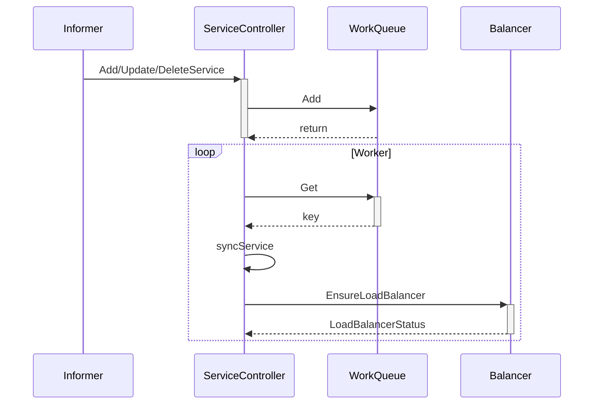

Mermaid

不过 `ServiceController` 其实只处理了负载均衡类型的 Service 对象，它会调用云服务商的 API 接口，不同的云服务商会实现不同的适配器来创建 LoadBalancer 类型的资源。


我们以 GCE 为例简单介绍一下 Google Cloud 是如何对实现负载均衡类型的 Service：

```go
func (g *Cloud) EnsureLoadBalancer(ctx context.Context, clusterName string, svc *v1.Service, nodes []*v1.Node) (*v1.LoadBalancerStatus, error) {
	loadBalancerName := g.GetLoadBalancerName(ctx, clusterName, svc)
	desiredScheme := getSvcScheme(svc)
	clusterID, _ := g.ClusterID.GetID()

	existingFwdRule, _ := g.GetRegionForwardingRule(loadBalancerName, g.region)

	if existingFwdRule != nil {
		existingScheme := cloud.LbScheme(strings.ToUpper(existingFwdRule.LoadBalancingScheme))
		if existingScheme != desiredScheme {
			switch existingScheme {
			case cloud.SchemeInternal:
				g.ensureInternalLoadBalancerDeleted(clusterName, clusterID, svc)
			default:
				g.ensureExternalLoadBalancerDeleted(clusterName, clusterID, svc)
			}
			existingFwdRule = nil
		}
	}

	var status *v1.LoadBalancerStatus
	switch desiredScheme {
	case cloud.SchemeInternal:
		status, err = g.ensureInternalLoadBalancer(clusterName, clusterID, svc, existingFwdRule, nodes)
	default:
		status, err = g.ensureExternalLoadBalancer(clusterName, clusterID, svc, existingFwdRule, nodes)
	}
	return status, err
}
```

Go

上述代码会先判断是否应该先删除已经存在的负载均衡资源，随后会调用一个内部的方法 `ensureExternalLoadBalancer` 在 Google Cloud 上创建一个新的资源，这个方法的调用过程比较复杂：

1. 检查转发规则是否存在并获取它的 IP 地址；
2. 确定当前 LoadBalancer 使用的 IP 地址；
3. 处理防火墙的规则的创建和更新；
4. 创建和删除指定的健康检查；

想要了解 GCE 是如何对 LoadBalancer 进行支持的可以在 Kubernetes 中的 [gce](https://github.com/kubernetes/kubernetes/tree/master/pkg/cloudprovider/providers/gce) package 中阅读相关的代码，这里面就是 gce 对于云服务商特定资源的实现方式。

Endpoint

`ServiceController` 主要处理的还是与 LoadBalancer 相关的逻辑，但是 `EndpointController` 的作用就没有这么简单了，我们在使用 Kubernetes 时虽然很少会直接与 Endpoint 资源打交道，但是它却是 Kubernetes 中非常重要的组成部分。

`EndpointController` 本身并没有通过 `Informer` 监听 Endpoint 资源的变动，但是它却同时订阅了 Service 和 Pod 资源的增删事件，对于 Service 资源来讲，`EndpointController` 会通过以下的方式进行处理：

```mermaid
sequenceDiagram
    participant I as Informer
    participant EC as EndpointController
    participant Q as WorkQueue
    participant PL as PodLister
    participant C as Client
    I->>+EC: Add/Update/DeleteService
    EC->>Q: Add
    Q-->>EC: return
    deactivate EC
    loop Worker
        EC->>+Q: Get
        Q-->>-EC: key
        EC->>+EC: syncService
        EC->>+PL: ListPod(service.Spec.Selector)
        PL-->>-EC: Pods
        loop Every Pod
            EC->>EC: addEndpointSubset
        end
        EC->>C: Create/UpdateEndpoint
        C-->>-EC: result
    end
```

Mermaid

`EndpointController` 中的 `syncService` 方法是用于创建和删除 Endpoint 资源最重要的方法，在这个方法中我们会根据 Service 对象规格中的选择器 Selector 获取集群中存在的所有 Pod，并将 Service 和 Pod 上的端口进行映射生成一个 `EndpointPort` 结构体：

```go
func (e *EndpointController) syncService(key string) error {
	namespace, name, _ := cache.SplitMetaNamespaceKey(key)
	service, _ := e.serviceLister.Services(namespace).Get(name)
	pods, _ := e.podLister.Pods(service.Namespace).List(labels.Set(service.Spec.Selector).AsSelectorPreValidated())

	subsets := []v1.EndpointSubset{}
	for _, pod := range pods {
		epa := *podToEndpointAddress(pod)

		for i := range service.Spec.Ports {
			servicePort := &service.Spec.Ports[i]

			portName := servicePort.Name
			portProto := servicePort.Protocol
			portNum, _ := podutil.FindPort(pod, servicePort)

			epp := &v1.EndpointPort{Name: portName, Port: int32(portNum), Protocol: portProto}
			subsets, _, _ = addEndpointSubset(subsets, pod, epa, epp, tolerateUnreadyEndpoints)
		}
	}
	subsets = endpoints.RepackSubsets(subsets)

	currentEndpoints = &v1.Endpoints{
		ObjectMeta: metav1.ObjectMeta{
			Name:   service.Name,
			Labels: service.Labels,
		},
	}

	newEndpoints := currentEndpoints.DeepCopy()
	newEndpoints.Subsets = subsets
	newEndpoints.Labels = service.Labels
	e.client.CoreV1().Endpoints(service.Namespace).Create(newEndpoints)

	return nil
}
```

Go

对于每一个 Pod 都会生成一个新的 `EndpointSubset`，其中包含了 Pod 的 IP 地址和端口和 Service 的规格中指定的输入端口和目标端口，在最后 `EndpointSubset` 的数据会被重新打包并通过客户端创建一个新的 Endpoint 资源。

在上面我们已经提到过，除了 Service 的变动会触发 Endpoint 的改变之外，Pod 对象的增删也会触发 `EndpointController` 中的回调函数。

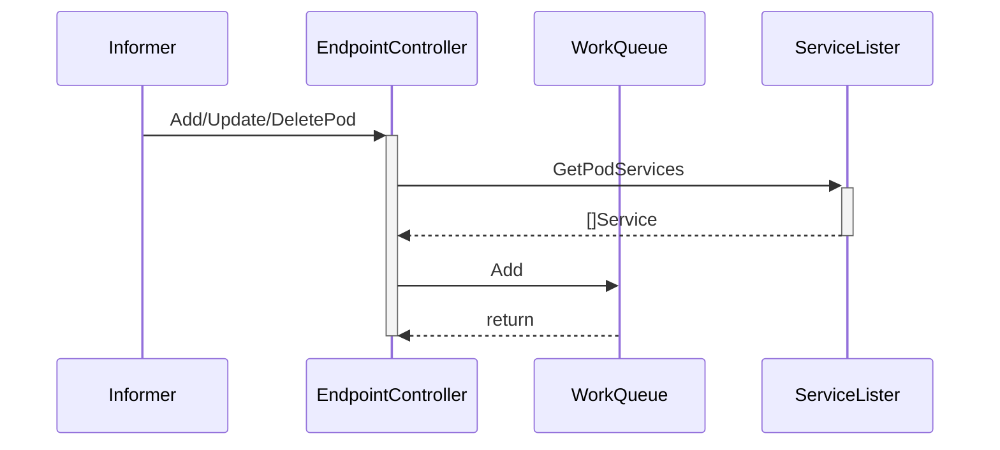

Mermaid

`getPodServiceMemberships` 会获取跟当前 Pod 有关的 Service 对象并将所有的 Service 对象都转换成 `<namespace>/<name>` 的字符串：

```go
func (e *EndpointController) getPodServiceMemberships(pod *v1.Pod) (sets.String, error) {
	set := sets.String{}
	services, _ := e.serviceLister.GetPodServices(pod)

	for i := range services {
		key, _ := controller.KeyFunc(services[i])
		set.Insert(key)
	}
	return set, nil
}
```

Go

这些服务最后会被加入 `EndpointController` 的队列中，等待它持有的几个 Worker 对 Service 进行同步。

这些其实就是 `EndpointController` 的作用，订阅 Pod 和 Service 对象的变更，并根据当前集群中的对象生成 Endpoint 对象将两者进行关联。

#### 代理

在整个集群中另一个订阅 Service 对象变动的组件就是 kube-proxy 了，每当 kube-proxy 在新的节点上启动时都会初始化一个 `ServiceConfig` 对象，就像介绍 iptables 代理模式时提到的，这个对象会接受 Service 的变更事件：

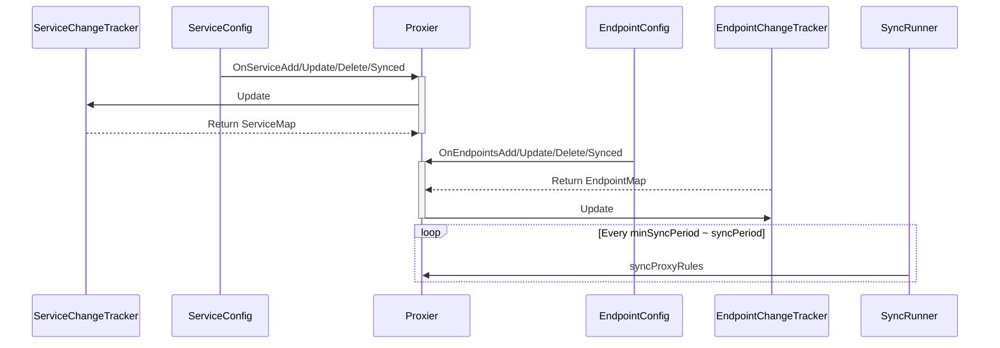

Mermaid

这些变更事件都会被订阅了集群中对象变动的 `ServiceConfig` 和 `EndpointConfig` 对象推送给启动的 `Proxier` 实例：

```go
func (c *ServiceConfig) handleAddService(obj interface{}) {
	service, ok := obj.(*v1.Service)
	if !ok {
		return
	}
	for i := range c.eventHandlers {
		c.eventHandlers[i].OnServiceAdd(service)
	}
}
```

Go

收到事件变动的 `Proxier` 实例随后会根据启动时的配置更新 iptables 或者 ipvs 中的规则，这些应用最终会负责对进出的流量进行转发并完成一些负载均衡相关的任务。

### 代理模式

在 Kubernetes 集群中的每一个节点都运行着一个 kube-proxy 进程，这个进程会负责监听 Kubernetes 主节点中 Service 的增加和删除事件并修改运行代理的配置，为节点内的客户端提供流量的转发和负载均衡等功能，但是当前 kube-proxy 的代理模式目前来看有三种：


这三种代理模式中的第一种 userspace 其实就是运行在用户空间代理，所有的流量最终都会通过 kube-proxy 本身转发给其他的服务，后两种 iptable 和 ipvs 都运行在内核空间能够为 Kubernetes 集群提供更加强大的性能支持。

#### userspace

作为运行在用户空间的代理，对于每一个 Service 都会在当前的节点上开启一个端口，所有连接到当前代理端口的请求都会被转发到 Service 背后的一组 Pod 上，它其实会在节点上添加 iptables 规则，通过 iptables 将流量转发给 kube-proxy 处理。

如果当前节点上的 kube-proxy 在启动时选择了 userspace 模式，那么每当有新的 Service 被创建时，kube-proxy 就会增加一条 iptables 记录并启动一个 Goroutine，前者用于将节点中服务对外发出的流量转发给 kube-proxy，再由后者持有的一系列 Goroutine 将流量转发到目标的 Pod 上。


这一系列的工作大都是在 `OnServiceAdd` 被触发时中完成的，正如上面所说的，该方法会调用 `mergeService` 将传入服务 Service 的端口变成一条 iptables 的配置命令为当前节点增加一条规则，同时在 `addServiceOnPort` 方法中启动一个 TCP 或 UDP 的 Socket：

```go
func (proxier *Proxier) mergeService(service *v1.Service) sets.String {
	svcName := types.NamespacedName{Namespace: service.Namespace, Name: service.Name}
	existingPorts := sets.NewString()
	for i := range service.Spec.Ports {
		servicePort := &service.Spec.Ports[i]
		serviceName := proxy.ServicePortName{NamespacedName: svcName, Port: servicePort.Name}
		existingPorts.Insert(servicePort.Name)
		info, exists := proxier.getServiceInfo(serviceName)
		if exists {
			proxier.closePortal(serviceName, info)
			proxier.stopProxy(serviceName, info)
		}
		proxyPort,  := proxier.proxyPorts.AllocateNext()

		serviceIP := net.ParseIP(service.Spec.ClusterIP)
		info, _ = proxier.addServiceOnPort(serviceName, servicePort.Protocol, proxyPort, proxier.udpIdleTimeout)
		info.portal.ip = serviceIP
		info.portal.port = int(servicePort.Port)
		info.externalIPs = service.Spec.ExternalIPs
		info.loadBalancerStatus = *service.Status.LoadBalancer.DeepCopy()
		info.nodePort = int(servicePort.NodePort)
		info.sessionAffinityType = service.Spec.SessionAffinity

		proxier.openPortal(serviceName, info)
		proxier.loadBalancer.NewService(serviceName, info.sessionAffinityType, info.stickyMaxAgeSeconds)
	}

	return existingPorts
}
```

Go

这个启动的进程会监听同一个节点上，转发自所有进程的 TCP 和 UDP 请求并将这些数据包发送给目标的 Pod 对象。

在用户空间模式中，如果一个连接被目标服务拒绝，我们的代理服务能够重新尝试连接其他的服务，除此之外用户空间模式并没有太多的优势。

#### iptables

另一种常见的代理模式就是直接使用 iptables 转发当前节点上的全部流量，这种脱离了用户空间在内核空间中实现转发的方式能够极大地提高 proxy 的效率，增加 kube-proxy 的吞吐量。


iptables 作为一种代理模式，它同样实现了 `OnServiceUpdate`、`OnEndpointsUpdate` 等方法，这两个方法会分别调用相应的变更追踪对象。

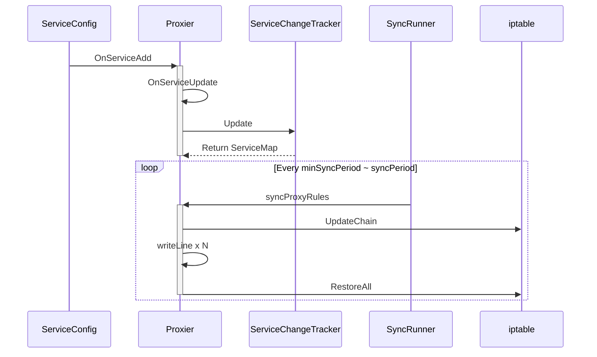

Mermaid

变更追踪对象会根据 `Service` 或 `Endpoint` 对象的前后变化改变 `ServiceChangeTracker` 本身的状态，这些变更会每隔一段时间通过一个 700 行的巨大方法 `syncProxyRules` 同步，在这里就不介绍这个方法的具体实现了，它的主要功能就是根据 `Service` 和 `Endpoint` 对象的变更生成一条一条的 iptables 规则，比较感兴趣的读者，可以点击 [proxier.go#L640-1379](https://sourcegraph.com/github.com/kubernetes/kubernetes@master/-/blob/pkg/proxy/iptables/proxier.go#L640-1379) 查看代码。

当我们使用 iptables 的方式启动节点上的代理时，所有的流量都会先经过 `PREROUTING` 或者 `OUTPUT` 链，随后进入 Kubernetes 自定义的链入口 KUBE-SERVICES、单个 Service 对应的链 `KUBE-SVC-XXXX` 以及每个 Pod 对应的链 `KUBE-SEP-XXXX`，经过这些链的处理，最终才能够访问当一个服务的真实 IP 地址。

虽然相比于用户空间来说，直接运行在内核态的 iptables 能够增加代理的吞吐量，但是当集群中的节点数量非常多时，iptables 并不能达到生产级别的可用性要求，每次对规则进行匹配时都会遍历 iptables 中的所有 Service 链。

规则的更新也不是增量式的，当集群中的 Service 达到 5,000 个，每增加一条规则都需要耗时 11min，当集群中的 Service 达到 20,000 个时，每增加一条规则都需要消耗 5h 的时间，这也就是告诉我们在大规模集群中使用 iptables 作为代理模式是完全不可用的。

#### ipvs

ipvs 就是用于解决在大量 Service 时，iptables 规则同步变得不可用的性能问题。与 iptables 比较像的是，ipvs 的实现虽然也基于 netfilter 的钩子函数，但是它却使用哈希表作为底层的数据结构并且工作在内核态，这也就是说 ipvs 在重定向流量和同步代理规则有着更好的性能。


在处理 Service 的变化时，ipvs 包和 iptables 其实就有非常相似了，它们都同样使用 `ServiceChangeTracker` 对象来追踪变更，只是两者对于同步变更的方法 `syncProxyRules` 实现上有一些不同。

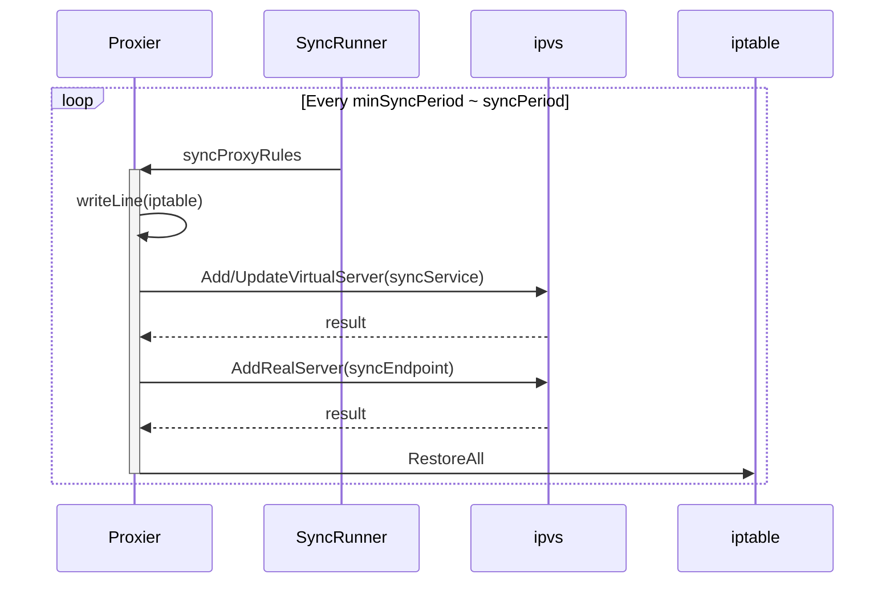

Mermaid

我们从 ipvs 的源代码和上述的时序图中可以看到，Kubernetes ipvs 的实现其实是依赖于 iptables 的，后者能够辅助它完成一些功能，使用 ipvs 相比 iptables 能够减少节点上的 iptables 规则数量，这也是因为 ipvs 接管了原来存储在 iptables 中的规则。

除了能够提升性能之外，ipvs 也提供了多种类型的负载均衡算法，除了最常见的 Round-Robin 之外，还支持最小连接、目标哈希、最小延迟等算法，能够很好地提升负载均衡的效率。

#### 小结

三种不同的代理模式其实是一个逐渐演化的过程，从最开始运行在用户空间需要『手动』监听端口并对数据包进行转发的用户空间模式，到之后使用运行在内核空间的 iptables 模式，再到 Kubernetes 1.9 版本中出现的 ipvs 模式，几种不同的模式在大量 Service 存在时有数量级别效率差异。

### 总结

Kubernetes 中的 Service 将一组 Pod 以统一的形式对外暴露成一个服务，它利用运行在内核空间的 iptables 或者 ipvs 高效地转发来自节点内部和外部的流量。除此之外，作为非常重要的 Kubernetes 对象，Service 不仅在逻辑上提供了微服务的概念，还引入 LoadBalancer 类型的 Service 无缝对接云服务商提供的复杂资源。

理解 Kubernetes 的 Service 对象能够帮助我们梳理集群内部的网络拓扑关系，也能让我们更清楚它是如何在集群内部实现服务发现、负载均衡等功能的，在后面的文章中我们会展开介绍 kube-proxy 的作用和实现。

## Kubernetes Volume

在 Kubernetes 集群中，虽然无状态的服务非常常见，但是在实际的生产中仍然会需要在集群中部署一些有状态的节点，比如一些存储中间件、消息队列等等。

然而 Kubernetes 中的每一个容器随时都可能因为某些原因而被删除和重启，容器中的文件也会随着它的删除而丢失，所以我们需要对集群中的某些文件和数据进行『持久化』；除此之外，由于同一个 Pod 中的多个 Container 可能也会有共享文件的需求，比如通过共享文件目录的方式为 nginx 生成需要代理的静态文件，所以我们需要一种方式来解决这两个问题。

作为 Kubernetes 集群中除了 Pod 和 Service 之外最常见的基本对象，Volume 不仅能够解决 Container 中文件的临时性问题，也能够让同一个 Pod 中的多个 Container 共享文件。

> 这篇文章并不会介绍 Kubernetes 中 Volume 的使用方法和 API，而是会着重介绍 Volume 的工作原理，包含其创建过程、多种 Volume 实现的异同以及如何与云服务提供商进行适配。

### 概述

Kubernetes 中的 Volume 种类非常多，它不仅要支持临时的、易失的磁盘文件，还需要解决持久存储的问题；第一个问题往往都比较容易解决，后者作为持久存储在很多时候都需要与云服务商提供的存储方案打交道，如果是 Kubernetes 中已经支持的存储类型倒是还好，遇到不支持的类型还是比较麻烦的。


除了卷和持久卷之外，Kubernetes 还有另外一种更加复杂的概念 - 动态存储供应，它能够允许存储卷按需进行创建，不再需要集群的管理员手动调用云服务商提供的接口或者界面创建新的存储卷。

集群中的每一个卷在被 Pod 使用时都会经历四个操作，也就是附着（Attach）、挂载（Mount）、卸载（Unmount）和分离（Detach）。

如果 Pod 中使用的是 EmptyDir、HostPath 这种类型的卷，那么这些卷并不会经历附着和分离的操作，它们只会被挂载和卸载到某一个的 Pod 中，不过如果使用的云服务商提供的存储服务，这些持久卷只有附着到某一个节点之后才可以被挂在到相应的目录下，不过在其他节点使用这些卷时，该存储资源也需要先与当前的节点分离。

#### 卷

在这一节中提到的卷（Volume）其实是一个比较特定的概念，它并不是一个持久化存储，可能会随着 Pod 的删除而删除，常见的卷就包括 EmptyDir、HostPath、ConfigMap 和 Secret，这些卷与所属的 Pod 具有相同的生命周期，它们可以通过如下的方式挂载到 Pod 下面的某一个目录中：

```yaml
apiVersion: v1
kind: Pod
metadata:
  name: test-pod
spec:
  containers:
  - name: test-container
    image: k8s.gcr.io/busybox
    volumeMounts:
    - name: cache-volume
      mountPath: /cache
    - name: test-volume
      mountPath: /hostpath
    - name: config-volume
      mountPath: /data/configmap
    - name: special-volume
      mountPath: /data/secret
  volumes:
  - name: cache-volume
    emptyDir: {}
  - name: hostpath-volume
    hostPath:
      path: /data/hostpath
      type: Directory
  - name: config-volume
    configMap:
      name: special-config
  - name: secret-volume
    secret:
      secretName: secret-config
```

YAML

需要注意的是，当我们将 ConfigMap 或者 Secret 『包装』成卷并挂载到某个目录时，我们其实创建了一些新的 Volume，这些 Volume 并不是 Kubernetes 中的对象，它们只存在于当前 Pod 中，随着 Pod 的删除而删除，但是需要注意的是这些『临时卷』的删除并不会导致相关 `ConfigMap` 或者 `Secret` 对象的删除。

从上面我们其实可以看出 Volume 没有办法脱离 Pod 而生存，它与 Pod 拥有完全相同的生命周期，而且它们也不是 Kubernetes 对象，所以 Volume 的主要作用还是用于跨节点或者容器对数据进行同步和共享。

#### 持久卷

临时的卷没有办法解决数据持久存储的问题，想要让数据能够持久化，首先就需要将 Pod 和卷的声明周期分离，这也就是引入持久卷 `PersistentVolume(PV)` 的原因。我们可以将 `PersistentVolume` 理解为集群中资源的一种，它与集群中的节点 Node 有些相似，PV 为 Kubernete 集群提供了一个如何提供并且使用存储的抽象，与它一起被引入的另一个对象就是 `PersistentVolumeClaim(PVC)`，这两个对象之间的关系与节点和 Pod 之间的关系差不多：


`PersistentVolume` 是集群中的一种被管理员分配的存储资源，而 `PersistentVolumeClaim` 表示用户对存储资源的申请，它与 Pod 非常相似，PVC 消耗了持久卷资源，而 Pod 消耗了节点上的 CPU 和内存等物理资源。

因为 PVC 允许用户消耗抽象的存储资源，所以用户需要不同类型、属性和性能的 PV 就是一个比较常见的需求了，在这时我们可以通过 `StorageClass` 来提供不同种类的 PV 资源，上层用户就可以直接使用系统管理员提供好的存储类型。

##### 访问模式

Kubernetes 中的 PV 提供三种不同的访问模式，分别是 `ReadWriteOnce`、`ReadOnlyMany` 和 `ReadWriteMany`，这三种模式的含义和用法我们可以通过它们的名字推测出来：

- `ReadWriteOnce` 表示当前卷可以被一个节点使用读写模式挂载；
- `ReadOnlyMany` 表示当前卷可以被多个节点使用只读模式挂载；
- `ReadWriteMany` 表示当前卷可以被多个节点使用读写模式挂载；

不同的卷插件对于访问模式其实有着不同的支持，AWS 上的 `AWSElasticBlockStore` 和 GCP 上的 `GCEPersistentDisk` 就只支持 `ReadWriteOnce` 方式的挂载，不能同时挂载到多个节点上，但是 `CephFS` 就同时支持这三种访问模式。

##### 回收策略

当某个服务使用完某一个卷之后，它们会从 apiserver 中删除 PVC 对象，这时 Kubernetes 就需要对卷进行回收（Reclaim），持久卷也同样包含三种不同的回收策略，这三种回收策略会指导 Kubernetes 选择不同的方式对使用过的卷进行处理。


第一种回收策略就是保留（Retain）PV 中的数据，如果希望 PV 能够被重新使用，系统管理员需要删除被使用的 `PersistentVolume` 对象并手动清除存储和相关存储上的数据。

另一种常见的回收策略就是删除（Delete），当 PVC 被使用者删除之后，如果当前卷支持删除的回收策略，那么 PV 和相关的存储会被自动删除，如果当前 PV 上的数据确实不再需要，那么将回收策略设置成 Delete 能够节省手动处理的时间并快速释放无用的资源。

##### 存储供应

Kubernetes 集群中包含了很多的 PV 资源，而 PV 资源有两种供应的方式，一种是静态的，另一种是动态的，静态存储供应要求集群的管理员预先创建一定数量的 PV，然后使用者通过 PVC 的方式对 PV 资源的使用进行声明和申请；但是当系统管理员创建的 PV 对象不能满足使用者的需求时，就会进入动态存储供应的逻辑，供应的方式是基于集群中的 `StorageClass` 对象，当然这种动态供应的方式也可以通过配置进行关闭。

### 管理

Volume 的创建和管理在 Kubernetes 中主要由卷管理器 `VolumeManager` 和 `AttachDetachController` 和 `PVController` 三个组件负责。其中卷管理器会负责卷的创建和管理的大部分工作，而 `AttachDetachController` 主要负责对集群中的卷进行 Attach 和 Detach，`PVController` 负责处理持久卷的变更，文章接下来的内容会详细介绍这几部分之间的关系、工作原理以及它们是如何协作的。

#### kubelet

作者在 [详解 Kubernetes Pod 的实现原理](https://draveness.me/kubernetes-pod) 一文中曾简单介绍过 kubelet 和 Pod 的关系，前者会负责后者的创建和管理，kubelet 中与 Pod 相关的信息都是从 apiserver 中获取的：

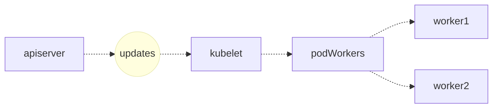

Mermaid

两者的通信会使用一个 `kubetypes.PodUpdate` 类型的 Channel，kubelet 从 apiserver 中获取 Pod 时也会通过字段过滤器 `fields.OneTermEqualSelector(api.PodHostField, string(nodeName))` 仅选择被调度到 kubelet 所在节点上的 Pod：

```go
func NewSourceApiserver(c clientset.Interface, nodeName types.NodeName, updates chan<- interface{}) {
	lw := cache.NewListWatchFromClient(c.CoreV1().RESTClient(), "pods", metav1.NamespaceAll, fields.OneTermEqualSelector(api.PodHostField, string(nodeName)))
	newSourceApiserverFromLW(lw, updates)
}
```

Go

所有对 Pod 的变更最终都会通知给具体的 PodWorker，这些 Worker 协程会调用 kubelet `syncPod` 函数完成对 Pod 的同步：

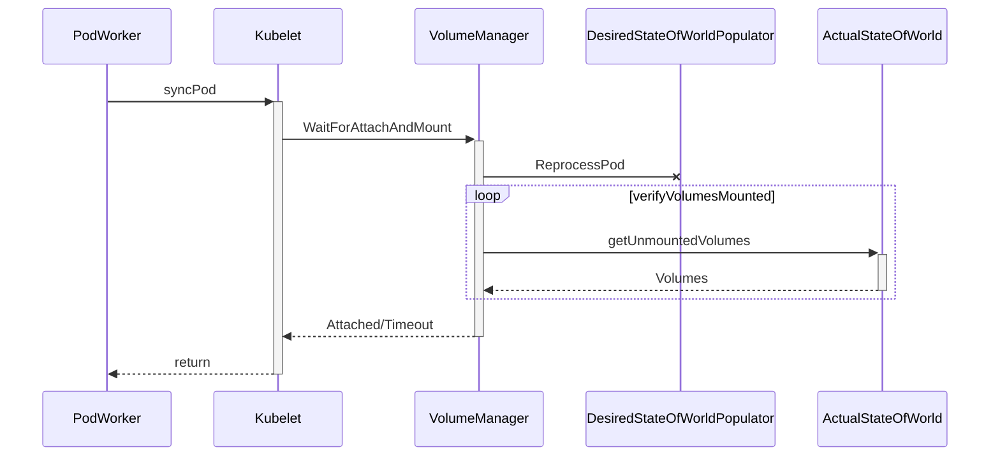

Mermaid

在一个 100 多行的 `syncPod` 方法中，kubelet 会调用 `WaitForAttachAndMount` 方法，等待某一个 Pod 中的全部卷已经被成功地挂载：

```go
func (kl *Kubelet) syncPod(o syncPodOptions) error {
	pod := o.pod
	
	// ...
	if !kl.podIsTerminated(pod) {
		kl.volumeManager.WaitForAttachAndMount(pod)
	}
	// ...

	return nil
}
```

Go

这个方法会将当前的 Pod 加入需要重新处理卷挂载的队列并在循环中持续调用 `verifyVolumesMounted` 方法来比较期望挂载的卷和实际挂载卷的区别，这个循环会等待两者变得完全相同或者超时后才会返回，当前方法的返回一般也意味着 Pod 中的全部卷已经挂载成功了。

#### 卷管理器

当前节点卷的管理就都是由 `VolumeManager` 来负责了，在 Kubernetes 集群中的每一个节点（Node）上的 kubelet 启动时都会运行一个 `VolumeManager` Goroutine，它会负责在当前节点上的 Pod 和 Volume 发生变动时对 Volume 进行挂载和卸载等操作。

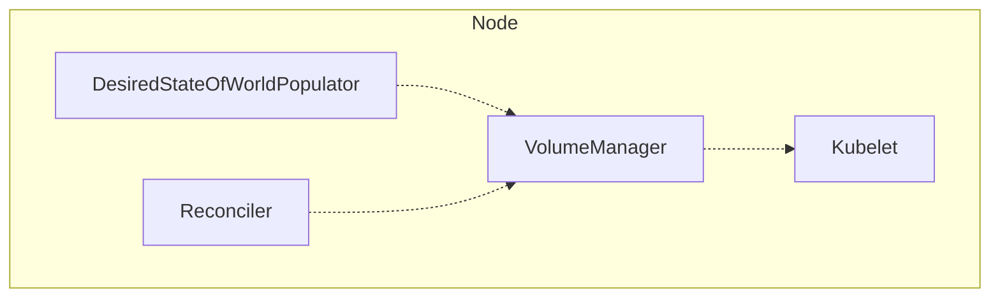

Mermaid

这个组件会在运行时启动两个 Goroutine 来管理节点中的卷，其中一个是 `DesiredStateOfWorldPopulator`，另一个是 `Reconciler`：

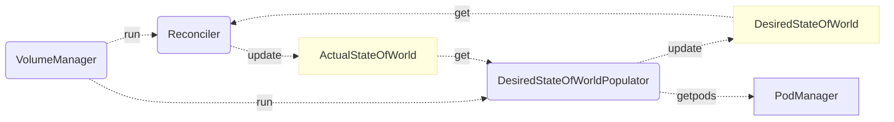

Mermaid

如上图所示，这里的 `DesiredStateOfWorldPopulator` 和 `Reconciler` 两个 Goroutine 会通过图中两个的 `XXXStateOfWorld` 状态进行通信，`DesiredStateOfWorldPopulator` 主要负责从 Kubernetes 节点中获取新的 Pod 对象并更新 `DesiredStateOfWorld` 结构；而后者会根据实际状态和当前状态的区别对当前节点的状态进行迁移，也就是通过 `DesiredStateOfWorld` 中状态的变更更新 `ActualStateOfWorld` 中的内容。

卷管理器中的两个 Goroutine，一个根据工程师的需求更新节点的期望状态 `DesiredStateOfWorld`，另一个 Goroutine 保证节点向期望状态『迁移』，也就是说 `DesiredStateOfWorldPopulator` 是卷管理器中的生产者，而 `Reconciler` 是消费者，接下来我们会分别介绍这两个 Goroutine 的工作和实现。

##### DesiredStateOfWorldPopulator

作为卷管理器中的消费者，`DesiredStateOfWorldPopulator` 会根据工程师的请求不断修改当前节点的期望状态，我们可以通过以下的时序图来了解它到底做了哪些工作：

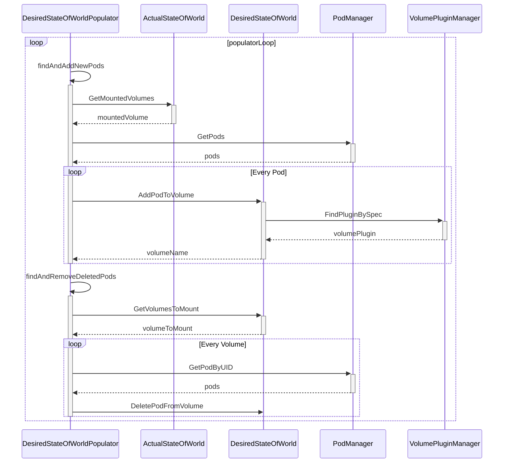

Mermaid

整个 `DesiredStateOfWorldPopulator` 运行在一个大的循环 `populatorLoop` 中，当前循环会通过两个方法 `findAndAddNewPods` 和 `findAndRemoveDeletedPods` 分别获取节点中被添加的新 Pod 或者已经被删除的老 Pod，获取到 Pod 之后会根据当前的状态修改期望状态：

```go
func (dswp *desiredStateOfWorldPopulator) findAndAddNewPods() {
	mountedVolumesForPod := make(map[volumetypes.UniquePodName]map[string]cache.MountedVolume)

	processedVolumesForFSResize := sets.NewString()
	for _, pod := range dswp.podManager.GetPods() {
		if dswp.isPodTerminated(pod) {
			continue
		}
		dswp.processPodVolumes(pod, mountedVolumesForPod, processedVolumesForFSResize)
	}
}
```

Go

就像时序图和代码中所描述的，`DesiredStateOfWorldPopulator` 会从 `PodManager` 中获取当前节点中的 Pod，随后调用 `processPodVolumes` 方法为将所有的 Pod 对象加入 `DesiredStateOfWorld` 结构中：

```go
func (dswp *desiredStateOfWorldPopulator) processPodVolumes(pod *v1.Pod, mountedVolumesForPod map[volumetypes.UniquePodName]map[string]cache.MountedVolume, processedVolumesForFSResize sets.String) {
	uniquePodName := util.GetUniquePodName(pod)
	if dswp.podPreviouslyProcessed(uniquePodName) {
		return
	}

	mountsMap, devicesMap := dswp.makeVolumeMap(pod.Spec.Containers)

	for _, podVolume := range pod.Spec.Volumes {
		pvc, volumeSpec, volumeGidValue, _ := dswp.createVolumeSpec(podVolume, pod.Name, pod.Namespace, mountsMap, devicesMap)
		dswp.desiredStateOfWorld.AddPodToVolume(uniquePodName, pod, volumeSpec, podVolume.Name, volumeGidValue)
	}

	dswp.markPodProcessed(uniquePodName)
	dswp.actualStateOfWorld.MarkRemountRequired(uniquePodName)
}
```

Go

`findAndAddNewPods` 方法做的主要就是将节点中加入的新 Pod 添加到 `DesiredStateOfWorld` 中，而另一个方法 `findAndRemoveDeletedPods` 其实也做着类似的事情，它会将已经被删除的节点从 `DesiredStateOfWorld` 中剔除，总而言之 `DesiredStateOfWorldPopulator` 就是将当前节点的期望状态同步到 `DesiredStateOfWorld` 中，等待消费者的处理。

##### Reconciler

`VolumeManager` 持有的另一个 Goroutine `Reconciler` 会负责对当前节点上的 Volume 进行管理，它在正常运行时会启动 `reconcile` 循环，在这个方法中会分三次对当前状态和期望状态不匹配的卷进行卸载、挂载等操作：

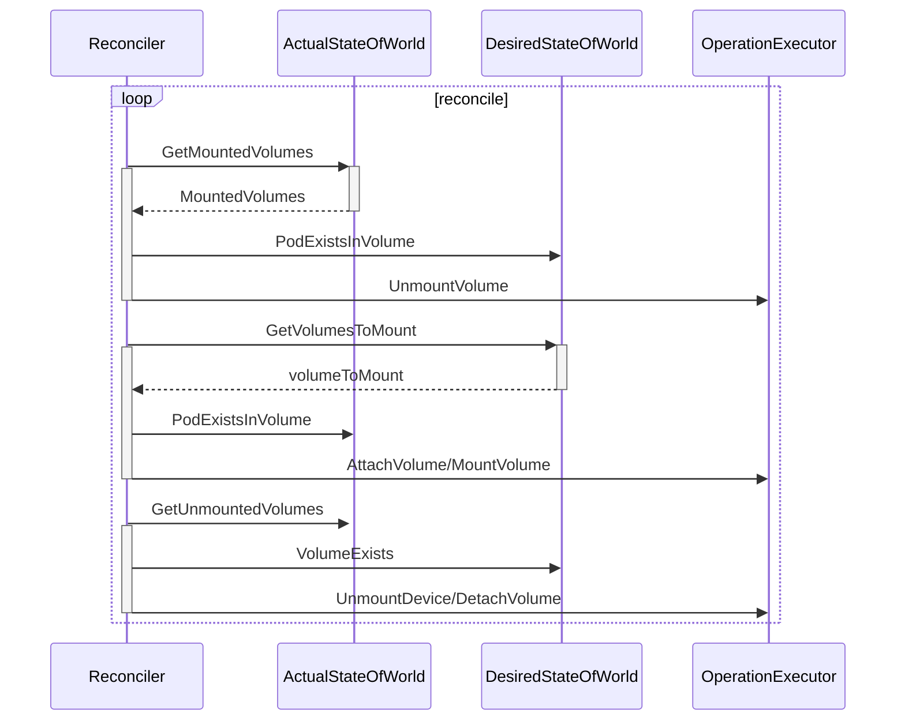

Mermaid

在当前的循环中首先会保证应该被卸载但是仍然在节点中存在的卷被卸载，然后将应该挂载的卷挂载到合适的位置，最后将设备与节点分离或者卸载，所有挂载和卸载的操作都是通过 `OperationExecutor` 完成的，这个结构体负责调用相应的插件执行操作，我们会在文章的后面展开进行介绍。

#### 附着分离控制器

除了 `VolumeManager` 之外，另一个负责管理 Kubernetes 卷的组件就是 `AttachDetachController` 了，引入这个组件的目的主要是：

1. 让卷的挂载和卸载能够与节点的可用性脱离；
   - 一旦节点或者 kubelet 宕机，附着（Attach）在当前节点上的卷应该能够被分离（Detach），分离之后的卷就能够再次附着到其他节点上；
2. 保证云服务商秘钥的安全；
   - 如果每一个 kubelet 都需要触发卷的附着和分离逻辑，那么每一个节点都应该有操作卷的权限，但是这些权限应该只由主节点掌握，这样能够降低秘钥泄露的风险；
3. 提高卷附着和分离部分代码的稳定性；

> 这些内容都是在 Kubernetes 官方项目的 GitHub issue [Detailed Design for Volume Attach/Detach Controller #20262](https://github.com/kubernetes/kubernetes/issues/20262) 中讨论的，想要了解 `AttachDetachController` 出现的原因可以阅读相关的内容。

每一个 `AttachDetachController` 其实也包含 `Reconciler` 和 `DesiredStateOfWorldPopulator` 两个组件，这两个组件虽然与 `VolumeManager` 中的两个组件重名，实现的功能也非常类似，与 `VolumeManager` 具有几乎相同的数据流向，但是这两个 Goroutine 是跑在 Kubernetes 主节点中的，所以实现上可能一些差异：

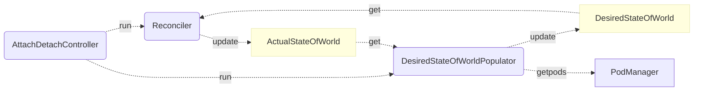

Mermaid

首先，无论是 `Reconciler` 还是 `DesiredStateOfWorldPopulator`，它们同步的就不再只是某个节点上 Pod 的信息了，它们需要对整个集群中的 Pod 对象负责，相关数据也不再是通过 apiserver 拉取了，而是使用 `podInformer` 在 Pod 对象发生变更时调用相应的方法。

##### DesiredStateOfWorldPopulator

作为 `AttachDetachController` 启动的 Goroutine，`DesiredStateOfWorldPopulator` 的主要作用是从当前集群的状态中获取 Pod 对象并修改 `DesiredStateOfWorld` 结构，与 `VolumeManager` 中的同名 Goroutine 起到相同的作用，作为整个链路的生产者，它们只是在实现上由于处理 Pod 范围的不同有一些区别：

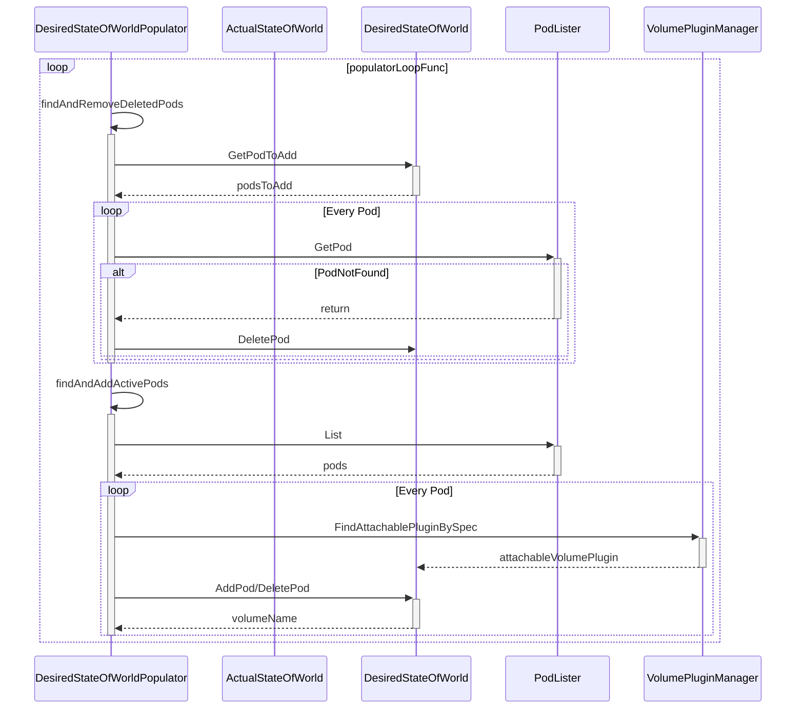

Mermaid

`AttachDetachController` 中的 `DesiredStateOfWorldPopulator` 协程就主要会先处理 Pod 的删除逻辑，添加 Pod 的逻辑都是根据 `listPodsRetryDuration` 的设置周期性被触发的，所以从这里我们就能看到 `AttachDetachController` 其实主要还是处理被删除 Pod 中 Volume 的分离工作，当节点或者 kubelet 宕机时能够将节点中的卷进行分离，保证 Pod 在其他节点重启时不会出现问题。

##### Reconciler

另一个用于调节当前状态与期望状态的 Goroutine 在执行它内部的循环时，也会优先处理分离卷的逻辑，后处理附着卷的工作，整个时序图与 `VolumeManager` 中的 `Reconciler` 非常相似：

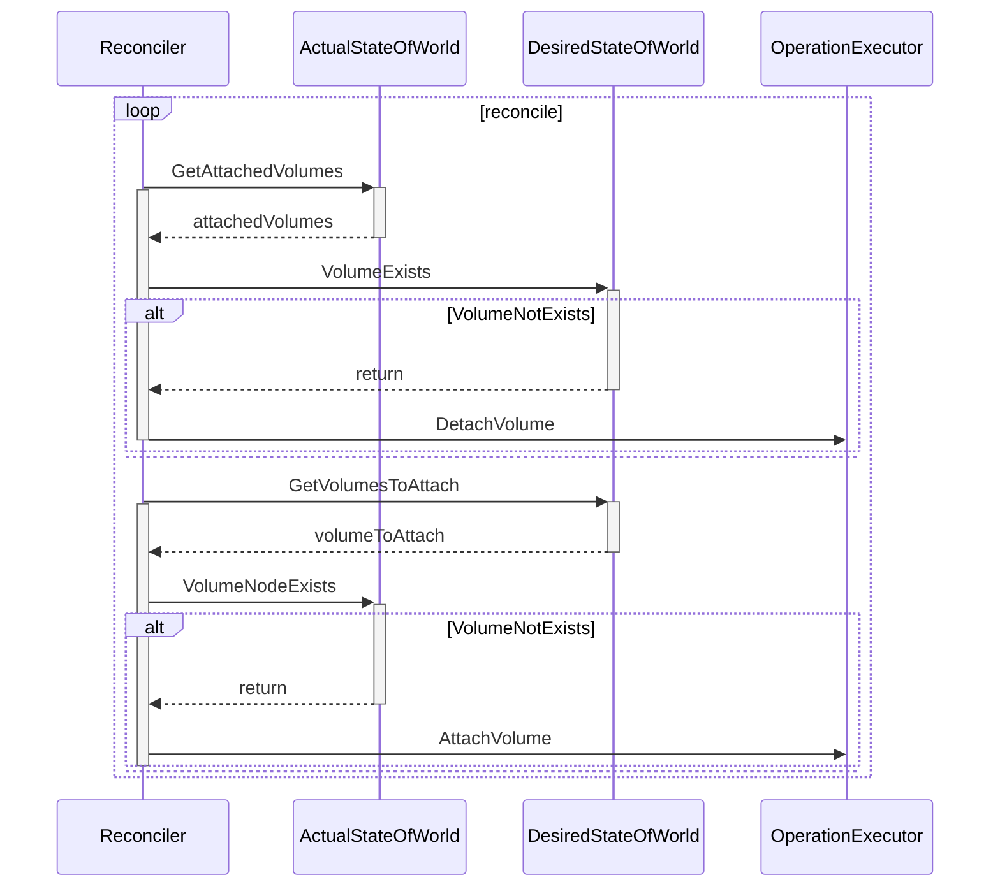

Mermaid

这里处理的工作其实相对更少一些，`Reconciler` 会将期望状态中的卷与实际状态进行比较，然后分离需要分离的卷、附着需要附着的卷，逻辑非常的清晰和简单。

#### 持久卷控制器

作为集群中与 PV 和 PVC 打交道的控制器，持久卷控制器同时运行着三个 Goroutine 用于处理相应的逻辑，其中 `Resync` 协程负责从 Kubernetes 集群中同步 PV 和 PVC 的信息，而另外两个工作协程主要负消费队列中的任务：

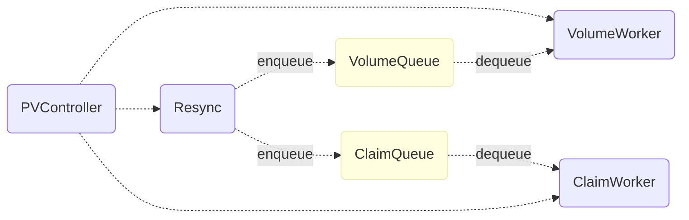

Mermaid

这两个工作协程主要负责对需要绑定或者解绑的 PV 和 PVC 进行处理，例如，当用户创建了新的 PVC 对象时，从集群中查找该 PVC 选择的 PV 并绑定到当前的 PVC 上。

##### VolumeWorker

`VolumeWorker` 协程中执行的最重要的方法其实就是 `syncVolume`，在这个方法中会根据当前 PV 对象的规格对 PV 和 PVC 进行绑定或者解绑：

```go
func (ctrl *PersistentVolumeController) syncVolume(volume *v1.PersistentVolume) error {
	if volume.Spec.ClaimRef == nil {
		return nil
	} else {
		if volume.Spec.ClaimRef.UID == "" {
			return nil
		}
		var claim *v1.PersistentVolumeClaim
		claimName := claimrefToClaimKey(volume.Spec.ClaimRef)
		obj, _, _ := ctrl.claims.GetByKey(claimName)
		claim, _ = obj.(*v1.PersistentVolumeClaim)

		if claim != nil && claim.UID != volume.Spec.ClaimRef.UID {
			claim = nil
		}

		if claim == nil {
			ctrl.reclaimVolume(volume)
		} else if claim.Spec.VolumeName == "" {
			ctrl.claimQueue.Add(claimToClaimKey(claim))
		} else if claim.Spec.VolumeName == volume.Name {
		} else {
			if metav1.HasAnnotation(volume.ObjectMeta, annDynamicallyProvisioned) && volume.Spec.PersistentVolumeReclaimPolicy == v1.PersistentVolumeReclaimDelete {
				ctrl.reclaimVolume(volume)
			} else {
				ctrl.unbindVolume(volume)
			}
		}
	}
	return nil
}
```

Go

如果当前 PV 没有绑定的 PVC 对象，那么这里的 `reclaimVolume` 可能会将当前的 PV 对象根据回收策略将其放回资源池等待重用、回收或者保留；而 `unbindVolume` 会删除 PV 与 PVC 之间的关系并更新 apiserver 中保存的 Kubernetes 对象数据。

##### ClaimWorker

`ClaimWorker` 就是控制器用来决定如何处理一个 PVC 对象的方法了，它会在一个 PVC 对象被创建、更新或者同步时被触发，`syncClaim` 会根据当前对象中的注解决定调用 `syncUnboundClaim` 或者 `syncBoundClaim` 方法来处理相应的逻辑：

```go
func (ctrl *PersistentVolumeController) syncClaim(claim *v1.PersistentVolumeClaim) error {
	if !metav1.HasAnnotation(claim.ObjectMeta, annBindCompleted) {
		return ctrl.syncUnboundClaim(claim)
	} else {
		return ctrl.syncBoundClaim(claim)
	}
}
```

Go

`syncUnboundClaim` 会处理绑定没有结束的 PVC 对象，如果当前 PVC 对象没有对应合适的 PV 存在，那么就会调用 `provisionClaim` 尝试从集群中获取新的 PV 供应，如果能够找到 PV 对象，就会通过 `bind` 方法将两者绑定：

```go
func (ctrl *PersistentVolumeController) syncUnboundClaim(claim *v1.PersistentVolumeClaim) error {
	if claim.Spec.VolumeName == "" {
		delayBinding, err := ctrl.shouldDelayBinding(claim)

		volume, err := ctrl.volumes.findBestMatchForClaim(claim, delayBinding)
		if volume == nil {
			switch {
			case delayBinding:
			case v1helper.GetPersistentVolumeClaimClass(claim) != "":
				ctrl.provisionClaim(claim)
			}
		} else {
			ctrl.bind(volume, claim)
		}
	} else {
		obj, found, _ := ctrl.volumes.store.GetByKey(claim.Spec.VolumeName)
		if found {
			volume, _ := obj.(*v1.PersistentVolume)
			if volume.Spec.ClaimRef == nil {
				ctrl.bind(volume, claim)
			} else if isVolumeBoundToClaim(volume, claim) {
				ctrl.bind(volume, claim)
			}
		}
	}
	return nil
}
```

Go

绑定的过程其实就是将 PV 和 PVC 之间建立起新的关系，更新 Spec 中的数据让两者能够通过引用 Ref 找到另一个对象并将更新后的 Kubernetes 对象存储到 apiserver 中。

另一个用于绑定 PV 和 PVC 对象的方法就是 `syncBoundClaim` 了，相比于 `syncUnboundClaim` 方法，该方法的实现更为简单，直接从缓存中尝试获取对应的 PV 对象：

```go
func (ctrl *PersistentVolumeController) syncBoundClaim(claim *v1.PersistentVolumeClaim) error {
	if claim.Spec.VolumeName == "" {
		return nil
	}
	obj, found, _ := ctrl.volumes.store.GetByKey(claim.Spec.VolumeName)
	if found {
		volume, _ := obj.(*v1.PersistentVolume)
		if volume.Spec.ClaimRef == nil {
			ctrl.bind(volume, claim)
		} else if volume.Spec.ClaimRef.UID == claim.UID {
			ctrl.bind(volume, claim)
		}
	}
	return nil
}
```

Go

如果找到了 PV 对象并且该对象没有绑定的 PVC 或者当前 PV 和 PVC 已经存在了引用就会调用 `bind` 方法对两者进行绑定。

##### 小结

无论是 `VolumeWorker` 还是 `ClaimWorker` 最终都可能会通过 apiserver 更新集群中 etcd 的数据，当然它们也会调用一些底层的插件获取新的存储供应、删除或者重用一些持久卷，我们会在下面介绍插件的工作原理。

### 插件

Kubernetes 中的所有对卷的操作最终基本都是通过 `OperationExecutor` 来完成的，这个组件包含了用于附着、挂载、卸载和分离几个常见的操作以及对设备进行操作的一些方法：

```go
type OperationExecutor interface {
	AttachVolume(volumeToAttach VolumeToAttach, actualStateOfWorld ActualStateOfWorldAttacherUpdater) error
	DetachVolume(volumeToDetach AttachedVolume, verifySafeToDetach bool, actualStateOfWorld ActualStateOfWorldAttacherUpdater) error
	MountVolume(waitForAttachTimeout time.Duration, volumeToMount VolumeToMount, actualStateOfWorld ActualStateOfWorldMounterUpdater, isRemount bool) error
	UnmountVolume(volumeToUnmount MountedVolume, actualStateOfWorld ActualStateOfWorldMounterUpdater, podsDir string) error
	// ...
}
```

Go

实现 `OperationExecutor` 接口的私有结构体会通过 `OperatorGenerator` 来生成一个用于挂载和卸载卷的方法，并将这个方法包装在一个 `GeneratedOperations` 结构中，在这之后操作执行器会启动一个新的 Goroutine 用于执行生成好的方法：

```mermaid
graph LR
    OE(OperationExexutor)-. 1. 获取相关方法 .->OG(OperationGenerator)
    OG-. 2. 根据 Spec 获取插件 .->VM(VolumePluginManager)
    VM-. 3. 返回 VolumePlugin .->OG
    OG-. 4. 构建方法 .->OG
    OG-. 5. 生成一个 Operation 结构 .->OE
    OE-. 6. 运行 Operation .->NPO(NestedPendingOperations)
    NPO-. 7. 启动 Goroutine 运行生成的方法 .->Goroutine
```

Mermaid

`VolumePluginManager` 和 `VolumePlugin` 这两个组件在整个流程中帮我们屏蔽了底层不同类型卷的实现差异，我们能直接在上层调用完全相同的接口，剩下的逻辑都由底层的插件来负责。

Kubernetes 提供了插件的概念，通过 `Volume` 和 `Mounter` 两个接口支持卷类型的扩展，作为存储提供商或者不同类型的文件系统，我们都可以通过实现以上的两个接口成为 Kubernetes 存储系统中一个新的存储类型：

```go
type VolumePlugin interface {
	Init(host VolumeHost) error
	GetPluginName() string
	GetVolumeName(spec *Spec) (string, error)
	NewMounter(spec *Spec, podRef *v1.Pod, opts VolumeOptions) (Mounter, error)
	// ...
}

type Mounter interface {
	Volume
	CanMount() error
	SetUp(fsGroup *int64) error
	SetUpAt(dir string, fsGroup *int64) error
	GetAttributes() Attributes
}
```

Go

在这一节中我们将介绍几种不同卷插件的实现，包括最常见的 EmptyDir、ConfigMap、Secret 和 Google 云上的 GCEPersistentDisk，这一节会简单介绍不同卷插件的实现方式，想要了解详细实现的读者可以阅读相关的源代码。

#### EmptyDir

EmptyDir 是 Kubernetes 中最简单的卷了，当我们为一个 Pod 设置一个 EmptyDir 类型的卷时，其实就是在当前 Pod 对应的目录创建了一个空的文件夹，这个文件夹会随着 Pod 的删除而删除。

```go
func (ed *emptyDir) SetUpAt(dir string, fsGroup *int64) error {
	ed.setupDir(dir)
	volume.SetVolumeOwnership(ed, fsGroup)
	volumeutil.SetReady(ed.getMetaDir())

	return nil
}

func (ed *emptyDir) setupDir(dir string) error {
	if err := os.MkdirAll(dir, perm); err != nil {
		return err
	}
	
	// ...

	return nil
}
```

Go

`SetUpAt` 方法其实就实现了对这种类型卷的创建工作，每当 Pod 被分配到了某个节点上，对应的文件目录就会通过 `MkdirAll` 方法创建，如果使用者配置了 medium 字段，也会选择使用相应的文件系统挂载到当前目录上，例如：tmpfs、nodev 等。

```yaml
apiVersion: v1
kind: Pod
metadata:
  name: test-pd
spec:
  containers:
  - image: k8s.gcr.io/test-webserver
    name: test-container
    volumeMounts:
    - mountPath: /cache
      name: cache-volume
  volumes:
  - name: cache-volume
    emptyDir: {}
```

YAML

我们经常会使用 EmptyDir 类型的卷在多个容器之间共享文件、充当缓存或者保留一些临时的日志，总而言之，这是一种经常被使用的卷类型。

#### ConfigMap 和 Secret

另一种比较常见的卷就是 ConfigMap 了，首先，ConfigMap 本身就是 Kubernetes 中常见的对象了，其中的 `data` 就是一个存储了从文件名到文件内容的字段，这里的 ConfigMap 对象被挂载到文件目录时就会创建一个名为 `redis-config` 的文件，然后将文件内容写入该文件：

```yaml
apiVersion: v1
kind: ConfigMap
data:
  redis-config: |
    maxmemory 2mb
    maxmemory-policy allkeys-lru    
```

YAML

在对 ConfigMap 类型的卷进行挂载时，总共需要完成三部分工作，首先从 apiserver 中获取当前 ConfigMap 对象，然后根据当前的 ConfigMap 生成一个从文件名到文件内容的键值对，最后构造一个 Writer 并执行 `Write` 方法写入内容：

```go
func (b *configMapVolumeMounter) SetUpAt(dir string, fsGroup *int64) error {
	configMap, _ := b.getConfigMap(b.pod.Namespace, b.source.Name)

	totalBytes := totalBytes(configMap)
	payload, _ := MakePayload(b.source.Items, configMap, b.source.DefaultMode, false)

	writerContext := fmt.Sprintf("pod %v/%v volume %v", b.pod.Namespace, b.pod.Name, b.volName)
	writer, _ := volumeutil.NewAtomicWriter(dir, writerContext)
	writer.Write(payload)

	return nil
}
```

Go

在涉及挂载的函数几个中，作者想要着重介绍的也就是在底层直接与文件系统打交道的 `writePayloadToDir` 方法：

```go
func (w *AtomicWriter) writePayloadToDir(payload map[string]FileProjection, dir string) error {
	for userVisiblePath, fileProjection := range payload {
		content := fileProjection.Data
		mode := os.FileMode(fileProjection.Mode)
		fullPath := path.Join(dir, userVisiblePath)
		baseDir, _ := filepath.Split(fullPath)

		os.MkdirAll(baseDir, os.ModePerm)
		ioutil.WriteFile(fullPath, content, mode)
		os.Chmod(fullPath, mode)
	}

	return nil
}
```

Go

这个方法使用了 `os` 包提供的接口完成了拼接文件名、创建相应文件目录、写入文件并且修改文件模式的工作，将 ConfigMap `data` 中的数据映射到了一个文件夹中，达到了让 Pod 中的容器可以直接通过文件系统获取内容的目的。

对于另一个非常常见的卷类型 Secret，Kubernetes 其实也做了几乎完全相同的工作，也是先获取 Secret 对象，然后构建最终写入到文件的键值对，最后初始化一个 Writer 并调用它的 `Write` 方法，从这里我们也能看出在卷插件这一层对于 ConfigMap 和 Secret 的处理几乎完全相同，并没有出现需要对 Secret 对象中的内容进行解密的工作。

#### GCEPersistentDisk

最后一个要介绍的卷与上面的几种都非常的不同，它在底层使用的是云服务商提供的网络磁盘，想要在一个节点上使用云磁盘其实总共需要两个步骤，首先是要将云磁盘附着到当前的节点上，这部分的工作其实就是由 `gcePersistentDiskAttacher` 完成的，每当调用 `AttachDisk` 方法时，最终都会执行云服务商提供的接口，将磁盘附着到相应的节点实例上：

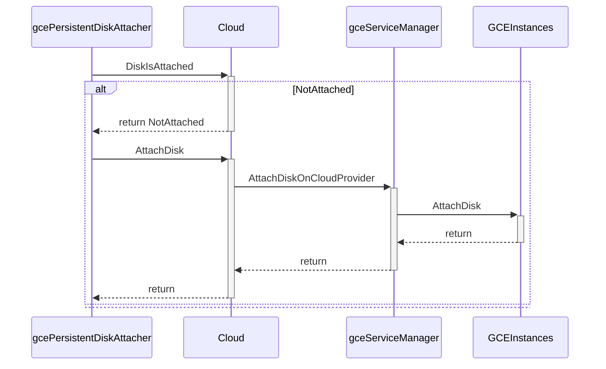

Mermaid

在方法的最后会将该请求包装成一个 HTTP 的方法调用向 `https://www.googleapis.com/compute/v1/projects/{project}/zones/{zone}/instances/{resourceId}/attachDisk` 链接发出一个 POST 请求，这个请求会将某个 GCE 上的磁盘附着到目标实例上，详细的内容可以阅读 [相关文档](https://cloud.google.com/compute/docs/reference/rest/v1/instances/attachDisk)。

一旦当前的磁盘被附着到了当前节点上，我们就能跟使用其他的插件一样，把磁盘挂载到某个目录上，完成从附着到挂载的全部操作。

### 总结

Volume 和存储系统是 Kubernetes 非常重要的一部分，它能够帮助我们在多个容器之间共享文件，同时也能够为集群提供持久存储的功能，假如 Kubernetes 没有用于持久存储的对象，我们也很难在集群中运行有状态的服务，例如：消息队列、分布式存储等。

对于刚刚使用 Kubernetes 的开发者来说，Volume、PV 和 PVC 确实是比较难以理解的概念，但是这却是深入使用 Kubernetes 必须要了解和掌握的，希望这篇文章能够帮助各位读者更好地理解存储系统底层的实现原理。

## Kubernetes ReplicaSet

Kubernetes 中的 ReplicaSet 主要的作用是维持一组 [Pod](https://draveness.me/kubernetes-pod) 副本的运行，它的主要作用就是保证一定数量的 Pod 能够在集群中正常运行，它会持续监听这些 Pod 的运行状态，在 Pod 发生故障重启数量减少时重新运行新的 Pod 副本。

这篇文章会介绍 ReplicaSet 的工作原理，其中包括在 Kubernetes 中是如何被创建的、如何创建并持有 Pod 并在出现问题时重启它们。

### 概述

在具体介绍 ReplicaSet 的实现原理之前，我们还是会先简单介绍它的使用，与其他的 Kubernetes 对象一样，我们会在 Kubernetes 集群中使用 YAML 文件创建新的 ReplicaSet 对象，一个常见的 ReplicaSet 的定义其实是这样的：

```yaml
apiVersion: apps/v1
kind: ReplicaSet
metadata:
  name: frontend
  labels:
    app: guestbook
    tier: frontend
spec:
  replicas: 3
  selector:
    matchLabels:
      tier: frontend
  template:
    metadata:
      labels:
        tier: frontend
    spec:
      containers:
      - name: php-redis
        image: gcr.io/google_samples/gb-frontend:v3
```

YAML

这里的 YAML 文件除了常见的 `apiVersion`、`kind` 和 `metadata` 属性之外，规格中总共包含三部分重要内容，也就是 Pod 副本数目 `replicas`、选择器 `selector` 和 Pod 模板 `template`，这三个部分共同定义了 ReplicaSet 的规格：


同一个 ReplicaSet 会使用选择器 `selector` 中的定义查找集群中自己持有的 `Pod` 对象，它们会根据标签的匹配获取能够获得的 Pod，下面就是持有三个 Pod 对象的 Replica 拓扑图：

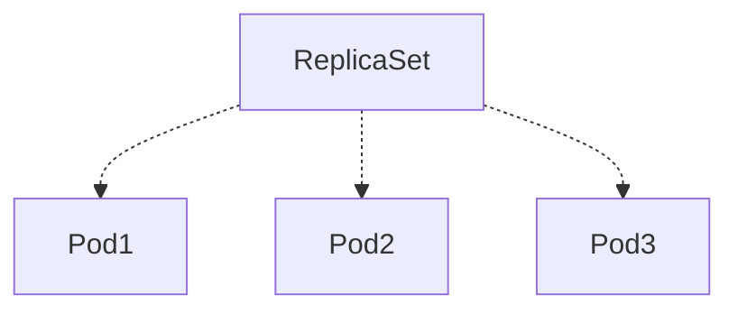

Mermaid

被 ReplicaSet 持有的 Pod 有一个 `metadata.ownerReferences` 指针指向当前的 ReplicaSet，表示当前 Pod 的所有者，这个引用主要会被集群中的 [垃圾收集器](https://draveness.me/kubernetes-garbage-collector) 使用以清理失去所有者的 Pod 对象。

### 实现原理

所有 ReplicaSet 对象的增删改查都是由 `ReplicaSetController` 控制器完成的，该控制器会通过 `Informer` 监听 ReplicaSet 和 Pod 的变更事件并将其加入持有的待处理队列:

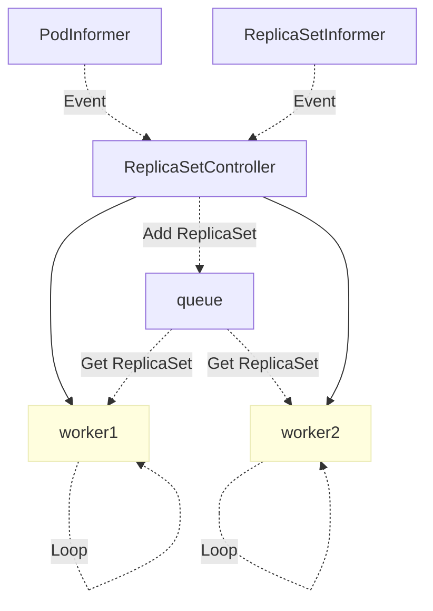

Mermaid

`ReplicaSetController` 中的 `queue` 其实就是一个存储待处理 ReplicaSet 的『对象池』，它运行的几个 Goroutine 会从队列中取出最新的数据进行处理，上图展示了事件从发生到被处理的流向，我们接下来将分别介绍 ReplicaSet 中常见的同步过程。

#### 同步

`ReplicaSetController` 启动的多个 Goroutine 会从队列中取出待处理的任务，然后调用 `syncReplicaSet` 进行同步，这个方法会按照传入的 `key` 从 etcd 中取出 ReplicaSet 对象，然后取出全部 Active 的 Pod：

```go
func (rsc *ReplicaSetController) syncReplicaSet(key string) error {
	namespace, name, _ := cache.SplitMetaNamespaceKey(key)
	rs, _ := rsc.rsLister.ReplicaSets(namespace).Get(name)

	rsNeedsSync := rsc.expectations.SatisfiedExpectations(key)
	selector, _ := metav1.LabelSelectorAsSelector(rs.Spec.Selector)

	allPods, _ := rsc.podLister.Pods(rs.Namespace).List(labels.Everything())
	filteredPods := controller.FilterActivePods(allPods)

	filteredPods, _ = rsc.claimPods(rs, selector, filteredPods)

	var manageReplicasErr error
	if rsNeedsSync && rs.DeletionTimestamp == nil {
		manageReplicasErr = rsc.manageReplicas(filteredPods, rs)
	}
	newStatus := calculateStatus(rs, filteredPods, manageReplicasErr)
	updatedRS, _ := updateReplicaSetStatus(rsc.kubeClient.AppsV1().ReplicaSets(rs.Namespace), rs, newStatus)

	return manageReplicasErr
}
```

Go

随后执行的 `ClaimPods` 方法会获取一系列 Pod 的所有权，如果当前的 Pod 与 ReplicaSet 的选择器匹配就会建立从属关系，否则就会释放持有的对象，或者直接忽视无关的 Pod，建立和释放关系的方法就是 `AdoptPod` 和 `ReleasePod`，`AdoptPod` 会设置目标对象的 `metadata.OwnerReferences` 字段：

```json
// AdoptPod
{
   "metadata": {
      "ownerReferences": [
         {
            "apiVersion": m.controllerKind.GroupVersion(),
            "kind": m.controllerKind.Kind,
            "name": m.Controller.GetName(),
            "uid": m.Controller.GetUID(),
            "controller": true,
            "blockOwnerDeletion": true
         }
      ],
      "uid": pod.UID
   }
}
```

JSON

而 `ReleasePod` 会使用如下的 JSON 数据删除目标 Pod 中的 `metadata.OwnerReferences` 属性：

```json
// ReleasePod
{
   "metadata": {
      "ownerReferences": [
         {
            "$patch":"delete",
            "uid": m.Controller.GetUID()
         }
      ],
      "uid": pod.UID
   }
}
```

JSON

无论是建立还是释放从属关系，都是根据 ReplicaSet 的选择器配置进行的，它们根据匹配的标签执行不同的操作。

在对已经存在 Pod 进行更新之后，`manageReplicas` 方法会检查并更新当前 ReplicaSet 持有的副本，如果已经存在的 Pod 数量小于 ReplicaSet 的期望数量，那么就会根据模板的配置创建一些新的 Pod 并与这些 Pod 建立从属关系，创建使用 `slowStartBatch` 方法分组批量创建 Pod 以减少失败的次数：

```go
func (rsc *ReplicaSetController) manageReplicas(filteredPods []*v1.Pod, rs *apps.ReplicaSet) error {
	diff := len(filteredPods) - int(*(rs.Spec.Replicas))
	rsKey, _ := controller.KeyFunc(rs)
	if diff < 0 {
		diff *= -1
		if diff > rsc.burstReplicas {
			diff = rsc.burstReplicas
		}
		successfulCreations, err := slowStartBatch(diff, controller.SlowStartInitialBatchSize, func() error {
			boolPtr := func(b bool) *bool { return &b }
			controllerRef := &metav1.OwnerReference{
				APIVersion:         rsc.GroupVersion().String(),
				Kind:               rsc.Kind,
				Name:               rs.Name,
				UID:                rs.UID,
				BlockOwnerDeletion: boolPtr(true),
				Controller:         boolPtr(true),
			}
			rsc.podControl.CreatePodsWithControllerRef(rs.Namespace, &rs.Spec.Template, rs, controllerRef)
			return nil
		})

		return err
```

Go

删除 Pod 的方式就是并发进行的了，代码使用 `WaitGroup` 等待全部的删除任务运行结束才会返回：

```go
	} else if diff > 0 {
		if diff > rsc.burstReplicas {
			diff = rsc.burstReplicas
		}

		podsToDelete := getPodsToDelete(filteredPods, diff)

		var wg sync.WaitGroup
		wg.Add(diff)
		for _, pod := range podsToDelete {
			go func(targetPod *v1.Pod) {
				defer wg.Done()
				rsc.podControl.DeletePod(rs.Namespace, targetPod.Name, rs)				}
			}(pod)
		}
		wg.Wait()
	}

	return nil
}
```

Go

如果需要删除全部的 Pod 就不对传入的 `filteredPods` 进行排序，否则就会按照三个不同的维度对 Pod 进行排序：

1. NotReady < Ready
2. Unscheduled < Scheduled
3. Pending < Running

按照上述规则进行排序的 Pod 能够保证删除在早期阶段的 Pod 对象，简单总结一下，`manageReplicas` 方法会在与已经存在的 Pod 建立关系之后，对持有的数量和期望的数量进行比较之后，会根据 Pod 模板创建或者删除 Pod:


到这里整个处理 ReplicaSet 的主要工作就结束了，`syncReplicaSet` 中剩下的代码会更新 ReplicaSet 的状态并结束同步 ReplicaSet 的工作。

#### 删除

如果我们在 Kubernetes 集群中删除一个 ReplicaSet 持有的 Pod，那么控制器会重新同步 ReplicaSet 的状态并启动一个新的 Pod，但是如果删除集群中的 ReplicaSet 所有相关的 Pod 也都会被删除：

```bash
$ kubectl delete rs example
replicaset.extensions "example" deleted

$ kubectl get pods --watch
example-z4fvc   0/1       Terminating   0         54s
example-zswpk   0/1       Terminating   0         54s
example-v8wwn   0/1       Terminating   0         54s
```

Bash

删除相关 Pod 的工作并不是 `ReplicaSetController` 负责的，而是由集群中的 [垃圾收集器](https://draveness.me/kubernetes-garbage-collector)，也就是 `GarbageCollector` 实现的。

Kubernetes 中的垃圾收集器会负责删除**以前有所有者但是现在没有**的对象，`metadata.ownerReference` 属性标识了一个对象的所有者，当垃圾收集器发现对象的所有者被删除时，就会自动删除这些无用的对象，这也是 ReplicaSet 持有的 Pod 被自动删除的原因，我们会在 [垃圾收集器](https://draveness.me/kubernetes-garbage-collector) 一节中具体介绍垃圾收集器的原理。

### 总结

Kubernetes 中的 ReplicaSet 并不是一个工程师经常需要直接接触的对象，常用的 Deployment 其实使用 ReplicaSet 实现了很多复杂的特性，例如滚动更新，虽然作为使用者我们并不会经常直接与 ReplicaSet 这一对象打交道，但是如果需要对 Kubernetes 进行一些定制化开发，可能会用 ReplicaSet 和其他对象实现一些更复杂的功能。

## Kubernetes 垃圾收集器

垃圾收集器在 Kubernetes 中的作用就是删除之前有所有者但是现在所有者已经不存在的对象，例如删除 ReplicaSet 时会删除它依赖的 Pod，虽然它的名字是垃圾收集器，但是它在 Kubernetes 中还是以控制器的形式进行设计和实现的。

在 Kubernetes 引入垃圾收集器之前，所有的级联删除逻辑都是在客户端完成的，kubectl 会先删除 ReplicaSet 持有的 Pod 再删除 ReplicaSet，但是垃圾收集器的引入就让级联删除的实现移到了服务端，我们在这里就会介绍垃圾收集器的设计和实现原理。

### 概述

垃圾收集主要提供的功能就是级联删除，它向对象的 API 中加入了 `metadata.ownerReferences` 字段，这一字段会包含当前对象的所有依赖者，在默认情况下，如果当前对象的所有依赖者都被删除，那么当前对象就会被删除：

```go
type ObjectMeta struct {
	...
	OwnerReferences []OwnerReference
}

type OwnerReference struct {
	APIVersion string
	Kind string
	Name string
	UID types.UID
}
```

Go

`OwnerReference` 包含了足够的信息来标识当前对象的依赖者，对象的依赖者必须与当前对象位于同一个命名空间 `namespace`，否则两者就无法建立起依赖关系。

通过引入 `metadata.ownerReferences` 能够建立起不同对象的关系，但是我们依然需要其他的组件来负责处理对象之间的联系并在所有依赖者不存在时将对象删除，这个处理不同对象联系的组件就是 `GarbageCollector`，也是 Kubernetes 控制器的一种。

### 实现原理

`GarbageCollector` 中包含一个 `GraphBuilder` 结构体，这个结构体会以 Goroutine 的形式运行并使用 Informer 监听集群中几乎全部资源的变动，一旦发现任何的变更事件 — 增删改，就会将事件交给主循环处理，主循环会根据事件的不同选择将待处理对象加入不同的队列，与此同时 `GarbageCollector` 持有的另外两组队列会负责删除或者孤立目标对象。

```mermaid
graph TD
    M1[PodMonitor]-. event .->WQ[WorkQueue]
    M2[ReplicaSetMonitor]-. event .->WQ[WorkQueue]
    GB[GraphBuilder]-- owns -->M1
    GB-- owns -->M2
    WQ-. event .->PGC(ProcessGraphChanges)
    GB-- owns -->PGC
    PGC-. item .->ATD[AttemptsToDelete]
    PGC-. item .->ATO[AttemptsToOrphan]
    GC[GarbageCollector]-- owns -->DW[DeleteWorker]
    ATD-.->DW
    ATO-.->OW
    GC[GarbageCollector]-- owns -->OW[OrphanWorker]
    GC-- owns -->GB
    style M1 fill:#fffede,stroke:#ebebb7
    style M2 fill:#fffede,stroke:#ebebb7
    style GB fill:#fffede,stroke:#ebebb7
    style PGC fill:#fffede,stroke:#ebebb7
    style DW fill:#fffede,stroke:#ebebb7
    style OW fill:#fffede,stroke:#ebebb7
```

Mermaid

接下来我们会从几个关键点介绍垃圾收集器是如何删除 Kubernetes 集群中的对象以及它们的依赖的。

#### 删除策略

多个资源的 Informer 共同构成了垃圾收集器中的 `Propagator`，它监听所有的资源更新事件并将它们投入到工作队列中，这些事件会更新内存中的 DAG，这个 DAG 表示了集群中不同对象之间的从属关系，垃圾收集器的多个 Worker 会从两个队列中获取待处理的对象并调用 `attemptToDeleteItem` 和 `attempteToOrphanItem` 方法，这里我们主要介绍 `attemptToDeleteItem` 的实现：

```go
func (gc *GarbageCollector) attemptToDeleteItem(item *node) error {
	latest, _ := gc.getObject(item.identity)
	ownerReferences := latest.GetOwnerReferences()

	solid, dangling, waitingForDependentsDeletion, _ := gc.classifyReferences(item, ownerReferences)
```

Go

该方法会先获取待处理的对象以及所有者的引用列表，随后使用 `classifyReferences` 方法将引用进行分类并按照不同的条件分别进行处理：

```go
	switch {
	case len(solid) != 0:
		ownerUIDs := append(ownerRefsToUIDs(dangling), ownerRefsToUIDs(waitingForDependentsDeletion)...)
		patch := deleteOwnerRefStrategicMergePatch(item.identity.UID, ownerUIDs...)
		gc.patch(item, patch, func(n *node) ([]byte, error) {
			return gc.deleteOwnerRefJSONMergePatch(n, ownerUIDs...)
		})
		return err
```

Go

如果当前对象的所有者还有存在于集群中的，那么当前的对象就不会被删除，上述代码会将已经被删除或等待删除的引用从对象中删掉。

当正在被删除的所有者不存在任何的依赖并且该对象的 `ownerReference.blockOwnerDeletion` 属性为 `true` 时会阻止依赖方的删除，所以当前的对象会等待属性 `ownerReference.blockOwnerDeletion=true` 的所有对象的删除后才会被删除。

```go
	// ...
	case len(waitingForDependentsDeletion) != 0 && item.dependentsLength() != 0:
		deps := item.getDependents()
		for _, dep := range deps {
			if dep.isDeletingDependents() {
				patch, _ := item.unblockOwnerReferencesStrategicMergePatch()
				gc.patch(item, patch, gc.unblockOwnerReferencesJSONMergePatch)				
				break
			}
		}
		policy := metav1.DeletePropagationForeground
		return gc.deleteObject(item.identity, &policy)
	// ...	
```

Go

在默认情况下，也就是当前对象已经不包含任何依赖，那么如果当前对象可能会选择三种不同的策略处理依赖：

```go
	// ...
	default:
		var policy metav1.DeletionPropagation
		switch {
		case hasOrphanFinalizer(latest):
			policy = metav1.DeletePropagationOrphan
		case hasDeleteDependentsFinalizer(latest):
			policy = metav1.DeletePropagationForeground
		default:
			policy = metav1.DeletePropagationBackground
		}
		return gc.deleteObject(item.identity, &policy)
	}
}
```

Go

1. 如果当前对象有 `FinalizerOrphanDependents` 终结器，`DeletePropagationOrphan` 策略会让对象所有的依赖变成孤立的；
2. 如果当前对象有 `FinalizerDeleteDependents` 终结器，`DeletePropagationBackground` 策略在前台等待所有依赖被删除后才会删除，整个删除过程都是同步的；
3. 默认情况下会使用 `DeletePropagationDefault` 策略在后台删除当前对象的全部依赖；

#### 终结器

对象的终结器是在对象删除之前需要执行的逻辑，所有的对象在删除之前，它的终结器字段必须为空，终结器提供了一个通用的 API，它的功能不只是用于阻止级联删除，还能过通过它在对象删除之前加入钩子：

```go
type ObjectMeta struct {
	// ...
	Finalizers []string
}
```

Go

终结器在对象被删之前运行，每当终结器成功运行之后，就会将它自己从 `Finalizers` 数组中删除，当最后一个终结器被删除之后，API Server 就会删除该对象。

在默认情况下，删除一个对象会删除它的全部依赖，但是我们在一些特定情况下我们只是想删除当前对象本身并不想造成复杂的级联删除，垃圾回收机制在这时引入了 `OrphanFinalizer`，它会在对象被删除之前向 `Finalizers` 数组添加或者删除 `OrphanFinalizer`。

该终结器会监听对象的更新事件并将它自己从它全部依赖对象的 `OwnerReferences` 数组中删除，与此同时会删除所有依赖对象中已经失效的 `OwnerReferences` 并将 `OrphanFinalizer` 从 `Finalizers` 数组中删除。

通过 `OrphanFinalizer` 我们能够在删除一个 Kubernetes 对象时保留它的全部依赖，为使用者提供一种更灵活的办法来保留和删除对象。

### 总结

Kubernetes 中垃圾收集器的实现还是比较容易理解的，它的主要作用就是监听集群中对象的变更事件并根据两个字段 `OwnerReferences` 和 `Finalizers` 确定对象的删除策略，其中包括同步和后台的选择、是否应该触发级联删除移除当前对象的全部依赖；在默认情况下，当我们删除 Kubernetes 集群中的 ReplicaSet、Deployment 对象时都会删除这些对象的全部依赖，不过我们也可以通过 `OrphanFinalizer` 终结器删除单独的对象。

## Kubernetes Deployment

如果你在生产环境中使用过 Kubernetes，那么相信你对 Deployment 一定不会陌生，Deployment 提供了一种对 [Pod](https://draveness.me/kubernetes-pod) 和 [ReplicaSet](https://draveness.me/kubernetes-replicaset) 的管理方式，每一个 Deployment 都对应集群中的一次部署，是非常常见的 Kubernetes 对象。

我们在这篇文章中就会介绍 Deployment 的实现原理，包括它是如何处理 Pod 的滚动更新、回滚以及支持副本的水平扩容。

### 概述

作为最常用的 Kubernetes 对象，Deployment 经常会用来创建 [ReplicaSet](https://draveness.me/kubernetes-replicaset) 和 [Pod](https://draveness.me/kubernetes-pod)，我们往往不会直接在集群中使用 ReplicaSet 部署一个新的微服务，一方面是因为 ReplicaSet 的功能其实不够强大，一些常见的更新、扩容和缩容运维操作都不支持，Deployment 的引入就是为了就是为了支持这些复杂的操作。

```yaml
apiVersion: apps/v1
kind: Deployment
metadata:
  name: nginx-deployment
  labels:
    app: nginx
spec:
  replicas: 3
  selector:
    matchLabels:
      app: nginx
  template:
    metadata:
      labels:
        app: nginx
    spec:
      containers:
      - name: nginx
        image: nginx:1.7.9
        ports:
        - containerPort: 80
```

YAML

当我们在 Kubernetes 集群中创建上述 Deployment 对象时，它不只会创建 Deployment 资源，还会创建另外的 ReplicaSet 以及三个 Pod 对象：

```bash
$ kubectl get deployments.apps
NAME               READY     UP-TO-DATE   AVAILABLE   AGE
nginx-deployment   3/3       3            3           6m55s

$ kubectl get replicasets.apps
NAME                          DESIRED   CURRENT   READY     AGE
nginx-deployment-76bf4969df   3         3         3         7m27s

$ kubectl get pods
NAME                                READY     STATUS    RESTARTS   AGE
nginx-deployment-76bf4969df-58gxj   1/1       Running   0          7m42s
nginx-deployment-76bf4969df-9jgk9   1/1       Running   0          7m42s
nginx-deployment-76bf4969df-m4pkg   1/1       Running   0          7m43s
```

Bash

每一个 Deployment 都会和它的依赖组成以下的拓扑结构，在这个拓扑结构中的子节点都是『稳定』的，任意节点的删除都会被 Kubernetes 的控制器重启：

```mermaid
graph TD
    Deployment-.->ReplicaSet
    ReplicaSet-.->Pod1
    ReplicaSet-.->Pod2
    ReplicaSet-.->Pod3
```

Mermaid

所有的 Deployment 对象都是由 Kubernetes 集群中的 `DeploymentController` 进行管理，家下来我们将开始介绍该控制器的实现原理。

### 实现原理

`DeploymentController` 作为管理 Deployment 资源的控制器，会在启动时通过 `Informer` 监听三种不同资源的通知，Pod、ReplicaSet 和 Deployment，这三种资源的变动都会触发 `DeploymentController` 中的回调。

```mermaid
graph TD
    DI[DeploymentInformer]-. Add/Update/Delete .->DC[DeploymentController]
    ReplicaSetInformer-. Add/Update/Delete .->DC
    PodInformer-. Delete .->DC
```

Mermaid

不同的事件最终都会在被过滤后进入控制器持有的队列，等待工作进程的消费，下面的这些事件都会触发 Deployment 的同步：

1. Deployment 的变动；
2. Deployment 相关的 ReplicaSet 变动；
3. Deployment 相关的 Pod 数量为 0 时，Pod 的删除事件；

`DeploymentController` 会在调用 `Run` 方法时启动多个工作进程，这些工作进程会运行 `worker` 方法从队列中读取最新的 Deployment 对象进行同步。

#### 同步

Deployment 对象的同步都是通过以下的 `syncDeployment` 方法进行的，该方法包含了同步、回滚以及更新的逻辑，是同步 Deployment 资源的唯一入口：

```go
func (dc *DeploymentController) syncDeployment(key string) error {
	namespace, name, _ := cache.SplitMetaNamespaceKey(key)
	deployment, _ := dc.dLister.Deployments(namespace).Get(name)

	d := deployment.DeepCopy()

	rsList, _ := dc.getReplicaSetsForDeployment(d)
	podMap, _ := dc.getPodMapForDeployment(d, rsList)

	dc.checkPausedConditions(d)

	if d.Spec.Paused {
		return dc.sync(d, rsList)
	}

	scalingEvent, _ := dc.isScalingEvent(d, rsList)
	if scalingEvent {
		return dc.sync(d, rsList)
	}

	switch d.Spec.Strategy.Type {
	case apps.RecreateDeploymentStrategyType:
		return dc.rolloutRecreate(d, rsList, podMap)
	case apps.RollingUpdateDeploymentStrategyType:
		return dc.rolloutRolling(d, rsList)
	}
	return fmt.Errorf("unexpected deployment strategy type: %s", d.Spec.Strategy.Type)
}
```

Go

1. 根据传入的键获取 Deployment 资源；

2. 调用

    

   ```
   getReplicaSetsForDeployment
   ```

    

   获取集群中与 Deployment 相关的全部 ReplicaSet；

   1. 查找集群中的全部 ReplicaSet；
   2. 根据 Deployment 的选择器对 ReplicaSet 建立或者释放从属关系；

3. 调用

    

   ```
   getPodMapForDeployment
   ```

    

   获取当前 Deployment 对象相关的从 ReplicaSet 到 Pod 的映射；

   1. 根据选择器查找全部的 Pod；
   2. 根据 Pod 的控制器 ReplicaSet 对上述 Pod 进行分类；

4. 如果当前的 Deployment 处于暂停状态或者需要进行扩容，就会调用 `sync` 方法同步 Deployment;

5. 在正常情况下会根据规格中的策略对 Deployment 进行更新；

   1. `Recreate` 策略会调用 `rolloutRecreate` 方法，它会先杀掉所有存在的 Pod 后启动新的 Pod 副本；
   2. `RollingUpdate` 策略会调用 `rolloutRolling` 方法，根据 `maxSurge` 和 `maxUnavailable` 配置对 Pod 进行滚动更新；

这就是 Deployment 资源同步的主要流程，我们在这里可以关注一下 `getReplicaSetsForDeployment` 方法：

```go
func (dc *DeploymentController) getReplicaSetsForDeployment(d *apps.Deployment) ([]*apps.ReplicaSet, error) {
	rsList, _ := dc.rsLister.ReplicaSets(d.Namespace).List(labels.Everything())
	deploymentSelector, _ := metav1.LabelSelectorAsSelector(d.Spec.Selector)
	canAdoptFunc := controller.RecheckDeletionTimestamp(func() (metav1.Object, error) {
		return dc.client.AppsV1().Deployments(d.Namespace).Get(d.Name, metav1.GetOptions{})
	})
	cm := controller.NewReplicaSetControllerRefManager(dc.rsControl, d, deploymentSelector, controllerKind, canAdoptFunc)
	return cm.ClaimReplicaSets(rsList)
}
```

Go

该方法获取 Deployment 持有的 ReplicaSet 时会重新与集群中符合条件的 ReplicaSet 通过 `ownerReferences` 建立关系，执行的逻辑与 [ReplicaSet](https://draveness.me/kubernetes-replicaset) 调用 `AdoptPod/ReleasePod` 几乎完全相同。

##### 扩容

如果当前需要更新的 Deployment 经过 `isScalingEvent` 的检查发现更新事件实际上是一次扩容或者缩容，也就是 ReplicaSet 持有的 Pod 数量和规格中的 `Replicas` 字段并不一致，那么就会调用 `sync` 方法对 Deployment 进行同步：

```go
func (dc *DeploymentController) sync(d *apps.Deployment, rsList []*apps.ReplicaSet) error {
	newRS, oldRSs, _ := dc.getAllReplicaSetsAndSyncRevision(d, rsList, false)
	dc.scale(d, newRS, oldRSs)

	allRSs := append(oldRSs, newRS)
	return dc.syncDeploymentStatus(allRSs, newRS, d)
}
```

Go

同步的过程其实比较简单，该方法会从 apiserver 中拿到当前 Deployment 对应的最新 ReplicaSet 和历史的 ReplicaSet 并调用 `scale` 方法开始扩容，`scale` 就是扩容需要执行的主要方法，我们将下面的方法分成几部分依次进行介绍：

```go
func (dc *DeploymentController) scale(deployment *apps.Deployment, newRS *apps.ReplicaSet, oldRSs []*apps.ReplicaSet) error {
	if activeOrLatest := deploymentutil.FindActiveOrLatest(newRS, oldRSs); activeOrLatest != nil {
		if *(activeOrLatest.Spec.Replicas) == *(deployment.Spec.Replicas) {
			return nil
		}
		dc.scaleReplicaSetAndRecordEvent(activeOrLatest, *(deployment.Spec.Replicas), deployment)
		return nil
	}

	if deploymentutil.IsSaturated(deployment, newRS) {
		for _, old := range controller.FilterActiveReplicaSets(oldRSs) {
			dc.scaleReplicaSetAndRecordEvent(old, 0, deployment)
		}
		return nil
	}
```

Go

如果集群中只有一个活跃的 ReplicaSet，那么就会对该 ReplicaSet 进行扩缩容，但是如果不存在活跃的 ReplicaSet 对象，就会选择最新的 ReplicaSet 进行操作，这部分选择 ReplicaSet 的工作都是由 `FindActiveOrLatest` 和 `scaleReplicaSetAndRecordEvent` 共同完成的。

当调用 `IsSaturated` 方法发现当前的 Deployment 对应的副本数量已经饱和时就会删除所有历史版本 ReplicaSet 持有的 Pod 副本。


但是在 Deployment 使用滚动更新策略时，如果发现当前的 ReplicaSet 并没有饱和并且存在多个活跃的 ReplicaSet 对象就会按照比例分别对各个活跃的 ReplicaSet 进行扩容或者缩容：

```go
	if deploymentutil.IsRollingUpdate(deployment) {
		allRSs := controller.FilterActiveReplicaSets(append(oldRSs, newRS))
		allRSsReplicas := deploymentutil.GetReplicaCountForReplicaSets(allRSs)

		allowedSize := int32(0)
		if *(deployment.Spec.Replicas) > 0 {
			allowedSize = *(deployment.Spec.Replicas) + deploymentutil.MaxSurge(*deployment)
		}

		deploymentReplicasToAdd := allowedSize - allRSsReplicas

		var scalingOperation string
		switch {
		case deploymentReplicasToAdd > 0:
			sort.Sort(controller.ReplicaSetsBySizeNewer(allRSs))
			scalingOperation = "up"

		case deploymentReplicasToAdd < 0:
			sort.Sort(controller.ReplicaSetsBySizeOlder(allRSs))
			scalingOperation = "down"
		}
```

Go

1. 通过 `FilterActiveReplicaSets` 获取所有活跃的 ReplicaSet 对象；

2. 调用 `GetReplicaCountForReplicaSets` 计算当前 Deployment 对应 ReplicaSet 持有的全部 Pod 副本个数；

3. 根据 Deployment 对象配置的 `Replicas` 和最大额外可以存在的副本数 `maxSurge` 以计算 Deployment 允许创建的 Pod 数量；

4. 通过 `allowedSize` 和 `allRSsReplicas` 计算出需要增加或者删除的副本数；

5. 根据

    

   ```
   deploymentReplicasToAdd
   ```

    

   变量的符号对 ReplicaSet 数组进行排序并确定当前的操作时扩容还是缩容；

   1. 如果 `deploymentReplicasToAdd > 0`，ReplicaSet 将按照从新到旧的顺序依次进行扩容；
   2. 如果 `deploymentReplicasToAdd < 0`，ReplicaSet 将按照从旧到新的顺序依次进行缩容；

> `maxSurge`、`maxUnavailable` 是两个处理滚动更新时需要关注的参数，我们会在滚动更新一节中具体介绍。

```go
		deploymentReplicasAdded := int32(0)
		nameToSize := make(map[string]int32)
		for i := range allRSs {
			rs := allRSs[i]

			if deploymentReplicasToAdd != 0 {
				proportion := deploymentutil.GetProportion(rs, *deployment, deploymentReplicasToAdd, deploymentReplicasAdded)

				nameToSize[rs.Name] = *(rs.Spec.Replicas) + proportion
				deploymentReplicasAdded += proportion
			} else {
				nameToSize[rs.Name] = *(rs.Spec.Replicas)
			}
		}
```

Go

因为当前的 Deployment 持有了多个活跃的 ReplicaSet，所以在计算了需要增加或者删除的副本个数 `deploymentReplicasToAdd` 之后，就会为多个活跃的 ReplicaSet 分配每个 ReplicaSet 需要改变的副本数，`GetProportion` 会根据以下几个参数决定最后的结果:

1. Deployment 期望的 Pod 副本数量；
2. 需要新增或者减少的副本数量；
3. Deployment 当前通过 ReplicaSet 持有 Pod 的总数量；

Kubernetes 会在 `getReplicaSetFraction` 使用下面的公式计算每一个 ReplicaSet 在 Deployment 资源中的占比，最后会返回该 ReplicaSet 需要改变的副本数：


该结果又会与目前期望的剩余变化量进行对比，保证变化的副本数量不会超过期望值。

```go
		for i := range allRSs {
			rs := allRSs[i]

			// ...

			dc.scaleReplicaSet(rs, nameToSize[rs.Name], deployment, scalingOperation)
		}
	}
	return nil
}
```

Go

在 `scale` 方法的最后会直接调用 `scaleReplicaSet` 将每一个 ReplicaSet 都扩容或者缩容到我们期望的副本数：

```go
func (dc *DeploymentController) scaleReplicaSet(rs *apps.ReplicaSet, newScale int32, deployment *apps.Deployment, scalingOperation string) (bool, *apps.ReplicaSet, error) {
	sizeNeedsUpdate := *(rs.Spec.Replicas) != newScale

	annotationsNeedUpdate := deploymentutil.ReplicasAnnotationsNeedUpdate(rs, *(deployment.Spec.Replicas), *(deployment.Spec.Replicas)+deploymentutil.MaxSurge(*deployment))

	if sizeNeedsUpdate || annotationsNeedUpdate {
		rsCopy := rs.DeepCopy()
		*(rsCopy.Spec.Replicas) = newScale
		deploymentutil.SetReplicasAnnotations(rsCopy, *(deployment.Spec.Replicas), *(deployment.Spec.Replicas)+deploymentutil.MaxSurge(*deployment))
		rs, _ = dc.client.AppsV1().ReplicaSets(rsCopy.Namespace).Update(rsCopy)
	}
	return true, rs, err
}
```

Go

这里会直接修改目标 ReplicaSet 规格中的 `Replicas` 参数和注解 `deployment.kubernetes.io/desired-replicas` 的值并通过 API 请求更新当前的 ReplicaSet 对象：

```bash
$ kubectl describe rs nginx-deployment-76bf4969df
Name:           nginx-deployment-76bf4969df
Namespace:      default
Selector:       app=nginx,pod-template-hash=76bf4969df
Labels:         app=nginx
                pod-template-hash=76bf4969df
Annotations:    deployment.kubernetes.io/desired-replicas=3
                deployment.kubernetes.io/max-replicas=4
...
```

Bash

我们可以通过 `describe` 命令查看 ReplicaSet 的注解，其实能够发现当前 ReplicaSet 的期待副本数和最大副本数，`deployment.kubernetes.io/desired-replicas` 注解就是在上述方法中被 Kubernetes 的 `DeploymentController` 更新的。

##### 重新创建

当 Deployment 使用的更新策略类型是 `Recreate` 时，`DeploymentController` 就会使用如下的 `rolloutRecreate` 方法对 Deployment 进行更新：

```go
func (dc *DeploymentController) rolloutRecreate(d *apps.Deployment, rsList []*apps.ReplicaSet, podMap map[types.UID]*v1.PodList) error {
	newRS, oldRSs, _ := dc.getAllReplicaSetsAndSyncRevision(d, rsList, false)
	allRSs := append(oldRSs, newRS)
	activeOldRSs := controller.FilterActiveReplicaSets(oldRSs)

	scaledDown, _ := dc.scaleDownOldReplicaSetsForRecreate(activeOldRSs, d)
	if scaledDown {
		return dc.syncRolloutStatus(allRSs, newRS, d)
	}

	if oldPodsRunning(newRS, oldRSs, podMap) {
		return dc.syncRolloutStatus(allRSs, newRS, d)
	}

	if newRS == nil {
		newRS, oldRSs, _ = dc.getAllReplicaSetsAndSyncRevision(d, rsList, true)
		allRSs = append(oldRSs, newRS)
	}

	dc.scaleUpNewReplicaSetForRecreate(newRS, d)

	if util.DeploymentComplete(d, &d.Status) {
		dc.cleanupDeployment(oldRSs, d)
	}

	return dc.syncRolloutStatus(allRSs, newRS, d)
}
```

Go

1. 利用 `getAllReplicaSetsAndSyncRevision` 和 `FilterActiveReplicaSets` 两个方法获取 Deployment 中所有的 ReplicaSet 以及其中活跃的 ReplicaSet 对象；
2. 调用 `scaleDownOldReplicaSetsForRecreate` 方法将所有活跃的历史 ReplicaSet 持有的副本 Pod 数目降至 0；
3. 同步 Deployment 的最新状态并等待 Pod 的终止；
4. 在需要时通过 `getAllReplicaSetsAndSyncRevision` 方法创建新的 ReplicaSet 并调用 `scaleUpNewReplicaSetForRecreate` 函数对 ReplicaSet 进行扩容；
5. 更新完成之后会调用 `cleanupDeployment` 方法删除历史全部的 ReplicaSet 对象并更新 Deployment 的状态；


也就是说在更新的过程中，之前创建的 ReplicaSet 和 Pod 资源全部都会被删除，只是 Pod 会先被删除而 ReplicaSet 会后被删除；上述方法也会创建新的 ReplicaSet 和 Pod 对象，需要注意的是在这个过程中旧的 Pod 副本一定会先被删除，所以会有一段时间不存在可用的 Pod。

##### 滚动更新

Deployment 的另一个更新策略 `RollingUpdate` 其实更加常见，在具体介绍滚动更新的流程之前，我们首先需要了解滚动更新策略使用的两个参数 `maxUnavailable` 和 `maxSurge`：

- `maxUnavailable` 表示在更新过程中能够进入不可用状态的 Pod 的最大值；
- `maxSurge` 表示能够额外创建的 Pod 个数；

`maxUnavailable` 和 `maxSurge` 这两个滚动更新的配置都可以使用绝对值或者百分比表示，使用百分比时需要用 `Replicas * Strategy.RollingUpdate.MaxSurge` 公式计算相应的数值。


`rolloutRolling` 方法就是 `DeploymentController` 用于处理滚动更新的方法：

```go
func (dc *DeploymentController) rolloutRolling(d *apps.Deployment, rsList []*apps.ReplicaSet) error {
	newRS, oldRSs, _ := dc.getAllReplicaSetsAndSyncRevision(d, rsList, true)
	allRSs := append(oldRSs, newRS)

	scaledUp, _ := dc.reconcileNewReplicaSet(allRSs, newRS, d)
	if scaledUp {
		return dc.syncRolloutStatus(allRSs, newRS, d)
	}

	scaledDown, _ := dc.reconcileOldReplicaSets(allRSs, controller.FilterActiveReplicaSets(oldRSs), newRS, d)
	if scaledDown {
		return dc.syncRolloutStatus(allRSs, newRS, d)
	}

	if deploymentutil.DeploymentComplete(d, &d.Status) {
		dc.cleanupDeployment(oldRSs, d)
	}

	return dc.syncRolloutStatus(allRSs, newRS, d)
}
```

Go

1. 首先获取 Deployment 对应的全部 ReplicaSet 资源；
2. 通过 `reconcileNewReplicaSet` 调解新 ReplicaSet 的副本数，创建新的 Pod 并保证额外的副本数量不超过 `maxSurge`；
3. 通过 `reconcileOldReplicaSets` 调解历史 ReplicaSet 的副本数，删除旧的 Pod 并保证不可用的部分数不会超过 `maxUnavailable`；
4. 最后删除无用的 ReplicaSet 并更新 Deployment 的状态；

需要注意的是，在滚动更新的过程中，Kubernetes 并不是一次性就切换到期望的状态，即『新 ReplicaSet 运行指定数量的副本』，而是会先启动新的 ReplicaSet 以及一定数量的 Pod 副本，然后删除历史 ReplicaSet 中的副本，再启动一些新 ReplicaSet 的副本，不断对新 ReplicaSet 进行扩容并对旧 ReplicaSet 进行缩容最终达到了集群期望的状态。

当我们使用如下的 `reconcileNewReplicaSet` 方法对新 ReplicaSet 进行调节时，我们会发现在新 ReplicaSet 中副本数量满足期望时会直接返回，在超过期望时会进行缩容：

```go
func (dc *DeploymentController) reconcileNewReplicaSet(allRSs []*apps.ReplicaSet, newRS *apps.ReplicaSet, deployment *apps.Deployment) (bool, error) {
	if *(newRS.Spec.Replicas) == *(deployment.Spec.Replicas) {
		return false, nil
	}
	if *(newRS.Spec.Replicas) > *(deployment.Spec.Replicas) {
		scaled, _, err := dc.scaleReplicaSetAndRecordEvent(newRS, *(deployment.Spec.Replicas), deployment)
		return scaled, err
	}
	newReplicasCount, _ := deploymentutil.NewRSNewReplicas(deployment, allRSs, newRS)
	scaled, _, err := dc.scaleReplicaSetAndRecordEvent(newRS, newReplicasCount, deployment)
	return scaled, err
}
```

Go

如果 ReplicaSet 的数量不够就会调用 `NewRSNewReplicas` 函数计算新的副本个数，计算的过程使用了如下所示的公式：

```go
maxTotalPods = deployment.Spec.Replicas + 
currentPodCount = sum(deployement.ReplicaSets.Replicas)
scaleUpCount = maxTotalPods - currentPodCount
scaleUpCount = min(scaleUpCount, deployment.Spec.Replicas - newRS.Spec.Replicas))
newRSNewReplicas = newRS.Spec.Replicas + scaleUpCount
```

Go

该过程总共需要考虑 Deployment 期望的副本数量、当前可用的副本数量以及新 ReplicaSet 持有的副本，还有一些最大值和最小值的限制，例如额外 Pod 数量不能超过 `maxSurge`、新 ReplicaSet 的 Pod 数量不能超过 Deployment 的期望数量，遵循这些规则我们就能计算出 `newRSNewReplicas`。

另一个滚动更新中使用的方法 `reconcileOldReplicaSets` 主要作用就是对历史 ReplicaSet 对象持有的副本数量进行缩容：

```go
func (dc *DeploymentController) reconcileOldReplicaSets(allRSs []*apps.ReplicaSet, oldRSs []*apps.ReplicaSet, newRS *apps.ReplicaSet, deployment *apps.Deployment) (bool, error) {
	oldPodsCount := deploymentutil.GetReplicaCountForReplicaSets(oldRSs)
	if oldPodsCount == 0 {
		return false, nil
	}

	allPodsCount := deploymentutil.GetReplicaCountForReplicaSets(allRSs)
	maxUnavailable := deploymentutil.MaxUnavailable(*deployment)

	minAvailable := *(deployment.Spec.Replicas) - maxUnavailable
	newRSUnavailablePodCount := *(newRS.Spec.Replicas) - newRS.Status.AvailableReplicas
	maxScaledDown := allPodsCount - minAvailable - newRSUnavailablePodCount
	if maxScaledDown <= 0 {
		return false, nil
	}

	oldRSs, cleanupCount, _ := dc.cleanupUnhealthyReplicas(oldRSs, deployment, maxScaledDown)

	allRSs = append(oldRSs, newRS)
	scaledDownCount, _ := dc.scaleDownOldReplicaSetsForRollingUpdate(allRSs, oldRSs, deployment)

	totalScaledDown := cleanupCount + scaledDownCount
	return totalScaledDown > 0, nil
}
```

Go

1. 计算历史 ReplicaSet 持有的副本总数量；
2. 计算全部 ReplicaSet 持有的副本总数量；
3. 根据 Deployment 期望的副本数、最大不可用副本数以及新 ReplicaSet 中不可用的 Pod 数量计算最大缩容的副本个数；
4. 通过 `cleanupUnhealthyReplicas` 方法清理 ReplicaSet 中处于不健康状态的副本；
5. 调用 `scaleDownOldReplicaSetsForRollingUpdate` 方法对历史 ReplicaSet 中的副本进行缩容；

```go
minAvailable = deployment.Spec.Replicas - maxUnavailable(deployment)
maxScaledDown = allPodsCount - minAvailable - newReplicaSetPodsUnavailable
```

Go

该方法会使用上述简化后的公式计算这次总共能够在历史 ReplicaSet 中删除的最大 Pod 数量，并调用 `cleanupUnhealthyReplicas` 和 `scaleDownOldReplicaSetsForRollingUpdate` 两个方法进行缩容，这两个方法的实现都相对简单，它们都对历史 ReplicaSet 按照创建时间进行排序依次对这些资源进行缩容，两者的区别在于前者主要用于删除不健康的副本。

#### 回滚

Kubernetes 中的每一个 Deployment 资源都包含有 `revision` 这个概念，版本的引入可以让我们在更新发生问题时及时通过 Deployment 的版本对其进行回滚，当我们在更新 Deployment 时，之前 Deployment 持有的 ReplicaSet 其实会被 `cleanupDeployment` 方法清理：

```go
func (dc *DeploymentController) cleanupDeployment(oldRSs []*apps.ReplicaSet, deployment *apps.Deployment) error {
	aliveFilter := func(rs *apps.ReplicaSet) bool {
		return rs != nil && rs.ObjectMeta.DeletionTimestamp == nil
	}
	cleanableRSes := controller.FilterReplicaSets(oldRSs, aliveFilter)

	diff := int32(len(cleanableRSes)) - *deployment.Spec.RevisionHistoryLimit
	if diff <= 0 {
		return nil
	}
	sort.Sort(controller.ReplicaSetsByCreationTimestamp(cleanableRSes))

	for i := int32(0); i < diff; i++ {
		rs := cleanableRSes[i]
		if rs.Status.Replicas != 0 || *(rs.Spec.Replicas) != 0 || rs.Generation > rs.Status.ObservedGeneration || rs.DeletionTimestamp != nil {
			continue
		}
		dc.client.AppsV1().ReplicaSets(rs.Namespace).Delete(rs.Name, nil)
	}

	return nil
}
```

Go

Deployment 资源在规格中由一个 `spec.revisionHistoryLimit` 的配置，这个配置决定了 Kubernetes 会保存多少个 ReplicaSet 的历史版本，这些历史上的 ReplicaSet 并不会被删除，它们只是不再持有任何的 Pod 副本了，假设我们有一个 `spec.revisionHistoryLimit=2` 的 Deployment 对象，那么当前资源最多持有两个历史的 ReplicaSet 版本：


这些资源的保留能够方便 Deployment 的回滚，而回滚其实是通过 kubectl 在客户端实现的，我们可以使用如下的命令将 Deployment 回滚到上一个版本：

```bash
$ kubectl rollout undo deployment.v1.apps/nginx-deployment
deployment.apps/nginx-deployment
```

Bash

上述 kubectl 命令没有指定回滚到的版本号，所以在默认情况下会回滚到上一个版本，在回滚时会直接根据传入的版本查找历史的 ReplicaSet 资源，拿到这个 ReplicaSet 对应的 Pod 模板后会触发一个资源更新的请求：

```go
func (r *DeploymentRollbacker) Rollback(obj runtime.Object, updatedAnnotations map[string]string, toRevision int64, dryRun bool) (string, error) {
	accessor, _ := meta.Accessor(obj)
	name := accessor.GetName()
	namespace := accessor.GetNamespace()

	deployment, _ := r.c.AppsV1().Deployments(namespace).Get(name, metav1.GetOptions{})
	rsForRevision, _ := deploymentRevision(deployment, r.c, toRevision)

	annotations := ...
	patchType, patch, _ := getDeploymentPatch(&rsForRevision.Spec.Template, annotations)

	r.c.AppsV1().Deployments(namespace).Patch(name, patchType, patch)
	return rollbackSuccess, nil
}
```

Go

回滚对于 Kubernetes 服务端来说其实与其他的更新操作没有太多的区别，在每次更新时都会在 `FindNewReplicaSet` 函数中根据 Deployment 的 Pod 模板在历史 ReplicaSet 中查询是否有相同的 ReplicaSet 存在：

```go
func FindNewReplicaSet(deployment *apps.Deployment, rsList []*apps.ReplicaSet) *apps.ReplicaSet {
	sort.Sort(controller.ReplicaSetsByCreationTimestamp(rsList))
	for i := range rsList {
		if EqualIgnoreHash(&rsList[i].Spec.Template, &deployment.Spec.Template) {
			return rsList[i]
		}
	}
	return nil
}
```

Go

如果存在规格完全相同的 ReplicaSet，就会保留这个 ReplicaSet 历史上使用的版本号并对该 ReplicaSet 重新进行扩容并对正在工作的 ReplicaSet 进行缩容以实现集群的期望状态。

```bash
$ k describe deployments.apps nginx-deployment
Name:                   nginx-deployment
Namespace:              default
CreationTimestamp:      Thu, 21 Feb 2019 10:14:29 +0800
Labels:                 app=nginx
Annotations:            deployment.kubernetes.io/revision: 11
                        kubectl.kubernetes.io/last-applied-configuration:
                          {"apiVersion":"apps/v1","kind":"Deployment","metadata":{"annotations":{},"labels":{"app":"nginx"},"name":"nginx-deployment","namespace":"d...
Selector:               app=nginx
Replicas:               3 desired | 3 updated | 3 total | 3 available | 0 unavailable
StrategyType:           RollingUpdate
...
Events:
  Type    Reason              Age   From                   Message
  ----    ------              ----  ----                   -------
  Normal  ScalingReplicaSet   20s   deployment-controller  Scaled up replica set nginx-deployment-5cc74f885d to 1
  Normal  ScalingReplicaSet   19s   deployment-controller  Scaled down replica set nginx-deployment-7c6cf994f6 to 2
  Normal  ScalingReplicaSet   19s   deployment-controller  Scaled up replica set nginx-deployment-5cc74f885d to 2
  Normal  ScalingReplicaSet   17s   deployment-controller  Scaled down replica set nginx-deployment-7c6cf994f6 to 1
  Normal  ScalingReplicaSet   17s   deployment-controller  Scaled up replica set nginx-deployment-5cc74f885d to 3
  Normal  ScalingReplicaSet   14s   deployment-controller  Scaled down replica set nginx-deployment-7c6cf994f6 to 0
```

Bash

在之前的 Kubernetes 版本中，客户端还会使用注解来实现 Deployment 的回滚，但是在最新的 kubectl 版本中这种使用注解的方式已经被废弃了。

#### 暂停和恢复

Deployment 中有一个不是特别常用的功能，也就是 Deployment 进行暂停，暂停之后的 Deployment 哪怕发生了改动也不会被 Kubernetes 更新，这时我们可以对 Deployment 资源进行更新或者修复，随后当重新恢复 Deployment 时，`DeploymentController` 才会重新对其进行滚动更新向期望状态迁移：

```go
func defaultObjectPauser(obj runtime.Object) ([]byte, error) {
	switch obj := obj.(type) {
	case *appsv1.Deployment:
		if obj.Spec.Paused {
			return nil, errors.New("is already paused")
		}
		obj.Spec.Paused = true
		return runtime.Encode(scheme.Codecs.LegacyCodec(appsv1.SchemeGroupVersion), obj)

	// ...
	default:
		return nil, fmt.Errorf("pausing is not supported")
	}
}
```

Go

暂停和恢复也都是由 kubectl 在客户端实现的，其实就是通过更改 `spec.paused` 属性，这里的更改会变成一个更新操作修改 Deployment 资源。

```bash
$ kubectl rollout pause deployment.v1.apps/nginx-deployment
deployment.apps/nginx-deployment paused

$ kubectl get deployments.apps nginx-deployment -o yaml
apiVersion: apps/v1
kind: Deployment
metadata:
  # ...
  name: nginx-deployment
  namespace: default
  selfLink: /apis/apps/v1/namespaces/default/deployments/nginx-deployment
  uid: 6b44965f-357e-11e9-af24-0800275e8310
spec:
  paused: true
  # ...
```

Bash

如果我们使用 YAML 文件和 `kubectl apply` 命令来更新整个 Deployment 资源，那么其实用不到暂停这一功能，我们只需要在文件里对资源进行修改并进行一次更新就可以了，但是我们可以在出现问题时，暂停一次正在进行的滚动更新以防止错误的扩散。

#### 删除

如果我们在 Kubernetes 集群中删除了一个 Deployment 资源，那么 Deployment 持有的 ReplicaSet 以及 ReplicaSet 持有的副本都会被 Kubernetes 中的 [垃圾收集器](https://draveness.me/kubernetes-garbage-collector) 删除：

```go
$ kubectl delete deployments.apps nginx-deployment
deployment.apps "nginx-deployment" deleted

$ kubectl get replicasets --watch
nginx-deployment-7c6cf994f6   0     0     0     2d1h
nginx-deployment-5cc74f885d   0     0     0     2d1h
nginx-deployment-c5d875444   3     3     3     30h

$ kubectl get pods --watch
nginx-deployment-c5d875444-6r4q6   1/1   Terminating   2     30h
nginx-deployment-c5d875444-7ssgj   1/1   Terminating   2     30h
nginx-deployment-c5d875444-4xvvz   1/1   Terminating   2     30h
```

Go

由于与当前 Deployment 有关的 ReplicaSet 历史和最新版本都会被删除，所以对应的 Pod 副本也都会随之被删除，这些对象之间的关系都是通过 `metadata.ownerReference` 这一字段关联的，[垃圾收集器](https://draveness.me/kubernetes-garbage-collector) 一节详细介绍了它的实现原理。

### 总结

Deployment 是 Kubernetes 中常用的对象类型，它解决了 ReplicaSet 更新的诸多问题，通过对 ReplicaSet 和 Pod 进行组装支持了滚动更新、回滚以及扩容等高级功能，通过对 Deployment 的学习既能让我们了解整个常见资源的实现也能帮助我们理解如何将 Kubernetes 内置的对象组合成更复杂的自定义资源。

## Kubernetes StatefulSet

在 Kubernetes 的世界中，[ReplicaSet](https://draveness.me/kubernetes-replicaset) 和 [Deployment](https://draveness.me/kubernetes-deployment) 主要用于处理无状态的服务，无状态服务的需求往往非常简单并且轻量，每一个无状态节点存储的数据在重启之后就会被删除，虽然这种服务虽然常见，但是我们仍然需要有状态的服务来实现一些特殊的需求，StatefulSet 就是 Kubernetes 为了运行有状态服务引入的资源，例如 Zookeeper、Kafka 等。

这篇文章会介绍 Kubernetes 如何在集群中运行有状态服务，同时会分析这些有状态服务 StatefulSet 的同步过程以及实现原理。

### 概述

StatefulSet 是用于管理有状态应用的工作负载对象，与 [ReplicaSet](https://draveness.me/kubernetes-replicaset) 和 [Deployment](https://draveness.me/kubernetes-deployment) 这两个对象不同，StatefulSet 不仅能管理 Pod 的对象，还它能够保证这些 Pod 的顺序性和唯一性。

与 Deployment 一样，StatefulSet 也使用规格中声明的 `template` 模板来创建 Pod 资源，但是这些 Pod 相互之间是不能替换的；除此之外 StatefulSet 会为每个 Pod 设置一个单独的持久标识符，这些用于标识序列的标识符在发生调度时也不会丢失。

```yaml
apiVersion: apps/v1
kind: StatefulSet
metadata:
  name: web
spec:
  serviceName: "nginx"
  replicas: 2
  selector:
    matchLabels:
      app: nginx
  template:
    metadata:
      labels:
        app: nginx
    spec:
      containers:
      - name: nginx
        image: k8s.gcr.io/nginx-slim:0.8
        volumeMounts:
        - name: www
          mountPath: /usr/share/nginx/html
  volumeClaimTemplates:
  - metadata:
      name: www
    spec:
      accessModes: [ "ReadWriteOnce" ]
      resources:
        requests:
          storage: 1Gi
```

YAML

如果我们在 Kubernetes 集群中创建如上所示的 StatefulSet 对象，会得到以下结果，Kubernetes 不仅会创建 StatefulSet 对象，还会自动创建两个 Pod 副本：

```go
$ kubectl get statefulsets.apps
kNAME   READY   AGE
web    2/2     2m27s

$ kubectl get pods
NAME    READY   STATUS    RESTARTS   AGE
web-0   1/1     Running   0          2m31s
web-1   1/1     Running   0          105s

$ kubectl get persistentvolumes
NAME                                       CAPACITY   ACCESS MODES   RECLAIM POLICY   STATUS   CLAIM               STORAGECLASS       REASON   AGE
pvc-19ef374f-39d1-11e9-b870-9efb418608da   1Gi        RWO            Delete           Bound    default/www-web-1   do-block-storage            21m
pvc-fe53d5f7-39d0-11e9-b870-9efb418608da   1Gi        RWO            Delete           Bound    default/www-web-0   do-block-storage            21m

$ kubectl get persistentvolumeclaims
NAME        STATUS   VOLUME                                     CAPACITY   ACCESS MODES   STORAGECLASS       AGE
www-web-0   Bound    pvc-fe53d5f7-39d0-11e9-b870-9efb418608da   1Gi        RWO            do-block-storage   21m
www-web-1   Bound    pvc-19ef374f-39d1-11e9-b870-9efb418608da   1Gi        RWO            do-block-storage   21m
```

Go

除此之外，上述 YAML 文件中的 `volumeClaimTemplates` 配置还会创建持久卷`PersistentVolume` 和用于绑定持久卷和 Pod 的 `PersistentVolumeClaim` 资源；两个 Pod 对象名中包含了它们的序列号，该序列号会在 StatefulSet 存在的时间内保持不变，哪怕 Pod 被重启或者重新调度，也不会出现任何的改变。

```mermaid
graph TD
  SS[StatefulSet]-.->Pod1
  SS[StatefulSet]-.->Pod2
  Pod1-.-PersistentVolumeClaim1
  Pod2-.-PersistentVolumeClaim2
  PersistentVolumeClaim1-.->PersistentVolume1
  PersistentVolumeClaim2-.->PersistentVolume2
```

Mermaid

StatefulSet 的拓扑结构和其他用于部署的资源其实比较类似，比较大的区别在于 StatefulSet 引入了 PV 和 PVC 对象来持久存储服务产生的状态，这样所有的服务虽然可以被杀掉或者重启，但是其中的数据由于 PV 的原因不会丢失。

> 这里不会展开介绍 PV 和 PVC，感兴趣的读者可以阅读 [详解 Kubernetes Volume 的实现原理](https://draveness.me/kubernetes-volume) 了解 Kubernetes 存储系统的实现原理。

### 实现原理

与 [ReplicaSet](https://draveness.me/kubernetes-replicaset) 和 [Deployment](https://draveness.me/kubernetes-deployment) 资源一样，StatefulSet 也使用控制器的方式实现，它主要由 `StatefulSetController`、`StatefulSetControl` 和 `StatefulPodControl` 三个组件协作来完成 StatefulSet 的管理，`StatefulSetController` 会同时从 `PodInformer` 和 `ReplicaSetInformer` 中接受增删改事件并将事件推送到队列中：

```mermaid
graph TD
    PI[PodInformer]-. Add/Update/Delete .->SSC[StatefulSetController]
    RSI[ReplicaSetInformer]-. Add/Update/Delete .->SSC
    SSC-->worker1
    SSC-. Add StatefulSet .->queue
    worker1-. Loop .->worker1
    queue-. Get StatefulSet .->worker1
    SSC-->worker2
    worker2-. Loop .->worker2
    queue-. Get StatefulSet .->worker2
    style worker1 fill:#fffede,stroke:#ebebb7
    style worker2 fill:#fffede,stroke:#ebebb7
```

Mermaid

控制器 `StatefulSetController` 会在 `Run` 方法中启动多个 Goroutine 协程，这些协程会从队列中获取待处理的 StatefulSet 资源进行同步，接下来我们会先介绍 Kubernetes 同步 StatefulSet 的过程。

#### 同步

`StatefulSetController` 使用 `sync` 方法同步 StatefulSet 资源，这是同步该资源的唯一入口，下面是这个方法的具体实现：

```go
func (ssc *StatefulSetController) sync(key string) error {
	namespace, name, _ := cache.SplitMetaNamespaceKey(key)
	set, _ := ssc.setLister.StatefulSets(namespace).Get(name)

	ssc.adoptOrphanRevisions(set)

	selector, _ := metav1.LabelSelectorAsSelector(set.Spec.Selector)
	pods, _ := ssc.getPodsForStatefulSet(set, selector)

	return ssc.syncStatefulSet(set, pods)
}

func (ssc *StatefulSetController) syncStatefulSet(set *apps.StatefulSet, pods []*v1.Pod) error {
	ssc.control.UpdateStatefulSet(set.DeepCopy(), pods); err != nil
	return nil
}
```

Go

1. 先重新获取 StatefulSet 对象；
2. 收养集群中与 StatefulSet 有关的孤立控制器版本；
3. 获取当前 StatefulSet 对应的全部 Pod 副本；
4. 调用 `syncStatefulSet` 方法同步资源；

`syncStatefulSet` 方法只是将方法的调用转发到了一个 `StatefulSetControlInterface` 的实现 `defaultStatefulSetControl` 上，`StatefulSetControlInterface` 定义了用与控制 StatefulSet 和 Pod 副本的接口，这里调用的 `UpdateStatefulSet` 函数执行了一个 StatefulSet 的核心逻辑，它会负责获取 StatefulSet 版本、更新 StatefulSet 以及它的状态和历史：

```go
func (ssc *defaultStatefulSetControl) UpdateStatefulSet(set *apps.StatefulSet, pods []*v1.Pod) error {
	revisions, err := ssc.ListRevisions(set)
	history.SortControllerRevisions(revisions)

	currentRevision, updateRevision, collisionCount, err := ssc.getStatefulSetRevisions(set, revisions)

	status, err := ssc.updateStatefulSet(set, currentRevision, updateRevision, collisionCount, pods)

	ssc.updateStatefulSetStatus(set, status)

	return ssc.truncateHistory(set, pods, revisions, currentRevision, updateRevision)
}
```

Go

它会使用默认的单调递增策略，按照升序依次创建副本并按照降序删除副本，当出现 Pod 处于不健康的状态时，那么新的 Pod 就不会被创建，`StatefulSetController` 会等待 Pod 恢复后继续执行下面的逻辑。

上述代码会在获取 StatefulSet 的历史版本之后调用 `updateStatefulSet` 方法开始更新 StatefulSet，这个将近 300 行的代码会按照执行以下的执行：

1. 将当前 StatefulSet 持有的 Pod 副本按照序列号进行分组，超出数量的副本将被分入 `condemned` 中等待后续的删除操作，这次同步中需要保留的副本将进入 `replicas` 分组；
2. 对当前的 StatefulSet 进行扩容，让集群达到目标的副本数；
3. 获取副本数组中第一个不健康的 Pod；
4. 根据副本的序列号检查各个副本的状态；
   - 如果发现了失败的副本就会进行重启；
   - 如果当前副本没有正常运行就会退出循环，直到当前副本达到正常运行的状态；
5. 按照降序依次删除 `condemned` 数组中的副本；
6. 按照降序依次更新 `replicas` 数组中的副本；

```go
func (ssc *defaultStatefulSetControl) updateStatefulSet(set *apps.StatefulSet, currentRevision *apps.ControllerRevision, updateRevision *apps.ControllerRevision, collisionCount int32, pods []*v1.Pod) (*apps.StatefulSetStatus, error) {
	currentSet, _ := ApplyRevision(set, currentRevision)
	updateSet, _ := ApplyRevision(set, updateRevision)

	status := apps.StatefulSetStatus{}
	// ...

	replicaCount := int(*set.Spec.Replicas)
	replicas := make([]*v1.Pod, replicaCount)
	condemned := make([]*v1.Pod, 0, len(pods))
	unhealthy := 0
	var firstUnhealthyPod *v1.Pod

	for i := range pods {
		if ord := getOrdinal(pods[i]); 0 <= ord && ord < replicaCount {
			replicas[ord] = pods[i]
		} else if ord >= replicaCount {
			condemned = append(condemned, pods[i])
		}
	}

	sort.Sort(ascendingOrdinal(condemned))

	for ord := 0; ord < replicaCount; ord++ {
		if replicas[ord] == nil {
			replicas[ord] = newVersionedStatefulSetPod(currentSet, updateSet, currentRevision.Name, updateRevision.Name, ord)
		}
	}
```

Go

这里通过 StatefulSet 应该持有的副本数对当前的副本进行分组，一部分是需要保证存活的 `replicas`，另一部分是需要被终止的副本 `condemned`，如果分组后的 `replicas` 数量不足，就会通过 `newVersionedStatefulSetPod` 函数创建新的 Pod，不过这里的 Pod 也只是待创建的模板。


拿到线上应该存在的 `replicas` 数组时，我们就可以进行通过 `CreateStatefulPod` 进行扩容了，每个 Pod 的更新和创建都会等待前面所有 Pod 正常运行，它会调用 `isFailed`、`isCreated`、`isTerminating` 等方法保证每一个 Pod 都正常运行时才会继续处理下一个 Pod，如果使用滚动更新策略，那么会在完成扩容之后才会对当前的 Pod 进行更新：

```go
	for i := range replicas {
		if isFailed(replicas[i]) {
			ssc.podControl.DeleteStatefulPod(set, replicas[i])
			replicas[i] = newVersionedStatefulSetPod(i)
		}
		if !isCreated(replicas[i]) {
			ssc.podControl.CreateStatefulPod(set, replicas[i])
			return &status, nil
		}
		if isTerminating(replicas[i]) || !isRunningAndReady(replicas[i]) {
			return &status, nil
		}
		if identityMatches(set, replicas[i]) && storageMatches(set, replicas[i]) {
			continue
		}
		replica := replicas[i].DeepCopy()
		ssc.podControl.UpdateStatefulPod(updateSet, replica)
	}
```

Go

当 `StatefulSetController` 处理完副本的创建和更新任务之后，就开始删除需要抛弃的节点了，节点的删除也需要确定按照降序依次进行：

```go
	for target := len(condemned) - 1; target >= 0; target-- {
		if isTerminating(condemned[target]) {
			return &status, nil
		}
		if !isRunningAndReady(condemned[target]) && condemned[target] != firstUnhealthyPod {
			return &status, nil
		}

		ssc.podControl.DeleteStatefulPod(set, condemned[target])
		return &status, nil
	}

	updateMin := 0
	if set.Spec.UpdateStrategy.RollingUpdate != nil {
		updateMin = int(*set.Spec.UpdateStrategy.RollingUpdate.Partition)
	}
	for target := len(replicas) - 1; target >= updateMin; target-- {
		if getPodRevision(replicas[target]) != updateRevision.Name && !isTerminating(replicas[target]) {
			ssc.podControl.DeleteStatefulPod(set, replicas[target])
			return &status, err
		}

		if !isHealthy(replicas[target]) {
			return &status, nil
		}
	}
	return &status, nil
}
```

Go

我们首先会删除待抛弃列表中的副本，其次根据滚动更新 `RollingUpdate` 的配置从高到低依次删除所有 Pod 版本已经过时的节点，所有删除节点的方式都会通过 `DeleteStatefulPod` 方法进行，该方法会通过客户端的接口直接根据 Pod 名称删除对应的资源。

#### 序列号

Pod 的序列号（Ordinal）是其唯一性和顺序性的保证，在创建和删除 StatefulSet 的副本时，我们都需要按照 Pod 的序列号对它们按照顺序操作，副本的创建会按照序列号升序处理，副本的更新和删除会按照序列号降序处理。


创建 StatefulSet 中的副本时，就会在 `newStatefulSetPod` 函数中传入当前 Pod 的 `ordinal` 信息，该方法会调用 `GetPodFromTemplate` 获取 `StatefulSet` 中的 Pod 模板并且初始化 Pod 的 `metadata` 和引用等配置：

```go
func newStatefulSetPod(set *apps.StatefulSet, ordinal int) *v1.Pod {
	pod, _ := controller.GetPodFromTemplate(&set.Spec.Template, set, metav1.NewControllerRef(set, controllerKind))
	pod.Name = getPodName(set, ordinal)
	initIdentity(set, pod)
	updateStorage(set, pod)
	return pod
}

func getPodName(set *apps.StatefulSet, ordinal int) string {
	return fmt.Sprintf("%s-%d", set.Name, ordinal)
}
```

Go

`getPodName` 函数的实现非常简单，它将 StatefulSet 的名字和传入的序列号通过破折号连接起来组成我们经常见到的 `web-0`、`web-1` 等形式的副本名；`initIdentity` 会更新 Pod 的主机名、资源名、命名空间标签，而 `updateStorage` 会为待创建的副本设置卷：

```go
func updateStorage(set *apps.StatefulSet, pod *v1.Pod) {
	currentVolumes := pod.Spec.Volumes
	claims := getPersistentVolumeClaims(set, pod)
	newVolumes := make([]v1.Volume, 0, len(claims))
	for name, claim := range claims {
		newVolumes = append(newVolumes, v1.Volume{
			Name: name,
			VolumeSource: v1.VolumeSource{
				PersistentVolumeClaim: &v1.PersistentVolumeClaimVolumeSource{
					ClaimName: claim.Name,
					ReadOnly: false,
				},
			},
		})
	}
	for i := range currentVolumes {
		if _, ok := claims[currentVolumes[i].Name]; !ok {
			newVolumes = append(newVolumes, currentVolumes[i])
		}
	}
	pod.Spec.Volumes = newVolumes
}
```

Go

设置卷的配置主要来自于 StatefulSet 规格中的 `volumeClaimTemplates` 模板，所有卷相关的配置信息都会通过该方法传递过来。

Pod 通过当前名字存储自己对应的序列号，在 `StatefulSetController` 同步时就会从 Pod 的名字中取出序列号并进行排序，随后的各种循环就可以选择使用正序或者倒序的方式依次处理各个节点了。

#### 删除

当我们删除一个 Kubernetes 中的 StatefulSet 资源时，它对应的全部 Pod 副本都会被 [垃圾收集器](https://draveness.me/kubernetes-garbage-collector) 自动删除，该收集器在检查到当前 Pod 的 `metadata.ownerReferences` 已经不再存在时就会删除 Pod 资源，读者可以阅读 [垃圾收集器](https://draveness.me/kubernetes-garbage-collector) 了解具体的执行过程和实现原理。

```go
$ kubectl delete statefulsets.apps web
statefulset.apps "web" deleted

$ kubectl get pods --watch
NAME    READY   STATUS    RESTARTS   AGE
web-2   1/1   Terminating   0     14h
web-1   1/1   Terminating   0     14h
web-0   1/1   Terminating   0     14h
```

Go

我们会发现除了 StatefulSet 和 Pod 之外的任何其他资源都没有被删除，之前创建的 `PersistentVolume` 和 `PersistentVolumeClaim` 对象都没有发生任何的变化，这也是 StatefulSet 的行为，它会在服务被删除之后仍然保留其中的状态，也就是数据，这些数据就都存储在 `PersistentVolume` 中。

如果我们重新创建相同的 StatefulSet，它还会使用之前的 PV 和 PVC 对象，不过也可以选择手动删除所有的 PV 和 PVC 来生成新的存储，这两个对象都属于 Kubernetes 的存储系统，感兴趣的读者可以通过 [存储系统](https://draveness.me/kubernetes-volume) 了解 Kubernetes 中 Volume 的设计和实现。

### 总结

StatefulSet 是 Kubernetes 为了处理有状态服务引入的概念，在有状态服务中，它为无序和短暂的 Pod 引入了顺序性和唯一性，使得 Pod 的创建和删除更容易被掌控和预测，同时加入 PV 和 PVC 对象来存储这些 Pod 的状态，我们可以使用 StatefulSet 实现一些偏存储的有状态系统，例如 Zookeeper、Kafka、MongoDB 等，这些系统大多数都需要持久化的存储数据，防止在服务宕机时发生数据丢失。

## Kubernetes DaemonSet

不同的维度解决了集群中的问题 — 如何同时在集群中的所有节点上提供基础服务和守护进程。

我们在这里将介绍 DaemonSet 如何进行状态的同步、Pod 与节点（Node）之间的调度方式和滚动更新的过程以及实现原理。

### 概述

DaemonSet 可以保证集群中所有的或者部分的节点都能够运行同一份 Pod 副本，每当有新的节点被加入到集群时，Pod 就会在目标的节点上启动，如果节点被从集群中剔除，节点上的 Pod 也会被垃圾收集器清除；DaemonSet 的作用就像是计算机中的守护进程，它能够运行集群存储、日志收集和监控等『守护进程』，这些服务一般是集群中必备的基础服务。

Google Cloud 的 Kubernetes 集群就会在所有的节点上启动 fluentd 和 Prometheus 来收集节点上的日志和监控数据，想要创建用于日志收集的守护进程其实非常简单，我们可以使用如下所示的代码：

```yaml
apiVersion: apps/v1
kind: DaemonSet
metadata:
  name: fluentd-elasticsearch
  namespace: kube-system
spec:
  selector:
    matchLabels:
      name: fluentd-elasticsearch
  template:
    metadata:
      labels:
        name: fluentd-elasticsearch
    spec:
      containers:
      - name: fluentd-elasticsearch
        image: k8s.gcr.io/fluentd-elasticsearch:1.20
        volumeMounts:
        - name: varlog
          mountPath: /var/log
        - name: varlibdockercontainers
          mountPath: /var/lib/docker/containers
          readOnly: true
      volumes:
      - name: varlog
        hostPath:
          path: /var/log
      - name: varlibdockercontainers
        hostPath:
          path: /var/lib/docker/containers
```

YAML

当我们使用 `kubectl apply -f` 创建上述的 DaemonSet 时，它会在 Kubernetes 集群的 `kube-system` 命名空间中创建 DaemonSet 资源并在所有的节点上创建新的 Pod：

```go
$ kubectl get daemonsets.apps fluentd-elasticsearch --namespace kube-system
NAME                    DESIRED   CURRENT   READY   UP-TO-DATE   AVAILABLE   NODE SELECTOR   AGE
fluentd-elasticsearch   1         1         1       1            1           <none>          19h

$ kubectl get pods --namespace kube-system --label name=fluentd-elasticsearch
NAME                          READY   STATUS    RESTARTS   AGE
fluentd-elasticsearch-kvtwj   1/1     Running   0          19h
```

Go

由于集群中只存在一个 Pod，所以 Kubernetes 只会在该节点上创建一个 Pod，如果我们向当前的集群中增加新的节点时，Kubernetes 就会创建在新节点上创建新的副本，总的来说，我们能够得到以下的拓扑结构：


集群中的 Pod 和 Node 一一对应，而 DaemonSet 会管理全部机器上的 Pod 副本，负责对它们进行更新和删除。

### 实现原理

所有的 DaemonSet 都是由控制器负责管理的，与其他的资源一样，用于管理 DaemonSet 的控制器是 `DaemonSetsController`，该控制器会监听 DaemonSet、ControllerRevision、Pod 和 Node 资源的变动。


大多数的触发事件最终都会将一个待处理的 DaemonSet 资源入栈，下游 `DaemonSetsController` 持有的多个工作协程就会从队列里面取出资源进行消费和同步。

#### 同步

`DaemonSetsController` 同步 DaemonSet 资源使用的方法就是 `syncDaemonSet`，这个方法从队列中拿到 DaemonSet 的名字时，会先从集群中获取最新的 DaemonSet 对象并通过 `constructHistory` 方法查找当前 DaemonSet 全部的历史版本：

```go
func (dsc *DaemonSetsController) syncDaemonSet(key string) error {
	namespace, name, _ := cache.SplitMetaNamespaceKey(key)
	ds, _ := dsc.dsLister.DaemonSets(namespace).Get(name)
	dsKey, _ := controller.KeyFunc(ds)

	cur, old, _ := dsc.constructHistory(ds)
	hash := cur.Labels[apps.DefaultDaemonSetUniqueLabelKey]

	dsc.manage(ds, hash)

	switch ds.Spec.UpdateStrategy.Type {
	case apps.OnDeleteDaemonSetStrategyType:
	case apps.RollingUpdateDaemonSetStrategyType:
		dsc.rollingUpdate(ds, hash)
	}

	dsc.cleanupHistory(ds, old)

	return dsc.updateDaemonSetStatus(ds, hash, true)
}
```

Go

然后调用的 `manage` 方法会负责管理 DaemonSet 在节点上 Pod 的调度和运行，`rollingUpdate` 会负责 DaemonSet 的滚动更新；前者会先找出找出需要运行 Pod 和不需要运行 Pod 的节点，并调用 `syncNodes` 对这些需要创建和删除的 Pod 进行同步：

```go
func (dsc *DaemonSetsController) syncNodes(ds *apps.DaemonSet, podsToDelete, nodesNeedingDaemonPods []string, hash string) error {
	dsKey, _ := controller.KeyFunc(ds)
	generation, err := util.GetTemplateGeneration(ds)
	template := util.CreatePodTemplate(ds.Spec.Template, generation, hash)

	createDiff := len(nodesNeedingDaemonPods)
	createWait := sync.WaitGroup{}
	createWait.Add(createDiff)
	for i := 0; i < createDiff; i++ {
		go func(ix int) {
			defer createWait.Done()

			podTemplate := template.DeepCopy()
			if utilfeature.DefaultFeatureGate.Enabled(features.ScheduleDaemonSetPods) {
				podTemplate.Spec.Affinity = util.ReplaceDaemonSetPodNodeNameNodeAffinity(podTemplate.Spec.Affinity, nodesNeedingDaemonPods[ix])
				dsc.podControl.CreatePodsWithControllerRef(ds.Namespace, podTemplate, ds, metav1.NewControllerRef(ds, controllerKind))
			} else {
				podTemplate.Spec.SchedulerName = "kubernetes.io/daemonset-controller"
				dsc.podControl.CreatePodsOnNode(nodesNeedingDaemonPods[ix], ds.Namespace, podTemplate, ds, metav1.NewControllerRef(ds, controllerKind))
			}

		}(i)
	}
	createWait.Wait()
```

Go

获取了 DaemonSet 中的模板之之后，就会开始并行地为节点创建 Pod 副本，并发创建的过程使用了 for 循环、Goroutine 和 `WaitGroup` 保证程序运行的正确，然而这里使用了特性开关来对调度新 Pod 的方式进行了控制，我们会在接下来的调度一节介绍 DaemonSet 调度方式的变迁和具体的执行过程。

当 Kubernetes 创建了需要创建的 Pod 之后，就需要删除所有节点上不必要的 Pod 了，这里使用同样地方式并发地对 Pod 进行删除：

```go
	deleteDiff := len(podsToDelete)
	deleteWait := sync.WaitGroup{}
	deleteWait.Add(deleteDiff)
	for i := 0; i < deleteDiff; i++ {
		go func(ix int) {
			defer deleteWait.Done()
			dsc.podControl.DeletePod(ds.Namespace, podsToDelete[ix], ds)
		}(i)
	}
	deleteWait.Wait()

	return nil
}
```

Go

到了这里我们就完成了节点上 Pod 的调度和运行，为一些节点创建 Pod 副本的同时删除另一部分节点上的副本，`manage` 方法执行完成之后就会调用 `rollingUpdate` 方法对 DaemonSet 的节点进行滚动更新并对控制器版本进行清理并更新 DaemonSet 的状态，文章后面的部分会介绍滚动更新的过程和实现。

#### 调度

在早期的 Kubernetes 版本中，所有 DaemonSet Pod 的创建都是由 `DaemonSetsController` 负责的，而其他的资源都是由 kube-scheduler 进行调度，这就导致了如下的一些问题：

1. `DaemonSetsController` 没有办法在节点资源变更时收到通知 ([#46935](https://github.com/kubernetes/kubernetes/issues/46935), [#58868](https://github.com/kubernetes/kubernetes/issues/58868))；
2. `DaemonSetsController` 没有办法遵循 Pod 的亲和性和反亲和性设置 ([#29276](https://github.com/kubernetes/kubernetes/issues/29276))；
3. `DaemonSetsController` 可能需要二次实现 Pod 调度的重要逻辑，造成了重复的代码逻辑 ([#42028](https://github.com/kubernetes/kubernetes/issues/42028))；
4. 多个组件负责调度会导致 Debug 和抢占等功能的实现非常困难；

设计文档 [Schedule DaemonSet Pods by default scheduler, not DaemonSet controller](https://github.com/kubernetes/community/blob/master/contributors/design-proposals/scheduling/schedule-DS-pod-by-scheduler.md) 中包含了使用 `DaemonSetsController` 调度时遇到的问题以及新设计给出的解决方案。

如果我们选择使用过去的调度方式，`DeamonSetsController` 就会负责在节点上创建 Pod，通过这种方式创建的 Pod 的 `schedulerName` 都会被设置成 `kubernetes.io/daemonset-controller`，但是在默认情况下这个字段一般为 `default-scheduler`，也就是使用 Kubernetes 默认的调度器 kube-scheduler 进行调度：

```go
func (dsc *DaemonSetsController) syncNodes(ds *apps.DaemonSet, podsToDelete, nodesNeedingDaemonPods []string, hash string) error {
    // ...
	for i := 0; i < createDiff; i++ {
		go func(ix int) {
			podTemplate := template.DeepCopy()
			if utilfeature.DefaultFeatureGate.Enabled(features.ScheduleDaemonSetPods) {
                // ...
			} else {
				podTemplate.Spec.SchedulerName = "kubernetes.io/daemonset-controller"
				dsc.podControl.CreatePodsOnNode(nodesNeedingDaemonPods[ix], ds.Namespace, podTemplate, ds, metav1.NewControllerRef(ds, controllerKind))
			}

		}(i)
	}
    
    // ...
}
```

Go

`DaemonSetsController` 在调度 Pod 时都会使用 `CreatePodsOnNode` 方法，这个方法的实现非常简单，它会先对 Pod 模板进行验证，随后调用 `createPods` 方法通过 Kubernetes 提供的 API 创建新的副本：

```go
func (r RealPodControl) CreatePodsWithControllerRef(namespace string, template *v1.PodTemplateSpec, controllerObject runtime.Object, controllerRef *metav1.OwnerReference) error {
	if err := validateControllerRef(controllerRef); err != nil {
		return err
	}
	return r.createPods("", namespace, template, controllerObject, controllerRef)
}
```

Go

`DaemonSetsController` 通过节点选择器和调度器的谓词对节点进行过滤，`createPods` 会直接为当前的 Pod 设置 `spec.NodeName` 属性，最后得到的 Pod 就会被目标节点上的 kubelet 创建。

除了这种使用 `DaemonSetsController` 管理和调度 DaemonSet 的方法之外，我们还可以使用 Kubernetes 默认的方式 kube-scheduler 创建新的 Pod 副本：

```go
func (dsc *DaemonSetsController) syncNodes(ds *apps.DaemonSet, podsToDelete, nodesNeedingDaemonPods []string, hash string) error {
    // ...
	for i := 0; i < createDiff; i++ {
		go func(ix int) {
			podTemplate := template.DeepCopy()
			if utilfeature.DefaultFeatureGate.Enabled(features.ScheduleDaemonSetPods) {
				podTemplate.Spec.Affinity = util.ReplaceDaemonSetPodNodeNameNodeAffinity(podTemplate.Spec.Affinity, nodesNeedingDaemonPods[ix])
				dsc.podControl.CreatePodsWithControllerRef(ds.Namespace, podTemplate, ds, metav1.NewControllerRef(ds, controllerKind))
			} else {
                // ...
			}

		}(i)
	}
    
    // ...
}
```

Go

这种情况会使用 NodeAffinity 特性来避免发生在 `DaemonSetsController` 中的调度：

1. `DaemonSetsController` 会在 `podsShouldBeOnNode` 方法中根据节点选择器过滤所有的节点；

2. 对于每一个节点，控制器都会创建一个遵循以下节点亲和的 Pod；

   ```yaml
   nodeAffinity:
     requiredDuringSchedulingIgnoredDuringExecution:
     - nodeSelectorTerms:
         matchExpressions:
         - key: kubernetes.io/hostname
           operator: in
           values:
           - dest_hostname
   ```

   YAML

3. 当节点进行同步时，DaemonSetsController 会根据节点亲和的设置来验证节点和 Pod 的关系；

4. 如果调度的谓词失败了，DaemonSet 持有的 Pod 就会保持在 Pending 的状态，所以可以通过修改 Pod 的优先级和抢占保证集群在高负载下也能正常运行 DaemonSet 的副本；

Pod 的优先级和抢占功能在 Kubernetes 1.8 版本引入，1.11 时转变成 beta 版本，在目前最新的 1.13 中依然是 beta 版本，感兴趣的读者可以阅读 [Pod Priority and Preemption](https://kubernetes.io/docs/concepts/configuration/pod-priority-preemption/) 文档了解相关的内容。

#### 滚动更新

`DaemonSetsController` 对滚动更新的实现其实比较简单，它其实就是根据 DaemonSet 规格中的配置，删除集群中的 Pod 并保证同时不可用的副本数不会超过 `spec.updateStrategy.rollingUpdate.maxUnavailable`，这个参数也是 DaemonSet 滚动更新可以配置的唯一参数：

```go
func (dsc *DaemonSetsController) rollingUpdate(ds *apps.DaemonSet, hash string) error {
	nodeToDaemonPods, err := dsc.getNodesToDaemonPods(ds)

	_, oldPods := dsc.getAllDaemonSetPods(ds, nodeToDaemonPods, hash)
	maxUnavailable, numUnavailable, err := dsc.getUnavailableNumbers(ds, nodeToDaemonPods)
	oldAvailablePods, oldUnavailablePods := util.SplitByAvailablePods(ds.Spec.MinReadySeconds, oldPods)

	var oldPodsToDelete []string
	for _, pod := range oldUnavailablePods {
		if pod.DeletionTimestamp != nil {
			continue
		}
		oldPodsToDelete = append(oldPodsToDelete, pod.Name)
	}

	for _, pod := range oldAvailablePods {
		if numUnavailable >= maxUnavailable {
			break
		}
		oldPodsToDelete = append(oldPodsToDelete, pod.Name)
		numUnavailable++
	}
	return dsc.syncNodes(ds, oldPodsToDelete, []string{}, hash)
}
```

Go

删除 Pod 的顺序其实也非常简单并且符合直觉，上述代码会将不可用的 Pod 先加入到待删除的数组中，随后将历史版本的可用 Pod 加入待删除数组 `oldPodsToDelete`，最后调用 `syncNodes` 完成对副本的删除。

#### 删除

与 [Deployment](https://draveness.me/kubernetes-deployment)、[ReplicaSet](https://draveness.me/kubernetes-replicaset) 和 [StatefulSet](https://draveness.me/kubernetes-statefulset) 一样，DaemonSet 的删除也会导致它持有的 Pod 的删除，如果我们使用如下的命令删除该对象，我们能观察到如下的现象：

```bash
$ kubectl delete daemonsets.apps fluentd-elasticsearch --namespace kube-system
daemonset.apps "fluentd-elasticsearch" deleted

$ kubectl get pods --watch --namespace kube-system
fluentd-elasticsearch-wvffx   1/1   Terminating   0     14s
```

Bash

这部分的工作就都是由 Kubernetes 中的垃圾收集器完成的，读者可以阅读 [垃圾收集器](https://draveness.me/kubernetes-garbage-collector) 一文了解集群中的不同对象是如何进行关联的以及在删除单一对象时如何触发级联删除的原理。

### 总结

DaemonSet 其实就是 Kubernetes 中的守护进程，它会在每一个节点上创建能够提供服务的副本，很多云服务商都会使用 DaemonSet 在所有的节点上内置一些用于提供日志收集、统计分析和安全策略的服务。

在研究 DaemonSet 的调度策略的过程中，我们其实能够通过一些历史的 issue 和 PR 了解到 DaemonSet 调度策略改动的原因，也能让我们对于 Kubernetes 的演进过程和设计决策有一个比较清楚的认识。

## Kubernetes Job & CronJob

之前介绍了 Kubernetes 中用于长期提供服务的 [ReplicaSet](https://draveness.me/kubernetes-replicaset)、[Deployment](https://draveness.me/kubernetes-deployment)、[StatefulSet](https://draveness.me/kubernetes-statefulset) 和 [DaemonSet](https://draveness.me/kubernetes-daemonset) 等资源，但是作为一个容器编排引擎，任务和定时任务的支持是一个必须要支持的功能。

Kubernetes 中使用 Job 和 CronJob 两个资源分别提供了一次性任务和定时任务的特性，这两种对象也使用控制器模型来实现资源的管理，我们在这篇文章种就会介绍它们的实现原理。

### 概述

Kubernetes 中的 Job 可以创建并且保证一定数量 Pod 的成功停止，当 Job 持有的一个 Pod 对象成功完成任务之后，Job 就会记录这一次 Pod 的成功运行；当一定数量的Pod 的任务执行结束之后，当前的 Job 就会将它自己的状态标记成结束。


上述图片中展示了一个 `spec.completions=3` 的任务的状态随着 Pod 的成功执行而更新和迁移状态的过程，从图中我们能比较清楚的看到 Job 和 Pod 之间的关系，假设我们有一个用于计算圆周率的如下任务：

```yaml
apiVersion: batch/v1
kind: Job
metadata:
  name: pi
spec:
  completions: 10
  parallelism: 5
  template:
    spec:
      containers:
      - name: pi
        image: perl
        command: ["perl",  "-Mbignum=bpi", "-wle", "print bpi(2000)"]
      restartPolicy: Never
  backoffLimit: 4
```

YAML

当我们在 Kubernetes 中创建上述任务时，使用 `kubectl` 能够观测到以下的信息：

```bash
$ k apply -f job.yaml
job.batch/pi created

$ kubectl get job --watch
NAME  COMPLETIONS   DURATION   AGE
pi    0/10          1s         1s
pi    1/10          36s        36s
pi    2/10          46s        46s
pi    3/10          54s        54s
pi    4/10          60s        60s
pi    5/10          65s        65s
pi    6/10          90s        90s
pi    7/10          99s        99s
pi    8/10          104s       104s
pi    9/10          107s       107s
pi    10/10         109s       109s
```

Bash

由于任务 `pi` 在配置时指定了 `spec.completions=10`，所以当前的任务需要等待 10 个 Pod 的成功执行，另一个比较重要的 `spec.parallelism=5` 表示最多有多少个并发执行的任务，如果 `spec.parallelism=1` 那么所有的任务都会依次顺序执行，只有前一个任务执行成功时，后一个任务才会开始工作。


每一个 Job 对象都会持有一个或者多个 Pod，而每一个 CronJob 就会持有多个 Job 对象，CronJob 能够按照时间对任务进行调度，它与 [crontab](https://en.wikipedia.org/wiki/Cron) 非常相似，我们可以使用 Cron 格式快速指定任务的调度时间：

```yaml
apiVersion: batch/v1beta1
kind: CronJob
metadata:
  name: pi
spec:
  schedule: "*/1 * * * *"
  jobTemplate:
    spec:
      completions: 2
      parallelism: 1
      template:
        spec:
          containers:
          - name: pi
            image: perl
            command: ["perl",  "-Mbignum=bpi", "-wle", "print bpi(2000)"]
          restartPolicy: OnFailure
```

YAML

上述的 CronJob 对象被创建之后，每分钟都会创建一个新的 Job 对象，所有的 CronJob 创建的任务都会带有调度时的时间戳，例如：pi-1551660600 和 pi-1551660660 两个任务：

```bash
$ k get cronjob --watch
NAME   SCHEDULE      SUSPEND   ACTIVE   LAST SCHEDULE   AGE
pi    */1 * * * *    False     0        <none>          3s
pi    */1 * * * *    False     1        1s              7s

$ k get job --watch
NAME            COMPLETIONS   DURATION   AGE
pi-1551660600   0/3   0s    0s
pi-1551660600   1/3   16s   16s
pi-1551660600   2/3   31s   31s
pi-1551660600   3/3   44s   44s
pi-1551660660   0/3         1s
pi-1551660660   0/3   1s    1s
pi-1551660660   1/3   14s   14s
pi-1551660660   2/3   28s   28s
pi-1551660660   3/3   42s   43s
```

Bash

CronJob 中保存的任务其实是有上限的，`spec.successfulJobsHistoryLimit` 和 `spec.failedJobsHistoryLimit` 分别记录了能够保存的成功或者失败的任务上限，超过这个上限的任务都会被删除，默认情况下这两个属性分别为 `spec.successfulJobsHistoryLimit=3` 和 `spec.failedJobsHistoryLimit=1`。

### 任务

Job 遵循 Kubernetes 的控制器模式进行设计，在发生需要监听的事件时，Informer 就会调用控制器中的回调将需要处理的资源 Job 加入队列，而控制器持有的工作协程就会处理这些任务。


用于处理 Job 资源的 `JobController` 控制器会监听 Pod 和 Job 这两个资源的变更事件，而资源的同步还是需要运行 `syncJob` 方法。

#### 同步

`syncJob` 是 `JobController` 中主要用于同步 Job 资源的方法，这个方法的主要作用就是对资源进行同步，它的大体架构就是先获取一些当前同步的基本信息，然后调用 `manageJob` 方法管理 Job 对应的 Pod 对象，最后计算出处于 `active`、`failed` 和 `succeed` 三种状态的 Pod 数量并更新 Job 的状态：

```go
func (jm *JobController) syncJob(key string) (bool, error) {
	ns, name, _ := cache.SplitMetaNamespaceKey(key)
	sharedJob, _ := jm.jobLister.Jobs(ns).Get(name)
	job := *sharedJob

	jobNeedsSync := jm.expectations.SatisfiedExpectations(key)

	pods, _ := jm.getPodsForJob(&job)

	activePods := controller.FilterActivePods(pods)
	active := int32(len(activePods))
	succeeded, failed := getStatus(pods)
	conditions := len(job.Status.Conditions)
```

Go

这一部分代码会从 apiserver 中该名字对应的 Job 对象，然后获取 Job 对应的 Pod 数组并根据计算不同状态 Pod 的数量，为之后状态的更新和比对做准备。

```go
	var manageJobErr error
	if jobNeedsSync && job.DeletionTimestamp == nil {
		active, manageJobErr = jm.manageJob(activePods, succeeded, &job)
	}
```

Go

准备工作完成之后，会调用 `manageJob` 方法，该方法主要负责管理 Job 持有的一系列 Pod 的运行，它最终会返回目前集群中当前 Job 对应的活跃任务的数量。

```go
	completions := succeeded
	complete := false
	if job.Spec.Completions == nil {
		if succeeded > 0 && active == 0 {
			complete = true
		}
	} else {
		if completions >= *job.Spec.Completions {
			complete = true
		}
	}
	if complete {
		job.Status.Conditions = append(job.Status.Conditions, newCondition(batch.JobComplete, "", ""))
		now := metav1.Now()
		job.Status.CompletionTime = &now
	}

	if job.Status.Active != active || job.Status.Succeeded != succeeded || job.Status.Failed != failed || len(job.Status.Conditions) != conditions {
		job.Status.Active = active
		job.Status.Succeeded = succeeded
		job.Status.Failed = failed

		jm.updateHandler(&job)
	}

	return forget, manageJobErr
}
```

Go

最后的这段代码会将 Job 规格中设置的 `spec.completions` 和已经完成的任务数量进行比对，确认当前的 Job 是否已经结束运行，如果任务已经结束运行就会更新当前 Job 的完成时间，同时当 `JobController` 发现有一些状态没有正确同步时，也会调用 `updateHandler` 更新资源的状态。

#### 并行执行

Pod 的创建和删除都是由 `manageJob` 这个方法负责的，这个方法根据 Job 的 `spec.parallelism` 配置对目前集群中的节点进行创建和删除。


如果当前正在执行的活跃节点数量超过了 `spec.parallelism`，那么就会按照创建的升删除多余的任务，删除任务时会使用 `DeletePod` 方法：

```go
func (jm *JobController) manageJob(activePods []*v1.Pod, succeeded int32, job *batch.Job) (int32, error) {
	active := int32(len(activePods))
	parallelism := *job.Spec.Parallelism

	if active > parallelism {
		diff := active - parallelism
		sort.Sort(controller.ActivePods(activePods))

		active -= diff
		wait := sync.WaitGroup{}
		wait.Add(int(diff))
		for i := int32(0); i < diff; i++ {
			go func(ix int32) {
				defer wait.Done()
				jm.podControl.DeletePod(job.Namespace, activePods[ix].Name, job)
			}(i)
		}
		wait.Wait()
```

Go

当正在活跃的节点数量小于 `spec.parallelism` 时，我们就会根据当前未完成的任务数和并行度计算出最大可以处于活跃的 Pod 个数 `wantActive` 以及与当前的活跃 Pod 数相差的 `diff`：

```go
	} else if active < parallelism {
		wantActive := int32(0)
		if job.Spec.Completions == nil {
			if succeeded > 0 {
				wantActive = active
			} else {
				wantActive = parallelism
			}
		} else {
			wantActive = *job.Spec.Completions - succeeded
			if wantActive > parallelism {
				wantActive = parallelism
			}
		}
		diff := wantActive - active
		if diff < 0 {
			diff = 0
		}

		active += diff
```

Go

在方法的最后就会以批量的方式并行创建 Pod，所有 Pod 的创建都是通过 `CreatePodsWithControllerRef` 方法在 Goroutine 中执行的。


这里会使用 `WaitGroup` 等待每个 Batch 中创建的结果返回才会执行下一个 Batch，Batch 的大小是从 1 开始指数增加的，以冷启动的方式避免首次创建的任务过多造成失败：

```go
		wait := sync.WaitGroup{}
		for batchSize := int32(integer.IntMin(int(diff), controller.SlowStartInitialBatchSize)); diff > 0; batchSize = integer.Int32Min(2*batchSize, diff) {
			wait.Add(int(batchSize))
			for i := int32(0); i < batchSize; i++ {
				go func() {
					defer wait.Done()
					jm.podControl.CreatePodsWithControllerRef(job.Namespace, &job.Spec.Template, job, metav1.NewControllerRef(job, controllerKind))
				}()
			}
			wait.Wait()
			diff -= batchSize
		}
	}

	return active, nil
}
```

Go

通过对 `manageJob` 的分析，我们其实能够看出这个方法就是根据规格中的配置对 Pod 进行管理，它在较多并行时删除 Pod，较少并行时创建 Pod，也算是一个简单的资源利用和调度机制，代码非常直白并且容易理解，不需要花太大的篇幅。

### 定时任务

用于管理 CronJob 资源的 `CronJobController` 虽然也使用了控制器模式，但是它的实现与其他的控制器不太一样，他没有从 Informer 中接受其他消息变动的通知，而是直接访问 apiserver 中的数据：


从 apiserver 中获取了 Job 和 CronJob 的信息之后就会调用 `JobControl` 向 apiserver 发起请求创建新的 Job 资源，这一个过程都是由 `CronJobController` 的 `syncAll` 方法驱动的，我们接下来就来介绍这一方法的实现。

#### 同步

`syncAll` 方法会从 apiserver 中取出所有的 Job 和 CronJob 对象，然后通过 `groupJobsByParent` 将任务按照 `spec.ownerReferences` 进行分类并遍历去同步所有的 CronJob：

```go
func (jm *CronJobController) syncAll() {
	jl, _ := jm.kubeClient.BatchV1().Jobs(metav1.NamespaceAll).List(metav1.ListOptions{})
	js := jl.Items

	sjl, _ := jm.kubeClient.BatchV1beta1().CronJobs(metav1.NamespaceAll).List(metav1.ListOptions{})
	sjs := sjl.Items

	jobsBySj := groupJobsByParent(js)

	for _, sj := range sjs {
		syncOne(&sj, jobsBySj[sj.UID], time.Now(), jm.jobControl, jm.sjControl, jm.recorder)
		cleanupFinishedJobs(&sj, jobsBySj[sj.UID], jm.jobControl, jm.sjControl, jm.recorder)
	}
}
```

Go

`syncOne` 就是用于同步单个 CronJob 对象的方法，这个方法会首先遍历全部的 Job 对象，只保留正在运行的活跃对象并更新 CronJob 的状态：

```go
func syncOne(sj *batchv1beta1.CronJob, js []batchv1.Job, now time.Time, jc jobControlInterface, sjc sjControlInterface, recorder record.EventRecorder) {
	childrenJobs := make(map[types.UID]bool)
	for _, j := range js {
		childrenJobs[j.ObjectMeta.UID] = true
		found := inActiveList(*sj, j.ObjectMeta.UID)
		if found && IsJobFinished(&j) {
			deleteFromActiveList(sj, j.ObjectMeta.UID)
		}
	}

	for _, j := range sj.Status.Active {
		if found := childrenJobs[j.UID]; !found {
			deleteFromActiveList(sj, j.UID)
		}
	}

	updatedSJ, _ := sjc.UpdateStatus(sj)
	*sj = *updatedSJ
```

Go

随后的 `getRecentUnmetScheduleTimes` 方法会根据 CronJob 的调度配置 `spec.schedule` 和上一次执行任务的时间计算出我们缺失的任务次数。

```go
	times, _ := getRecentUnmetScheduleTimes(*sj, now)
	if len(times) == 0 {
		return
	}

	scheduledTime := times[len(times)-1]
	if sj.Spec.ConcurrencyPolicy == batchv1beta1.ForbidConcurrent && len(sj.Status.Active) > 0 {
		return
	}
	if sj.Spec.ConcurrencyPolicy == batchv1beta1.ReplaceConcurrent {
		for _, j := range sj.Status.Active {
			job, _ := jc.GetJob(j.Namespace, j.Name)
			if !deleteJob(sj, job, jc, recorder) {
				return
			}
		}
	}
```

Go

如果现在需要调度新的任务，但是当前已经存在活跃的任务，就会根据并发策略的配置执行不同的操作：

1. 使用 `ForbidConcurrent` 策略跳过这一次任务的调度直接返回；
2. 使用 `ReplaceConcurrent` 策略获取并删除全部活跃的任务，通过创建新的 Pod 替换这些正在执行的活跃 Pod；

```go
	jobReq, _ := getJobFromTemplate(sj, scheduledTime)
	jobResp, _ := jc.CreateJob(sj.Namespace, jobReq)

	ref,_ := getRef(jobResp)
	sj.Status.Active = append(sj.Status.Active, *ref)
	sj.Status.LastScheduleTime = &metav1.Time{Time: scheduledTime}
	sjc.UpdateStatus(sj)

	return
}
```

Go

在方法的最后，它会从 CronJob 的 `spec.jobTemplate` 中拿到创建 Job 使用的模板并调用 `JobControl` 的 `CreateJob` 向 apiserver 发起创建任务的 HTTP 请求，接下来的操作就都是由 `JobController` 负责了。

### 总结

Job 作为 Kubernetes 中用于处理任务的资源，与其他的资源没有太多的区别，它也使用 Kubernetes 中常见的控制器模式，监听 Informer 中的事件并运行 `syncHandler` 同步任务

而 CronJob 由于其功能的特殊性，每隔 10s 会从 apiserver 中取出资源并进行检查是否应该触发调度创建新的资源，需要注意的是 CronJob 并不能保证在准确的目标时间执行，执行会有一定程度的滞后。

两个控制器的实现都比较清晰，只是边界条件比较多，分析其实现原理时一定要多注意。

## 如何为 Kubernetes 定制特性

Kubernetes 是非常复杂的集群编排系统，然而哪怕包含丰富的功能和特性，因为容器的调度和管理本身就有较高的复杂性，所以它无法满足所有场景下的需求。虽然 Kubernetes 能够解决大多数场景中的常见问题，但是为了实现更加灵活的策略，我们需要使用 Kubernetes 提供的扩展能力实现特定目的。

每个项目在不同的周期会着眼于不同的特性，我们可以将项目的演进过程简单分成三个不同的阶段：

- **最小可用**：项目在早期更倾向于解决通用的、常见的问题，给出开箱即用的解决方案以吸引用户，这时代码库的规模还相对比较小，提供的功能较为有限，能够覆盖领域内 90% 的场景；
- **功能完善**：随着项目得到更多的使用者和支持者，社区会不断实现相对重要的功能，社区治理和自动化工具也逐渐变得完善，能够解决覆盖内 95% 的场景；
- **扩展能力**：因为项目的社区变得完善，代码库变得逐渐庞大，项目的每个变动都会影响下游的开发者，任何新功能的加入都需要社区成员的讨论和审批，这时社区会选择增强项目的扩展性，让使用者能够为自己的场景定制需求，能够解决覆盖内 99% 的场景；


**图 1 - 开源项目的演进**

从 90%、95% 到 99%，每个步骤都需要社区成员花费很多精力，但是哪怕提供了较好的扩展性也无法解决领域内的全部问题，在一些极端场景下仍然需要维护自己的分支或者另起炉灶满足业务上的需求。

然而无论是维护自己的分支，还是另起炉灶都会带来较高的开发和维护成本，这需要结合实际需求进行抉择。但是能够利用项目提供的配置能力和扩展能力就可以明显地降低定制化的开发成本，而我们今天要梳理的就是 Kubernetes 的可扩展性。

### 扩展接口

API 服务器是 Kubernetes 中的核心组件，它承担着集群中资源读写的重任，虽然社区提供的资源和接口可以满足大多数的日常需求，但是我们仍然会有一些场景需要扩展 API 服务器的能力，这一节简单介绍几个扩展该服务的方法。

#### 自定义资源

自定义资源（Custom Resource Definition、CRD）应该是 Kubernetes 最常见的扩展方式[1](https://draveness.me/cloud-native-kubernetes-extension/#fn:1)，它是扩展 Kubernetes API 的方式之一。Kubernetes 的 API 就是我们向集群提交的 YAML，系统中的各个组件会根据提交的 YAML 启动应用、创建网络路由规则以及运行工作负载。

```yaml
apiVersion: v1
kind: Pod
metadata:
  name: static-web
  labels:
    role: myrole
spec:
  containers:
    - name: web
      image: nginx
      ports:
        - name: web
          containerPort: 80
          protocol: TCP
```

YAML

`Pod`、`Service` 以及 `Ingress` 都是 Kubernetes 对外暴露的接口，当我们在集群中提交上述 YAML 时，Kubernetes 中的控制器会根据配置创建满足条件的容器。

```yaml
apiVersion: apiextensions.k8s.io/v1
kind: CustomResourceDefinition
metadata:
  name: crontabs.stable.example.com
spec:
  group: stable.example.com
  versions:
    - name: v1
      served: true
      storage: true
      schema:
        openAPIV3Schema:
          type: object
          properties:
            spec:
              type: object
              properties:
                cronSpec:
                  type: string
                image:
                  type: string
                replicas:
                  type: integer
  scope: Namespaced
  names:
    plural: crontabs
    singular: crontab
    kind: CronTab
    shortNames:
    - ct
```

YAML

除了这些系统内置的 API 之外，想要实现定制的接口就需要使用 CRD，然而 CRD 仅仅是实现自定义资源的冰山一角，因为它只定义了资源中的字段，我们还需要遵循 Kubernetes 的控制器模式，实现消费 CRD 的 Operator，通过组合 Kubernetes 提供的资源实现更复杂、更高级的功能。


**图 2 - Kubernetes API 模块化设计**

如上图所示，Kubernetes 中的控制器等组件会消费 `Deployment`、`StatefulSet` 等资源，而用户自定义的 CRD 会由自己实现的控制器消费，这种设计极大地降低了系统之间各个模块的耦合，让不同模块可以无缝协作。

当我们想要让 Kubernetes 集群提供更加复杂的功能时，选择 CRD 和控制器是首先需要考虑的方法，这种方式与现有的功能耦合性非常低，同时也具有较强的灵活性，但是在定义接口时应该遵循社区 API 的最佳实践设计出优雅的接口[2](https://draveness.me/cloud-native-kubernetes-extension/#fn:2)。

#### 聚合层

Kubernetes API 聚合层是 v1.7 版本实现的功能，它的目的是将单体的 API 服务器拆分成多个聚合服务，每个开发者都能够实现聚合 API 服务暴露它们需要的接口，这个过程不需要重新编译 Kubernetes 的任何代码[3](https://draveness.me/cloud-native-kubernetes-extension/#fn:3)。


**图 3 - Kubernetes API 聚合**

当我们需要在集群中加入新的 API 聚合服务时，需要提交一个 `APIService` 资源，这个资源描述了接口所属的组、版本号以及处理该接口的服务，下面是 Kubernetes 社区中 metrics-server 服务对应的 `APIService`：

```yaml
apiVersion: apiregistration.k8s.io/v1
kind: APIService
metadata:
  name: v1beta1.metrics.k8s.io
spec:
  service:
    name: metrics-server
    namespace: kube-system
  group: metrics.k8s.io
  version: v1beta1
  insecureSkipTLSVerify: true
  groupPriorityMinimum: 100
  versionPriority: 100
```

YAML

如果我们将上述资源提交到 Kubernetes 集群中后，用户在访问 API 服务器的 `/apis/metrics.k8s.io/v1beta1` 路径时，会被转发到集群中的 `metrics-server.kube-system.svc` 服务上。

与应用范围很广的 CRD 相比，API 聚合机制在项目中比较少见，它的主要目的还是扩展 API 服务器，而大多数的集群都不会有类似的需求，在这里也就不过多介绍了。

#### 准入控制

Kubernetes 的准入控制机制可以修改和验证即将被 API 服务器持久化的资源，API 服务器收到的全部写请求都会经过如下所示的阶段持久化到 etcd 中[4](https://draveness.me/cloud-native-kubernetes-extension/#fn:4)：


**图 4 - Kubernetes 准入控制**

Kubernetes 的代码仓库中包含 20 多个准入控制插件[5](https://draveness.me/cloud-native-kubernetes-extension/#fn:5)，我们以 `TaintNodesByCondition` 插件[6](https://draveness.me/cloud-native-kubernetes-extension/#fn:6)为例简单介绍一下它们的实现原理：

```go
func (p *Plugin) Admit(ctx context.Context, a admission.Attributes, o admission.ObjectInterfaces) error {
	if a.GetResource().GroupResource() != nodeResource || a.GetSubresource() != "" {
		return nil
	}

	node, ok := a.GetObject().(*api.Node)
	if !ok {
		return admission.NewForbidden(a, fmt.Errorf("unexpected type %T", a.GetObject()))
	}

	addNotReadyTaint(node)
	return nil
}
```

Go

所有的准入控制插件都可以实现上述的 `Admit` 方法修改即将提交到存储中的资源，也就是上面提到的 Mutating 修改阶段，这段代码会为所有传入节点加上 `NotReady` 污点保证节点在更新期间不会有任务调度到该节点上；除了 `Admit` 方法之外，插件还可以实现 `Validate` 方法验证传入资源的合法性。

在 Kubernetes 实现自定义的准入控制器相对比较复杂，我们需要构建一个实现准入控制接口的 API 服务并将该 API 服务通过 `MutatingWebhookConfiguration` 和 `ValidatingWebhookConfiguration` 两种资源将服务的地址和接口注册到集群中，而 Kubernetes 的 API 服务器会在修改资源时调用 `WebhookConfiguration` 中定义的服务修改和验证资源。Kubernetes 社区中的比较热门的服务网格 Istio 就利用该特性实现了一些功能[7](https://draveness.me/cloud-native-kubernetes-extension/#fn:7)。

### 容器接口

Kubernetes 作为容器编排系统，它的主要逻辑还是调度和管理集群中运行的容器，虽然它不需要从零开始实现新的容器运行时，但是因为网络和存储等模块是容器运行的必需品，所以它要与这些模块打交道。Kubernetes 选择的方式是设计网络、存储和运行时接口隔离实现细节，自己把精力放在容器编排上，让第三方社区实现这些复杂而且极具专业性的模块。

#### 网络插件

容器网络接口（Container Network Interface、CNI）包含一组用于开发插件去配置 Linux 容器中网卡的接口和框架。CNI 仅会关注容器的网络连通性并在容器删除时回收所有分配的网络资源[8](https://draveness.me/cloud-native-kubernetes-extension/#fn:8)。


**图 5 - 容器网络接口**

CNI 插件虽然与 Kubernetes 有密切的关系，但是不同的容器管理系统都可以使用 CNI 插件来创建和管理网络，例如：mesos、Cloud Foundry 等。

所有的 CNI 插件都应该实现包含 `ADD`、`DEL` 和 `CHECK` 操作的二进制可执行文件，容器管理系统会执行二进制文件来创建网络[9](https://draveness.me/cloud-native-kubernetes-extension/#fn:9)。

在 Kubernetes 中，无论使用哪种网络插件都需要遵循它的网络模型，除了每个 Pod 都需要有独立的 IP 地址之外，Kubernetes 还对网络模型做出了以下的需求：

- 任意节点上的 Pod 在不使用 NAT 的情况下都访问到所有节点上的所有 Pod；
- 节点上的 Kubelet 和守护进程等服务可以访问节点上的其他 Pod；

```go
type CNI interface {
	AddNetworkList(ctx context.Context, net *NetworkConfigList, rt *RuntimeConf) (types.Result, error)
	CheckNetworkList(ctx context.Context, net *NetworkConfigList, rt *RuntimeConf) error
	DelNetworkList(ctx context.Context, net *NetworkConfigList, rt *RuntimeConf) error
	GetNetworkListCachedResult(net *NetworkConfigList, rt *RuntimeConf) (types.Result, error)
	GetNetworkListCachedConfig(net *NetworkConfigList, rt *RuntimeConf) ([]byte, *RuntimeConf, error)

	AddNetwork(ctx context.Context, net *NetworkConfig, rt *RuntimeConf) (types.Result, error)
	CheckNetwork(ctx context.Context, net *NetworkConfig, rt *RuntimeConf) error
	DelNetwork(ctx context.Context, net *NetworkConfig, rt *RuntimeConf) error
	GetNetworkCachedResult(net *NetworkConfig, rt *RuntimeConf) (types.Result, error)
	GetNetworkCachedConfig(net *NetworkConfig, rt *RuntimeConf) ([]byte, *RuntimeConf, error)

	ValidateNetworkList(ctx context.Context, net *NetworkConfigList) ([]string, error)
	ValidateNetwork(ctx context.Context, net *NetworkConfig) ([]string, error)
}
```

Go

开发 CNI 插件对于多数工程师来说都非常遥远，在正常情况下，我们只需要在一些常见的开源框架中根据需求做出选择，例如：Flannel、Calico 和 Cilium 等，当集群的规模变得非常庞大时，也自然会有网络工程师与 Kubernetes 开发者配合开发相应的插件。

#### 存储插件

容器存储接口（Container Storage Interface、CSI）是 Kubernetes 在 v1.9 引入的新特性，该特性在 v1.13 中达到稳定，目前常见的容器编排系统 Kubernetes、Cloud Foundry、Mesos 和 Nomad 都选择使用该接口扩展集群中容器的存储能力。


**图 6 - 容器存储接口**

CSI 是在容器编排系统向容器化的工作负载暴露块存储和文件存储的标准，第三方的存储提供商可以通过实现 CSI 插件在 Kubernetes 集群中提供新的存储[10](https://draveness.me/cloud-native-kubernetes-extension/#fn:10)。

Kubernetes 的开发团队在 CSI 的文档中给出了开发和部署 CSI 插件的最佳实践[11](https://draveness.me/cloud-native-kubernetes-extension/#fn:11)，其中最主要的工作是创建实现 `Identity`、`Node` 和可选的 `Controller` 接口的容器化应用，并通过官方的 [`sanity`](https://github.com/kubernetes-csi/csi-test/tree/master/pkg/sanity) 包测试 CSI 插件的合法性，需要实现的接口都定义在 CSI 的规格文档中[12](https://draveness.me/cloud-native-kubernetes-extension/#fn:12)。

```protobuf
service Identity {
  rpc GetPluginInfo(GetPluginInfoRequest)
    returns (GetPluginInfoResponse) {}

  rpc GetPluginCapabilities(GetPluginCapabilitiesRequest)
    returns (GetPluginCapabilitiesResponse) {}

  rpc Probe (ProbeRequest)
    returns (ProbeResponse) {}
}

service Controller {
  ...
}

service Node {
  ...
}
```

Protocol Buffers

CSI 的规格文档非常复杂，除了详细地定义了不同接口的请求和响应参数。它还定义不同接口在出现相应错误时应该返回的 gRPC 错误码，开发者想要实现一个完全遵循 CSI 接口的插件还是很麻烦的。

Kubernetes 在较早的版本中分别接入了不同的云厂商的接口，其中包括 Google PD、AWS、Azure 以及 OpenStack，但是随着 CSI 接口的成熟，社区未来会在上游移除云厂商特定的实现，减少上游的维护成本，也能加快各个厂商自身存储的迭代和支持[13](https://draveness.me/cloud-native-kubernetes-extension/#fn:13)。

#### 运行时接口

容器运行时接口（Container Runtime Interface、CRI）是一系列用于管理容器运行时和镜像的 gRPC 接口，它是 Kubernetes 在 v1.5 中引入的新接口，Kubelet 可以通过它使用不同的容器运行时。


**图 7 - CRI 和容器运行时**

CRI 主要定义的是一组 gRPC 方法，我们能在规格文档中找到 `RuntimeService` 和 `ImageService` 两个服务[14](https://draveness.me/cloud-native-kubernetes-extension/#fn:14)，它们的名字很好地解释了各自的作用：

```protobuf
service RuntimeService {
    rpc Version(VersionRequest) returns (VersionResponse) {}

    rpc RunPodSandbox(RunPodSandboxRequest) returns (RunPodSandboxResponse) {}
    rpc StopPodSandbox(StopPodSandboxRequest) returns (StopPodSandboxResponse) {}
    rpc RemovePodSandbox(RemovePodSandboxRequest) returns (RemovePodSandboxResponse) {}
    rpc PodSandboxStatus(PodSandboxStatusRequest) returns (PodSandboxStatusResponse) {}
    rpc ListPodSandbox(ListPodSandboxRequest) returns (ListPodSandboxResponse) {}

    rpc CreateContainer(CreateContainerRequest) returns (CreateContainerResponse) {}
    rpc StartContainer(StartContainerRequest) returns (StartContainerResponse) {}
    rpc StopContainer(StopContainerRequest) returns (StopContainerResponse) {}
    rpc RemoveContainer(RemoveContainerRequest) returns (RemoveContainerResponse) {}
    rpc ListContainers(ListContainersRequest) returns (ListContainersResponse) {}
    rpc ContainerStatus(ContainerStatusRequest) returns (ContainerStatusResponse) {}
    rpc UpdateContainerResources(UpdateContainerResourcesRequest) returns (UpdateContainerResourcesResponse) {}
    rpc ReopenContainerLog(ReopenContainerLogRequest) returns (ReopenContainerLogResponse) {}

    rpc ExecSync(ExecSyncRequest) returns (ExecSyncResponse) {}
    rpc Exec(ExecRequest) returns (ExecResponse) {}
    rpc Attach(AttachRequest) returns (AttachResponse) {}
    rpc PortForward(PortForwardRequest) returns (PortForwardResponse) {}

    ...
}

service ImageService {
    rpc ListImages(ListImagesRequest) returns (ListImagesResponse) {}
    rpc ImageStatus(ImageStatusRequest) returns (ImageStatusResponse) {}
    rpc PullImage(PullImageRequest) returns (PullImageResponse) {}
    rpc RemoveImage(RemoveImageRequest) returns (RemoveImageResponse) {}
    rpc ImageFsInfo(ImageFsInfoRequest) returns (ImageFsInfoResponse) {}
}
```

Protocol Buffers

容器运行时的接口相对比较简单，上面的这些接口不仅暴露了 Pod 沙箱管理、容器管理以及命令执行和端口转发等功能，还包含用于管理镜像的多个接口，容器运行时只要实现上面的二三十个方法可以为 Kubelet 提供服务。

### 设备插件

CPU、内存、磁盘是主机上常见的资源，然而随着大数据、机器学习和硬件的发展，部分场景可能需要异构的计算资源，例如：GPU、FPGA 等设备。异构资源的出现不仅需要节点代理 Kubelet 的支持，还需要调度器的配合，为了良好的兼容后出现的不同计算设备，Kubernetes 社区在上游引入了设备插件（Device Plugin）用于支持多种类型资源的调度和分配[15](https://draveness.me/cloud-native-kubernetes-extension/#fn:15)。


**图 8 - 设备插件概述**

设备插件是独立在 Kubelet 之外单独运行的服务，它通过 Kubelet 暴露的 `Registration` 服务注册自己的相关信息并实现 `DevicePlugin` 服务用于订阅和分配自定义的设备[16](https://draveness.me/cloud-native-kubernetes-extension/#fn:16)。

```protobuf
service Registration {
	rpc Register(RegisterRequest) returns (Empty) {}
}

service DevicePlugin {
      rpc GetDevicePluginOptions(Empty) returns (DevicePluginOptions) {}
      rpc ListAndWatch(Empty) returns (stream ListAndWatchResponse) {}
      rpc Allocate(AllocateRequest) returns (AllocateResponse) {}
      rpc GetPreferredAllocation(PreferredAllocationRequest) returns (PreferredAllocationResponse) {}
      rpc PreStartContainer(PreStartContainerRequest) returns (PreStartContainerResponse) {}
}
```

Protocol Buffers

当设备插件刚刚启动时，它会调用 Kubelet 的注册接口传入自己的版本号、Unix 套接字和资源名，例如：`nvidia.com/gpu`；Kubelet 会通过 Unix 套接字与设备插件通信，它会通过 `ListAndWatch` 接口持续获得设备中资源的最新状态，并在 Pod 申请资源时通过 `Allocate` 接口分配资源。设备插件的实现逻辑相对比较简单，感兴趣的读者可以研究 Nvidia GPU 插件的实现原理[17](https://draveness.me/cloud-native-kubernetes-extension/#fn:17)。

### 调度框架

调度器是 Kubernetes 中的核心组件之一，它的主要作用是在 Kubernetes 集群中的一组节点中为工作负载做出最优的调度决策，不同场景下的调度需求往往都是很复杂的，然而调度器在 Kubernetes 项目早期并不支持易用的扩展能力，仅支持调度器扩展（Extender）这种比较难用的方法。

Kubernetes 从 v1.15 引入的调度框架才是今天比较主流的调度器扩展技术，通过在 Kubernetes 调度器的内部抽象出关键的扩展点（Extension Point）并通过插件的方式在扩展点上改变调度器做出的调度决策[18](https://draveness.me/cloud-native-kubernetes-extension/#fn:18)。


**图 9 - 调度框架扩展点**

目前的调度框架总共支持 11 个不同的扩展点，每个扩展点都对应 Kubernetes 调度器中定义的接口，这里仅展示 `FilterPlugin` 和 `ScorePlugin` 两个常见接口中的方法[19](https://draveness.me/cloud-native-kubernetes-extension/#fn:19)：

```go
type FilterPlugin interface {
	Plugin
	Filter(ctx context.Context, state *CycleState, pod *v1.Pod, nodeInfo *NodeInfo) *Status
}

type ScoreExtensions interface {
	NormalizeScore(ctx context.Context, state *CycleState, p *v1.Pod, scores NodeScoreList) *Status
}

type ScorePlugin interface {
	Plugin
	Score(ctx context.Context, state *CycleState, p *v1.Pod, nodeName string) (int64, *Status)
	ScoreExtensions() ScoreExtensions
}
```

Go

调度框架的出现让实现复杂的调度策略和调度算法变得更加容易，社区通过调度框架替代更早的谓词和优先级并实现了协作式调度、基于容量调度等功能更强大的插件[20](https://draveness.me/cloud-native-kubernetes-extension/#fn:20)。虽然今天的调度框架已经变得非常灵活，但是串行的调度器可能无法满足大集群的调度需求，而 Kubernetes 目前也很难实现多调度器，不知道未来是否会提供更灵活的接口。

### 总结

Kubernetes 从 2014 年发布至今已经过去将近 7 年了，从一个最小可用的编排系统到今天的庞然大物，社区的每个代码贡献者和成员都有~~责任~~。从这篇文章中，我们可以看到随着 Kubernetes 项目的演进方向，社区越来越关注系统的可扩展性，通过设计接口、移除第三方代码降低社区成员的负担，让 Kubernetes 能够更专注于容器的编排和调度。

## 其它

### 为什么 Kubernetes 要替换 Docker

Kubernetes 是今天容器编排领域的事实标准，而 Docker 从诞生之日到今天都在容器中扮演着举足轻重的地位，也都是 Kubernetes 中的默认容器引擎。然而在 2020 年 12 月，Kubernetes 社区决定着手移除仓库中 Dockershim 相关代码[1](https://draveness.me/whys-the-design-kubernetes-deprecate-docker/#fn:1)，这对于 Kubernetes 和 Docker 两个社区来说都意义重大。


**图 1 - Dockershim**

相信大多数的开发者都听说过 Kubernetes 和 Docker，也知道我们可以使用 Kubernetes 管理 Docker 容器，但是可能没有听说过 Dockershim，即 Docker 垫片。如上图所示，Kubernetes 中的节点代理 Kubelet 为了访问 Docker 提供的服务需要先经过社区维护的 Dockershim，Dockershim 会将请求转发给管理容器的 Docker 服务。

其实从上面的架构图中，我们就能猜测出 Kubernetes 社区从代码仓库移除 Dockershim 的原因：

- Kubernetes 引入容器运行时接口（Container Runtime Interface、CRI）隔离不同容器运行时的实现机制，容器编排系统不应该依赖于某个具体的运行时实现；
- Docker 没有支持也不打算支持 Kubernetes 的 CRI 接口，需要 Kubernetes 社区在仓库中维护 Dockershim；

#### 可扩展性

Kubernetes 通过引入新的容器运行时接口将容器管理与具体的运行时解耦，不再依赖于某个具体的运行时实现。很多开源项目在早期为了降低用户的使用成本，都会提供开箱即用的体验，而随着用户群体的扩大，为了满足更多定制化的需求、提供更强的可扩展性，会引入更多的接口。Kubernetes 通过下面的一系列接口为不同模块提供了扩展性：


**图 2 - Kubernetes 接口和可扩展性**

Kubernetes 在较早期的版本中就引入了 CRD、CNI、CRI 和 CSI 等接口，只有用于扩展调度器的调度框架是 Kubernetes 中比较新的特性。我们在这里就不展开分析其他的接口和扩展了，简单介绍一下容器运行时接口。

Kubernetes 早在 1.3 就在代码仓库中同时支持了 rkt 和 Docker 两种运行时，但是这些代码为 Kubelet 组件的维护带来了很大的困难，不仅需要维护不同的运行时，接入新的运行时也很困难；容器运行时接口（Container Runtime Interface、CRI）是 Kubernetes 在 1.5 中引入的新接口，Kubelet 可以通过这个新接口使用各种各样的容器运行时。其实 CRI 的发布就意味着 Kubernetes 一定会将 Dockershim 的代码从仓库中移除。

CRI 是一系列用于管理容器运行时和镜像的 gRPC 接口，我们能在它的定义中找到 `RuntimeService` 和 `ImageService` 两个服务[2](https://draveness.me/whys-the-design-kubernetes-deprecate-docker/#fn:2)，它们的名字很好地解释了各自的作用：

```protobuf
service RuntimeService {
    rpc Version(VersionRequest) returns (VersionResponse) {}

    rpc RunPodSandbox(RunPodSandboxRequest) returns (RunPodSandboxResponse) {}
    rpc StopPodSandbox(StopPodSandboxRequest) returns (StopPodSandboxResponse) {}
    rpc RemovePodSandbox(RemovePodSandboxRequest) returns (RemovePodSandboxResponse) {}
    rpc PodSandboxStatus(PodSandboxStatusRequest) returns (PodSandboxStatusResponse) {}
    rpc ListPodSandbox(ListPodSandboxRequest) returns (ListPodSandboxResponse) {}

    rpc CreateContainer(CreateContainerRequest) returns (CreateContainerResponse) {}
    rpc StartContainer(StartContainerRequest) returns (StartContainerResponse) {}
    rpc StopContainer(StopContainerRequest) returns (StopContainerResponse) {}
    rpc RemoveContainer(RemoveContainerRequest) returns (RemoveContainerResponse) {}
    rpc ListContainers(ListContainersRequest) returns (ListContainersResponse) {}
    rpc ContainerStatus(ContainerStatusRequest) returns (ContainerStatusResponse) {}
    rpc UpdateContainerResources(UpdateContainerResourcesRequest) returns (UpdateContainerResourcesResponse) {}
    rpc ReopenContainerLog(ReopenContainerLogRequest) returns (ReopenContainerLogResponse) {}

    ...
}

service ImageService {
    rpc ListImages(ListImagesRequest) returns (ListImagesResponse) {}
    rpc ImageStatus(ImageStatusRequest) returns (ImageStatusResponse) {}
    rpc PullImage(PullImageRequest) returns (PullImageResponse) {}
    rpc RemoveImage(RemoveImageRequest) returns (RemoveImageResponse) {}
    rpc ImageFsInfo(ImageFsInfoRequest) returns (ImageFsInfoResponse) {}
}
```

Protocol Buffers

对 Kubernetes 稍有了解的人都能从上面的定义中找到一些熟悉的方法，它们都是容器运行时需要暴露给 Kubelet 的接口。Kubernetes 将 CRI 垫片实现成 gRPC 服务器与 Kubelet 中的客户端通信，所有的请求都会被转发给容器运行时处理。


**图 3 - Kubernetes 和 CRI**

Kubernetes 中的声明式接口非常常见，作为声明式接口的拥趸，CRI 没有使用声明式的接口是一件听起来『非常怪异』的事情[3](https://draveness.me/whys-the-design-kubernetes-deprecate-docker/#fn:3)。不过 Kubernetes 社区考虑过让容器运行时重用 Pod 资源，这样容器运行时可以实现不同的控制逻辑来管理容器，能够极大地简化 Kubelet 和容器运行时之间的接口，但是社区出于以下两点考虑，最终没有选择声明式的接口：

1. 所有的运行时都需要重新实现相同的逻辑支持很多 Pod 级别的功能和机制；
2. Pod 的定义在 CRI 设计时演进地非常快，初始化容器等功能都需要运行时的配合；

虽然社区最终为 CRI 选择了命令式的接口，但是 Kubelet 仍然会保证 Pod 的状态会不断地向期望状态迁移。

#### 不兼容接口

与容器运行时相比，Docker 更像是一个复杂的开发者工具，它提供了从构建到运行的全套功能。开发者可以很快地上手 Docker 并在本地运行并管理一些 Docker 容器，然而在集群中运行的容器运行时往往不需要这么复杂的功能，Kubernetes 需要的只是 CRI 中定义的那些接口。


**图 4 - Docker & CRI**

Docker 的官方文档加起来可能有一本书的厚度，相信没有任何开发者可以熟练运用 Docker 提供的全部功能。而作为开发者工具，虽然 Docker 中包含 CRI 需要的所有功能，但是都需要实现一层包装以兼容 CRI。除此之外，社区提出的很多新功能都没有办法在 Dockershim 中实现，例如 cgroups v2 以及用户命名空间。

Kubernetes 作为比较松散的开源社区，每个成员尤其是各个 SIG 的成员都只会在开源社区上花费有限的时间，而维护 Kubelet 的 sig-node 又尤其繁忙，很多新的功能都因为维护者没有足够的精力而被搁置，所以既然 Docker 社区看起来没有打算支持 Kubernetes 的 CRI 接口，维护 Dockershim 又需要花费很多精力，那么我们就能理解为什么 Kubernetes 会移除 Dockershim 了。

#### 总结

今天的 Kubernetes 已经是非常成熟的项目，它的关注点也逐渐从提供更完善的功能转变到提供更好的扩展性，这样才能满足不同场景和不同公司定制化的业务需求。Kubernetes 在过去因为 Docker 的热门而选择 Docker，而在今天又因为高昂的维护成本而放弃 Docker，我们能够从这个过程中体会到容器领域的发展和进步。

移除 Docker 的种子其实从 CRI 发布时就种下了，Dockershim 一直都是 Kubernetes 为了兼容 Docker 获得市场采取的临时决定，对于今天已经统治市场的 Kubernetes 来说，Docker 的支持显得非常鸡肋，移除代码也就顺理成章了。我们在这里重新回顾一下 Kubernetes 在仓库中移除 Docker 支持的两个原因：

- Kubernetes 在早期版本中引入 CRI 摆脱依赖某个具体的容器运行时依赖，屏蔽底层的诸多实现细节，让 Kubernetes 能够更关注容器的编排；
- Docker 本身不兼容 CRI 接口，而且官方并没有实现 CRI 的打算，同时也不支持容器的一些新需求，所以 Dockershim 的维护成为了社区的想要摆脱负担；

到最后，我们还是来看一些比较开放的相关问题，有兴趣的读者可以仔细思考一下下面的问题：

- Kubernetes 中还有哪些模块提供良好的扩展性？
- 除了文中提到的 CRI-O、Containerd，还有哪些支持 CRI 的容器运行时？

> 如果对文章中的内容有疑问或者想要了解更多软件工程上一些设计决策背后的原因，可以在博客下面留言，作者会及时回复本文相关的疑问并选择其中合适的主题作为后续的内容。


