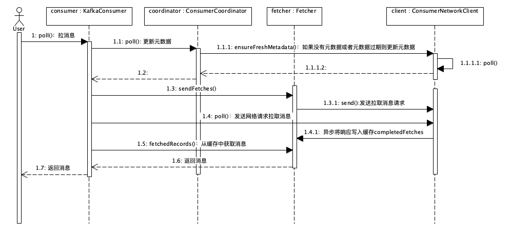
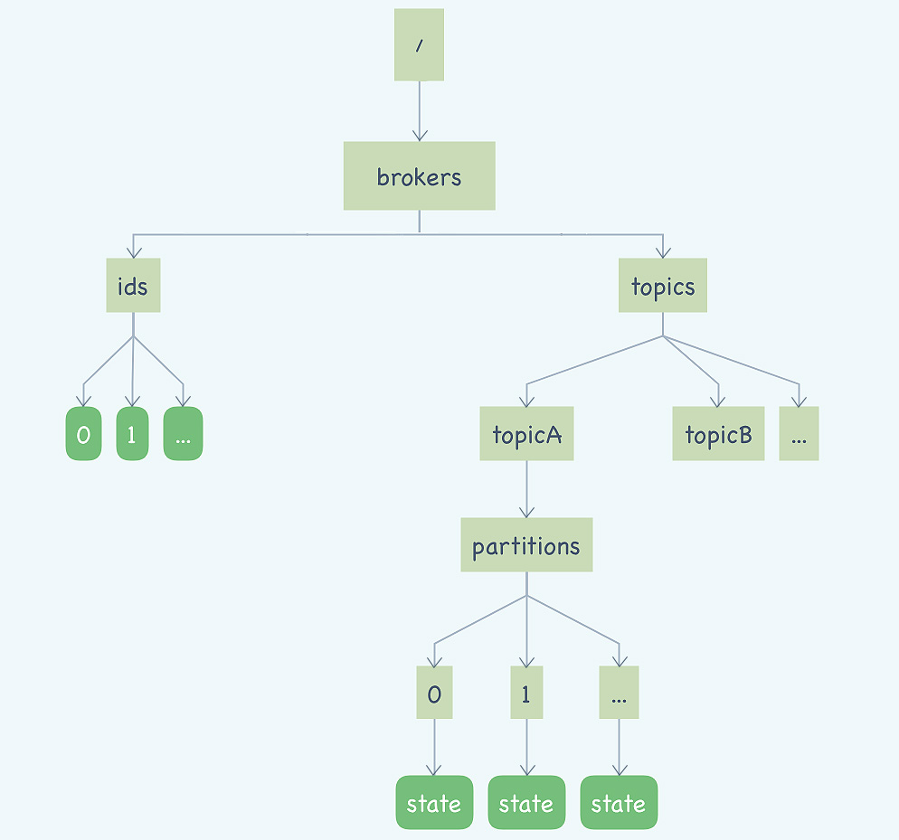
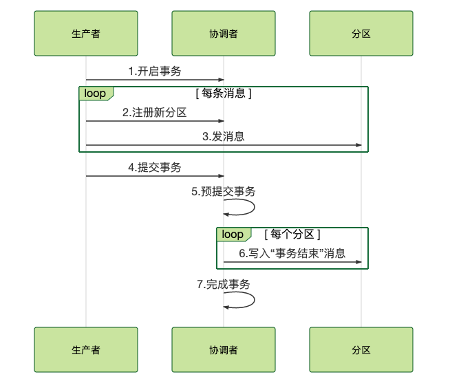

+++

title = "MQ"
description = "MQ"
tags = ["it", "mq"]

+++


# 消息队列


- MQ解决的问题：解决了上下游工序之间的“**通信**”问题；解决了上下游生产速度不一致的问题，起到了“通信”过程中“**缓存**”的作用
- 哪些问题适合使用消息队列解决：异步处理、流量控制、服务解耦

## 秒杀系统与MQ

- 如何设计一个秒杀系统？**秒杀（高并发）系统需要解决的核心问题是，如何利用有限的服务器资源，尽可能多地处理短时间内的海量请求**。

### 异步处理

- 秒杀步骤：处理一个秒杀请求包含很多步骤，**风险控制、库存锁定、生成订单、短信通知、更新统计数据**等
  - 决定了能否秒杀成功的实际上只有**风险控制、库存锁定**，完成这 2 个步骤，就可以马上给用户返回响应，然后把请求的数据放入消息队列中（生产者），后续的其它操作则在其它服务上异步执行（消费者）
  - 处理一个秒杀请求，从 5 个步骤减少为 2 个步骤，这样不仅响应速度更快，并且在秒杀期间，我们可以把大量的服务器资源用来处理秒杀请求。秒杀结束后再把资源用于处理后面的步骤，充分利用有限的服务器资源处理更多的秒杀请求。
  - **在这个场景中，消息队列被用于实现服务的异步处理。**这样做的好处是：可以更快地返回结果；减少等待，自然实现了步骤之间的并发，提升系统总体的性能


- 网关处理：注意实际生产环境中的秒杀系统实现更加复杂和多样，这里只是提供一个比较简单的方案。

  - **网关如何处理 APP 的秒杀请求**：网关在收到 APP 的秒杀请求后，直接给消息队列发消息（消息的内容，并不一定是 APP 请求的 Request，只要包含足够的字段即可，比如用户 ID、设备 ID、请求时间……请求ID、网关ID……）。如果发送消息失败，直接给 APP 返回秒杀失败结果；如果发送消息成功，线程就阻塞等待秒杀结果（有超时时间）。等待结束之后，去**存放秒杀结果的 Map** 中查询是否有返回的秒杀结果，如果有就构建 Response并给 APP 返回秒杀结果，如果没有则按秒杀失败处理。这个解决方案不是一个性能最优的方案，处理 APP 请求的线程需要同步等待秒杀结果，后面会讲如何使用异步方式来提升程序的性能。
  - **网关如何接收从后端秒杀服务返回的秒杀结果**：秒杀系统从MQ取到消息，秒杀结果中需要包含请求 ID，通过RPC请求或者其它方式将秒杀结果发送给对应网关节点，可以通过这个网关 ID 来找到对应的网关实例
  - **网关如何给 APP 返回响应**：网关收到后端服务的秒杀结果之后，用请求 ID 为 Key，把这个结果保存到秒杀结果的 Map 中，然后通知对应的处理 APP 请求的线程，结束等待。我刚刚说过，处理 APP 请求的线程，在结束等待之后，会去秒杀的结果 Map 中查询这个结果，然后再给 APP 返回响应


```java
// Java 语言来举例
public class RequestHandler {
    // ID 生成器
    @Inject
    private IdGenerator idGenerator;
    // 消息队列生产者
    @Inject
    private Producer producer;
    // 保存秒杀结果的 Map
    @Inject
    private Map<Long, Result> results;
    
    // 保存 mutex 的 Map
    private Map<Long, Object> mutexes = new ConcurrentHashMap<>();
    // 这个网关实例的 ID
    @Inject
    private long myId;
    
    @Inject
    private long timeout;
    
    // 在这里处理 APP 的秒杀请求
    public Response onRequest(Request request) {
        // 获取一个进程内唯一的 UUID 作为请求 id
        Long uuid = idGenerator.next();
        try {
            Message msg = composeMsg(request, uuid, myId);
        	// 生成一个 mutex，用于等待和通知
        	Object mutex = new Object();
        	mutexes.put(uuid, mutex)
 
      	 	// 发消息
      		producer.send(msg);
 
      		// 等待后端处理
      		synchronized(mutex) {
        		mutex.wait(timeout);
      		}
            
      		// 查询秒杀结果
      		Result result = results.remove(uuid);
 
      		// 检查秒杀结果并返回响应
      		if(null != result && result.success()){
        		return Response.success();
      		}
            
 		} catch (Throwable ignored) {
        } finally {
      		mutexes.remove(uuid);
        }
    	// 返回秒杀失败
    	return Response.fail();
  	}
 
  	// 在这里处理后端服务返回的秒杀结果
  	public void onResult(Result result) {
 
    	Object mutex = mutexes.get(result.uuid());
    	if(null != mutex) { // 如果查询不到，说明已经超时了，丢弃 result 即可。
     	 	// 登记秒杀结果
      		results.put(result.uuid(), result);
      		// 唤醒处理 APP 请求的线程
      		synchronized(mutex) {
        		mutex.notify();
      		}
    	}
  	}
}
```


### 流量控制

- 即使实现了异步处理，但还面临另一个问题，如何避免过多的请求压垮我们的秒杀系统？一个设计健壮的程序有自我保护的能力，即在海量请求下还能**在自身能力范围内尽可能多地处理请求、拒绝处理不了的请求、并保证自身运行正常**。但现实中很多程序并没有那么“健壮”，而直接拒绝请求返回错误对于用户来说也不是好的体验。因此，我们需要设计一套足够健壮的架构来将后端的服务保护起来。我们的设计思路是，**使用消息队列隔离网关和后端服务，以达到流量控制和保护后端服务的目的。**

  - 加入消息队列后，整个秒杀流程变为：网关在收到请求后，将请求放入请求消息队列；后端服务从请求消息队列中获取 APP 请求，完成后续秒杀处理过程，然后返回结果。秒杀开始后，当短时间内大量的秒杀请求到达网关时，不会直接冲击到后端的秒杀服务，而是先堆积在消息队列中，后端服务按照自己的最大处理能力，从消息队列中消费请求进行处理。对于超时的请求可以直接丢弃，APP 将超时无响应的请求处理为秒杀失败即可。运维人员还可以随时增加秒杀服务的实例数量进行水平扩容，而不用对系统的其他部分做任何更改。
  - 这种设计的优点是：能根据下游的处理能力自动调节流量，达到“削峰填谷”的作用。
  - 但这样做同样是有代价的：**增加了系统调用链环节，导致总体的响应时延变长**；上下游系统都要将同步调用改为异步消息，增加了系统的复杂度。

- 那还有没有更简单一点儿的流量控制方法呢？**如果能预估出秒杀服务的处理能力**，就可以用**消息队列实现一个令牌桶**，更简单地进行流量控制。

  - **令牌桶（池）**控制流量的原理是：单位时间内只发放固定数量的令牌到令牌桶中，规定服务在处理请求之前必须先从令牌桶中拿出一个令牌，如果令牌桶中没有令牌，则拒绝请求。这样就保证单位时间内，能处理的请求不超过发放令牌的数量，起到了流量控制的作用。
  - 实现的方式也很简单，不需要破坏原有的调用链，只要网关在处理 APP 请求时增加一个获取令牌的逻辑。令牌桶可以简单地用一个有固定容量的消息队列加一个“令牌发生器”来实现：令牌发生器按照预估的处理能力，匀速生产令牌并放入令牌队列（如果队列满了则丢弃令牌），网关在收到请求时去令牌队列消费一个令牌，获取到令牌则继续调用后端秒杀服务，如果获取不到令牌则直接返回秒杀失败。

  - 以上是常用的使用消息队列两种进行流量控制的设计方法，你可以根据各自的优缺点和不同的适用场景进行合理选择。


### **服务解耦**

- 消息队列的另外一个作用，就是实现系统应用之间的解耦。再举一个电商的例子来说明解耦的作用和必要性
  - 订单是电商系统中比较核心的数据，当一个新订单创建时：支付系统需要发起支付流程；风控系统需要审核订单的合法性；客服系统需要给用户发短信告知用户；经营分析系统需要更新统计数据；……。
  - 这些订单下游的系统都需要实时获得订单数据。随着业务不断发展，这些订单下游系统不断的增加，不断变化，并且**每个系统可能只需要订单数据的一个子集**，负责订单服务的开发团队不得不花费很大的精力，应对不断增加变化的下游系统，不停地修改调试订单系统与这些下游系统的接口。任何一个下游系统接口变更，都需要订单模块重新进行一次上线，对于一个电商的核心服务来说，这几乎是不可接受的。
  - 所有的电商都选择用消息队列来解决类似的系统耦合过于紧密的问题。引入消息队列后，订单服务在订单变化时发送一条消息到消息队列的一个主题 Order 中，所有下游系统都订阅主题 Order，这样每个下游系统都可以获得一份实时完整的订单数据。无论增加、减少下游系统或是下游系统需求如何变化，订单服务都无需做任何更改，实现了订单服务与下游服务的解耦。

### 小结

- 消息队列的适用范围不仅仅局限于这些场景，还有包括：

  - 作为发布 / 订阅系统实现一个微服务级系统间的观察者模式
  - 连接流计算任务和数据
  - 用于将消息广播给大量接收者

  简单的说，我们在单体应用里面需要用队列解决的问题，在分布式系统中大多都可以用消息队列来解决。

  同时我们也要认识到，消息队列也有它自身的一些问题和局限性，包括：

  - 引入消息队列带来的延迟问题；
  - 增加了系统的复杂度；
  - 可能产生数据不一致的问题。


## 消息


### 消息模型

- 每种MQ产品都有自己的一套消息模型，像队列（Queue）、主题（Topic）或是分区（Partition），在每个消息队列模型中都会涉及一些，含义还不太一样。国际组织尝试制定过消息相关的标准，比如早期的 JMS 和 AMQP。但让人无奈的是，标准的进化跟不上消息队列的演进速度，这些标准实际上已经被废弃了。**好的架构不是设计出来的，而是演进出来的**

#### 队列

- 最初的消息队列，就是一个严格意义上的队列
  - 队列是先进先出（FIFO, First-In-First-Out）的线性表（Linear List）。在具体应用中通常用链表或者数组来实现。队列只允许在后端（称为 rear）进行插入操作，在前端（称为 front）进行删除操作。在消息入队出队过程中，需要保证这些消息**严格有序**，**早期的消息队列，就是按照“队列”的数据结构来设计的**，生产者（Producer）发消息就是入队操作，消费者（Consumer）收消息就是出队也就是删除操作，服务端存放消息的容器自然就称为“队列”
  - 一个队列的多个消费者之间为**竞争**关系。如果需要将一份消息数据分发给多个消费者，要求每个消费者都能收到全量的消息，例如，对于一份订单数据，风控系统、分析系统、支付系统等都需要接收消息。这个时候，单个队列就满足不了需求，一个可行的解决方式是，为每个消费者创建一个单独的队列，让生产者发送多份。同样的一份消息数据被复制到多个队列中会浪费资源，更重要的是，生产者必须知道有多少个消费者。为每个消费者单独发送一份消息，这实际上违背了消息队列“解耦”这个设计初衷。所以演化出了另外一种消息模型：“**发布 - 订阅模型（Publish-Subscribe Pattern）**”


#### 发布订阅

- 在发布 - 订阅模型中，消息的发送方称为发布者（Publisher），消息的接收方称为订阅者（Subscriber），服务端存放消息的容器称为主题（Topic）。发布者将消息发送到主题中，订阅者在接收消息之前需要先“订阅主题”。“订阅”在这里既是一个动作，同时还可以认为是主题在消费时的一个逻辑副本，每份订阅中，订阅者都可以接收到主题的所有消息。
- 消息的发送方称为发布者（Publisher），消息的接收方称为订阅者（Subscriber），服务端存放消息的容器称为主题（Topic）。发布者将消息发送到主题中，订阅者在接收消息之前需要先“订阅主题”。“订阅”在这里既是一个动作，同时还可以认为是主题在消费时的一个逻辑副本，每份订阅中，订阅者都可以接收到主题的所有消息
- 仔细对比一下这两种模型，生产者就是发布者，消费者就是订阅者，队列就是主题，并没有本质的区别。**它们最大的区别其实就是，一份消息数据能不能被消费多次的问题。**如果只有一个订阅者，那它和队列模型就基本是一样的了。也就是说，发布 - 订阅模型在功能层面上是可以兼容队列模型的


#### RabbitMQ的消息模型

- 少数依然坚持使用队列模型的产品之一。那它是怎么解决多个消费者的问题呢？在 RabbitMQ 中，Exchange 位于生产者和队列之间，生产者并不关心将消息发送给哪个队列，而是将消息发送给 Exchange，由 Exchange 上配置的策略来决定将消息投递到哪些队列中。
- 同一份消息如果需要被多个消费者来消费，需要配置 Exchange 将消息发送到多个队列，每个队列中都存放一份完整的消息数据，可以为一个消费者提供消费服务。这也可以变相地实现新发布 - 订阅模型中，“一份消息数据可以被多个订阅者来多次消费”这样的功能。


#### RocketMQ 的消息模型

- RocketMQ 使用的消息模型是标准的发布 - 订阅模型
- RocketMQ 也有队列（Queue）这个概念
- 几乎所有的消息队列产品都使用一种非常朴素的“请求 - 确认”机制，确保消息不会在传递过程中由于网络或服务器故障丢失。具体的做法也非常简单。
  - 在生产端，生产者发送消息给服务端（Broker），服务端在收到消息并将消息写入主题或者队列中后，会给生产者发送确认的响应。如果生产者没有收到服务端的确认或者收到失败的响应，则会重新发送消息。在消费端，消费者在收到消息并完成自己的消费业务逻辑（比如，将数据保存到数据库中）后，也会给服务端发送消费成功的确认，服务端只有收到消费确认后，才认为一条消息被成功消费，否则它会给消费者重新发送这条消息，直到收到对应的消费成功确认。
  - 确认机制很好地保证了消息传递的可靠性，但引入这个机制在消费端带来了一个不小的问题：为了确保消息的有序性，在某一条消息被成功消费之前，下一条消息是不能被消费的，否则就会出现消息空洞，违背有序性原则。即每个主题在任意时刻，至多只能有一个消费者实例在进行消费，那就没法通过水平扩展消费者的数量来提升消费端总体的消费性能。为了解决这个问题，RocketMQ 在主题下面增加了队列的概念。
- **每个主题包含多个队列，通过多个队列来实现多实例并行生产和消费。**需要注意的是，RocketMQ 只在队列上保证消息的有序性，主题层面是无法保证消息的严格顺序的
  - RocketMQ 中，订阅者的概念是通过消费组（Consumer Group）来体现的。每个消费组都消费主题中一份完整的消息，不同消费组之间消费进度彼此不受影响，也就是说，一条消息被 Consumer Group1 消费过，也会再给 Consumer Group2 消费。消费组中包含多个消费者，同一个组内的消费者是竞争消费的关系，每个消费者负责消费组内的一部分消息。如果一条消息被消费者 Consumer1 消费了，那同组的其他消费者就不会再收到这条消息。
  - 在 Topic 的消费过程中，由于消息需要被不同的组进行多次消费，所以消费完的消息并不会立即被删除，这就需要 RocketMQ 为每个消费组在每个队列上维护一个消费位置（Consumer Offset），这个位置之前的消息都被消费过，之后的消息都没有被消费过，每成功消费一条消息，消费位置就加一。这个消费位置是非常重要的概念，我们在使用消息队列的时候，丢消息的原因大多是由于消费位置处理不当导致的。


#### Kafka 的消息模型

- Kafka 的消息模型与RocketMQ是完全一致，包括确认机制。唯一的区别是，在 Kafka 中，队列这个概念的名称不一样，Kafka 中对应的名称是“分区（Partition）”，含义和功能是没有任何区别的。
- 消息模型总结：假设有一个主题 MyTopic，为主题创建 5 个队列，分布到 2 个 Broker 中。
  - 生产者、Queue：**无对应**。假设有3个生产者实例Produer0、Produer1、Producer2。每个生产者可以在 5 个队列中轮询发送，或者随机选一个队列发送，或者只往某个队列发送，皆可。比如 Producer0 要发 5 条消息，可以都发到队列 Q0 里面，也可以 5 个队列每个队列发一条。
  - Queue、消费组、消费者：每个消费组就是一份订阅，它要消费主题 MyTopic 下所有队列的全部消息。每个消费组都会去消费所配置的每个Queue中的消息，消费过的消息仍然被维护在Queue中，只是还需要各自维护各消费组在各Queue上的消费位置（offsite），每个消费组内部维护自己的一组消费位置，每个队列对应一个消费位置。消费位置在服务端保存，并且，**消费位置和消费者是没有关系的**。每个消费位置一般就是一个整数，记录这个消费组中，这个队列消费到哪个位置了，这个位置之前的消息都成功消费了，之后的消息都没有消费或者正在消费。。即多个消费组在消费同一个主题时，消费组之间是互不影响的。在消费组内部，一个消费组中可以包含多个消费者的实例，由于消费确认机制的限制，这里面有一个原则是，每个队列只能被一个消费组中的一个消费者实例占用，至于如何分配则是由很多策略的，总之保证每个队列分配该消费组的一个消费者即可，比如说消费组 G1，包含了 2 个消费者 C0 和 C1，可以让消费者 C0 消费 Q0，Q1 和 Q2，C1 消费 Q3 和 Q4，如果 C0 宕机了，会触发重新分配，这时候 C1 同时消费全部 5 个队列。

#### 小结

- 队列模型和发布订阅模型其实并没有本质上的区别，都可以通过一些扩展或者变化来互相替代。
- 需要注意的是，消息模型和相关的概念是业务层面的模型，不等于就是实现层面的模型。比如说 MySQL 和 Hbase 同样是支持 SQL 的数据库，它们的业务模型中，存放数据的单元都是“表”，但是在实现层面，没有哪个数据库是以二维表的方式去存储数据的，MySQL 使用 B+ 树来存储数据，而 HBase 使用的是 KV 的结构来存储。际上这Kafka 和 RocketMQ的实现是完全不同的

#### 思考

- 如果不要求严格顺序，如何实现单个队列的并行消费？
  - 关于这个问题，有很多的实现方式，在 JMQ（京东自研的消息队列产品）中，它实现的思路是这样的。比如说，队列中当前有 10 条消息，对应的编号是 0-9，当前的消费位置是 5。同时来了三个消费者来拉消息，把编号为 5、6、7 的消息分别给三个消费者，每人一条。过了一段时间，三个消费成功的响应都回来了，这时候就可以把消费位置更新为 8 了，这样就实现并行消费。这是理想的情况。还有可能编号为 6、7 的消息响应回来了，编号 5 的消息响应一直回不来，怎么办？这个位置 5 就是一个消息空洞。为了避免位置 5 把这个队列卡住，可以先把消费位置 5 这条消息，复制到一个特殊重试队列中，然后依然把消费位置更新为 8，继续消费。再有消费者来拉消息的时候，优先把重试队列中的那条消息给消费者就可以了。这是并行消费的一种实现方式。需要注意的是，并行消费开销还是很大的，不应该作为一个常规的，提升消费并发的手段，如果消费慢需要增加消费者的并发数，还是需要扩容队列数
- 如何保证消息的严格顺序
  - 主题层面是无法保证严格顺序的，只有在队列上才能保证消息的严格顺序。如果说，你的业务必须要求全局严格顺序，就只能把消息队列数配置成 1，生产者和消费者也只能是一个实例，这样才能保证全局严格顺序。大部分情况下，我们并不需要全局严格顺序，只要保证局部有序就可以满足要求了。比如，在传递账户流水记录的时候，只要保证每个账户的流水有序就可以了，不同账户之间的流水记录是不需要保证顺序的。如果需要保证局部严格顺序，可以这样来实现。在发送端，我们使用账户 ID 作为 Key，采用一致性哈希算法计算出队列编号，指定队列来发送消息。一致性哈希算法可以保证，相同 Key 的消息总是发送到同一个队列上，这样可以保证相同 Key 的消息是严格有序的。如果不考虑队列扩容，也可以用队列数量取模的简单方法来计算队列编号。

### 消息和事务

- MQ也需要事务，很多场景下，我们“发消息”这个过程，目的往往是通知另外一个系统或者模块去更新数据，**消息队列中的“事务”，主要解决的是消息生产者和消息消费者的数据一致性问题**。
- 电商举例，购物时，先把商品加到购物车里，然后几件商品一起下单，最后支付，完成购物流程。这个过程中有一个需要用到消息队列的步骤，订单系统创建订单后，发消息给购物车系统，将已下单的商品从购物车中删除。因为从购物车删除已下单商品这个步骤，并不是用户下单支付这个主要流程中必需的步骤，使用消息队列来异步清理购物车是更加合理的设计。
- 订单系统来说，它创建订单的过程中实际上执行了 2 个步骤的操作：
  1. 在订单库中插入一条订单数据，创建订单；
  2. 发消息给消息队列，消息的内容就是刚刚创建的订单。
- 购物车系统订阅相应的主题，接收订单创建的消息，然后清理购物车，在购物车中删除订单中的商品。在分布式系统中，任何一个步骤都有可能失败，如果不做任何处理，那就有可能出现订单数据与购物车数据不一致的情况，比如说：
  - 创建了订单，没有清理购物车；
  - 订单没创建成功，购物车里面的商品却被清掉了。
- 需要解决的问题可以总结为：在上述任意步骤都有可能失败的情况下，还要保证订单库和购物车库这两个库的数据一致性。对于购物车系统收到订单创建成功消息清理购物车这个操作来说，失败的处理比较简单，只要成功执行购物车清理后再提交消费确认即可，如果失败，由于没有提交消费确认，消息队列会自动重试。问题的关键点集中在订单系统，创建订单和发送消息这两个步骤要么都操作成功，要么都操作失败，不允许一个成功而另一个失败的情况出现。这就是事务需要解决的问题。


#### 事务

- 什么是事务
  - 如果我们需要对若干数据进行更新操作，为了保证这些数据的完整性和一致性，我们希望这些更新操作**要么都成功，要么都失败。**至于更新的数据，不只局限于数据库中的数据，可以是磁盘上的一个文件，也可以是远端的一个服务，或者以其他形式存储的数据。
  - 一个严格意义的事务实现，应该具有 4 个属性：原子性、一致性、隔离性、持久性。这四个属性通常称为 ACID 特性
    - 原子性，是指一个事务操作不可分割，要么成功，要么失败，不能有一半成功一半失败的情况。
    - 一致性，是指这些数据在事务执行完成这个时间点之前，读到的一定是更新前的数据，之后读到的一定是更新后的数据，不应该存在一个时刻，让用户读到更新过程中的数据。
    - 隔离性，是指一个事务的执行不能被其他事务干扰。即一个事务内部的操作及使用的数据对正在进行的其他事务是隔离的，并发执行的各个事务之间不能互相干扰，这个有点儿像我们打网游中的副本，我们在副本中打的怪和掉的装备，与其他副本没有任何关联也不会互相影响。
    - 持久性，是指一个事务一旦完成提交，后续的其他操作和故障都不会对事务的结果产生任何影响。
  - 大部分传统的单体关系型数据库都完整的实现了 ACID，但是，对于分布式系统来说，严格的实现 ACID 这四个特性几乎是不可能的，或者说实现的代价太大，大到我们无法接受。分布式事务就是要在分布式系统中的实现事务。在分布式系统中，在保证可用性和不严重牺牲性能的前提下，光是要实现数据的一致性就已经非常困难了，所以出现了很多“残血版”的一致性，比如顺序一致性、最终一致性等等。
  - 显然实现严格的分布式事务是更加不可能完成的任务。所以，目前大家所说的分布式事务，更多情况下，是在分布式系统中事务的不完整实现。在不同的应用场景中，有不同的实现，目的都是通过一些妥协来解决实际问题。
  - 在实际应用中，比较常见的分布式事务实现有 2PC、TCC和事务消息。每一种实现都有其特定的使用场景，也有各自的问题，都不是完美的解决方案。
    - 2PC（Two-phase Commit，二阶段提交）：
    - TCC（Try-Confirm-Cancel）：
  - 事务消息适用的场景主要是那些需要异步更新数据，并且对数据实时性要求不太高的场景。比如我们在开始时提到的那个例子，在创建订单后，如果出现短暂的几秒，购物车里的商品没有被及时清空，也不是完全不可接受的，只要最终购物车的数据和订单数据保持一致就可以了。
- 消息队列是如何实现分布式事务
  - 事务消息需要消息队列提供相应的功能才能实现，Kafka 和 RocketMQ 都提供了事务相关功能。
  - 首先，订单系统在消息队列上开启一个事务。然后订单系统给消息服务器发送一个“半消息”，这个半消息不是说消息内容不完整，它包含的内容就是完整的消息内容，半消息和普通消息的唯一区别是，在事务提交之前，对于消费者来说，这个消息是不可见的。
  - 半消息发送成功后，订单系统就可以执行本地事务了，在订单库中创建一条订单记录，并提交订单库的数据库事务。然后根据本地事务的执行结果决定提交或者回滚事务消息。如果订单创建成功，那就提交事务消息，购物车系统就可以消费到这条消息继续后续的流程。如果订单创建失败，那就回滚事务消息，购物车系统就不会收到这条消息。这样就基本实现了“要么都成功，要么都失败”的一致性要求。
  - 有一个问题是没有解决的。如果在第四步提交事务消息时失败了怎么办
    - Kafka 的解决方案比较简单粗暴，直接抛出异常，让用户自行处理。我们可以在业务代码中反复重试提交，直到提交成功，或者删除之前创建的订单进行补偿。
    - 在 RocketMQ 中的事务实现中，增加了事务反查的机制来解决事务消息提交失败的问题。
      - 如果 Producer 也就是订单系统，在提交或者回滚事务消息时发生网络异常，RocketMQ 的 Broker 没有收到提交或者回滚的请求，Broker 会定期去 Producer 上反查这个事务对应的本地事务的状态，然后根据反查结果决定提交或者回滚这个事务。为了支撑这个事务反查机制，我们的业务代码需要实现一个反查本地事务状态的接口，告知 RocketMQ 本地事务是成功还是失败。
      - 在我们这个例子中，反查本地事务的逻辑也很简单，我们只要根据消息中的订单 ID，在订单库中查询这个订单是否存在即可，如果订单存在则返回成功，否则返回失败。RocketMQ 会自动根据事务反查的结果提交或者回滚事务消息。
      - 这个反查本地事务的实现，并不依赖消息的发送方，也就是订单服务的某个实例节点上的任何数据。这种情况下，即使是发送事务消息的那个订单服务节点宕机了，RocketMQ 依然可以通过其他订单服务的节点来执行反查，确保事务的完整性。


#### 小结

- RocketMQ 的事务反查机制，这种机制通过定期反查事务状态，来补偿提交事务消息可能出现的通信失败。在 Kafka 的事务功能中，并没有类似的反查机制，需要用户自行去解决这个问题。但是，这不代表 RocketMQ 的事务功能比 Kafka 更好，只能说在我们这个例子的场景下，更适合使用 RocketMQ。Kafka 对于事务的定义、实现和适用场景，和 RocketMQ 有比较大的差异，后面的课程中，我们会专门讲到 Kafka 的事务的实现原理。

#### 思考

- 建议你最好能通过写代码的方式，把我们这节课中的订单购物车的例子，用 RocketMQ 完整地实现出来。然后再思考一下，RocketMQ 的这种事务消息是不是完整地实现了事务的 ACID 四个特性？如果不是，哪些特性没有实现？

### 消息丢失

- 对于大部分业务系统来说，丢消息意味着数据丢失，是完全无法接受的。
- 现在主流的消息队列产品都提供了非常完善的消息可靠性保证机制，完全可以做到在消息传递过程中，即使发生网络中断或者硬件故障，也能确保消息的可靠传递，不丢消息。
- 绝大部分丢消息的原因都是由于开发者不熟悉消息队列，没有正确使用和配置消息队列导致的。虽然不同的消息队列提供的 API 不一样，相关的配置项也不同，但是在保证消息可靠传递这块儿，它们的实现原理是一样的。熟知原理以后，无论你使用任何一种消息队列，再简单看一下它的 API 和相关配置项，就能很快知道该如何配置消息队列，写出可靠的代码，避免消息丢失

#### 检测消息丢失的方法

- 用消息队列最尴尬的情况不是丢消息，而是消息丢了还不知道
- 分布式链路追踪系统可以很方便地追踪每一条消息
- 如果没有这样的追踪系统，**可以利用消息队列的有序性来验证是否有消息丢失。**原理非常简单，在 Producer 端，我们给每个发出的消息附加一个连续递增的序号，然后在 Consumer 端来检查这个序号的连续性。
  - 如果没有消息丢失，Consumer 收到消息的序号必然是连续递增的，或者说收到的消息，其中的序号必然是上一条消息的序号 +1。如果检测到序号不连续，那就是丢消息了。还可以通过缺失的序号来确定丢失的是哪条消息，方便进一步排查原因。
  - 大多数消息队列的客户端都支持拦截器机制，你可以利用这个拦截器机制，在 Producer 发送消息之前的拦截器中将序号注入到消息中，在 Consumer 收到消息的拦截器中检测序号的连续性，这样实现的好处是消息检测的代码不会侵入到你的业务代码中，待你的系统稳定后，也方便将这部分检测的逻辑关闭或者删除。
- 如果是在一个分布式系统中实现这个检测方法，有几个问题需要注意。
  - 首先，像 Kafka 和 RocketMQ 这样的消息队列，它是不保证在 Topic 上的严格顺序的，只能保证分区上的消息是有序的，所以我们在发消息的时候必须要指定分区，并且，在每个分区单独检测消息序号的连续性。
  - 如果你的系统中 Producer 是多实例的，由于并不好协调多个 Producer 之间的发送顺序，所以也需要每个 Producer 分别生成各自的消息序号，并且需要附加上 Producer 的标识，在 Consumer 端按照每个 Producer 分别来检测序号的连续性。
  - Consumer 实例的数量最好和分区数量一致，做到 Consumer 和分区一一对应，这样会比较方便地在 Consumer 内检测消息序号的连续性。

#### 确保消息可靠传递

- **生产阶段**: 在这个阶段，从消息在 Producer 创建出来，经过网络传输发送到 Broker 端。

  - 消息队列通过最常用的请求确认机制，来保证消息的可靠传递：当你的代码调用发消息方法时，消息队列的客户端会把消息发送到 Broker，Broker 收到消息后，会给客户端返回一个确认响应，表明消息已经收到了。客户端收到响应后，完成了一次正常消息的发送。

  - 只要 Producer 收到了 Broker 的确认响应，就可以保证消息在生产阶段不会丢失。有些消息队列在长时间没收到发送确认响应后，会自动重试，如果重试再失败，就会以返回值或者异常的方式告知用户。

  - **你在编写发送消息代码时，需要注意，正确处理返回值或者捕获异常，就可以保证这个阶段的消息不会丢失。**以 Kafka 为例，我们看一下如何可靠地发送消息：

  - 同步发送时，只要注意捕获异常即可。

    ```
    try {
        RecordMetadata metadata = producer.send(record).get();
        System.out.println(" 消息发送成功。");
    } catch (Throwable e) {
        System.out.println(" 消息发送失败！");
        System.out.println(e);
    }
    ```

  - 异步发送时，则需要在回调方法里进行检查。这个地方是需要特别注意的，很多丢消息的原因就是，我们使用了异步发送，却没有在回调中检查发送结果。

    ```
    producer.send(record, (metadata, exception) -> {
        if (metadata != null) {
            System.out.println(" 消息发送成功。");
        } else {
            System.out.println(" 消息发送失败！");
            System.out.println(exception);
        }
    });
    ```

- **存储阶段**: 在这个阶段，消息在 Broker 端存储，如果是集群，消息会在这个阶段被复制到其他的副本上。

  - 在存储阶段正常情况下，只要 Broker 在正常运行，就不会出现丢失消息的问题，但是如果 Broker 出现了故障，比如进程死掉了或者服务器宕机了，还是可能会丢失消息的。
  - **如果对消息的可靠性要求非常高，可以通过配置 Broker 参数来避免因为宕机丢消息。**
  - 对于单个节点的 Broker，需要配置 Broker 参数，在收到消息后，将消息写入磁盘后再给 Producer 返回确认响应，这样即使发生宕机，由于消息已经被写入磁盘，就不会丢失消息，恢复后还可以继续消费。例如，在 RocketMQ 中，需要将刷盘方式 flushDiskType 配置为 SYNC_FLUSH 同步刷盘。
  - 如果是 Broker 是由多个节点组成的集群，需要将 Broker 集群配置成：至少将消息发送到 2 个以上的节点，再给客户端回复发送确认响应。这样当某个 Broker 宕机时，其他的 Broker 可以替代宕机的 Broker，也不会发生消息丢失。后面我会专门安排一节课，来讲解在集群模式下，消息队列是如何通过消息复制来确保消息的可靠性的。

- **消费阶段**: 在这个阶段，Consumer 从 Broker 上拉取消息，经过网络传输发送到 Consumer 上。

  - 消费阶段采用和生产阶段类似的确认机制来保证消息的可靠传递，客户端从 Broker 拉取消息后，执行用户的消费业务逻辑，成功后，才会给 Broker 发送消费确认响应。如果 Broker 没有收到消费确认响应，下次拉消息的时候还会返回同一条消息，确保消息不会在网络传输过程中丢失，也不会因为客户端在执行消费逻辑中出错导致丢失。

  - 你在编写消费代码时需要注意的是，**不要在收到消息后就立即发送消费确认，而是应该在执行完所有消费业务逻辑之后，再发送消费确认。**

  - 同样，我们以用 Python 语言消费 RabbitMQ 消息为例，来看一下如何实现一段可靠的消费代码：

    ```
    def callback(ch, method, properties, body):
        print(" [x] 收到消息 %r" % body)
        # 在这儿处理收到的消息
        database.save(body)
        print(" [x] 消费完成 ")
        # 完成消费业务逻辑后发送消费确认响应
        ch.basic_ack(delivery_tag = method.delivery_tag)
     
    channel.basic_consume(queue='hello', on_message_callback=callback)
    ```

  - 你可以看到，在消费的回调方法 callback 中，正确的顺序是，先是把消息保存到数据库中，然后再发送消费确认响应。这样如果保存消息到数据库失败了，就不会执行消费确认的代码，下次拉到的还是这条消息，直到消费成功。


#### 小结

- 在理解了这几个阶段的原理后，如果再出现丢消息的情况，应该可以通过在代码中加一些日志的方式，很快定位到是哪个阶段出了问题，然后再进一步深入分析，快速找到问题原因。

#### 思考

- 如果消息在网络传输过程中发送错误，由于发送方收不到确认，会通过重发来保证消息不丢失。但是，如果确认响应在网络传输时丢失，也会导致重发消息。也就是说，**无论是 Broker 还是 Consumer 都是有可能收到重复消息的，**那我们在编写消费代码时，就需要考虑这种情况，你可以想一下，在消费消息的代码中，该如何处理这种重复消息，才不会影响业务逻辑的正确性？

### 消息重复

- 消息传递过程中，如果出现传递失败的情况，发送方会执行重试，重试的过程中就有可能会产生重复的消息。对使用消息队列的业务系统来说，如果没有对重复消息进行处理，就有可能会导致系统的数据出现错误。比如说，一个消费订单消息，统计下单金额的微服务，如果没有正确处理重复消息，那就会出现重复统计，导致统计结果错误。

#### 消息重复的情况必然存在

- 在 MQTT 协议中，给出了三种传递消息时能够提供的服务质量标准，这三种服务质量从低到高依次是：
  - **At most once**: 至多一次。消息在传递时，最多会被送达一次。换一个说法就是，没什么消息可靠性保证，允许丢消息。一般都是一些对消息可靠性要求不太高的监控场景使用，比如每分钟上报一次机房温度数据，可以接受数据少量丢失。
  - **At least once**: 至少一次。消息在传递时，至少会被送达一次。也就是说，不允许丢消息，但是允许有少量重复消息出现。
  - **Exactly once**：恰好一次。消息在传递时，只会被送达一次，不允许丢失也不允许重复，这个是最高的等级。
- 这个服务质量标准不仅适用于 MQTT，对所有的消息队列都是适用的。我们现在常用的绝大部分消息队列提供的服务质量都是 At least once，包括 RocketMQ、RabbitMQ 和 Kafka 都是这样。也就是说，消息队列很难保证消息不重复。
- 说到这儿我知道肯定有的同学会反驳我：“你说的不对，我看过 Kafka 的文档，Kafka 是支持 Exactly once 的。”我在这里跟这些同学解释一下，你说的没错，Kafka 的确是支持 Exactly once，但是我讲的也没有问题，为什么呢？
- Kafka 支持的“Exactly once”和我们刚刚提到的消息传递的服务质量标准“Exactly once”是不一样的，它是 Kafka 提供的另外一个特性，Kafka 中支持的事务也和我们通常意义理解的事务有一定的差异。在 Kafka 中，事务和 Excactly once 主要是为了配合流计算使用的特性，我们在专栏“进阶篇”这个模块中，会有专门的一节课来讲 Kafka 的事务和它支持的 Exactly once 特性。
- 稍微说一些题外话，Kafka 的团队是一个非常善于包装和营销的团队，你看他们很巧妙地用了两个所有人都非常熟悉的概念“事务”和“Exactly once”来包装它的新的特性，实际上它实现的这个事务和 Exactly once 并不是我们通常理解的那两个特性，但是你深入了解 Kafka 的事务和 Exactly once 后，会发现其实它这个特性虽然和我们通常的理解不一样，但确实和事务、Exactly once 有一定关系。这一点上，我们都要学习 Kafka 团队。一个优秀的开发团队，不仅要能写代码，更要能写文档，能写 Slide（PPT），还要能讲，会分享。对于每个程序员来说，也是一样的。
- 我们把话题收回来，继续来说重复消息的问题。既然消息队列无法保证消息不重复，就需要我们的消费代码能够接受“消息是可能会重复的”这一现状，然后，通过一些方法来消除重复消息对业务的影响。

#### 幂等性解决消息重复问题

- **幂等（Idempotence）** 本来是一个数学上的概念，它是这样定义的：

  > 如果一个函数 f(x) 满足：f(f(x)) = f(x)，则函数 f(x) 满足幂等性。

  这个概念被拓展到计算机领域，被用来描述一个操作、方法或者服务。一个幂等操作的特点是，**其任意多次执行所产生的影响均与一次执行的影响相同。**

- 一个幂等的方法，使用同样的参数，对它进行多次调用和一次调用，对系统产生的影响是一样的。所以，对于幂等的方法，不用担心重复执行会对系统造成任何改变。比如，在不考虑并发的情况下，“将账户 X 的余额设置为 100 元”，执行一次后对系统的影响是，账户 X 的余额变成了 100 元，只要提供的参数 100 元不变，那即使再执行多少次，账户 X 的余额始终都是 100 元，不会变化，这个操作就是一个幂等的操作；而“将账户 X 的余额加 100 元”，这个操作它就不是幂等的，每执行一次，账户余额就会增加 100 元，执行多次和执行一次对系统的影响（也就是账户的余额）是不一样的。

- 一般解决重复消息的办法是，在消费端，让我们消费消息的操作具备幂等性。如果我们系统消费消息的业务逻辑具备幂等性，那就不用担心消息重复的问题了，因为同一条消息，消费一次和消费多次对系统的影响是完全一样的。也就可以认为，消费多次等于消费一次。从对系统的影响结果来说：**At least once + 幂等消费 = Exactly once。**

- 那么如何实现幂等操作呢？最好的方式就是，**从业务逻辑设计上入手，将消费的业务逻辑设计成具备幂等性的操作。**但是，不是所有的业务都能设计成天然幂等的，这里就需要一些方法和技巧来实现幂等。

##### 利用数据库的唯一约束实现幂等

- 对于每个转账单每个账户只可以执行一次变更操作，在分布式系统中，这个限制实现的方法非常多，最简单的是我们在数据库中建一张转账流水表，这个表有三个字段：转账单 ID、账户 ID 和变更金额，然后给转账单 ID 和账户 ID 这两个字段联合起来创建一个唯一约束，这样对于相同的转账单 ID 和账户 ID，表里至多只能存在一条记录。
- 这样，我们消费消息的逻辑可以变为：“在转账流水表中增加一条转账记录，然后再根据转账记录，异步操作更新用户余额即可。”在转账流水表增加一条转账记录这个操作中，由于我们在这个表中预先定义了“账户 ID 转账单 ID”的唯一约束，对于同一个转账单同一个账户只能插入一条记录，后续重复的插入操作都会失败，这样就实现了一个幂等的操作。我们只要写一个 SQL，正确地实现它就可以了。
- 基于这个思路，不光是可以使用关系型数据库，只要是支持类似“INSERT IF NOT EXIST”语义的存储类系统都可以用于实现幂等，比如，你可以用 Redis 的 SETNX 命令来替代数据库中的唯一约束，来实现幂等消费。

##### 为更新的数据设置前置条件

- 另外一种实现幂等的思路是，给数据变更设置一个前置条件，如果满足条件就更新数据，否则拒绝更新数据，在更新数据的时候，同时变更前置条件中需要判断的数据。这样，重复执行这个操作时，由于第一次更新数据的时候已经变更了前置条件中需要判断的数据，不满足前置条件，则不会重复执行更新数据操作。
- 比如，刚刚我们说过，“将账户 X 的余额增加 100 元”这个操作并不满足幂等性，我们可以把这个操作加上一个前置条件，变为：“如果账户 X 当前的余额为 500 元，将余额加 100 元”，这个操作就具备了幂等性。对应到消息队列中的使用时，可以在发消息时在消息体中带上当前的余额，在消费的时候进行判断数据库中，当前余额是否与消息中的余额相等，只有相等才执行变更操作。
- 但是，如果我们要更新的数据不是数值，或者我们要做一个比较复杂的更新操作怎么办？用什么作为前置判断条件呢？更加通用的方法是，给你的数据增加一个版本号属性，每次更数据前，比较当前数据的版本号是否和消息中的版本号一致，如果不一致就拒绝更新数据，更新数据的同时将版本号 +1，一样可以实现幂等更新。

##### 记录并检查操作

- 如果上面提到的两种实现幂等方法都不能适用于你的场景，我们还有一种通用性最强，适用范围最广的实现幂等性方法：记录并检查操作，也称为“Token 机制或者 GUID（全局唯一 ID）机制”，实现的思路特别简单：在执行数据更新操作之前，先检查一下是否执行过这个更新操作。
- 具体的实现方法是，在发送消息时，给每条消息指定一个全局唯一的 ID，消费时，先根据这个 ID 检查这条消息是否有被消费过，如果没有消费过，才更新数据，然后将消费状态置为已消费。
- 原理和实现是不是很简单？其实一点儿都不简单，在分布式系统中，这个方法其实是非常难实现的。首先，给每个消息指定一个全局唯一的 ID 就是一件不那么简单的事儿，方法有很多，但都不太好同时满足简单、高可用和高性能，或多或少都要有些牺牲。更加麻烦的是，在“检查消费状态，然后更新数据并且设置消费状态”中，三个操作必须作为一组操作保证原子性，才能真正实现幂等，否则就会出现 Bug。
- 比如说，对于同一条消息：“全局 ID 为 8，操作为：给 ID 为 666 账户增加 100 元”，有可能出现这样的情况：
  - t0 时刻：Consumer A 收到条消息，检查消息执行状态，发现消息未处理过，开始执行“账户增加 100 元”；
  - t1 时刻：Consumer B 收到条消息，检查消息执行状态，发现消息未处理过，因为这个时刻，Consumer A 还未来得及更新消息执行状态。
- 这样就会导致账户被错误地增加了两次 100 元，这是一个在分布式系统中非常容易犯的错误，一定要引以为戒。
- 对于这个问题，当然我们可以用事务来实现，也可以用锁来实现，但是在分布式系统中，无论是分布式事务还是分布式锁都是比较难解决问题。

#### 小结

- 主要介绍了通过幂等消费来解决消息重复的问题，然后我重点讲了几种实现幂等操作的方法，你可以利用数据库的约束来防止重复更新数据，也可以为数据更新设置一次性的前置条件，来防止重复消息，如果这两种方法都不适用于你的场景，还可以用“记录并检查操作”的方式来保证幂等，这种方法适用范围最广，但是实现难度和复杂度也比较高，一般不推荐使用。
- 这些实现幂等的方法，不仅可以用于解决重复消息的问题，也同样适用于，在其他场景中来解决重复请求或者重复调用的问题。比如，我们可以将 HTTP 服务设计成幂等的，解决前端或者 APP 重复提交表单数据的问题；也可以将一个微服务设计成幂等的，解决 RPC 框架自动重试导致的重复调用问题。这些方法都是通用的，希望你能做到触类旁通，举一反三。

#### 思考

- 为什么大部分消息队列都选择只提供 At least once 的服务质量，而不是级别更高的 Exactly once 呢？

### 消息积压

- 据我了解，在使用消息队列遇到的问题中，消息积压这个问题，应该是最常遇到的问题了，并且，这个问题还不太好解决。
- 我们都知道，消息积压的直接原因，一定是系统中的某个部分出现了性能问题，来不及处理上游发送的消息，才会导致消息积压。
- 所以，我们先来分析下，在使用消息队列时，如何来优化代码的性能，避免出现消息积压。然后再来看看，如果你的线上系统出现了消息积压，该如何进行紧急处理，最大程度地避免消息积压对业务的影响。

#### 优化性能来避免消息积压

- 在使用消息队列的系统中，对于性能的优化，主要体现在生产者和消费者这一收一发两部分的业务逻辑中
- 对于消息队列本身的性能，你作为使用者，不需要太关注。对于绝大多数使用消息队列的业务来说，消息队列本身的处理能力要远大于业务系统的处理能力。主流消息队列的单个节点，消息收发的性能可以达到每秒钟处理几万至几十万条消息的水平，还可以通过水平扩展 Broker 的实例数成倍地提升处理能力。
- 而一般的业务系统需要处理的业务逻辑远比消息队列要复杂，单个节点每秒钟可以处理几百到几千次请求，已经可以算是性能非常好的了。所以，对于消息队列的性能优化，我们更关注的是，**在消息的收发两端，我们的业务代码怎么和消息队列配合，达到一个最佳的性能。**

##### 发送端性能优化

- 发送端业务代码的处理性能，实际上和消息队列的关系不大，因为一般发送端都是先执行自己的业务逻辑，最后再发送消息。**如果说，你的代码发送消息的性能上不去，你需要优先检查一下，是不是发消息之前的业务逻辑耗时太多导致的。**
- 对于发送消息的业务逻辑，只需要注意设置合适的并发和批量大小，就可以达到很好的发送性能。为什么这么说呢？ Producer 发送消息的过程，Producer 发消息给 Broker，Broker 收到消息后返回确认响应，这是一次完整的交互。假设这一次交互的平均时延是 1ms，我们把这 1ms 的时间分解开，它包括了下面这些步骤的耗时：
  - 发送端准备数据、序列化消息、构造请求等逻辑的时间，也就是发送端在发送网络请求之前的耗时；
  - 发送消息和返回响应在网络传输中的耗时；
  - Broker 处理消息的时延。
- 如果是单线程发送，每次只发送 1 条消息，那么每秒只能发送 1000ms / 1ms * 1 条 /ms = 1000 条 消息，这种情况下并不能发挥出消息队列的全部实力。
- 无论是增加每次发送消息的批量大小，还是增加并发，都能成倍地提升发送性能。至于到底是选择批量发送还是增加并发，主要取决于发送端程序的业务性质。简单来说，只要能够满足你的性能要求，怎么实现方便就怎么实现。
- 比如说，你的消息发送端是一个微服务，主要接受 RPC 请求处理在线业务。很自然的，微服务在处理每次请求的时候，就在当前线程直接发送消息就可以了，因为所有 RPC 框架都是多线程支持多并发的，自然也就实现了并行发送消息。并且在线业务比较在意的是请求响应时延，选择批量发送必然会影响 RPC 服务的时延。这种情况，比较明智的方式就是通过并发来提升发送性能。
- 如果你的系统是一个离线分析系统，离线系统在性能上的需求是什么呢？它不关心时延，更注重整个系统的吞吐量。发送端的数据都是来自于数据库，这种情况就更适合批量发送，你可以批量从数据库读取数据，然后批量来发送消息，同样用少量的并发就可以获得非常高的吞吐量。

##### 消费端性能优化

- 使用消息队列的时候，大部分的性能问题都出现在消费端，如果消费的速度跟不上发送端生产消息的速度，就会造成消息积压。如果这种性能倒挂的问题只是暂时的，那问题不大，只要消费端的性能恢复之后，超过发送端的性能，那积压的消息是可以逐渐被消化掉的。
- 要是消费速度一直比生产速度慢，时间长了，整个系统就会出现问题，要么，消息队列的存储被填满无法提供服务，要么消息丢失，这对于整个系统来说都是严重故障。
- 所以，我们在设计系统的时候，**一定要保证消费端的消费性能要高于生产端的发送性能，这样的系统才能健康的持续运行。**
- 消费端的性能优化除了优化消费业务逻辑以外，也可以通过水平扩容，增加消费端的并发数来提升总体的消费性能。特别需要注意的一点是，**在扩容 Consumer 的实例数量的同时，必须同步扩容主题中的分区（也叫队列）数量，确保 Consumer 的实例数和分区数量是相等的。**如果 Consumer 的实例数量超过分区数量，这样的扩容实际上是没有效果的。原因我们之前讲过，因为对于消费者来说，在每个分区上实际上只能支持单线程消费。
- 见到过很多消费程序，他们是这样来解决消费慢的问题的：它收消息处理的业务逻辑可能比较慢，也很难再优化了，为了避免消息积压，在收到消息的 OnMessage 方法中，不处理任何业务逻辑，把这个消息放到一个内存队列里面就返回了。然后它可以启动很多的业务线程，这些业务线程里面是真正处理消息的业务逻辑，这些线程从内存队列里取消息处理，这样它就解决了单个 Consumer 不能并行消费的问题。
- 这个方法是不是很完美地实现了并发消费？请注意，这是一个非常常见的错误方法！ 为什么错误？因为会丢消息。如果收消息的节点发生宕机，在内存队列中还没来及处理的这些消息就会丢失。关于“消息丢失”问题，你可以回顾一下我们的专栏文章《[05 | 如何确保消息不会丢失？](http://time.geekbang.org/column/article/111488)》。


#### 消息积压处理

- 还有一种消息积压的情况是，日常系统正常运转的时候，没有积压或者只有少量积压很快就消费掉了，但是某一个时刻，突然就开始积压消息并且积压持续上涨。这种情况下需要你在短时间内找到消息积压的原因，迅速解决问题才不至于影响业务。
- 导致突然积压的原因肯定是多种多样的，不同的系统、不同的情况有不同的原因，不能一概而论。但是，我们排查消息积压原因，是有一些相对固定而且比较有效的方法的。
- 能导致积压突然增加，最粗粒度的原因，只有两种：要么是发送变快了，要么是消费变慢了。
- 大部分消息队列都内置了监控的功能，只要通过监控数据，很容易确定是哪种原因。如果是单位时间发送的消息增多，比如说是赶上大促或者抢购，短时间内不太可能优化消费端的代码来提升消费性能，唯一的方法是通过扩容消费端的实例数来提升总体的消费能力。
- 如果短时间内没有足够的服务器资源进行扩容，没办法的办法是，将系统降级，通过关闭一些不重要的业务，减少发送方发送的数据量，最低限度让系统还能正常运转，服务一些重要业务。
- 还有一种不太常见的情况，你通过监控发现，无论是发送消息的速度还是消费消息的速度和原来都没什么变化，这时候你需要检查一下你的消费端，是不是消费失败导致的一条消息反复消费这种情况比较多，这种情况也会拖慢整个系统的消费速度。
- 如果监控到消费变慢了，你需要检查你的消费实例，分析一下是什么原因导致消费变慢。优先检查一下日志是否有大量的消费错误，如果没有错误的话，可以通过打印堆栈信息，看一下你的消费线程是不是卡在什么地方不动了，比如触发了死锁或者卡在等待某些资源上了。

#### 小结

- 主要讨论了 2 个问题，一个是如何在消息队列的收发两端优化系统性能，提前预防消息积压。另外一个问题是，当系统发生消息积压了之后，该如何处理。
- 优化消息收发性能，预防消息积压的方法有两种，增加批量或者是增加并发，在发送端这两种方法都可以使用，在消费端需要注意的是，增加并发需要同步扩容分区数量，否则是起不到效果的。
- 对于系统发生消息积压的情况，需要先解决积压，再分析原因，毕竟保证系统的可用性是首先要解决的问题。快速解决积压的方法就是通过水平扩容增加 Consumer 的实例数量。

#### 思考

在消费端是否可以通过批量消费的方式来提升消费性能？在什么样场景下，适合使用这种方法？或者说，这种方法有什么局限性？

### 提问

#### 网关如何接收服务端的秒杀结果？

#### 详解 RocketMQ 和 Kafka 的消息模型


## 通信


### 高性能异步系统

- 对于开发者来说，异步是一种程序设计的思想，使用异步模式设计的程序可以显著减少线程等待，从而在高吞吐量的场景中，极大提升系统的整体性能，显著降低时延。因此，像消息队列这种需要超高吞吐量和超低时延的中间件系统，在其核心流程中，一定会大量采用异步的设计思想。
- 使用异步编程模型，虽然并不能加快程序本身的速度，但可以减少或者避免线程等待，只用很少的线程就可以达到超高的吞吐能力。
- 同时我们也需要注意到异步模型的问题：相比于同步实现，异步实现的复杂度要大很多，代码的可读性和可维护性都会显著的下降。虽然使用一些异步编程框架会在一定程度上简化异步开发，但是并不能解决异步模型高复杂度的问题。
- 异步性能虽好，但一定不要滥用，只有类似在像消息队列这种业务逻辑简单并且需要超高吞吐量的场景下，或者必须长时间等待资源的地方，才考虑使用异步模型。如果系统的业务逻辑比较复杂，在性能足够满足业务需求的情况下，采用符合人类自然的思路且易于开发和维护的同步模型是更加明智的选择。

#### 同步实现的线程等待问题

- 假设我们要实现一个转账的服务，我们要从账户 A 中转账 100 元到账户 B 中：先从 A 的账户中减去 100 元；再给 B 的账户加上 100 元，转账完成。设计实现共2个微服务
  - TransferService：提供转账入口，即Transfer( accountFrom, accountTo, amount)，三个参数：分别是转出账户、转入账户和转账金额。
  - AccountService：提供账户金额更变得功能，即Add(account, amount)，它的功能是给账户 account 增加金额 amount，当 amount 为负值的时候，就是扣减响应的金额
- 性能分析：
  - 假设调用AccountService.Add的平均响应有延时为50ms，TransferService.Transfer中执行了2次Add，即每处理一个转账请求耗时100ms，并且这 100ms 过程中是需要独占一个线程的，那么每个线程每秒钟最多可以处理 10 个请求，假设TransferService所在服务器同时打开的线程数量上限是 10,000，可以计算出这台服务器每秒钟可以处理的请求上限是100,000 次/秒
  - 如果请求速度超过这个值，那么请求就不能被马上处理，只能阻塞或者排队，这时候 Transfer 服务的响应时延由 100ms 延长到了：排队的等待时延 + 处理时延 (100ms)。也就是说，在大量请求的情况下，我们的微服务的平均响应时延变长了。
  - 这是不是已经到了这台服务器所能承受的极限了呢？其实远远没有，如果我们监测一下服务器的各项指标，会发现无论是 CPU、内存，还是网卡流量或者是磁盘的 IO 都空闲的很，那我们 Transfer 服务中的那 10,000 个线程在干什么呢？对，绝大部分线程都在等待 Add 服务执行更变账户的业务并返回结果。**采用同步实现的方式，整个服务器的所有线程大部分时间都没有在工作，而是都在等待。**如果能减少或者避免这种无意义的等待，就可以大幅提升服务的吞吐能力，从而提升服务的总体性能。


```java
// 伪代码。为了使问题简化以便我们能专注于异步和性能优化，还省略了错误处理和事务相关的代码
Transfer(accountFrom, accountTo, amount) {
    // 先从 accountFrom 的账户中减去相应的钱数
    Add(accountFrom, -1 * amount)
    // 再把减去的钱数加到 accountTo 的账户中
    Add(accountTo, amount)
    return OK
}
```

#### 异步实现解决线程等待问题

- TransferAsync 服务比 Transfer 多了一个参数，并且这个参数传入的是一个回调方法 OnComplete()（虽然 Java 语言并不支持将方法作为方法参数传递，但像 JavaScript 等很多语言都具有这样的特性，在 Java 语言中，也可以通过传入一个回调类的实例来变相实现类似的功能）。TransferAsync() 方法的语义是：请帮我执行转账操作，当转账完成后，请调用 OnComplete() 方法。调用 TransferAsync 的线程不必等待转账完成就可以立即返回了，待转账结束后，TransferService 自然会调用 OnComplete() 方法来执行转账后续的工作
  - `//TODO`回调方法 OnComplete() 是在什么线程中运行的？我们是否能控制回调方法的执行线程数？该如何做？
- 如果调用账户失败，可以在异步callBack里执行通知客户端的逻辑；因为是两次调用add，如果是第一次失败，那后面的那一步就不用执行了，直接转账失败；如果是第一次成功但是第二次失败，首先考虑重试，如果转账服务是幂等的，可以考虑一定次数的重试，如果不能重试，可以考虑采用补偿机制，undo第一次的转账操作，需要注意的是采取补偿机制之前也要先检查，即**先检查后补偿**，避免发生重复补偿
- 性能分析：流程的时序和同步实现是一样，在低请求数量的场景下，平均响应时延一样是 100ms。在超高请求数量场景下，异步的实现不再需要线程等待执行结果，只需要个位数量的线程，即可实现同步场景大量线程一样的吞吐量。由于没有了线程的数量的限制，总体吞吐量上限会大大超过同步实现，并且在服务器 CPU、网络带宽资源达到极限之前，响应时延不会随着请求数量增加而显著升高，几乎可以一直保持约 100ms 的平均响应时延。


```java
// 伪代码
TransferAsync(accountFrom, accountTo, amount, OnComplete()) {
    // 异步调用 AccountService.AddAsync 从 accountFrom 的账户中减去相应的钱数，然后回调 TransferService.OnDebit 方法。
    AddAsync(accountFrom, -1 * amount, OnDebit(accountTo, amount, OnAllDone(OnComplete())))
}

// AccountService 扣减账户 accountFrom 完成后的回调
OnDebit(accountTo, amount, OnAllDone(OnComplete())) {
    // 再异步 AccountService.AddAsync 把减去的钱数加到 accountTo 的账户中，然后再回调执行 TransferService.OnAllDone 方法
    AddAsync(accountTo, amount, OnAllDone(OnComplete()))
}

// AccountService 转入账户 accountTo 完成后的回调
OnAllDone(OnComplete()) {
    // 转账后续业务
	OnComplete()
}
```


#### 简单实用的 Java8 内置异步框架

- 在实际开发时可以使用异步框架和响应式框架，来解决一些通用的异步编程问题，简化开发。[CompletableFuture](https://docs.oracle.com/javase/8/docs/api/java/util/concurrent/CompletableFuture.html) 是 Java8 中新增的一个非常强大的用于异步编程的类，几乎囊获了我们在开发异步程序的大部分功能，使用 CompletableFuture 很容易编写出优雅且易于维护的异步代码。其它异步框架还有如 ReactiveX 的 [RxJava](https://github.com/ReactiveX/RxJava)，功能更加强大但相对复杂。
- 使用 CompletableFuture 实现的转账异步设计

```java
/**
 * CompletableFuture 实现的转账服务
 */
public interface TransferService {
    /**
     * 异步转账服务
     * @param fromAccount 转出账户
     * @param toAccount 转入账户
     * @param amount 转账金额，单位分
     */
    CompletableFuture<Void> transfer(int fromAccount, int toAccount, int amount);
}

/**
 * 转账服务的实现
 */
public class TransferServiceImpl implements TransferService {
    // 注入账户服务的实例
    @Inject
    private  AccountService accountService;
    
    @Override
    public CompletableFuture<Void> transfer(int fromAccount, int toAccount, int amount) {
        // 异步调用 add 方法从 fromAccount 扣减相应金额；然后调用 add 方法给 toAccount 增加相应金额
        return accountService.add(fromAccount, -1 * amount).thenCompose(v -> accountService.add(toAccount, amount));
    }
}
```

```java
/**
 * CompletableFuture 实现的账户服务
 */
public interface AccountService {
    /**
     * 变更账户金额
     * @param account 账户 ID
     * @param amount 增加的金额，负值为减少
     */
    CompletableFuture<Void> add(int account, int amount);
}
```

- CompletableFuture 的同步和异步调用：客户端使用 CompletableFuture 非常灵活，既可以同步调用，也可以异步调用

```java
public class Client {
    @Inject
    private TransferService transferService; // 使用依赖注入获取转账服务的实例
    private final static int A = 1000;
    private final static int B = 1001;
 
    public void syncInvoke() throws ExecutionException, InterruptedException {
        // get：同步调用，将等待调用的方法执行结束并获得返回值
        transferService.transfer(A, B, 100).get();
        System.out.println(" 转账完成！");
    }
 
    public void asyncInvoke() {
        // thenXXX：异步调用，为 CompletableFuture 定义异步方法结束之后的后续操作
        transferService.transfer(A, B, 100)
                .thenRun(() -> System.out.println(" 转账完成！"));
    }
}
```


### 高性能异步网络传输

- 异步与同步模型最大的区别是，同步模型会阻塞线程等待资源，而异步模型不会阻塞线程，它是等资源准备好后，再通知业务代码来完成后续的资源处理逻辑。这种异步设计的方法，可以很好地解决 IO 等待的问题。
- IO 密集型系统：IO 密集型系统大部分时间都在执行 IO 操作，IO 操作主要包括网络 IO 和磁盘 IO，以及与计算机连接的一些外围设备的访问。绝大多数业务系统都是 IO 密集型系统，很少有非常耗时的计算，更多的是网络收发数据，读写磁盘和数据库这些 IO 操作，特别适合使用异步的设计来提升系统性能，且由于现在的 SSD 的速度越来越快，对于本地磁盘IO，异步的意义越来越小。所以，使用异步设计的方法来提升 IO 性能，我们更加需要关注的问题是，如何来实现高性能的异步网络传输。
- 计算密集型系统：大部分时间都是在使用 CPU 执行计算操作。我们开发的业务系统，

#### 同步网络IO模型

- 在我们开发的程序中，如果要实现通过网络来传输数据，需要用到开发语言提供的网络通信类库。大部分语言提供的网络通信基础类库都是同步的，一个 TCP 连接建立后，用户代码会获得一个用于收发数据的通道，每个通道会在内存中开辟两片区域用于收发数据的缓存。传统的同步网络 IO，一般采用的都是一个线程对应一个Channel接收数据，很难支持高并发和高吞吐量。
  - 发送数据：**同步发送，无需异步**。发送数据的过程比较简单，直接往通信通道里面来写入数据就可以了，用户代码在发送时写入的数据会暂存在缓存中，然后操作系统会通过网卡，把发送缓存中的数据传输到对端的服务器上，只要通信的缓存不满，或者说，我们发送数据的速度没有超过网卡传输速度的上限，那这个发送数据的操作耗时，只不过是一次内存写入的时间，这个时间是非常快的
  - 接收数据：**数据接收方不知道何时会收到数据，则用一个线程阻塞等待接收，存在大量连接数时亦需要等量线程数，将造成频繁的CPU上下文切换，影响性能**。当有数据到来的时候，操作系统会先把数据写入接收缓存，然后给接收数据的线程发一个通知，线程收到通知后结束等待，开始读取数据。处理完这一批数据后，继续阻塞等待下一批数据到来，这样周而复始地处理收到的数据。同步网络 IO 模型在处理少量连接的时候，是没有问题的。但是如果要同时处理非常多的连接，同步的网络 IO 模型就有点儿力不从心了。每个连接都需要阻塞一个线程来等待数据，大量的连接数就会需要相同数量的数据接收线程。当这些 TCP 连接都在进行数据收发的时候，会导致什么情况呢？对，会有大量的线程来抢占 CPU 时间，造成频繁的 CPU 上下文切换，导致 CPU 的负载升高，整个系统的性能就会比较慢。


#### 异步网络IO模型

- 一个好的异步网络框架，无非就是只用少量的线程就能处理大量的连接，有数据到来的时候能第一时间处理就可以了。对于开发者来说，最简单的方式就是，事先定义好收到数据后的处理逻辑，把这个处理逻辑作为一个回调方法，在连接建立前就通过框架提供的 API 设置好。当收到数据的时候，由框架自动来执行这个回调方法就好了。实际上，有没有这么简单的框架呢？Netty设计就是这样的

##### Netty

- Netty 基于 Java NIO 实现了全异步的设计，像线程控制、缓存管理、连接管理这些异步网络 IO 中通用的、复杂的问题，完全由 Netty 处理好了，并提供了一组非常友好 API，用户只需要通过Netty 提供的 ServerBootstrap 对象创建、初始化、启动服务，并实现对应的 Handler 来处理收到的数据即可。所以非常多的开源项目使用 Netty 作为其底层的网络 IO 框架
- 使用Netty实现的异步网络通信
  - 服务启动后，如果有客户端来请求连接，Netty 会自动接受并创建一个 Socket 连接。可以看到代码中并没有像一些同步网络框架中那样，需要用户调用 Accept() 方法来接受创建连接的情况，在 Netty 中，这个过程是自动的。
  - 当收到来自客户端的数据后，Netty 就会从 EventLoopGroup 中，获取一个 IO 线程，在这个 IO 线程中调用接收数据的回调方法，来执行接收数据的业务逻辑，这里即MyHandler 中的方法。
  - `//TODO`针对接收数据这个流程，Netty 是如何用 NIO 来实现的呢？

```java
// 使用Netty实现的异步网络通信。代码非常简单，使用 Netty 提供的 ServerBootstrap 来创建并初始化一个 Socket Server 用以接收数据

// 创建NioEventLoopGroup。简单将之理解为一组线程，这组线程的作用就是来执行收发数据的业务逻辑。
EventLoopGroup group = new NioEventLoopGroup();

try{
    ServerBootstrap serverBootstrap = new ServerBootstrap();
    serverBootstrap.group(group);
    serverBootstrap.channel(NioServerSocketChannel.class);
    serverBootstrap.localAddress(new InetSocketAddress("localhost", 9999));
 
    // 设置收到数据后的 Handler。MyHandler 即我们自己实现的处理类，它需要继承 Netty 提供的抽象类 ChannelInboundHandlerAdapter，其中定义收到数据后的处理逻辑
    serverBootstrap.childHandler(new ChannelInitializer<SocketChannel>() {
        protected void initChannel(SocketChannel socketChannel) throws Exception {
            socketChannel.pipeline().addLast(new MyHandler());
        }
    });
    // 绑定端口，启动 Socket 服务
    ChannelFuture channelFuture = serverBootstrap.bind().sync();
    channelFuture.channel().closeFuture().sync();
} catch(Exception e){
    e.printStackTrace();
} finally {
    group.shutdownGracefully().sync();
}
```


##### NIO

- NIO 提供了 Selector 机制，用**单个线程同时管理多个连接，解决了异步网络通信的核心问题-多路复用（一个信道同时传输多路信号）**。如果业务需要更灵活的实现，自己来维护收发数据的线程，可以选择于 Netty 更底层的 Java NIO。
- 使用 NIO 实现的异步网络通信
  - 每个已经建立好的连接用一个 Channel 对象来表示，希望实现的是，在一个线程里，接收来自多个 Channel 的数据并处理，则有可能会出现这两种情况
    - 线程正在处理收到的数据，这时候又有任意 Channel 收到了新的数据；
    - 线程闲着没事儿干，所有的 Channel 中都没收到数据，也不能确定哪个 Channel 会在什么时候收到数据。
  - 在 NIO 中，Selecor 通过一种类似于事件的机制来解决这个问题。
    - 首先你需要把你的连接，也就是 Channel 绑定到 Selector 上
    - 然后你可以在接收数据的线程来调用 Selector.select() 方法来等待数据到来。但这是一个阻塞方法，这个线程会一直卡在这儿，直到这些 Channel 中的任意一个有数据到来，就会结束等待返回数据，它的返回值是一个迭代器
    - 可以从这个迭代器里面获取所有 Channel 收到的数据，然后来执行你的数据接收的业务逻辑。你可以选择直接在这个线程里面来执行接收数据的业务逻辑，也可以将任务分发给其他的线程来执行，如何选择完全可以由你的代码来控制。


### 高性能数据序列化

- **进程之间要通过网络传输结构化的数据，需要通过序列化和反序列化来实现结构化数据和二进制数据的双向转换。在选择序列化实现的时候，需要综合考虑数据可读性、实现复杂度、性能、信息密度四个因素**。
  - 大多数情况下，选择一个高性能的通用序列化框架都可以满足要求，在性能可以满足需求的前提下，推荐优先选择 JSON 这种可读性好的序列化方法。如果说我们需要超高的性能，或者是带宽有限的情况下，可以使用专用的序列化方法，来提升序列化性能，节省传输流量。不过实现起来很复杂，大部分情况下并不划算。
  - `//TODO`在内存里存放的任何数据，它最基础的存储单元也是二进制比特，也就是说，我们应用程序操作的对象，它在内存中也是使用二进制存储的，既然都是二进制，为什么不能直接把内存中，对象对应的二进制数据直接通过网络发送出去，或者保存在文件中呢？为什么还需要序列化和反序列化呢？因为内存中的对象数据应该具有语言独特性

- 数据的形式
- 二进制流：在 TCP 的连接上，传输数据的基本形式就是二进制流，也就是一段一段的 1 和 0，以 bit 为数量单位
  - 字节流：在一般编程语言或者网络框架提供的 API 中，传输数据的基本形式是字节 Byte，一个字节就是 8 个二进制位，所以二进制流和字节流本质上是一样的。
- 结构化数据：那对于编写的程序来说，它需要通过网络传输的数据是什么形式的呢？是结构化的数据，比如，一条命令、一段文本或者是一条消息。对应到我们写的代码中，这些结构化的数据是什么？这些都可以用一个类（Class）或者一个结构体（Struct）来表示。
- 序列化与反序列化：将结构化数据转换成字节流的过程，称为序列化，反之则是反序列化
  - 显然，要想使用网络框架的 API 来传输结构化的数据，必须得先实现结构化的数据与字节流之间的双向转换，即序列化和反序列化
  - 因为在文件内保存数据的形式也是二进制序列，所以将结构化数据保存到文件，同样也需要序列化和反序列化。很多处理海量数据的场景中，都需要将对象序列化后，把它们暂时从内存转移到磁盘中，等需要用的时候，再把数据从磁盘中读取出来，反序列化成对象来使用，这样不仅可以长期保存不丢失数据，而且可以节省有限的内存空间。
- 序列化与反序列化实现：只是实现序列化和反序列的功能，并不难，方法也有很多，比如我们最常使用的，把一个对象转换成字符串并打印出来，这其实就是一种序列化的实现，这个字符串只要转成字节序列，就可以在网络上传输或者保存在文件中了，但千万不要在程序中这么用。

#### 开源序列化实现选择

- 有很多通用的序列化实现可以直接拿来使用。Java 和 Go 语言都内置了序列化实现，也有一些流行的开源序列化实现，比如，Google 的 **Protobuf**、Kryo、Hessian 等；此外，像 **JSON、XML、TOML** 这些标准的数据格式，也可以作为一种序列化实现来使用。
- 序列化实现选择因素
  - **可读性**：序列化后的数据最好是易于人类阅读的；
  - **实现复杂度**：实现的复杂度是否足够低；
  - **性能**：序列化和反序列化的速度越快越好；
  - **信息密度**：序列化后的信息密度越大越好，也就是说，同样的一个结构化数据，序列化之后占用的存储空间越小越好；
- 当然，**不存在一种序列化实现都是最优的**，因为大多数情况下，易于阅读和信息密度是矛盾的，实现的复杂度和性能也是互相矛盾的。所以需要根据所实现的业务，来选择合适的序列化实现
  - 像 JSON、XML 这些序列化方法，可读性最好，但信息密度也最低
  - 像 Kryo、Hessian 这些通用的二进制序列化实现，适用范围广，使用简单，性能比 JSON、XML 要好一些，但是肯定不如专用的序列化实现。
  - 对于一些强业务类系统，比如电商类、社交类的应用系统，这些系统的特点是业务复杂、需求变化快、对性能的要求没有那么苛刻，这种情况下，推荐使用 JSON 这种实现简单，数据可读性好的序列化实现，使用简单，可读性高，无论是接口调试还是排查问题都非常方便，付出的代价就是多一点 CPU 时间和存储空间罢了
- 使用序列化实现：这里使用 JSON 和 Kryo 序列化一个 User 对象。如果 JSON 序列化的性能达不到系统的要求，可以采用性能更好的二进制序列化实现，实现的复杂度和 JSON 序列化是差不多的，都很简单，但是序列化性能更好，信息密度也更高，代价是失去了可读性

```yaml
User:
  name: "zhangsan"
  age: 23
  married: true
```

```json
{"name":"zhangsan","age":"23","married":"true"}
```

```java
// JSON 序列化
byte [] serializedUser = JsonConvert.SerializeObject(user).getBytes("UTF-8");
```

```java
// Kryo 序列化。先要向 Kryo 注册一下 User 类，然后创建一个流，最后调用 writeObject 方法，将 user 对象序列化后直接写到流中
kryo.register(User.class);
Output output = new Output(new FileOutputStream("file.bin"));
kryo.writeObject(output, user);
```

#### 实现高性能的序列化

- 绝大部分系统，使用前面这两类通用的开源序列化实现，都可以满足需求，而像消息队列这种用于解决通信问题的中间件，对性能要求非常高，一般的序列化实现达不到性能要求，所以，**很多消息队列都选择自己实现高性能的专用序列化和反序列化**。使用专用的序列化方法，可以提高序列化性能，并有效减小序列化后的字节长度，并且不必考虑通用性
- 比如，我们可以固定字段的顺序，这样在序列化后的字节里面就不必包含字段名，只要字段值就可以了，不同类型的数据也可以做针对性的优化。对于同样的 User 对象，可以把它序列化成这样：
  - 首先我们需要标识一下这个对象的类型，这里面我们用一个字节来表示类型，比如用 03 表示这是一个 User 类型的对象。我们约定，按照 name、age、married 这个固定顺序来序列化这三个属性。按照顺序，第一个字段是 name，我们不存字段名，直接存字段值“zhangsan”就可以了，由于名字的长度不固定，我们用第一个字节 08 表示这个名字的长度是 8 个字节，后面的 8 个字节就是 zhangsan。第二个字段是年龄，我们直接用一个字节表示就可以了，23 的 16 进制是 17 。最后一个字段是婚姻状态，我们用一个字节来表示，01 表示已婚，00 表示未婚，这里面保存一个 01。
  - 可以看到，同样的一个 User 对象，JSON 序列化后需要 47 个字节，这里只要 12 个字节就够了。专用的序列化方法显然更高效，序列化出来的字节更少，在网络传输过程中的速度也更快。但缺点是，需要为每种对象类型定义专门的序列化和反序列化方法，实现起来太复杂了，大部分情况下是不划算的。

```
03   | 08 7a 68 61 6e 67 73 61 6e | 17 | 01
User |    z  h  a  n  g  s  a  n  | 23 | true
```


### 高性能传输协议

- **传输协议就是应用程序之间对话的语言**。应用程序之间要想互相通信，一起配合来实现业务功能，还需要有一套传输协议来支持。设计传输协议，并没有太多规范和要求，只要是通信双方的应用程序都能正确处理这个协议，并且没有歧义即可。
- 解决断句问题，实现了双工通信，配合专用的序列化方法，就可以实现一套高性能的网络通信协议，实现高性能的进程间通信。很多的消息队列、RPC 框架都是用这种方式来实现它们自己的私有应用层传输协议。

#### 前置长度解决断句问

- 传输协议也是一种语言，在传输数据的的时候，首先要解决的就是断句问题
- 对于传输层来说，收到的数据是一段一段的字节，但因为网络的不确定性，你收到的分段并不一定是我发出去的分段。比如我发送的数据是"下雨天 留客天 天留 我不留"，这样断句意思就是"作为主人我不想让你在我这儿住"。经过网络传输，可能就变成"下雨天 留客天 天留我不 留"，意思完全变了，"客人想赖在这儿不走了"。
  - **分隔符解决断句问题**：在协议中也加上“标点符号”，并且并不需要像自然语言中那么多，只需要定义一个分隔符就可以了
  - 这是可行的，有很多传输协议采用这种方法，比如 HTTP1 协议的分隔符是换行（\r\n）
    - 但是，这个办法有一个问题比较难处理，在自然语言中，标点符号是专用的，它没有别的含义，和文字是有天然区分的。在数据传输的过程中，无论你定义什么字符作为分隔符，理论上，它都有可能会在传输的数据中出现。为了区分“数据内的分隔符”和真正的分隔符，你必须得在发送数据阶段，加上分隔符之前，把数据内的分隔符做转义，收到数据之后再转义回来。这是个比较麻烦的过程，还要损失一些性能。
- **预置长度解决断句问题**：更加实用的方法是，我们给每句话前面加一个表示这句话长度的数字，收到数据的时候，我们按照长度来读取就可以了
    - 比如："03 下雨天 03 留客天 02 天留 03 我不留"。这里面固定使用 2 位数字来存放长度，每句话最长可以支持到 99 个字。接收后的处理就比较简单了，我们先读取 2 位数字 03，知道接下来的 3 个字是第一句话，那我们接下来就等着这 3 个字都收到了，就可以作为第一句话来处理了，接下来再按照这个方法来读第二句话、第三句话
  - 这种预置长度的方法就很好解决了断句的问题，并且它实现起来要比分隔符的方法简单很多，性能也更好，是目前普遍采用的一种分隔数据的方法。

#### 全双工收发协议提升吞吐量

- 单工通信：消息只能单方向传输的通信方式。单工通信信道上，发送端和接收端的身份是固定的，发送端只能发送信息，不能接收信息；接收端只能接收信息，不能发送信息，数据信号仅从一端传送到另一端，即信息流是单方向的
  - HTTP1 协议就是一个单工协议，客户端与服务端建立一个连接后，客户端发送一个请求，直到服务端返回响应或者请求超时，这段时间内，这个连接通道上是不能再发送其他请求的。单工通信的效率是比较低的，很多浏览器和 App 为了解决这个问题，只能同时在服务端和客户端之间创建多个连接。
- 半双工通信：双向交替通信。半双工通信信道上，通信双方都可以发送信息，但不能双方同时发送或接收
- 全双工通信：双向同时通信。全双工通信信道上，双方同时进行数据的双向收发，互相是不会受到任何影响的。要提高吞吐量，应用层的协议也必须支持双工通信。TCP 连接就是一个全双工通信信道。
  - 全双工通信时存在问题：请求和响应无法对应；请求因网络等因素无法保证顺序。而在实际上设计协议时，一般不关心顺序，只需要确保请求和响应能够正确对应即可，要解决这个问题，只需要发送请求时，给每个请求加一个序号，这个序号在本次会话内保证唯一，然后在响应中带上请求的序号，即可使请求和响应相对应

### 高性能通信程序（实践）

- `//TODO`实现一个简单的高性能通信程序。功能是两个大爷，服务端张大爷，客户端李大爷，让俩人在胡同口碰见一百万次并对话，记录下总耗时

#### server

```go

```

#### client

```go

```


## 磁盘与内存

### 内存管理：如何避免内存溢出和频繁的垃圾回收？

- 内存管理问题：简单的事情在高并发、高吞吐量的极限情况下，就会变得复杂。一个业务逻辑非常简单的微服务，日常情况下都能稳定运行，一到大促就卡死甚至进程挂掉；一个做数据汇总的应用，按照小时、天这样的粒度进行数据汇总都没问题，到年底需要汇总全年数据的时候，没等数据汇总出来，程序就死掉了。之所以出现这些情况，大部分的原因是，程序在设计的时候，没有针对高并发高吞吐量的情况做好内存管理
- 现代的编程语言，像 Java、Go 语言等，采用的都是自动内存管理机制。我们在编写代码的时候，不需要显式去申请和释放内存。当我们创建一个新对象的时候，系统会自动分配一块内存用于存放新创建的对象，对象使用完毕后，系统会自动择机收回这块内存，完全不需要开发者干预。对于开发者来说，这种自动内存管理的机制，显然是非常方便的，不仅极大降低了开发难度，提升了开发效率，更重要的是，它完美地解决了内存泄漏的问题。是不是很厉害？当年，Java 语言能够迅速普及和流行，超越 C 和 C++，自动内存管理机制是非常重要的一个因素。但是它也会带来一些问题，什么问题呢？这就要从它的实现原理中来分析。

#### 自动内存管理机制

- 内存管理，主要需要考虑内存申请和内存回收这两个部分。 有效地解决了内存泄漏问题，带来的代价是执行垃圾回收时会暂停进程，如果暂停的时间过长，程序看起来就像“卡死了”一样。
- 内存申请：
  1. 计算要创建对象所需要占用的内存大小；
  2. 在内存中找一块儿连续并且是空闲的内存空间，标记为已占用；
  3. 把申请的内存地址绑定到对象的引用上，这时候对象就可以使用了。
- 内存回收：**完成垃圾回收，并进行内存碎片整理，将不连续的空闲内存移动到一起，以便空出足够的连续内存空间供后续使用**。
  - 垃圾回收：现代的 GC 算法大多采用的是“标记 - 清除”算法或是它的变种算法，这种算法分为标记和清除两个阶段，
    - 标记阶段：从 GC Root 开始，你可以简单地把 GC Root 理解为程序入口的那个对象，标记所有可达的对象，因为程序中所有在用的对象一定都会被这个 GC Root 对象直接或者间接引用。
    - 清除阶段：遍历所有对象，找出所有没有标记的对象。这些没有标记的对象都是可以被回收的，清除这些对象，释放对应的内存即可。
    - 这个算法有一个最大问题就是，在执行标记和清除过程中，必须把进程暂停，否则计算的结果就是不准确的。这也就是为什么发生垃圾回收的时候，我们的程序会卡死的原因。后续产生了许多变种的算法，这些算法更加复杂，可以减少一些进程暂停的时间，但都不能完全避免暂停进程。
  - 内存碎片整理：也有很多非常复杂的实现方法，由于整理过程中需要移动内存中的数据，也都不可避免地需要暂停进程
    - 完成对象回收后，还需要整理内存碎片。什么是内存碎片呢？我举个例子你就明白了。
    - 假设，我们的内存只有 10 个字节，一开始这 10 个字节都是空闲的。我们初始化了 5 个 Short 类型的对象，每个 Short 占 2 个字节，正好占满 10 个字节的内存空间。程序运行一段时间后，其中的 2 个 Short 对象用完并被回收了。这时候，如果我需要创建一个占 4 个字节的 Int 对象，是否可以创建成功呢？
    - 答案是，不一定。我们刚刚回收了 2 个 Short，正好是 4 个字节，但是，创建一个 Int 对象需要连续 4 个字节的内存空间，2 段 2 个字节的内存，并不一定就等于一段连续的 4 字节内存。如果这两段 2 字节的空闲内存不连续，我们就无法创建 Int 对象，这就是内存碎片问题。

#### 高并发下频繁内存回收甚至内存溢出

- 微服务在收到一个请求后，执行一段业务逻辑，然后返回响应。这个过程中，会创建一些对象，请求响应的处理流程结束后，这些对象都是垃圾对象，并且直到下一次垃圾回收之前将一直占用内存。
  - 低并发场景下，单位时间内请求不多，创建的对象数量不多，自动垃圾回收机制可以很好地发挥作用，它可以选择在系统不太忙的时候来执行垃圾回收，每次垃圾回收的对象数量也不多，相应的，程序暂停的时间非常短，短到我们都无法感知到这个暂停。这是一个良性的循环。
  - 高并发场景下，自动内存管理的机制会更容易触发进程暂停。虚拟机决定何时执行垃圾回收，策略非常复杂，也有很多不同的实现，但**无论是什么策略，只要内存不够用了，就一定要执行一次垃圾回收，否则程序将无法继续运行**。短时间内海量请求导致海量对象创建，迅速占满内存，GC被迫执行，大量的对象也将导致GC执行时间较长，并带来较长时间的程序暂停，进一步导致大量的请求积压，垃圾回收刚结束，更多的请求立刻涌进来，再次迅速占满内存，再次被迫GC，形成恶性循环。如果垃圾回收的速度跟不上创建对象的速度，还可能会产生内存溢出的现象。最终服务卡死

#### 内存管理技巧

- 对于开发者来说，垃圾回收是不可控的，而且是无法避免的。但还是可以通过一些方法来降低垃圾回收的频率，减少进程暂停的时长。 我们知道，只有使用过被丢弃的对象才是垃圾回收的目标，所以，我们需要想办法在处理大量请求的同时，尽量少的产生这种一次性对象。
  - **重用**：最有效的方法就是，优化你的代码中处理请求的业务逻辑，尽量少的创建一次性对象，特别是占用内存较大的对象
    - 比如说，我们可以把收到请求的 Request 对象在业务流程中一直传递下去，而不是每执行一个步骤，就创建一个内容和 Request 对象差不多的新对象。这里面没有多少通用的优化方法，你需要根据我告诉你的这个原则，针对你的业务逻辑来想办法进行优化。
    - 对于需要频繁使用，占用内存较大的一次性对象，我们可以考虑自行回收并重用这些对象。实现的方法是这样的：我们可以为这些对象建立一个对象池。收到请求后，在对象池内申请一个对象，使用完后再放回到对象池中，这样就可以反复地重用这些对象，非常有效地避免频繁触发垃圾回收。
  - **硬件升级**：如果可能的话，使用更大内存的服务器，也可以非常有效地缓解这个问题。
  - **自行回收**：当然，要从根本上来解决这个问题，办法只有一个，那就是绕开自动垃圾回收机制，自己来实现内存管理。但是，自行管理内存将会带来非常多的问题，比如说极大增加了程序的复杂度，可能会引起内存泄漏等等。流计算平台 Flink，就是自行实现了一套内存管理机制，一定程度上缓解了处理大量数据时垃圾回收的问题，但是也带来了一些问题和 Bug，总体看来，效果并不是特别好。因此，一般情况下并不推荐这样做，具体还是要根据你的应用情况，综合权衡做出一个相对最优的选择。
- `//TODO`如果我们的微服务的需求是处理大量的文本，比如说，每次请求会传入一个 10KB 左右的文本，在高并发的情况下，你会如何来优化这个程序，来尽量避免由于垃圾回收导致的进程卡死问题？


### Kafka的高性能IO

- Kafka 是如何做到这么高的性能的？开发一个高性能的网络应用程序，像全异步化线程模型、高性能异步网络传输、定制私有传输协议、定制序列化反序列化等，这些方法和优化技巧，都可以在 Kafka 的源代码中找到对应的实现。除了这些通用的性能优化手段之外，Kafka 还有其它“独门绝技”

#### 批量消息提升服务端处理能力

- 批量处理是一种非常有效的提升系统吞吐量的方法。
- 在 Kafka 内部，消息都是以“批”为单位处理的，采用了异步批量发送的机制
  - 发送端：在 Kafka 的客户端 SDK（软件开发工具包）中，Producer 只提供了发送单条消息的 send() 方法，没有提供任何批量发送的接口，因为根本不提供单条发送的功能，当调用 send() 方法发送一条消息之后，无论是同步发送还是异步发送，Kafka 都不会立即就把这条消息发送出去，而是先把这条消息，存放在内存中缓存起来，然后选择合适的时机把缓存中的所有消息组成一批，一次性发给 Broker
  - 服务端：Kafka 不会把一批消息还原成多条消息，再一条一条地处理，这样太慢了。而是每批消息都会被当做一个“批消息”处理。即在 Broker 整个处理流程中，无论是读写磁盘、复制到其它副本这些流程中，**批消息都不会被解开，一直是作为一条“批消息”来处理的**。构建批消息和解开批消息分别在发送端和消费端的客户端完成，不仅减轻了 Broker 的压力，最重要的是减少了 Broker 处理请求的次数，提升了总体的处理能力。
  - 接收端：在消费时，消息同样是以批为单位进行传递的，Consumer 从 Broker 拉到一批消息后，在客户端把批消息解开，再一条一条交给用户代码处理

#### 顺序读写提升磁盘 IO 性能

- 磁盘的顺序读写性远大于随机读写
  - 在 SSD（固态硬盘）上，顺序读写的性能要比随机读写快几倍，如果是机械硬盘，差距会达到几十倍
  - 因为操作系统每次从磁盘读写数据的时候，需要先寻址，即找到数据在磁盘上的物理位置，再进行数据读写。且机械硬盘寻址时间比较长，因为是要移动磁头的机械运动。顺序读写相比随机读写省去了大部分的寻址时间，只需要寻址一次，就可以连续地读写下去
- Kafka 就充分利用了磁盘的这个特性：其存储设计非常简单，充分利用了顺序读写这个特性，极大提升了 Kafka 在使用磁盘时的 IO 性能
  - 生产时：对于每个分区，把从 Producer 收到的消息，顺序地写入对应的 log 文件中，一个文件写满了，就开启一个新的文件这样顺序写下去
  - 消费时：也是从某个全局的位置开始，也就是某一个 log 文件中的某个位置开始，顺序地把消息读出来

#### PageCache加速消息读写

- Kafka 会利用 PageCache 加速消息读写
- PageCache ：是现代操作系统都具有的一项基本特性，是**操作系统在内存中给磁盘上的文件建立的缓存**。无论使用什么语言编写的程序，在调用系统的 API 读写文件时，都不会直接去磁盘上读写文件，应用程序实际操作的都是 PageCache，即文件在内存中缓存的副本
  - 读：读文件时，PageCache 中有数据就直接读取；无数据则操作系统会引发一个缺页中断，应用程序的读取线程会被阻塞，操作系统会真正读一次磁盘上的文件，把数据从磁盘中复制到 PageCache ，然后应用程序再从 PageCache 中继续把数据读出来，这个读的过程就会比较慢
  - 写：应用程序在写入文件的时候，操作系统会先把数据写入到内存中的 PageCache，然后再异步的一批一批地写到磁盘上，需要注意的是这之间存在延迟，虽然操作系统可以保证即使应用程序意外退出了，也会把这部分数据同步到磁盘上，但如果服务器突然掉电了，这部分数据就丢失了。
- 用户的应用程序在使用完某块 PageCache 后，操作系统并不会立刻就清除这个 PageCache，而是尽可能地利用空闲的物理内存保存这些 PageCache，除非系统内存不够用，操作系统才会清理掉一部分 PageCache。清理的策略一般是 LRU 或它的变种算法，这个算法不展开讲，它保留 PageCache 的逻辑是：优先保留最近一段时间最常使用的那些 PageCache。
- Kafka 在读写消息文件的时候，充分利用了 PageCache 的特性。一般来说，消息刚刚写入到服务端就会被消费，按照 LRU 的“优先清除最近最少使用的页”这种策略，读取的时候，对于这种刚刚写入的 PageCache，命中的几率会非常高。也就是说，大部分情况下，消费读消息都会命中 PageCache，带来的好处有两个：一个是读取的速度会非常快，另外一个是，给写入消息让出磁盘的 IO 资源，间接也提升了写入的性能。

#### ZeroCopy零拷贝技术

- Kafka 的服务端在消费过程中，还使用了一种“零拷贝”的操作系统特性来进一步提升消费的性能。
  - 在服务端，处理消费的大致逻辑是这样的：首先，从文件中找到消息数据，读到内存中；然后，把消息通过网络发给客户端。这个过程中，数据实际上做了 2 次或者 3 次复制：从文件复制数据到 PageCache 中，如果命中 PageCache，这一步可以省掉；从 PageCache 复制到w应用程序的内存空间中，也就是我们可以操作的对象所在的内存；从应用程序的内存空间复制到 Socket 的缓冲区，这个过程就是我们调用网络应用框架的 API 发送数据的过程。
  - Kafka 使用零拷贝技术可以把这个复制次数减少一次，上面的 2、3 步骤两次复制合并成一次复制。直接从 PageCache 中把数据复制到 Socket 缓冲区中，这样不仅减少一次数据复制，更重要的是，由于不用把数据复制到用户内存空间，DMA 控制器可以直接完成数据复制，不需要 CPU 参与，速度更快。
  - 如果遇到这种从文件读出数据后再通过网络发送出去的场景，并且这个过程中你不需要对这些数据进行处理，那一定要使用这个零拷贝的方法，可以有效地提升性能。
- 下面是这个零拷贝对应的系统调用：它的前两个参数分别是目的端和源端的文件描述符，后面两个参数是源端的偏移量和复制数据的长度，返回值是实际复制数据的长度。

```c
#include <sys/socket.h>
ssize_t sendfile(int out_fd, int in_fd, off_t *offset, size_t count);
```

- `//TODO`读一读 Kafka 的源代码，从上面找一两个技术点，找到对应的代码部分，真正去看一下，这些优化技术，是如何落地到代码上的


### 缓存策略减少磁盘IO

- 消息队列，都会使用磁盘文件来持久化存储消息，但内存的随机读写速度是磁盘的 10 万倍，所以**使用内存作为缓存来加速应用程序的访问速度，是几乎所有高性能系统都会采用的方法**。缓存的思想很简单，就是把低速存储的数据，复制一份副本放到高速的存储中，用来加速数据的访问
- 缓存的命中率如何？或者说怎样才能提高缓存的命中率？缓存是否总能返回最新的数据？如果缓存返回了过期的数据该怎么办？

#### 只读缓存与读写缓存

- 只读缓存：写不经过缓存。适用于读远大于写的场景，我们开发的大部分业务类应用程序读频次都远高于写频次
  - 只读缓存实现：主要考虑的是缓存更新策略。主要有三种方法，这三种方法在更新及时性和实现复杂度上，都是依次递减的，需按需选择。对于缓存的置换策略，最优的策略一定是你根据业务来设计的定制化的置换策略，当然你也可以考虑 LRU 这样通用的缓存置换算法
    - 第一种是在更新数据的同时去更新缓存
    - 第二种是定期来更新全部缓存
    - 第三种是给缓存中的每个数据设置一个有效期，让它自然过期以达到更新的目的
- 读写缓存：写会经过缓存，所以存在数据丢失可能。适用于写比例较大的场景以换取更高写性能
  - 读写缓存实现：应用程序不停地更新 PageCache 中的数据，操作系统需要记录哪些数据有变化，同时还要在另外一个线程中，把缓存中变化的数据更新到磁盘文件中。在提供并发读写的同时来异步更新数据，这个过程中要保证数据的一致性，并且有非常好的性能，实现起来并不容易。所以一般不推荐使用读写缓存。
  - Kafka 使用读写缓存 PageCache 来提升性能
    - MQ 读写比例大致为1:1的特性，写占比大自然就需要写缓存
    - Kafka 不是只靠磁盘来保证数据的可靠性，更依赖的是不同节点上的多副本来解决数据可靠性问题
    - 和 Kafka 一样，大部分其他的消息队列，同样也会采用读写缓存来加速消息写入的过程，只是使用的缓存实现各不相同
  - 应用程序可以调用 sync 等系统调用，强制操作系统立即把缓存数据同步到磁盘文件中去，但是这个同步的过程是很慢的，也就失去了缓存的意义
- 读缓存和读写缓存的唯一区别，就是在更新数据时是否经过缓存。

#### 缓存与磁盘的数据一致性问题

- 缓存数据与磁盘数据的一致性问题：只读缓存的缓存数据仅来源于磁盘，当有数据写入磁盘时，如何向缓存中同步数据以保证缓存与磁盘的数据一致性？这在并发的分布式的环境中实现并不太容易
  - 同步更新：更新磁盘成功了，但是更新缓存失败了，是不是要反复重试来保证更新成功？如果多次重试都失败，那这次更新是算成功还是失败呢？
  - 异步更新：怎么保证更新的时序？比如，我先把一个文件中的某个数据设置成 0，然后又设为 1，这个时候文件中的数据肯定是 1，但是缓存中的数据可不一定就是 1 了
  - 这些问题都会导致缓存的数据和磁盘中的数据不一致，而且，在下次更新这条数据之前，这个不一致的问题它是一直存在的。当然，这些问题也不是不能解决的，比如，你可以使用分布式事务来解决，只是付出的性能、实现复杂度等代价比较大。

#### 缓存更新策略

- 缓存更新策略：
  - **同时更新**：数据写入磁盘的同时写入到缓存
  - **定时更新**：定时将磁盘上的数据全量更新到缓存中，在异步的线程中执行速度稍慢也不算大问题；数据量过大速度无法接受也可以选择增量更新，只更新时间内变化的数据，但实现会复杂一些。某次同步过程中发生了错误，等到下一个同步周期也会自动把数据纠正过来。定时更新的缺点是缓存更新不那么及时，优点是实现简单，鲁棒性好
  - **过期更新**：不更新缓存中的数据，而是给缓存中的每条数据设置一个比较短的过期时间，数据过期以后即使它还存在缓存中，我们也认为它不再有效，需要从磁盘上重新加载，变相地实现数据更新。
- 策略选择
  - 很多情况下，缓存数据更新即使不太及时，系统也是可以接受的。比如发了一封邮件，收件人过了一会儿才收到，或者更改微信头像，在一段时间内，好友看到还是你的旧头像，这些都是可以接受的。一般来说对数据一致性要求不强的场景下，一定要选择后面两种方法
  - 而像交易类的系统，需要数据的强一致性。比如你给别人转一笔钱，你的余额减少了而他余额没有增加，这必然不可接受。对于这样的系统，要么不使用缓存，要么即时更新缓存

#### 缓存置换策略

- 缓存置换问题：在内存有限的情况下，要优先缓存哪些数据，让缓存的命中率最高，避免更多的缓存穿透，避免挖坟
  - 缓存穿透：没有命中缓存，穿过缓存读取磁盘
  - 挖坟：某个客户端正在从很旧的位置开始向后读取一批历史数据，内存中的缓存很快都会被替换成这些历史数据，相当于大部分缓存资源都被消耗掉了，这样会导致其他客户端的访问命中率下降。
- 如果系统数据的访问是可预测的，比如有的系统会定期做数据同步，每次同步的数据范围都是一样的，像这样的系统，要访问什么数据就缓存什么数据即可，甚至可以做到百分之百的命中。但大部分系统，它并没有办法准确地预测未来会有哪些数据会被访问到，所以只能使用一些策略来尽可能地提高缓存命中率。
- 缓存置换：一般数据在首次被访问时，被更新到缓存中。随着访问的数据增多，直到缓存占满时，就需要删除一些缓存数据，以存放新的数据，这个过程称为缓存置换
- 缓存置换策略：决定删除哪些缓存数据的策略，使将来保持高的缓存命中率。**命中率最高的置换策略，一定是由业务决定的定制策略**。如果知道某些数据已经从磁盘删除，永远不会再被访问到，那优先置换这些数据肯定是没问题的；如果系统是一个有会话的系统，可以知道哪些用户是在线的，哪些用户是离线的，则优先置换已经离线用户的数据，尽量保留在线用户的数
  - LRU：它的思想是，最近刚刚被访问的数据，它在将来被访问的可能性也很大，而很久都没被访问过的数据，未来再被访问的几率也不大，也叫最近最少使用算法，总是把最长时间未被访问的数据置换出去，效果极好，是最经典最实用的通用置换算法
  - LRU 变种定制：
    - PageCache 的置换算法就是 LRU 的变种算法 LRU 2Q
    - JMQ 的缓存策略也是采用一种改进的 LRU 算法，LRU 淘汰最近最少使用的页，JMQ 根据消息这种流数据存储的特点，在淘汰时增加了一个考量维度：页面位置与尾部的距离。因为越是靠近尾部的数据，被访问的概率越大，加入位置权重后，比较旧的页面会很快被淘汰掉，减少“挖坟”对系统的影响。

##### LRU实现

- `//TODO`实现一个采用 LRU 置换算法的缓存。你需要继承 LruCache 这个抽象类，实现你自己的 LRU 缓存。lowSpeedStorage 是提供给你可用的低速存储，你不需要实现它

```java
// 
/**
 * KV 存储抽象
 */
public interface Storage<K,V> {
    /**
     * 根据提供的 key 来访问数据
     * @param key 数据 Key
     * @return 数据值
     */
    V get(K key);
}
 
/**
 * LRU 缓存。你需要继承这个抽象类来实现 LRU 缓存。
 * @param <K> 数据 Key
 * @param <V> 数据值
 */
public abstract class LruCache<K, V> implements Storage<K,V>{
    // 缓存容量
    protected final int capacity;
    // 低速存储，所有的数据都可以从这里读到
    protected final Storage<K,V> lowSpeedStorage;
 
    public LruCache(int capacity, Storage<K,V> lowSpeedStorage) {
        this.capacity = capacity;
        this.lowSpeedStorage = lowSpeedStorage;
    }
}
```


## 并发编程

### 用锁保护共享数据以及协调异步线程

- JMQ 为了提升整个流程的处理性能，使用了一个“近乎无锁”的设计，这里面其实隐含着两个信息点。第一个是，在消息队列中，“锁”是一个必须要使用的技术。第二个是，使用锁其实会降低系统的性能

- 锁：**任何时间都只能有一个线程持有锁，只有持有锁的线程才能访问被锁保护的资源**。
  - 异步和并发的设计可以大幅提升程序性能，代价是程序更加复杂，多线程并行执行时带来很多不确定性，尤其是多线程并发读写共享数据时，如果处理不好，很可能会产出不可预期的结果。使用锁可以非常有效地解决问题。
  - 但用锁会减低系统性能，加锁和解锁过程都是需要 CPU 时间的，且用锁就有可能导致线程等待锁，等待锁过程中线程是阻塞的状态，过多的锁等待会显著降低程序的性能；用锁多线程程序的调试困难复杂，使用不当容易死锁，将导致整个程序阻塞甚至卡死
- 原则：**能不用锁，就不用锁；如果不确定是否应该用锁，那就不用锁**
  - 用锁之前，一定要非常明确地知道，这个问题必须要用一把锁来解决，切忌看到一个共享数据，也搞不清它在并发环境中会不会出现争用问题，就"为了保险给它加锁吧"，千万不能有这种不负责任的想法，否则你将会付出惨痛的代价，只有在并发环境中，共享资源不支持并发访问，或者说并发访问共享资源会导致系统错误的情况下，才需要使用锁。
- 锁的一般用法：访问共享资源之前获取锁，成功获取锁则可以访问共享资源，最后**释放锁**以让其它线程继续访问共享资源

```java
// Lock
private Lock lock = new ReentrantLock();
 
public void visitShareResWithLock() {
  lock.lock();
  try {
    // 在这里安全的访问共享资源
  } finally {
    lock.unlock();
  }
}
```

```java
// synchronized 关键字，效果与 Lock 一致
private Object lock = new Object();
 
public void visitShareResWithLock() {
  synchronized (lock) {
    // 在这里安全的访问共享资源
  }
}
```

- 需要注意的是：很多语言都有异常机制，当抛出异常的时候，不再执行后面的代码，如果在访问共享资源时抛出异常，那后面释放锁的代码就不会被执行，锁就无法被释放形成死锁。所以要考虑到代码可能走到的所有正常和异常的分支，确保所有情况下锁都能被释放。有些语言提供了 try-with 的机制，不需要显式地获取和释放锁，可以简化编程，有效避免这种问题，比如 Python。`//TODO`在 Java 中实现一个 try-with-lock 呢？

```python
lock = threading.RLock()
 
def visitShareResWithLock():
  with lock:
    # 注意缩进
    # 在这里安全的访问共享资源
  
  # 锁会在 with 代码段执行完成后自动释放
```

#### 死锁

- 死锁：由于某种原因，锁一直没有释放，后续需要获取锁的线程都将处于等待锁的状态，这样程序就卡死了。
- 第一种原因就是我在刚刚讲的，获取了锁之后没有释放，有经验的程序员很少会犯这种错误，即使出现这种错误，也很容易通过查看代码找到 Bug。
- 锁的重入问题：如下代码，当前的线程获取到了锁 lock，然后在持有这把锁的情况下，再次去尝试获取这把锁，这样会导致死锁吗？答案是不一定，**会不会死锁取决于，你获取的这把锁它是不是可重入锁**，如果是可重入锁就不会死锁，否则会死锁。
  - 大部分编程语言都提供了可重入锁，如果没有特别的要求，你要尽量使用可重入锁。既然已经获取到锁了，干嘛还要再次获取同一把锁呢？如果程序足够复杂，调用栈很深，很多情况下，当你需要获取一把锁的时候，是不太好判断在 n 层调用之外的某个地方，是不是已经获取过这把锁了，这个时候，获取可重入锁就有意义了。

```java
public void visitShareResWithLock() {
  lock.lock(); // 获取锁
  try {
    lock.lock(); // 再次获取锁，会导致死锁吗？
  } finally {
    lock.unlock();
  }
```

- 最后一种死锁的情况是最复杂的，也是最难解决的。如果程序中存在多把锁，就有可能出现这些锁互相锁住的情况
  - 这里模拟了一个最简单最典型的死锁情况，在这个程序里面有两把锁：lockA 和 lockB，然后我们定义了两个线程，这两个线程反复地去获取这两把锁，然后释放。
  - 这两个线程获取锁的顺序是不一样的。第一个线程，先获取 lockA，再获取 lockB，而第二个线程正好相反，先获取 lockB，再获取 lockA。死锁前的最后两行日志，线程 1 持有了 lockA，现在尝试获取 lockB，而线程 2 持有了 lockB，尝试获取 lockA。两个线程，各持有一把锁，都等着对方手里的另外一把锁，这样就僵持住了。这是最简单的两把锁两个线程死锁的情况，还可以分析清楚，但如果你的程序中有十几把锁，几十处加锁解锁，几百的线程，如果出现死锁你还能分析清楚是什么情况吗？


```python
import threading
 
def func1(lockA, lockB):
  while True:
    print("Thread1: Try to accquire lockA...")
    with lockA:
      print("Thread1: lockA accquired. Try to accquire lockB...")
      with lockB:
        print("Thread1: Both lockA and LockB accrquired.")
 
 
def func2(lockA, lockB):
  while True:
    print("Thread2: Try to accquire lockB...")
    with lockB:
      print("Thread2: lockB accquired. Try to accquire lockA...")
      with lockA:
        print("Thread2: Both lockA and LockB accrquired.")
 
 
if __name__ == '__main__':
  lockA = threading.RLock();
  lockB = threading.RLock()
  t1 = threading.Thread(target=func1, args=(lockA, lockB,))
  t2 = threading.Thread(target=func2, args=(lockA, lockB,))
  t1.start()
  t2.start()
```

```
$ python3 DeadLock.py
Thread1: Try to accquire lockA...
Thread1: lockA accquired. Try to accquire lockB...
Thread1: Both lockA and LockB accrquired.
Thread1: Try to accquire lockA...
... ...
Thread1: Try to accquire lockA...
Thread2: Try to accquire lockB...
Thread1: lockA accquired. Try to accquire lockB...
Thread2: lockB accquired. Try to accquire lockA...
```

- 避免死锁的几点建议。
  1. 避免滥用锁，程序里用的锁少，写出死锁 Bug 的几率自然就低。
  2. 对于同一把锁，加锁和解锁必须要放在同一个方法中，这样一次加锁对应一次解锁，代码清晰简单，便于分析问题。
  3. 尽量避免在持有一把锁的情况下，去获取另外一把锁，就是要尽量避免同时持有多把锁。
  4. 如果需要持有多把锁，一定要注意加解锁的顺序，解锁的顺序要和加锁顺序相反。比如，获取三把锁的顺序是 A、B、C，释放锁的顺序必须是 C、B、A。
  5. 给你程序中所有的锁排一个顺序，在所有需要加锁的地方，按照同样的顺序加解锁。比如我刚刚举的那个例子，如果两个线程都按照先获取 lockA 再获取 lockB 的顺序加锁，就不会产生死锁

#### 读写锁兼顾性能与安全

- 对于共享数据来说，如果说某个方法在访问它的时候，只读，并不更新，也是需要加锁的，因为如果一个线程读数据的同时，另外一个线程同时在更新数据，那么你读到的数据有可能是更新到一半的数据，这肯定是不符合预期的。所以，无论是只读访问，还是读写访问，都是需要加锁的。如果给数据简单地加一把锁，虽然解决了安全性的问题，但是牺牲了性能，因为，那无论读还是写，都无法并发了，跟单线程的程序性能是一样。实际上，如果没有线程在更新数据，那即使多个线程都在并发读，也是没有问题的。大部分情况下，数据的读写比是不均衡的，读要远远多于写，所以，我们希望的是：**读可以并发执行，写的同时不能并发读，也不能并发写**。这样就兼顾了性能和安全性。
- 读写锁就是为这一需求设计的。我们来看一下 Java 中提供的读写锁：在这段代码中，需要读数据的时候，我们获取读锁，获取到的读锁不是一个互斥锁，也就是说 read() 方法是可以多个线程并行执行的，这样使得读数据的性能依然很好。写数据的时候，我们获取写锁，当一个线程持有写锁的时候，其他线程既无法获取读锁，也不能获取写锁，达到保护共享数据的目的。这样使用读写锁就兼顾了性能和安全。

```java
ReadWriteLock rwlock = new ReentrantReadWriteLock();
 
public void read() {
  rwlock.readLock().lock();
  try {
    // 在这儿读取共享数据
  } finally {
    rwlock.readLock().unlock();
  }
}
public void write() {
  rwlock.writeLock().lock();
  try {
    // 在这儿更新共享数据
  } finally {
    rwlock.writeLock().unlock();
  }
}
```


### 硬件同步原语

- 硬件同步原语（Atomic Hardware Primitives）是由计算机硬件提供的一组原子操作，比较常用的原语主要是 CAS 和 FAA，他们在各种编程语言中，都有相应的实现
- 下面用代码表示的AHP，肯定是无法保证原子性的。而原语的特殊之处就是，它们都是由计算机硬件，具体说就是 CPU 提供的实现，可以保证操作的原子性。**原子操作具有不可分割性，也就不存在并发的问题**

#### CAS

- CAS：Compare and Swap，比较并交换
- 这里输入参数一共有三个，分别是：

  - p: 要修改的变量的指针。
  - old: 旧值。
  - new: 新值。
- 返回的是一个布尔值，标识是否赋值成功。逻辑，非常简单，就是先比较一下变量 p 当前的值是不是等于 old，如果等于，那就把变量 p 赋值为 new，并返回 true，否则就不改变变量 p，并返回 false。这是 CAS 这个原语的语义

```
// CAS 的实现伪代码
<< atomic >>
function cas(p : pointer to int, old : int, new : int) returns bool {
    if *p ≠ old {
        return false
    }
    *p ← new
    return true
}
```


#### FAA

- FAA 原语（Fetch and Add）：FAA 原语的语义是，先获取变量 p 当前的值 value，然后给变量 p 增加 inc，最后返回变量 p 之前的值 value。

```
<< atomic >>
function faa(p : pointer to int, inc : int) returns int {
    int value <- *location
    *p <- value + inc
    return value
}
```


#### CAS 替代锁

- 某些情况下，可以使用硬件同步原语来替代锁，保证和锁一样的数据安全性，同时具有更好的并发性能。
- 在今年的 NSDI（NSDI 是 USENIX 组织开办的关于网络系统设计的著名学术会议）上，伯克利大学发表了一篇论文《[Confluo: Distributed Monitoring and Diagnosis Stack for High-speed Networks](http://www.usenix.org/conference/nsdi19/presentation/khandelwal)》，这个论文中提到的 Confluo，也是一个类似于消息队列的流数据存储，它的吞吐量号称是 Kafka 的 4～10 倍。对于这个实验结论我个人不是很认同，因为它设计的实验条件对 Kafka 来说不太公平。但不可否认的是，Confluo 它的这个设计思路是一个创新，并且实际上它的性能也非常好。Confluo 是如何做到这么高的吞吐量的呢？这里面非常重要的一个创新的设计就是，它使用硬件同步原语来代替锁，在一个日志上（你可以理解为消息队列中的一个队列或者分区），保证严格顺序的前提下，实现了多线程并发写入。

##### CAS 版账户服务

- 假设我们有一个共享变量 balance，它保存的是当前账户余额，然后我们模拟多个线程并发转账的情况，看一下如何使用 CAS 原语来保证数据的安全性
- 这个例子中，我们让账户的初始值为 0，然后启动多个协程来并发执行 10000 次转账，每次往账户中转入 1 元，全部转账执行完成后，账户中的余额应该正好是 10000 元。反复多次执行，每次 balance 的结果都应该正好是 10000

```go
// 锁实现
package main
 
import (
	"fmt"
	"sync"
)
 
func main() {
	// 账户初始值为 0 元
	var balance int32
	balance = int32(0)
	done := make(chan bool)
	// 执行 10000 次转账，每次转入 1 元
	count := 10000
 
	var lock sync.Mutex
 
	for i := 0; i < count; i++ {
		// 这里模拟异步并发转账
		go transfer(&balance, 1, done, &lock)
	}
	// 等待所有转账都完成
	for i := 0; i < count; i++ {
		<-done
	}
	// 打印账户余额
	fmt.Printf("balance = %d \n", balance)
}
// 转账服务
func transfer(balance *int32, amount int, done chan bool, lock *sync.Mutex) {
	lock.Lock()
	*balance = *balance + int32(amount)
	lock.Unlock()
	done <- true
}
```

```go
// CAS 实现
func transferCas(balance *int32, amount int, done chan bool) {
	for {
		old := atomic.LoadInt32(balance)
		new := old + int32(amount)
		if atomic.CompareAndSwapInt32(balance, old, new) {
			break
		}
	}
	done <- true
}
```

```go
// FAA 实现
func transferFaa(balance *int32, amount int, done chan bool) {
	atomic.AddInt32(balance, int32(amount))
	done <- true
}
```

- CAS 和锁实现的程序，总体结构是一样的，主要的区别在于，“异步给账户余额 +1”这一小块儿代码的实现。
  - 锁实现，需要先获取锁，然后变更账户的值，最后释放锁，完成一次转账
  - CAS 实现：CAS 原语 + 反复重试的方式来保证数据安全。用 for 来做了一个没有退出条件的循环。在这个循环的内部，反复地调用 CAS 原语，来尝试给账户的余额 +1。先取得账户当前的余额，暂时存放在变量 old 中，再计算转账之后的余额，保存在变量 new 中，然后调用 CAS 原语来尝试给变量 balance 赋值。我们刚刚讲过，CAS 原语它的赋值操作是有前置条件的，只有变量 balance 的值等于 old 时，才会将 balance 赋值为 new
    - 在 for 循环中执行了 3 条语句，在并发的环境中执行，这里面会有两种可能情况：
      - 一种情况是，执行到第 3 条 CAS 原语时，没有其他线程同时改变了账户余额，那我们是可以安全变更账户余额的，这个时候执行 CAS 的返回值一定是 true，转账成功，就可以退出循环了。并且，CAS 这一条语句，它是一个原子操作，赋值的安全性是可以保证的。
      - 另外一种情况，那就是在这个过程中，有其他线程改变了账户余额，这个时候是无法保证数据安全的，不能再进行赋值。执行 CAS 原语时，由于无法通过比较的步骤，所以不会执行赋值操作。本次尝试转账失败，当前线程并没有对账户余额做任何变更。由于返回值为 false，不会退出循环，所以会继续重试，直到转账成功退出循环。
    - 这样每一次转账操作，都可以通过若干次重试，在保证安全性的前提下，完成并发转账操作
    - 上面使用 CAS 原语反复重试赋值的方法，它是比较耗费 CPU 资源的，因为在 for 循环中，如果赋值不成功，是会立即进入下一次循环没有等待的。如果线程之间的碰撞非常频繁，经常性的反复重试，这个重试的线程会占用大量的 CPU 时间，随之系统的整体性能就会下降。缓解这个问题的一个方法是使用 Yield()， 大部分编程语言都支持 Yield() 这个系统调用，Yield() 的作用是，告诉操作系统，让出当前线程占用的 CPU 给其他线程使用。每次循环结束前调用一下 Yield() 方法，可以在一定程度上减少 CPU 的使用率，缓解这个问题。你也可以在每次循环结束之后，Sleep() 一小段时间，但是这样做的代价是，性能会严重下降。所以，这种方法它只适合于线程之间碰撞不太频繁，也就是说绝大部分情况下，执行 CAS 原语不需要重试这样的场景。
    - 相比FAA，CAS适用范围更加广泛一些。类似于这样的逻辑：先读取数据，做计算，然后更新数据，无论这个计算是什么样的，都可以使用 CAS 原语来保护数据安全，但是 FAA 原语，这个计算的逻辑只能局限于简单的加减法。
  - FAA：它的操作是，获取变量当前的值，然后把它做一个加法，并且保证这个操作的原子性，一行代码就可以搞定了。相比CAS，FAA更简单、性能更好，这个例子里面，肯定是使用 FAA 原语更合适
- `//TODO`账户服务这个例子，用你熟悉的语言，用锁、CAS 和 FAA 这三种方法，都完整地实现一遍。每种实现方法都要求是完整的，可以执行的程序。


## 数据压缩时间换空间

- 数据压缩：节省存储空间，提升网络传输效率
- 网络传输数据时间：传输不压缩数据时间；压缩时间+传输已压缩数据时间+解压时间。有数据压缩率、网络带宽、收发两端服务器的繁忙程度等诸多影响因素，属于**CPU资源换存储资源或网络资源**的行为
- 使用场景：压缩和解压的操作都是计算密集型的操作，非常耗费 CPU 资源。如果你的系统的瓶颈是磁盘的 IO 性能，CPU 资源又很闲，这种情况就非常适合在把数据写入磁盘前先进行压缩；如果你的应用处理业务逻辑就需要耗费大量的 CPU 资源，就不太适合再进行压缩和解压；如果你的系统读写比严重不均衡，你还要考虑，每读一次数据就要解压一次是不是划算。

#### 压缩算法

- 分类
  - 有损压缩：一般用来压缩音视频，压缩之后会丢失信息
  - 无损压缩：数据经过压缩和解压过程后，与压缩前相比是 100% 相同的。
- 是什么：简单举例`00000000000000000000`→`20 个 0`，20 个字符被压缩成 4 个字符，并可以无损还原，虽然这个压缩算法没什么实用性，但与其它压缩算法本质没什么区别
- 选择：目前常用的压缩算法有ZIP，GZIP，SNAPPY，LZ4等。有兴趣，可以选择学习了解最经典的压缩算，法哈夫曼编码（霍夫曼编码，Huffman Coding）。
  - 主要需要考虑数据的压缩率和压缩耗时，一般压缩率越高压缩耗时也越高。如果是对性能要求高的系统，可以选择压缩速度快的算法，比如 LZ4；如果需要更高的压缩比，可以考虑 GZIP 或者压缩率更高的 XZ 等算法
  - 压缩样本对压缩速度和压缩比的影响也是比较大的，同样大小的一段数字和一段新闻的文本，即使是使用相同的压缩算法，压缩率和压缩时间的差异也是比较大的。所以有时在选择压缩算法之前，用系统的样例业务数据做一个测试，可以帮助找到最合适的压缩算法

#### 压缩分段

- 大部分的压缩算法的区别主要是，对数据进行编码的算法，压缩的流程和压缩包的结构大致一样的。而在压缩过程中，最需要了解的就是如何选择合适的压缩分段大小。
- 压缩分段：在压缩时，给定的被压缩数据它必须有确定的长度，或者说，是有头有尾的，不能是一个无限的数据流，**如果要对流数据进行压缩，那必须把流数据划分成多个帧，一帧一帧的分段压缩**
  - 主要原因是，压缩算法在开始压缩之前，一般都需要对被压缩数据从头到尾进行一次扫描，扫描的目的是确定如何对数据进行划分和编码，一般的原则是重复次数多、占用空间大的内容，使用尽量短的编码，这样压缩率会更高
  - 另外，被压缩的数据长度越大，重码率会更高，压缩比也就越高。这个很好理解，比如我们这篇文章，可能出现了几十次“压缩”这个词，如果将整篇文章压缩，这个词的重复率是几十次，但如果我们按照每个自然段来压缩，那每段中这个词的重复率只有二三次。显然全文压缩的压缩率肯定高于分段压缩。
  - 分段也不是越大越好，实际上分段大小超过一定长度之后，再增加长度对压缩率的贡献就不太大了，这是一个原因。另外，过大的分段长度，在解压缩的时候，会有更多的解压浪费。比如，一个 1MB 大小的压缩文件，即使你只是需要读其中很短的几个字节，也不得不把整个文件全部解压缩，造成很大的解压浪费。
- 需要根据你的业务，选择合适的压缩分段，在压缩率、压缩速度和解压浪费之间找到一个合适的平衡。
- 确定了如何对数据进行划分和压缩算法之后，就可以进行压缩了，压缩的过程就是用编码来替换原始数据的过程。压缩之后的压缩包就是由这个编码字典和用编码替换之后的数据组成的。这就是数据压缩的过程。解压的时候，先读取编码字典，然后按照字典把压缩编码还原成原始的数据就可以了。

#### Kafka 的消息压缩处理

- Kafka 是否开启压缩，这是可以配置，它也支持配置使用哪一种压缩算法。原因我们在上面说过，不同的业务场景是否需要开启压缩，选择哪种压缩算法是不能一概而论的。所以，Kafka 的设计者把这个选择权交给使用者。 
- 开启压缩时，Kafka 选择一批消息一起压缩，每一个批消息就是一个压缩分段。使用者也可以通过参数来控制每批消息的大小。
- 在服务端也不会对这批消息进行解压，可以整批直接存储，然后整批发送给消费者。最后，批消息由消费者进行解压。在服务端不用解压，就不会耗费服务端宝贵的 CPU 资源，同时还能获得压缩后，占用传输带宽小，占用存储空间小的这些好处
- 使用 Kafka 时，如果生产者和消费者的 CPU 资源不是特别吃紧，开启压缩后，可以节省网络带宽和服务端的存储空间，提升总体的吞吐量，一般都是个不错的选择。
- `//TODO`看一下 RocketMQ 的文档或者源代码，看一下，RocketMQ 是怎么处理消息压缩的。和 Kafka 的压缩方式对比一下，想一想哪种处理方式更适合你的系统？


## 实现

### RocketMQ Producer源码分析：消息生产的实现过程

对于消息队列来说，它最核心的功能就是收发消息。也就是消息生产和消费这两个流程。我们在之前的课程中提到了消息队列一些常见问题，比如，“如何保证消息不会丢失？”“为什么会收到重复消息？”“消费时为什么要先执行消费业务逻辑再确认消费？”，针对这些问题，我讲过它们的实现原理，这些最终落地到代码上，都包含在这一收一发两个流程中。

在接下来的两节课中，我会带你一起通过分析源码的方式，详细学习一下这两个流程到底是如何实现的。你在日常使用消息队列的时候，遇到的大部分问题，更多的是跟 Producer 和 Consumer，也就是消息队列的客户端，关联更紧密。搞清楚客户端的实现原理和代码中的细节，将对你日后使用消息队列时进行问题排查有非常大的帮助。所以，我们这两节课的重点，也将放在分析客户端的源代码上。

秉着先易后难的原则，我们选择代码风格比较简明易懂的 RocketMQ 作为分析对象。一起分析 RocketMQ 的 Producer 的源代码，学习消息生产的实现过程。

在分析源代码的过程中，我们的首要目的就是搞清楚功能的实现原理，另外，最好能有敏锐的嗅觉，善于发现代码中优秀的设计和巧妙构思，学习、总结并记住这些方法。在日常开发中，再遇到类似场景，你就可以直接拿来使用。

我们使用当前最新的 release 版本 release-4.5.1 进行分析，使用 Git 在 GitHub 上直接下载源码到本地：

```
git clone git@github.com:apache/rocketmq.git
cd rocketmq
git checkout release-4.5.1
```

客户端是一个单独的 Module，在 rocketmq/client 目录中。

#### 从单元测试看 Producer API 的使用

在专栏之前的课程《[09 | 学习开源代码该如何入手？](https://time.geekbang.org/column/article/115519)》中我和你讲过，不建议你从 main() 方法入手去分析源码，而是带着问题去分析。我们本节课的问题是非常清晰的，就是要搞清楚 Producer 是如何发消息的。带着这个问题，接下来我们该如何分析源码呢？

我的建议是，先看一下单元测试用例。因为，一般单元测试中，每一个用例就是测试代码中的一个局部或者说是一个小流程。那对于一些比较完善的开源软件，它们的单元测试覆盖率都非常高，很容易找到我们关心的那个流程所对应的测试用例。我们的源码分析，就可以从这些测试用例入手，一步一步跟踪其方法调用链路，理清实现过程。

首先我们先分析一下 RocketMQ 客户端的单元测试，看看 Producer 提供哪些 API，更重要的是了解这些 API 应该如何使用。

Producer 的所有测试用例都在同一个测试类"org.apache.rocketmq.client.producer.DefaultMQProducerTest"中，看一下这个测试类中的所有单元测试方法，大致可以了解到 Producer 的主要功能。

这个测试类的主要测试方法如下：

> init
> terminate
> testSendMessage_ZeroMessage
> testSendMessage_NoNameSrv
> testSendMessage_NoRoute
> testSendMessageSync_Success
> testSendMessageSync_WithBodyCompressed
> testSendMessageAsync_Success
> testSendMessageAsync
> testSendMessageAsync_BodyCompressed
> testSendMessageSync_SuccessWithHook

其中 init 和 terminate 是测试开始初始化和测试结束销毁时需要执行的代码，其他以 testSendMessage 开头的方法都是在各种情况和各种场景下发送消息的测试用例，通过这些用例的名字，你可以大致看出测试的功能。

比如，testSendMessageSync 和 testSendMessageAsync 分别是测试同步发送和异步发送的用例，testSendMessageSync_WithBodyCompressed 是压缩消息发送的测试用例，等等。

像 RocketMQ 这种开源项目，前期花费大量时间去编写测试用例，看似浪费时间，实际上会节省非常多后期联调测试、集成测试、以及上线后出现问题解决问题的时间，并且能够有效降低线上故障的概率，总体来说是非常划算的。强烈建议你在日常进行开发的过程中，也多写一些测试用例，尽量把单元测试的覆盖率做到 50% 以上。

RockectMQ 的 Producer 入口类为“org.apache.rocketmq.client.producer.DefaultMQProducer”，大致浏览一下代码和类的继承关系，我整理出 Producer 相关的几个核心类和接口如下：


这里面 RocketMQ 使用了一个设计模式：门面模式（Facade Pattern）。

> 门面模式主要的作用是给客户端提供了一个可以访问系统的接口，隐藏系统内部的复杂性。

接口 MQProducer 就是这个模式中的门面，客户端只要使用这个接口就可以访问 Producer 实现消息发送的相关功能，从使用层面上来说，不必再与其他复杂的实现类打交道了。

类 DefaultMQProducer 实现了接口 MQProducer，它里面的方法实现大多没有任何的业务逻辑，只是封装了对其他实现类的方法调用，也可以理解为是门面的一部分。Producer 的大部分业务逻辑的实现都在类 DefaultMQProducerImpl 中，这个类我们会在后面重点分析其实现。

有的时候，我们的实现分散在很多的内部类中，不方便用接口来对外提供服务，你就可以仿照 RocketMQ 的这种方式，使用门面模式来隐藏内部实现，对外提供服务。

接口 MQAdmin 定义了一些元数据管理的方法，在消息发送过程中会用到。

#### 启动过程

通过单元测试中的代码可以看到，在 init() 和 terminate() 这两个测试方法中，分别执行了 Producer 的 start 和 shutdown 方法，说明在 RocketMQ 中，Producer 是一个有状态的服务，在发送消息之前需要先启动 Producer。这个启动过程，实际上就是为了发消息做的准备工作，所以，在分析发消息流程之前，我们需要先理清 Producer 中维护了哪些状态，在启动过程中，Producer 都做了哪些初始化的工作。有了这个基础才能分析其发消息的实现流程。

首先从测试用例的方法 init() 入手：

```
  @Before
  public void init() throws Exception {
      String producerGroupTemp = producerGroupPrefix + System.currentTimeMillis();
      producer = new DefaultMQProducer(producerGroupTemp);
      producer.setNamesrvAddr("127.0.0.1:9876");
      producer.setCompressMsgBodyOverHowmuch(16);
 
      // 省略构造测试消息的代码
 
      producer.start();
 
      // 省略用于测试构造 mock 的代码
  }
```

这段初始化代码的逻辑非常简单，就是创建了一个 DefaultMQProducer 的实例，为它初始化一些参数，然后调用 start 方法启动它。接下来我们跟进 start 方法的实现，继续分析其初始化过程。

DefaultMQProducer#start() 方法中直接调用了 DefaultMQProducerImpl#start() 方法，我们直接来看这个方法的代码：

```
public void start(final boolean startFactory) throws MQClientException {
    switch (this.serviceState) {
        case CREATE_JUST:
            this.serviceState = ServiceState.START_FAILED;
 
            // 省略参数检查和异常情况处理的代码
 
            // 获取 MQClientInstance 的实例 mQClientFactory，没有则自动创建新的实例
            this.mQClientFactory = MQClientManager.getInstance().getAndCreateMQClientInstance(this.defaultMQProducer, rpcHook);
            // 在 mQClientFactory 中注册自己
            boolean registerOK = mQClientFactory.registerProducer(this.defaultMQProducer.getProducerGroup(), this);
            // 省略异常处理代码
 
            // 启动 mQClientFactory
            if (startFactory) {
                mQClientFactory.start();
            }
            this.serviceState = ServiceState.RUNNING;
            break;
        case RUNNING:
        case START_FAILED:
        case SHUTDOWN_ALREADY:
            // 省略异常处理代码
        default:
            break;
    }
    // 给所有 Broker 发送心跳
    this.mQClientFactory.sendHeartbeatToAllBrokerWithLock();
}
```

这里面，RocketMQ 使用一个成员变量 serviceState 来记录和管理自身的服务状态，这实际上是状态模式 (State Pattern) 这种设计模式的变种实现。

> 状态模式允许一个对象在其内部状态改变时改变它的行为，对象看起来就像是改变了它的类。

与标准的状态模式不同的是，它没有使用状态子类，而是使用分支流程（switch-case）来实现不同状态下的不同行为，在管理比较简单的状态时，使用这种设计会让代码更加简洁。这种模式非常广泛地用于管理有状态的类，推荐你在日常开发中使用。

在设计状态的时候，有两个要点是需要注意的，第一是，不仅要设计正常的状态，还要设计中间状态和异常状态，否则，一旦系统出现异常，你的状态就不准确了，你也就很难处理这种异常状态。比如在这段代码中，RUNNING 和 SHUTDOWN_ALREADY 是正常状态，CREATE_JUST 是一个中间状态，START_FAILED 是一个异常状态。

第二个要点是，将这些状态之间的转换路径考虑清楚，并在进行状态转换的时候，检查上一个状态是否能转换到下一个状态。比如，在这里，只有处于 CREATE_JUST 状态才能转换为 RUNNING 状态，这样就可以确保这个服务是一次性的，只能启动一次。从而避免了多次启动服务而导致的各种问题。

接下来看一下启动过程的实现：

1. 通过一个单例模式（Singleton Pattern）的 MQClientManager 获取 MQClientInstance 的实例 mQClientFactory，没有则自动创建新的实例；
2. 在 mQClientFactory 中注册自己；
3. 启动 mQClientFactory；
4. 给所有 Broker 发送心跳。

这里面又使用了一个最简单的设计模式：单例模式。我们在这儿给出单例模式的定义，不再详细说明了，不会的同学需要自我反省一下，然后赶紧去复习设计模式基础去。

> 单例模式涉及一个单一的类，该类负责创建自己的对象，同时确保只有单个对象被创建。这个类提供了一种访问其唯一的对象的方式，可以直接访问，不需要实例化该类的对象。

其中实例 mQClientFactory 对应的类 MQClientInstance 是 RocketMQ 客户端中的顶层类，大多数情况下，可以简单地理解为每个客户端对应类 MQClientInstance 的一个实例。这个实例维护着客户端的大部分状态信息，以及所有的 Producer、Consumer 和各种服务的实例，想要学习客户端整体结构的同学可以从分析这个类入手，逐步细化分析下去。

我们进一步分析一下 MQClientInstance#start() 中的代码：

```
// 启动请求响应通道
this.mQClientAPIImpl.start();
// 启动各种定时任务
this.startScheduledTask();
// 启动拉消息服务
this.pullMessageService.start();
// 启动 Rebalance 服务
this.rebalanceService.start();
// 启动 Producer 服务
this.defaultMQProducer.getDefaultMQProducerImpl().start(false);
```

这一部分代码的注释比较清楚，流程是这样的：

1. 启动实例 mQClientAPIImpl，其中 mQClientAPIImpl 是类 MQClientAPIImpl 的实例，封装了客户端与 Broker 通信的方法；
2. 启动各种定时任务，包括与 Broker 之间的定时心跳，定时与 NameServer 同步数据等任务；
3. 启动拉取消息服务；
4. 启动 Rebalance 服务；
5. 启动默认的 Producer 服务。

以上是 Producer 的启动流程。这里面有几个重要的类，你需要清楚它们的各自的职责。后续你在使用 RocketMQ 时，如果遇到问题需要调试代码，了解这几个重要类的职责会对你有非常大的帮助。

1. DefaultMQProducerImpl：Producer 的内部实现类，大部分 Producer 的业务逻辑，也就是发消息的逻辑，都在这个类中。
2. MQClientInstance：这个类中封装了客户端一些通用的业务逻辑，无论是 Producer 还是 Consumer，最终需要与服务端交互时，都需要调用这个类中的方法；
3. MQClientAPIImpl：这个类中封装了客户端服务端的 RPC，对调用者隐藏了真正网络通信部分的具体实现；
4. NettyRemotingClient：RocketMQ 各进程之间网络通信的底层实现类。

#### 消息发送过程

接下来我们一起分析 Producer 发送消息的流程。

在 Producer 的接口 MQProducer 中，定义了 19 个不同参数的发消息的方法，按照发送方式不同可以分成三类：

- 单向发送（Oneway）：发送消息后立即返回，不处理响应，不关心是否发送成功；
- 同步发送（Sync）：发送消息后等待响应；
- 异步发送（Async）：发送消息后立即返回，在提供的回调方法中处理响应。

这三类发送实现基本上是相同的，异步发送稍微有一点儿区别，我们看一下异步发送的实现方法"DefaultMQProducerImpl#send()"（对应源码中的 1132 行）：

```
@Deprecated
public void send(final Message msg, final MessageQueueSelector selector, final Object arg, final SendCallback sendCallback, final long timeout)
    throws MQClientException, RemotingException, InterruptedException {
    final long beginStartTime = System.currentTimeMillis();
    ExecutorService executor = this.getAsyncSenderExecutor();
    try {
        executor.submit(new Runnable() {
            @Override
            public void run() {
                long costTime = System.currentTimeMillis() - beginStartTime;
                if (timeout > costTime) {
                    try {
                        try {
                            sendSelectImpl(msg, selector, arg, CommunicationMode.ASYNC, sendCallback,
                                timeout - costTime);
                        } catch (MQBrokerException e) {
                            throw new MQClientException("unknownn exception", e);
                        }
                    } catch (Exception e) {
                        sendCallback.onException(e);
                    }
                } else {
                    sendCallback.onException(new RemotingTooMuchRequestException("call timeout"));
                }
            }
 
        });
    } catch (RejectedExecutionException e) {
        throw new MQClientException("exector rejected ", e);
    }
}
```

我们可以看到，RocketMQ 使用了一个 ExecutorService 来实现异步发送：使用 asyncSenderExecutor 的线程池，异步调用方法 sendSelectImpl()，继续发送消息的后续工作，当前线程把发送任务提交给 asyncSenderExecutor 就可以返回了。单向发送和同步发送的实现则是直接在当前线程中调用方法 sendSelectImpl()。

我们来继续看方法 sendSelectImpl() 的实现：

```
// 省略部分代码
MessageQueue mq = null;
 
// 选择将消息发送到哪个队列（Queue）中
try {
    List<MessageQueue> messageQueueList =
        mQClientFactory.getMQAdminImpl().parsePublishMessageQueues(topicPublishInfo.getMessageQueueList());
    Message userMessage = MessageAccessor.cloneMessage(msg);
    String userTopic = NamespaceUtil.withoutNamespace(userMessage.getTopic(), mQClientFactory.getClientConfig().getNamespace());
    userMessage.setTopic(userTopic);
 
    mq = mQClientFactory.getClientConfig().queueWithNamespace(selector.select(messageQueueList, userMessage, arg));
} catch (Throwable e) {
    throw new MQClientException("select message queue throwed exception.", e);
}
 
// 省略部分代码
 
// 发送消息
if (mq != null) {
    return this.sendKernelImpl(msg, mq, communicationMode, sendCallback, null, timeout - costTime);
} else {
    throw new MQClientException("select message queue return null.", null);
}
// 省略部分代码
```

方法 sendSelectImpl() 中主要的功能就是选定要发送的队列，然后调用方法 sendKernelImpl() 发送消息。

选择哪个队列发送由 MessageQueueSelector#select 方法决定。在这里 RocketMQ 使用了策略模式（Strategy Pattern），来解决不同场景下需要使用不同的队列选择算法问题。

> 策略模式：定义一系列算法，将每一个算法封装起来，并让它们可以相互替换。策略模式让算法独立于使用它的客户而变化。

RocketMQ 提供了很多 MessageQueueSelector 的实现，例如随机选择策略，哈希选择策略和同机房选择策略等，如果需要，你也可以自己实现选择策略。之前我们的课程中提到过，如果要保证相同 key 消息的严格顺序，你需要使用哈希选择策略，或者提供一个自己实现的选择策略。

接下来我们再看一下方法 sendKernelImpl()。这个方法的代码非常多，大约有 200 行，但逻辑比较简单，主要功能就是构建发送消息的头 RequestHeader 和上下文 SendMessageContext，然后调用方法 MQClientAPIImpl#sendMessage()，将消息发送给队列所在的 Broker。

至此，消息被发送给远程调用的封装类 MQClientAPIImpl，完成后续序列化和网络传输等步骤。

可以看到，RocketMQ 的 Producer 整个发消息的流程，无论是同步发送还是异步发送，都统一到了同一个流程中。包括异步发送消息的实现，实际上也是通过一个线程池，在异步线程执行的调用和同步发送相同的底层方法来实现的。

在底层方法的代码中，依靠方法的一个参数来区分同步还是异步发送。这样实现的好处是，整个流程是统一的，很多同步异步共同的逻辑，代码可以复用，并且代码结构清晰简单，便于维护。

使用同步发送的时候，当前线程会阻塞等待服务端的响应，直到收到响应或者超时方法才会返回，所以在业务代码调用同步发送的时候，只要返回成功，消息就一定发送成功了。异步发送的时候，发送的逻辑都是在 Executor 的异步线程中执行的，所以不会阻塞当前线程，当服务端返回响应或者超时之后，Producer 会调用 Callback 方法来给业务代码返回结果。业务代码需要在 Callback 中来判断发送结果。这和我们在之前的课程《[05 | 如何确保消息不会丢失？](https://time.geekbang.org/column/article/111488)》讲到的发送流程是完全一样的。

#### 小结

这节课我带你分析了 RocketMQ 客户端消息生产的实现过程，包括 Producer 初始化和发送消息的主流程。Producer 中包含的几个核心的服务都是有状态的，在 Producer 启动时，在 MQClientInstance 这个类中来统一来启动。在发送消息的流程中，RocketMQ 分了三种发送方式：单向、同步和异步，这三种发送方式对应的发送流程基本是相同的，同步和异步发送是由已经封装好的 MQClientAPIImpl 类来分别实现的。

对于我们在分析代码中提到的几个重要的业务逻辑实现类，你最好能记住这几个类和它的功能，包括 ：DefaultMQProducerImpl 封装了大部分 Producer 的业务逻辑，MQClientInstance 封装了客户端一些通用的业务逻辑，MQClientAPIImpl 封装了客户端与服务端的 RPC，NettyRemotingClient 实现了底层网络通信。

我在课程中，只能带你把主干流程分析清楚，但是很多细节并没有涉及，课后请你一定要按照流程把源代码仔细看一遍，仔细消化一下没有提及到的分支流程，将这两个流程绘制成详细的流程图或者时序图。

分析过程中提到的几个设计模式，是非常实用且常用的设计模式，希望你能充分理解并熟练运用。

#### 思考

你有没有注意到，在源码中，异步发送消息方法 DefaultMQProducerImpl#send()(1132 行) 被开发者加了 @Deprecated（弃用）注解，显然开发者也意识到了这种异步的实现存在一些问题，需要改进。请你结合我们专栏文章《[10 | 如何使用异步设计提升系统性能？](https://time.geekbang.org/column/article/117272)》中讲到的异步设计方法想一想，应该如何改进这个异步发送的流程？


### Kafka Consumer源码分析：消息消费的实现过程

我们在上节课中提到过，用于解决消息队列一些常见问题的知识和原理，最终落地到代码上，都包含在收、发消息这两个流程中。对于消息队列的生产和消费这两个核心流程，在大部分消息队列中，它实现的主要流程都是一样的，所以，通过这两节课的学习之后，掌握了这两个流程的实现过程。无论你使用的是哪种消息队列，遇到收发消息的问题，你都可以用同样的思路去分析和解决问题。

上一节课我和你一起通过分析源代码学习了 RocketMQ 消息生产的实现过程，本节课我们来看一下 Kafka 消费者的源代码，理清 Kafka 消费的实现过程，并且能从中学习到一些 Kafka 的优秀设计思路和编码技巧。

在开始分析源码之前，我们一起来回顾一下 Kafka 消费模型的几个要点：

- Kafka 的每个 Consumer（消费者）实例属于一个 ConsumerGroup（消费组）；
- 在消费时，ConsumerGroup 中的每个 Consumer 独占一个或多个 Partition（分区）；
- 对于每个 ConsumerGroup，在任意时刻，每个 Partition 至多有 1 个 Consumer 在消费；
- 每个 ConsumerGroup 都有一个 Coordinator(协调者）负责分配 Consumer 和 Partition 的对应关系，当 Partition 或是 Consumer 发生变更是，会触发 reblance（重新分配）过程，重新分配 Consumer 与 Partition 的对应关系；
- Consumer 维护与 Coordinator 之间的心跳，这样 Coordinator 就能感知到 Consumer 的状态，在 Consumer 故障的时候及时触发 rebalance。

掌握并理解 Kafka 的消费模型，对于接下来理解其消费的实现过程是至关重要的，如果你对上面的这些要点还有不清楚的地方，建议回顾一下之前的课程或者看一下 Kafka 相关的文档，然后再继续接下来的内容。

我们使用当前最新的版本 2.2 进行分析，使用 Git 在 GitHub 上直接下载源码到本地：

```
git clone git@github.com:apache/kafka.git
cd kafka
git checkout 2.2
```

在《[09 | 学习开源代码该如何入手？](https://time.geekbang.org/column/article/115519)》这节课中，我讲过，分析国外源码最好的方式就是从文档入手，接下来我们就找一下 Kafka 的文档，看看从哪儿来入手开启我们的分析流程。

Kafka 的 Consumer 入口类[KafkaConsumer 的 JavaDoc](https://kafka.apache.org/10/javadoc/?org/apache/kafka/clients/consumer/KafkaConsumer.html)，给出了关于如何使用 KafkaConsumer 非常详细的说明文档，并且给出了一个使用 Consumer 消费的最简代码示例：

```
     // 设置必要的配置信息
     Properties props = new Properties();
     props.put("bootstrap.servers", "localhost:9092");
     props.put("group.id", "test");
     props.put("enable.auto.commit", "true");
     props.put("auto.commit.interval.ms", "1000");
     props.put("key.deserializer", "org.apache.kafka.common.serialization.StringDeserializer");
     props.put("value.deserializer", "org.apache.kafka.common.serialization.StringDeserializer");
 
     // 创建 Consumer 实例
     KafkaConsumer<String, String> consumer = new KafkaConsumer<>(props);
 
     // 订阅 Topic
     consumer.subscribe(Arrays.asList("foo", "bar"));
 
     // 循环拉消息
     while (true) {
         ConsumerRecords<String, String> records = consumer.poll(100);
         for (ConsumerRecord<String, String> record : records)
             System.out.printf("offset = %d, key = %s, value = %s%n", record.offset(), record.key(), record.value());
     }
```

这段代码主要的主要流程是：

1. 设置必要的配置信息，包括：起始连接的 Broker 地址，Consumer Group 的 ID，自动提交消费位置的配置和序列化配置；
2. 创建 Consumer 实例；
3. 订阅了 2 个 Topic：foo 和 bar；
4. 循环拉取消息并打印在控制台上。

通过上面的代码实例我们可以看到，消费这个大的流程，在 Kafka 中实际上是被分成了“订阅”和“拉取消息”这两个小的流程。另外，我在之前的课程中反复提到过，Kafka 在消费过程中，每个 Consumer 实例是绑定到一个分区上的，那 Consumer 是如何确定，绑定到哪一个分区上的呢？这个问题也是可以通过分析消费流程来找到答案的。所以，我们分析整个消费流程主要聚焦在三个问题上：

1. 订阅过程是如何实现的？
2. Consumer 是如何与 Coordinator 协商，确定消费哪些 Partition 的？
3. 拉取消息的过程是如何实现的？

了解前两个问题，有助于你充分理解 Kafka 的元数据模型，以及 Kafka 是如何在客户端和服务端之间来交换元数据的。最后一个问题，拉取消息的实现过程，实际上就是消费的主要流程，我们上节课讲过，这是消息队列最核心的两个流程之一，也是必须重点掌握的。我们就带着这三个问题，来分析 Kafka 的订阅和拉取消息的过程如何实现。

#### 订阅过程如何实现？

我们先来看看订阅的实现流程。从上面的例子跟踪到订阅的主流程方法：

```
  public void subscribe(Collection<String> topics, ConsumerRebalanceListener listener) {
      acquireAndEnsureOpen();
      try {
          // 省略部分代码
 
          // 重置订阅状态
          this.subscriptions.subscribe(new HashSet<>(topics), listener);
 
          // 更新元数据
          metadata.setTopics(subscriptions.groupSubscription());
      } finally {
          release();
      }
  }
```

在这个代码中，我们先忽略掉各种参数和状态检查的分支代码，订阅的主流程主要更新了两个属性：一个是订阅状态 subscriptions，另一个是更新元数据中的 topic 信息。订阅状态 subscriptions 主要维护了订阅的 topic 和 patition 的消费位置等状态信息。属性 metadata 中维护了 Kafka 集群元数据的一个子集，包括集群的 Broker 节点、Topic 和 Partition 在节点上分布，以及我们聚焦的第二个问题：Coordinator 给 Consumer 分配的 Partition 信息。

请注意一下，这个 subscribe() 方法的实现有一个非常值得大家学习的地方：就是开始的 acquireAndEnsureOpen() 和 try-finally release()，作用就是保护这个方法只能单线程调用。

Kafka 在文档中明确地注明了 Consumer 不是线程安全的，意味着 Consumer 被并发调用时会出现不可预期的结果。为了避免这种情况发生，Kafka 做了主动的检测并抛出异常，而不是放任系统产生不可预期的情况。

Kafka“**主动检测不支持的情况并抛出异常，避免系统产生不可预期的行为**”这种模式，对于增强的系统的健壮性是一种非常有效的做法。如果你的系统不支持用户的某种操作，正确的做法是，检测不支持的操作，直接拒绝用户操作，并给出明确的错误提示，而不应该只是在文档中写上“不要这样做”，却放任用户错误的操作，产生一些不可预期的、奇怪的错误结果。

具体 Kafka 是如何实现的并发检测，大家可以看一下方法 acquireAndEnsureOpen() 的实现，很简单也很经典，我们就不再展开讲解了。

继续跟进到更新元数据的方法 metadata.setTopics() 里面，这个方法的实现除了更新元数据类 Metadata 中的 topic 相关的一些属性以外，还调用了 Metadata.requestUpdate() 方法请求更新元数据。

```
    public synchronized int requestUpdate() {
        this.needUpdate = true;
        return this.updateVersion;
    }
```

跟进到 requestUpdate() 的方法里面我们会发现，这里面并没有真正发送更新元数据的请求，只是将需要更新元数据的标志位 needUpdate 设置为 true 就结束了。Kafka 必须确保在第一次拉消息之前元数据是可用的，也就是说在第一次拉消息之前必须更新一次元数据，否则 Consumer 就不知道它应该去哪个 Broker 上去拉哪个 Partition 的消息。

分析完订阅相关的代码，我们来总结一下：在订阅的实现过程中，Kafka 更新了订阅状态 subscriptions 和元数据 metadata 中的相关 topic 的一些属性，将元数据状态置为“需要立即更新”，但是并没有真正发送更新元数据的请求，整个过程没有和集群有任何网络数据交换。

那这个元数据会在什么时候真正做一次更新呢？我们可以先带着这个问题接着看代码。

#### 拉取消息的过程如何实现？

接下来，我们分析拉取消息的流程。这个流程的时序图如下（点击图片可放大查看）：



我们对着时序图来分析它的实现流程。在 KafkaConsumer.poll() 方法 (对应源码 1179 行) 的实现里面，可以看到主要是先后调用了 2 个私有方法：

1. updateAssignmentMetadataIfNeeded(): 更新元数据。
2. pollForFetches()：拉取消息。

方法 updateAssignmentMetadataIfNeeded() 中，调用了 coordinator.poll() 方法，poll() 方法里面又调用了 client.ensureFreshMetadata() 方法，在 client.ensureFreshMetadata() 方法中又调用了 client.poll() 方法，实现了与 Cluster 通信，在 Coordinator 上注册 Consumer 并拉取和更新元数据。至此，“元数据会在什么时候真正做一次更新”这个问题也有了答案。

类 ConsumerNetworkClient 封装了 Consumer 和 Cluster 之间所有的网络通信的实现，这个类是一个非常彻底的异步实现。它没有维护任何的线程，所有待发送的 Request 都存放在属性 unsent 中，返回的 Response 存放在属性 pendingCompletion 中。每次调用 poll() 方法的时候，在当前线程中发送所有待发送的 Request，处理所有收到的 Response。

我们在之前的课程中讲到过，这种异步设计的优势就是用很少的线程实现高吞吐量，劣势也非常明显，极大增加了代码的复杂度。对比上节课我们分析的 RocketMQ 的代码，Producer 和 Consumer 在主要收发消息流程上功能的复杂度是差不多的，但是你可以很明显地感受到 Kafka 的代码实现要比 RocketMQ 的代码实现更加的复杂难于理解。

我们继续分析方法 pollForFetches() 的实现。

```
    private Map<TopicPartition, List<ConsumerRecord<K, V>>> pollForFetches(Timer timer) {
        // 省略部分代码
        // 如果缓存里面有未读取的消息，直接返回这些消息
        final Map<TopicPartition, List<ConsumerRecord<K, V>>> records = fetcher.fetchedRecords();
        if (!records.isEmpty()) {
            return records;
        }
        // 构造拉取消息请求，并发送
        fetcher.sendFetches();
        // 省略部分代码
        // 发送网络请求拉取消息，等待直到有消息返回或者超时
        client.poll(pollTimer, () -> {
            return !fetcher.hasCompletedFetches();
        });
        // 省略部分代码
        // 返回拉到的消息
        return fetcher.fetchedRecords();
    }
```

这段代码的主要实现逻辑是：

1. 如果缓存里面有未读取的消息，直接返回这些消息；
2. 构造拉取消息请求，并发送；
3. 发送网络请求并拉取消息，等待直到有消息返回或者超时；
4. 返回拉到的消息。

在方法 fetcher.sendFetches() 的实现里面，Kafka 根据元数据的信息，构造到所有需要的 Broker 的拉消息的 Request，然后调用 client.Send() 方法将这些请求异步发送出去。并且，注册了一个回调类来处理返回的 Response，所有返回的 Response 被暂时存放在 Fetcher.completedFetches 中。需要注意的是，这时的 Request 并没有被真正发给各个 Broker，而是被暂存在了 client.unsend 中等待被发送。

然后，在调用 client.poll() 方法时，会真正将之前构造的所有 Request 发送出去，并处理收到的 Response。

最后，fetcher.fetchedRecords() 方法中，将返回的 Response 反序列化后转换为消息列表，返回给调用者。

综合上面的实现分析，我在这里给出整个拉取消息的流程涉及到的相关类的类图，在这个类图中，为了便于你理解，我并没有把所有类都绘制上去，只是把本节课两个流程相关的主要类和这些类里的关键属性画在了图中。你可以配合这个类图和上面的时序图进行代码阅读。

类图（点击图片可放大查看）：


#### 小结

本节课我们一起分析了 Kafka Consumer 消费消息的实现过程。大家来分析代码过程中，不仅仅是要掌握 Kafka 整个消费的流程是是如何实现的，更重要的是理解它这种完全异步的设计思想。

发送请求时，构建 Request 对象，暂存入发送队列，但不立即发送，而是等待合适的时机批量发送。并且，用回调或者 RequestFeuture 方式，预先定义好如何处理响应的逻辑。在收到 Broker 返回的响应之后，也不会立即处理，而是暂存在队列中，择机处理。那这个择机策略就比较复杂了，有可能是需要读取响应的时候，也有可能是缓冲区满了或是时间到了，都有可能触发一次真正的网络请求，也就是在 poll() 方法中发送所有待发送 Request 并处理所有 Response。

这种设计的好处是，不需要维护用于异步发送的和处理响应的线程，并且能充分发挥批量处理的优势，这也是 Kafka 的性能非常好的原因之一。这种设计的缺点也非常的明显，就是实现的复杂度太大了，如果没有深厚的代码功力，很难驾驭这么复杂的设计，并且后续维护的成本也很高。

总体来说，不推荐大家把代码设计得这么复杂。代码结构简单、清晰、易维护是是我们在设计过程中需要考虑的一个非常重要的因素。很多时候，为了获得较好的代码结构，在可接受的范围内，去牺牲一些性能，也是划算的。

#### 思考题

我们知道，Kafka Consumer 在消费过程中是需要维护消费位置的，Consumer 每次从当前消费位置拉取一批消息，这些消息都被正常消费后，Consumer 会给 Coordinator 发一个提交位置的请求，然后消费位置会向后移动，完成一批消费过程。那 kafka Consumer 是如何维护和提交这个消费位置的呢？请你带着这个问题再回顾一下 Consumer 的代码，尝试独立分析代码并找到答案。


### Kafka和RocketMQ的消息复制实现

之前我在《[05 | 如何确保消息不会丢失？](https://time.geekbang.org/column/article/111488)》那节课中讲过，消息队列在收发两端，主要是依靠业务代码，配合请求确认的机制，来保证消息不会丢失的。而在服务端，一般采用持久化和复制的方式来保证不丢消息。

把消息复制到多个节点上，不仅可以解决丢消息的问题，还可以保证消息服务的高可用。即使某一个节点宕机了，还可以继续使用其他节点来收发消息。所以大部分生产系统，都会把消息队列配置成集群模式，并开启消息复制，来保证系统的高可用和数据可靠性。

这节课我们来讲一下，消息复制需要解决的一些问题，以及 RocketMQ 和 Kafka 都是如何应对这些问题来实现复制的。

#### 消息复制面临什么问题？

我们希望消息队列最好能兼具高性能、高可用并且还能提供数据一致性的保证。虽然很多消息队列产品宣称三个特性全都支持，但你需要知道，这都是有前置条件的。

首先来说性能。任何的复制实现方式，数据的写入性能一定是不如单节点的。这个很好理解，因为无论采用哪种复制实现方式，都需要数据被写入到多个节点之后再返回，性能一定是不如只写入一个节点的。

**需要写入的节点数量越多，可用性和数据可靠性就越好，但是写入性能就越低，这是一个天然的矛盾。**不过，复制对消费的性能影响不大，不管采用哪种复制方式，消费消息的时候，都只是选择多副本中一个节点去读数据而已，这和单节点消费并没有差别。

再来说一致性，消息队列对数据一致性的要求，既包括了“不丢消息”这个要求，也包括“严格顺序”的要求。如果要确保数据一致性，必须采用“主 - 从”的复制方式，这个结论是有严格的数学论证的，大家只要记住就可以了。

在“主 - 从”模式下，数据先写入到主节点上，从节点只从主节点上复制数据，如果出现主从数据不一致的情况，必须以主节点上的数据为准。这里面需要注意一下，这里面的主节点它并不是不可变的，在很多的复制实现中，当主节点出现问题的时候，其他节点可以通过选举的方式，变成主节点。只要保证，在任何一个时刻，集群的主节点数不能超过 1 个，就可以确保数据一致性。

最后说一下高可用。既然必须要采用主从的复制方式，高可用需要解决的就是，当某个主节点宕机的时候，尽快再选出一个主节点来接替宕机的主节点。

比较快速的实现方式是，使用一个第三方的管理服务来管理这些节点，发现某个主节点宕机的时候，由管理服务来指定一个新的主节点。但引入管理服务会带来一系列问题，比如管理服务本身的高可用、数据一致性如何保证？

有的消息队列选择自选举的方式，由还存活的这些节点通过投票，来选出一个新的主节点，这种投票的实现方式，它的优点是没有外部依赖，可以实现自我管理。缺点就是投票的实现都比较复杂，并且选举的过程是比较慢的，几秒至几十秒都有可能，在选出新的主节点前，服务一直是不可用的。

大部分复制的实现，都不会选择把消息写入全部副本再返回确认，因为这样虽然可以保证数据一致性，但是，一旦这些副本中有任何一个副本宕机，写入就会卡死了。如果只把消息写入到一部分副本就认为写入成功并返回确认，就可以解决卡死的问题，并且性能也会比写全部副本好很多。

到底写入多少个副本算写入成功呢？这又是一个非常难抉择的问题。

假设我们的集群采用“一主二从三副本”的模式，如果只要消息写入到两个副本就算是写入成功了，那这三个节点最多允许宕机一个节点，否则就没法提供服务了。如果说我们把要求写入的副本数量降到 1，只要消息写入到主节点就算成功了，那三个节点中，可以允许宕机两个节点，系统依然可以提供服务，这个可用性就更好一些。但是，有可能出现一种情况：主节点有一部分消息还没来得复制到任何一个从节点上，主节点就宕机了，这时候就会丢消息，数据一致性又没有办法保证了。

以上我讲的这些内容，还没有涉及到任何复制或者选举的方法和算法，都是最朴素，最基本的原理。你可以看出，这里面是有很多天然的矛盾，所以，**目前并没有一种完美的实现方案能够兼顾高性能、高可用和一致性。**

不同的消息队列选择了不同的复制实现方式，这些实现方式都有各自的优缺点，在高性能、高可用和一致性方面提供的能力也是各有高低。接下来我们一起来看一下 RocketMQ 和 Kafka 分别是如何来实现复制的。

#### RocketMQ 如何实现复制？

RocketMQ 在 2018 年底迎来了一次重大的更新，引入 Deldger，增加了一种全新的复制方式。我们先来说一下传统的复制方式。

在 RocketMQ 中，复制的基本单位是 Broker，也就是服务端的进程。复制采用的也是主从方式，通常情况下配置成一主一从，也可以支持一主多从。

RocketMQ 提供了两种复制方式，一种是异步复制，消息先发送到主节点上，就返回“写入成功”，然后消息再异步复制到从节点上。另外一种方式是同步双写，消息同步双写到主从节点上，主从都写成功，才返回“写入成功”。这两种方式本质上的区别是，写入多少个副本再返回“写入成功”的问题，异步复制需要的副本数是 1，同步双写需要的副本数是 2。

我刚刚讲过，如果在返回“写入成功”前，需要写入的副本数不够多，那就会丢消息。对 RocketMQ 来说，如果采用异步复制的方式会不会丢消息呢？答案是，并不会丢消息。

我来跟你说一下为什么不会丢消息。

在 RocketMQ 中，Broker 的主从关系是通过配置固定的，不支持动态切换。如果主节点宕机，生产者就不能再生产消息了，消费者可以自动切换到从节点继续进行消费。这时候，即使有一些消息没有来得及复制到从节点上，这些消息依然躺在主节点的磁盘上，除非是主节点的磁盘坏了，否则等主节点重新恢复服务的时候，这些消息依然可以继续复制到从节点上，也可以继续消费，不会丢消息，消息的顺序也是没有问题的。

从设计上来讲，**RocketMQ 的这种主从复制方式，牺牲了可用性，换取了比较好的性能和数据一致性。**

那 RocketMQ 又是如何解决可用性的问题的呢？一对儿主从节点可用性不行，多来几对儿主从节点不就解决了？RocketMQ 支持把一个主题分布到多对主从节点上去，每对主从节点中承担主题中的一部分队列，如果某个主节点宕机了，会自动切换到其他主节点上继续发消息，这样既解决了可用性的问题，还可以通过水平扩容来提升 Topic 总体的性能。

这种复制方式在大多数场景下都可以很好的工作，但也面临一些问题。

比如，在需要保证消息严格顺序的场景下，由于在主题层面无法保证严格顺序，所以必须指定队列来发送消息，对于任何一个队列，它一定是落在一组特定的主从节点上，如果这个主节点宕机，其他的主节点是无法替代这个主节点的，否则就无法保证严格顺序。在这种复制模式下，严格顺序和高可用只能选择一个。

RocketMQ 引入 Dledger，使用新的复制方式，可以很好地解决这个问题。我们来看一下 Dledger 是怎么来复制的。

Dledger 在写入消息的时候，要求至少消息复制到半数以上的节点之后，才给客户端返回写入成功，并且它是支持通过选举来动态切换主节点的。

同样拿 3 个节点举例说明一下。当主节点宕机的时候，2 个从节点会通过投票选出一个新的主节点来继续提供服务，相比主从的复制模式，解决了可用性的问题。由于消息要至少复制到 2 个节点上才会返回写入成功，即使主节点宕机了，也至少有一个节点上的消息是和主节点一样的。Dledger 在选举时，总会把数据和主节点一样的从节点选为新的主节点，这样就保证了数据的一致性，既不会丢消息，还可以保证严格顺序。

当然，Dledger 的复制方式也不是完美的，依然存在一些不足：比如，选举过程中不能提供服务。最少需要 3 个节点才能保证数据一致性，3 节点时，只能保证 1 个节点宕机时可用，如果 2 个节点同时宕机，即使还有 1 个节点存活也无法提供服务，资源的利用率比较低。另外，由于至少要复制到半数以上的节点才返回写入成功，性能上也不如主从异步复制的方式快。

讲完了 RocketMQ，我们再来看看 Kafka 是怎么来实现复制的。

#### Kafka 是如何实现复制的？

Kafka 中，复制的基本单位是分区。每个分区的几个副本之间，构成一个小的复制集群，Broker 只是这些分区副本的容器，所以 Kafka 的 Broker 是不分主从的。

分区的多个副本中也是采用一主多从的方式。Kafka 在写入消息的时候，采用的也是异步复制的方式。消息在写入到主节点之后，并不会马上返回写入成功，而是等待足够多的节点都复制成功后再返回。在 Kafka 中这个“足够多”是多少呢？Kafka 的设计哲学是，让用户自己来决定。

Kafka 为这个“足够多”创造了一个专有名词：ISR（In Sync Replicas)，翻译过来就是“保持数据同步的副本”。ISR 的数量是可配的，但需要注意的是，这个 ISR 中是包含主节点的。

Kafka 使用 ZooKeeper 来监控每个分区的多个节点，如果发现某个分区的主节点宕机了，Kafka 会利用 ZooKeeper 来选出一个新的主节点，这样解决了可用性的问题。ZooKeeper 是一个分布式协调服务，后面，我会专门用一节课来介绍 ZooKeeper。选举的时候，会从所有 ISR 节点中来选新的主节点，这样可以保证数据一致性。

默认情况下，如果所有的 ISR 节点都宕机了，分区就无法提供服务了。你也可以选择配置成让分区继续提供服务，这样只要有一个节点还活着，就可以提供服务，代价是无法保证数据一致性，会丢消息。

Kafka 的这种高度可配置的复制方式，优点是非常灵活，你可以通过配置这些复制参数，在可用性、性能和一致性这几方面做灵活的取舍，缺点就是学习成本比较高。

#### 总结

这节课我们主要来讲了一下，消息复制需要面临的问题以及 RocketMQ 和 Kafka 都是如何应对这些问题来实现复制的。

RocketMQ 提供新、老两种复制方式：传统的主从模式和新的基于 Dledger 的复制方式。传统的主从模式性能更好，但灵活性和可用性稍差，而基于 Dledger 的复制方式，在 Broker 故障的时候可以自动选举出新节点，可用性更好，性能稍差，并且资源利用率更低一些。Kafka 提供了基于 ISR 的更加灵活可配置的复制方式，用户可以自行配置，在可用性、性能和一致性这几方面根据系统的情况来做取舍。但是，这种灵活的配置方式学习成本较高。

并没有一种完美的复制方案，可以同时能够兼顾高性能、高可用和一致性。你需要根据你实际的业务需求，先做出取舍，然后再去配置消息队列的复制方式。

#### 思考题

假设我们有一个 5 节点的 RocketMQ 集群，采用 Dledger5 副本的复制方式，集群中只有一个主题，50 个队列均匀地分布到 5 个 Broker 上。

如果需要你来配置一套 Kafka 集群，要求达到和这个 RocketMQ 集群一样的性能（不考虑 Kafka 和 RocketMQ 本身的性能差异）、可用性和数据一致性，该如何配置？


### RocketMQ客户端如何在集群中找到正确的节点？

我们在《[21 | RocketMQ Producer 源码分析：消息生产的实现过程](https://time.geekbang.org/column/article/135120)》这节课中，讲解 RocketMQ 的生产者启动流程时提到过，生产者只要配置一个接入地址，就可以访问整个集群，并不需要客户端配置每个 Broker 的地址。RocketMQ 会自动根据要访问的主题名称和队列序号，找到对应的 Broker 地址。如果 Broker 发生宕机，客户端还会自动切换到新的 Broker 节点上，这些对于用户代码来说都是透明的。

这些功能都是由 NameServer 协调 Broker 和客户端共同实现的，其中 NameServer 的作用是最关键的。

展开来讲，不仅仅是 RocketMQ，任何一个弹性分布式集群，都需要一个类似于 NameServer 服务，来帮助访问集群的客户端寻找集群中的节点，这个服务一般称为 NamingService。比如，像 Dubbo 这种 RPC 框架，它的注册中心就承担了 NamingService 的职责。在 Flink 中，则是 JobManager 承担了 NamingService 的职责。

也就是说，这种使用 NamingService 服务来协调集群的设计，在分布式集群的架构设计中，是一种非常通用的方法。你在学习这节课之后，不仅要掌握 RocketMQ 的 NameServer 是如何实现的，还要能总结出通用的 NamingService 的设计思想，并能应用于其他分布式系统的设计中。

这节课，我们一起来分析一下 NameServer 的源代码，看一下 NameServer 是如何协调集群中众多的 Broker 和客户端的。

#### NameServer 是如何提供服务的？

在 RocketMQ 中，NameServer 是一个独立的进程，为 Broker、生产者和消费者提供服务。NameServer 最主要的功能就是，为客户端提供寻址服务，协助客户端找到主题对应的 Broker 地址。此外，NameServer 还负责监控每个 Broker 的存活状态。

NameServer 支持只部署一个节点，也支持部署多个节点组成一个集群，这样可以避免单点故障。在集群模式下，NameServer 各节点之间是不需要任何通信的，也不会通过任何方式互相感知，每个节点都可以独立提供全部服务。

我们一起通过这个图来看一下，在 RocketMQ 集群中，NameServer 是如何配合 Broker、生产者和消费者一起工作的。这个图来自[RocketMQ 的官方文档](https://github.com/apache/rocketmq/tree/master/docs)。


每个 Broker 都需要和所有的 NameServer 节点进行通信。当 Broker 保存的 Topic 信息发生变化的时候，它会主动通知所有的 NameServer 更新路由信息，为了保证数据一致性，Broker 还会定时给所有的 NameServer 节点上报路由信息。这个上报路由信息的 RPC 请求，也同时起到 Broker 与 NameServer 之间的心跳作用，NameServer 依靠这个心跳来确定 Broker 的健康状态。

因为每个 NameServer 节点都可以独立提供完整的服务，所以，对于客户端来说，包括生产者和消费者，只需要选择任意一个 NameServer 节点来查询路由信息就可以了。客户端在生产或消费某个主题的消息之前，会先从 NameServer 上查询这个主题的路由信息，然后根据路由信息获取到当前主题和队列对应的 Broker 物理地址，再连接到 Broker 节点上进行生产或消费。

如果 NameServer 检测到与 Broker 的连接中断了，NameServer 会认为这个 Broker 不再能提供服务。NameServer 会立即把这个 Broker 从路由信息中移除掉，避免客户端连接到一个不可用的 Broker 上去。而客户端在与 Broker 通信失败之后，会重新去 NameServer 上拉取路由信息，然后连接到其他 Broker 上继续生产或消费消息，这样就实现了自动切换失效 Broker 的功能。

此外，NameServer 还提供一个类似 Redis 的 KV 读写服务，这个不是主要的流程，我们不展开讲。

接下来我带你一起分析 NameServer 的源代码，看一下这些服务都是如何实现的。

#### NameServer 的总体结构

由于 NameServer 的结构非常简单，排除 KV 读写相关的类之后，一共只有 6 个类，这里面直接给出这 6 个类的说明：

- **NamesrvStartup**：程序入口。
- **NamesrvController**：NameServer 的总控制器，负责所有服务的生命周期管理。
- **RouteInfoManager**：NameServer 最核心的实现类，负责保存和管理集群路由信息。
- **BrokerHousekeepingService**：监控 Broker 连接状态的代理类。
- **DefaultRequestProcessor**：负责处理客户端和 Broker 发送过来的 RPC 请求的处理器。
- **ClusterTestRequestProcessor**：用于测试的请求处理器。

RouteInfoManager 这个类中保存了所有的路由信息，这些路由信息都是保存在内存中，并且没有持久化的。在代码中，这些路由信息保存在 RouteInfoManager 的几个成员变量中：

```
public class BrokerData implements Comparable<BrokerData> {
  // ...
  private final HashMap<String/* topic */, List<QueueData>> topicQueueTable;
  private final HashMap<String/* brokerName */, BrokerData> brokerAddrTable;
  private final HashMap<String/* clusterName */, Set<String/* brokerName */>> clusterAddrTable;
  private final HashMap<String/* brokerAddr */, BrokerLiveInfo> brokerLiveTable;
  private final HashMap<String/* brokerAddr */, List<String>/* Filter Server */> filterServerTable;
  // ...
}
```

以上代码中的这 5 个 Map 对象，保存了集群所有的 Broker 和主题的路由信息。

topicQueueTable 保存的是主题和队列信息，其中每个队列信息对应的类 QueueData 中，还保存了 brokerName。需要注意的是，这个 brokerName 并不真正是某个 Broker 的物理地址，它对应的一组 Broker 节点，包括一个主节点和若干个从节点。

brokerAddrTable 中保存了集群中每个 brokerName 对应 Broker 信息，每个 Broker 信息用一个 BrokerData 对象表示：

```
public class BrokerData implements Comparable<BrokerData> {
    private String cluster;
    private String brokerName;
    private HashMap<Long/* brokerId */, String/* broker address */> brokerAddrs;
    // ...
}
```

BrokerData 中保存了集群名称 cluster，brokerName 和一个保存 Broker 物理地址的 Map：brokerAddrs，它的 Key 是 BrokerID，Value 就是这个 BrokerID 对应的 Broker 的物理地址。

下面这三个 map 相对没那么重要，简单说明如下：

- brokerLiveTable 中，保存了每个 Broker 当前的动态信息，包括心跳更新时间，路由数据版本等等。
- clusterAddrTable 中，保存的是集群名称与 BrokerName 的对应关系。
- filterServerTable 中，保存了每个 Broker 对应的消息过滤服务的地址，用于服务端消息过滤。

可以看到，在 NameServer 的 RouteInfoManager 中，主要的路由信息就是由 topicQueueTable 和 brokerAddrTable 这两个 Map 来保存的。

在了解了总体结构和数据结构之后，我们再来看一下实现的流程。

#### NameServer 如何处理 Broker 注册的路由信息？

首先来看一下，NameServer 是如何处理 Broker 注册的路由信息的。

NameServer 处理 Broker 和客户端所有 RPC 请求的入口方法是：“DefaultRequestProcessor#processRequest”，其中处理 Broker 注册请求的代码如下：

```
public class DefaultRequestProcessor implements NettyRequestProcessor {
    // ...
    @Override
    public RemotingCommand processRequest(ChannelHandlerContext ctx,
        RemotingCommand request) throws RemotingCommandException {
        // ...
        switch (request.getCode()) {
            // ...
            case RequestCode.REGISTER_BROKER:
                Version brokerVersion = MQVersion.value2Version(request.getVersion());
                if (brokerVersion.ordinal() >= MQVersion.Version.V3_0_11.ordinal()) {
                    return this.registerBrokerWithFilterServer(ctx, request);
                } else {
                    return this.registerBroker(ctx, request);
                }
            // ...
            default:
                break;
        }
        return null;
    }
    // ...
}
```

这是一个非常典型的处理 Request 的路由分发器，根据 request.getCode() 来分发请求到对应的处理器中。Broker 发给 NameServer 注册请求的 Code 为 REGISTER_BROKER，在代码中根据 Broker 的版本号不同，分别有两个不同的处理实现方法：“registerBrokerWithFilterServer”和"registerBroker"。这两个方法实现的流程是差不多的，实际上都是调用了"RouteInfoManager#registerBroker"方法，我们直接看这个方法的代码：

```
public RegisterBrokerResult registerBroker(
    final String clusterName,
    final String brokerAddr,
    final String brokerName,
    final long brokerId,
    final String haServerAddr,
    final TopicConfigSerializeWrapper topicConfigWrapper,
    final List<String> filterServerList,
    final Channel channel) {
    RegisterBrokerResult result = new RegisterBrokerResult();
    try {
        try {
            // 加写锁，防止并发修改数据
            this.lock.writeLock().lockInterruptibly();
 
            // 更新 clusterAddrTable
            Set<String> brokerNames = this.clusterAddrTable.get(clusterName);
            if (null == brokerNames) {
                brokerNames = new HashSet<String>();
                this.clusterAddrTable.put(clusterName, brokerNames);
            }
            brokerNames.add(brokerName);
 
            // 更新 brokerAddrTable
            boolean registerFirst = false;
 
            BrokerData brokerData = this.brokerAddrTable.get(brokerName);
            if (null == brokerData) {
                registerFirst = true; // 标识需要先注册
                brokerData = new BrokerData(clusterName, brokerName, new HashMap<Long, String>());
                this.brokerAddrTable.put(brokerName, brokerData);
            }
            Map<Long, String> brokerAddrsMap = brokerData.getBrokerAddrs();
            // 更新 brokerAddrTable 中的 brokerData
            Iterator<Entry<Long, String>> it = brokerAddrsMap.entrySet().iterator();
            while (it.hasNext()) {
                Entry<Long, String> item = it.next();
                if (null != brokerAddr && brokerAddr.equals(item.getValue()) && brokerId != item.getKey()) {
                    it.remove();
                }
            }
 
            // 如果是新注册的 Master Broker，或者 Broker 中的路由信息变了，需要更新 topicQueueTable
            String oldAddr = brokerData.getBrokerAddrs().put(brokerId, brokerAddr);
            registerFirst = registerFirst || (null == oldAddr);
 
            if (null != topicConfigWrapper
                && MixAll.MASTER_ID == brokerId) {
                if (this.isBrokerTopicConfigChanged(brokerAddr, topicConfigWrapper.getDataVersion())
                    || registerFirst) {
                    ConcurrentMap<String, TopicConfig> tcTable =
                        topicConfigWrapper.getTopicConfigTable();
                    if (tcTable != null) {
                        for (Map.Entry<String, TopicConfig> entry : tcTable.entrySet()) {
                            this.createAndUpdateQueueData(brokerName, entry.getValue());
                        }
                    }
                }
            }
 
            // 更新 brokerLiveTable
            BrokerLiveInfo prevBrokerLiveInfo = this.brokerLiveTable.put(brokerAddr,
                new BrokerLiveInfo(
                    System.currentTimeMillis(),
                    topicConfigWrapper.getDataVersion(),
                    channel,
                    haServerAddr));
            if (null == prevBrokerLiveInfo) {
                log.info("new broker registered, {} HAServer: {}", brokerAddr, haServerAddr);
            }
 
            // 更新 filterServerTable
            if (filterServerList != null) {
                if (filterServerList.isEmpty()) {
                    this.filterServerTable.remove(brokerAddr);
                } else {
                    this.filterServerTable.put(brokerAddr, filterServerList);
                }
            }
 
            // 如果是 Slave Broker，需要在返回的信息中带上 master 的相关信息
            if (MixAll.MASTER_ID != brokerId) {
                String masterAddr = brokerData.getBrokerAddrs().get(MixAll.MASTER_ID);
                if (masterAddr != null) {
                    BrokerLiveInfo brokerLiveInfo = this.brokerLiveTable.get(masterAddr);
                    if (brokerLiveInfo != null) {
                        result.setHaServerAddr(brokerLiveInfo.getHaServerAddr());
                        result.setMasterAddr(masterAddr);
                    }
                }
            }
        } finally {
            // 释放写锁
            this.lock.writeLock().unlock();
        }
    } catch (Exception e) {
        log.error("registerBroker Exception", e);
    }
 
    return result;
}
```

上面这段代码比较长，但总体结构很简单，就是根据 Broker 请求过来的路由信息，依次对比并更新 clusterAddrTable、brokerAddrTable、topicQueueTable、brokerLiveTable 和 filterServerTable 这 5 个保存集群信息和路由信息的 Map 对象中的数据。

另外，在 RouteInfoManager 中，这 5 个 Map 作为一个整体资源，使用了一个读写锁来做并发控制，避免并发更新和更新过程中读到不一致的数据问题。这个读写锁的使用方法，和我们在之前的课程《[17 | 如何正确使用锁保护共享数据，协调异步线程？](https://time.geekbang.org/column/article/129333)》中讲到的方法是一样的。

#### 客户端如何寻找 Broker？

下面我们来看一下，NameServer 如何帮助客户端来找到对应的 Broker。对于客户端来说，无论是生产者还是消费者，通过主题来寻找 Broker 的流程是一样的，使用的也是同一份实现。客户端在启动后，会启动一个定时器，定期从 NameServer 上拉取相关主题的路由信息，然后缓存在本地内存中，在需要的时候使用。每个主题的路由信息用一个 TopicRouteData 对象来表示：

```
public class TopicRouteData extends RemotingSerializable {
    // ...
    private List<QueueData> queueDatas;
    private List<BrokerData> brokerDatas;
    // ...
}
```

其中，queueDatas 保存了主题中的所有队列信息，brokerDatas 中保存了主题相关的所有 Broker 信息。客户端选定了队列后，可以在对应的 QueueData 中找到对应的 BrokerName，然后用这个 BrokerName 找到对应的 BrokerData 对象，最终找到对应的 Master Broker 的物理地址。这部分代码在 org.apache.rocketmq.client.impl.factory.MQClientInstance 这个类中，你可以自行查看。

下面我们看一下在 NameServer 中，是如何实现根据主题来查询 TopicRouteData 的。

NameServer 处理客户端请求和处理 Broker 请求的流程是一样的，都是通过路由分发器将请求分发的对应的处理方法中，我们直接看具体的实现方法 RouteInfoManager#pickupTopicRouteData：

```
public TopicRouteData pickupTopicRouteData(final String topic) {
 
    // 初始化返回数据 topicRouteData
    TopicRouteData topicRouteData = new TopicRouteData();
    boolean foundQueueData = false;
    boolean foundBrokerData = false;
    Set<String> brokerNameSet = new HashSet<String>();
    List<BrokerData> brokerDataList = new LinkedList<BrokerData>();
    topicRouteData.setBrokerDatas(brokerDataList);
 
    HashMap<String, List<String>> filterServerMap = new HashMap<String, List<String>>();
    topicRouteData.setFilterServerTable(filterServerMap);
 
    try {
        try {
 
            // 加读锁
            this.lock.readLock().lockInterruptibly();
 
            // 先获取主题对应的队列信息
            List<QueueData> queueDataList = this.topicQueueTable.get(topic);
            if (queueDataList != null) {
 
                // 把队列信息返回值中
                topicRouteData.setQueueDatas(queueDataList);
                foundQueueData = true;
 
                // 遍历队列，找出相关的所有 BrokerName
                Iterator<QueueData> it = queueDataList.iterator();
                while (it.hasNext()) {
                    QueueData qd = it.next();
                    brokerNameSet.add(qd.getBrokerName());
                }
 
                // 遍历这些 BrokerName，找到对应的 BrokerData，并写入返回结果中
                for (String brokerName : brokerNameSet) {
                    BrokerData brokerData = this.brokerAddrTable.get(brokerName);
                    if (null != brokerData) {
                        BrokerData brokerDataClone = new BrokerData(brokerData.getCluster(), brokerData.getBrokerName(), (HashMap<Long, String>) brokerData
                            .getBrokerAddrs().clone());
                        brokerDataList.add(brokerDataClone);
                        foundBrokerData = true;
                        for (final String brokerAddr : brokerDataClone.getBrokerAddrs().values()) {
                            List<String> filterServerList = this.filterServerTable.get(brokerAddr);
                            filterServerMap.put(brokerAddr, filterServerList);
                        }
                    }
                }
            }
        } finally {
            // 释放读锁
            this.lock.readLock().unlock();
        }
    } catch (Exception e) {
        log.error("pickupTopicRouteData Exception", e);
    }
 
    log.debug("pickupTopicRouteData {} {}", topic, topicRouteData);
 
    if (foundBrokerData && foundQueueData) {
        return topicRouteData;
    }
 
    return null;
}
```

这个方法的实现流程是这样的：

1. 初始化返回的 topicRouteData 后，获取读锁。
2. 在 topicQueueTable 中获取主题对应的队列信息，并写入返回结果中。
3. 遍历队列，找出相关的所有 BrokerName。
4. 遍历这些 BrokerName，从 brokerAddrTable 中找到对应的 BrokerData，并写入返回结果中。
5. 释放读锁并返回结果。

#### 小结

这节课我们一起分析了 RocketMQ NameServer 的源代码，NameServer 在集群中起到的一个核心作用就是，为客户端提供路由信息，帮助客户端找到对应的 Broker。

每个 NameServer 节点上都保存了集群所有 Broker 的路由信息，可以独立提供服务。Broker 会与所有 NameServer 节点建立长连接，定期上报 Broker 的路由信息。客户端会选择连接某一个 NameServer 节点，定期获取订阅主题的路由信息，用于 Broker 寻址。

NameServer 的所有核心功能都是在 RouteInfoManager 这个类中实现的，这类中使用了几个 Map 来在内存中保存集群中所有 Broker 的路由信息。

我们还一起分析了 RouteInfoManager 中的两个比较关键的方法：注册 Broker 路由信息的方法 registerBroker，以及查询 Broker 路由信息的方法 pickupTopicRouteData。

建议你仔细读一下这两个方法的代码，结合保存路由信息的几个 Map 的数据结构，体会一下 RocketMQ NameServer 这种简洁的设计。

把以上的这些 NameServer 的设计和实现方法抽象一下，我们就可以总结出通用的 NamingService 的设计思想。

NamingService 负责保存集群内所有节点的路由信息，NamingService 本身也是一个小集群，由多个 NamingService 节点组成。这里我们所说的“路由信息”也是一种通用的抽象，含义是：“客户端需要访问的某个特定服务在哪个节点上”。

集群中的节点主动连接 NamingService 服务，注册自身的路由信息。给客户端提供路由寻址服务的方式可以有两种，一种是客户端直接连接 NamingService 服务查询路由信息，另一种是，客户端连接集群内任意节点查询路由信息，节点再从自身的缓存或者从 NamingService 上进行查询。

掌握了以上这些 NamingService 的设计方法，将会非常有助于你理解其他分布式系统的架构，当然，你也可以把这些方法应用到分布式系统的设计中去。

#### 思考

今天的思考题是这样的，在 RocketMQ 的 NameServer 集群中，各节点之间不需要互相通信，每个节点都可以独立的提供服务。课后请你想一想，这种独特的集群架构有什么优势，又有什么不足？


### Kafka的协调服务ZooKeeper：实现分布式系统的“瑞士军刀”

上节课我带你一起学习了 RocketMQ NameServer 的源代码，RocketMQ 的 NameServer 虽然设计非常简洁，但很好地解决了路由寻址的问题。

而 Kafka 却采用了完全不同的设计思路，它选择使用 ZooKeeper 这样一个分布式协调服务来实现和 RocketMQ 的 NameServer 差不多的功能。

这节课我先带大家简单了解一下 ZooKeeper，然后再来一起学习一下 Kafka 是如何借助 ZooKeeper 来构建集群，实现路由寻址的。

#### ZooKeeper 的作用是什么？

Apache ZooKeeper 它是一个非常特殊的中间件，为什么这么说呢？一般来说，像中间件类的开源产品，大多遵循“做一件事，并做好它。”这样的 UNIX 哲学，每个软件都专注于一种功能上。而 ZooKeeper 更像是一个“瑞士军刀”，它提供了很多基本的操作，能实现什么样的功能更多取决于使用者如何来使用它。

ZooKeeper 作为一个分布式的协调服务框架，主要用来解决分布式集群中，应用系统需要面对的各种通用的一致性问题。ZooKeeper 本身可以部署为一个集群，集群的各个节点之间可以通过选举来产生一个 Leader，选举遵循半数以上的原则，所以一般集群需要部署奇数个节点。

ZooKeeper 最核心的功能是，它提供了一个分布式的存储系统，数据的组织方式类似于 UNIX 文件系统的树形结构。由于这是一个可以保证一致性的存储系统，所以你可以放心地在你的应用集群中读写 ZooKeeper 的数据，而不用担心数据一致性的问题。分布式系统中一些需要整个集群所有节点都访问的元数据，比如集群节点信息、公共配置信息等，特别适合保存在 ZooKeeper 中。

在这个树形的存储结构中，每个节点被称为一个“ZNode”。ZooKeeper 提供了一种特殊的 ZNode 类型：临时节点。这种临时节点有一个特性：如果创建临时节点的客户端与 ZooKeeper 集群失去连接，这个临时节点就会自动消失。在 ZooKeeper 内部，它维护了 ZooKeeper 集群与所有客户端的心跳，通过判断心跳的状态，来确定是否需要删除客户端创建的临时节点。

ZooKeeper 还提供了一种订阅 ZNode 状态变化的通知机制：Watcher，一旦 ZNode 或者它的子节点状态发生了变化，订阅的客户端会立即收到通知。

利用 ZooKeeper 临时节点和 Watcher 机制，我们很容易随时来获取业务集群中每个节点的存活状态，并且可以监控业务集群的节点变化情况，当有节点上下线时，都可以收到来自 ZooKeeper 的通知。

此外，我们还可以用 ZooKeeper 来实现业务集群的快速选举、节点间的简单通信、分布式锁等很多功能。

下面我带你一起来看一下 Kafka 是如何来使用 ZooKeeper 的。

#### Kafka 在 ZooKeeper 中保存了哪些信息？

首先我们来看一下 Kafka 在 ZooKeeper 都保存了哪些信息，我把这些 ZNode 整理了一张图方便你来学习。



你可能在网上看到过和这个图类似的其他版本的图，这些图中绘制的 ZNode 比我们这张图要多一些，这些图大都是描述的 0.8.x 的旧版本的情况，最新版本的 Kafka 已经将消费位置管理等一些原本依赖 ZooKeeper 实现的功能，替换成了其他的实现方式。

图中圆角的矩形是临时节点，直角矩形是持久化的节点。

我们从左往右来看，左侧这棵树保存的是 Kafka 的 Broker 信息，/brokers/ids/[0…N]，每个临时节点对应着一个在线的 Broker，Broker 启动后会创建一个临时节点，代表 Broker 已经加入集群可以提供服务了，节点名称就是 BrokerID，节点内保存了包括 Broker 的地址、版本号、启动时间等等一些 Broker 的基本信息。如果 Broker 宕机或者与 ZooKeeper 集群失联了，这个临时节点也会随之消失。

右侧部分的这棵树保存的就是主题和分区的信息。/brokers/topics/ 节点下面的每个子节点都是一个主题，节点的名称就是主题名称。每个主题节点下面都包含一个固定的 partitions 节点，pattitions 节点的子节点就是主题下的所有分区，节点名称就是分区编号。

每个分区节点下面是一个名为 state 的临时节点，节点中保存着分区当前的 leader 和所有的 ISR 的 BrokerID。这个 state 临时节点是由这个分区当前的 Leader Broker 创建的。如果这个分区的 Leader Broker 宕机了，对应的这个 state 临时节点也会消失，直到新的 Leader 被选举出来，再次创建 state 临时节点。

#### Kafka 客户端如何找到对应的 Broker？

那 Kafka 客户端如何找到主题、队列对应的 Broker 呢？其实，通过上面 ZooKeeper 中的数据结构，你应该已经可以猜的八九不离十了。是的，先根据主题和队列，在右边的树中找到分区对应的 state 临时节点，我们刚刚说过，state 节点中保存了这个分区 Leader 的 BrokerID。拿到这个 Leader 的 BrokerID 后，再去左侧的树中，找到 BrokerID 对应的临时节点，就可以获取到 Broker 真正的访问地址了。

在《[21 | Kafka Consumer 源码分析：消息消费的实现过程](https://time.geekbang.org/column/article/135120)》这一节课中，我讲过，Kafka 的客户端并不会去直接连接 ZooKeeper，它只会和 Broker 进行远程通信，那我们可以合理推测一下，ZooKeeper 上的元数据应该是通过 Broker 中转给每个客户端的。

下面我们一起看一下 Kafka 的源代码，来验证一下我们的猜测是不是正确的。

在之前的课程中，我和大家讲过，客户端真正与服务端发生网络传输是在 org.apache.kafka.clients.NetworkClient#poll 方法中实现的，我们一直跟踪这个调用链：

```
NetworkClient#poll() -> DefaultMetadataUpdater#maybeUpdate(long) -> DefaultMetadataUpdater#maybeUpdate(long, Node)
复制代码
```

直到 maybeUpdate(long, Node) 这个方法，在这个方法里面，Kafka 构造了一个更新元数据的请求：

```
private long maybeUpdate(long now, Node node) {
    String nodeConnectionId = node.idString();
 
    if (canSendRequest(nodeConnectionId, now)) {
        // 构建一个更新元数据的请求的构造器
        Metadata.MetadataRequestAndVersion metadataRequestAndVersion = metadata.newMetadataRequestAndVersion();
        inProgressRequestVersion = metadataRequestAndVersion.requestVersion;
        MetadataRequest.Builder metadataRequest = metadataRequestAndVersion.requestBuilder;
        log.debug("Sending metadata request {} to node {}", metadataRequest, node);
        // 发送更新元数据的请求
        sendInternalMetadataRequest(metadataRequest, nodeConnectionId, now);
        return defaultRequestTimeoutMs;
    }
 
    //...
}
```

这段代码先构造了更新元数据的请求的构造器，然后调用 sendInternalMetadataRequest() 把这个请求放到待发送的队列中。这里面有两个地方我需要特别说明一下。

第一点是，在这个方法里面创建的并不是一个真正的更新元数据的 MetadataRequest，而是一个用于构造 MetadataRequest 的构造器 MetadataRequest.Builder，等到真正要发送请求之前，Kafka 才会调用 Builder.buid() 方法把这个 MetadataRequest 构建出来然后发送出去。而且，不仅是元数据的请求，所有的请求都是这样来处理的。

第二点是，调用 sendInternalMetadataRequest() 方法时，这个请求也并没有被真正发出去，依然是保存在待发送的队列中，然后择机来异步批量发送。

请求的具体内容封装在 org.apache.kafka.common.requests.MetadataRequest 这个对象中，它包含的信息很简单，只有一个主题的列表，来表明需要获取哪些主题的元数据，另外还有一个布尔类型的字段 allowAutoTopicCreation，表示是否允许自动创建主题。

然后我们再来看下，在 Broker 中，Kafka 是怎么来处理这个更新元数据的请求的。

Broker 处理所有 RPC 请求的入口类在 kafka.server.KafkaApis#handle 这个方法里面，我们找到对应处理更新元数据的方法 handleTopicMetadataRequest(RequestChannel.Request)，这段代码是用 Scala 语言编写的：

```
  def handleTopicMetadataRequest(request: RequestChannel.Request) {
    val metadataRequest = request.body[MetadataRequest]
    val requestVersion = request.header.apiVersion
 
    // 计算需要获取哪些主题的元数据
    val topics =
      // 在旧版本的协议中，每次都获取所有主题的元数据
      if (requestVersion == 0) {
        if (metadataRequest.topics() == null || metadataRequest.topics.isEmpty)
          metadataCache.getAllTopics()
        else
          metadataRequest.topics.asScala.toSet
      } else {
        if (metadataRequest.isAllTopics)
          metadataCache.getAllTopics()
        else
          metadataRequest.topics.asScala.toSet
      }
 
    // 省略掉鉴权相关代码
    // ...
 
    val topicMetadata =
      if (authorizedTopics.isEmpty)
        Seq.empty[MetadataResponse.TopicMetadata]
      else
        // 从元数据缓存过滤出相关主题的元数据
        getTopicMetadata(metadataRequest.allowAutoTopicCreation, authorizedTopics, request.context.listenerName,
          errorUnavailableEndpoints, errorUnavailableListeners)
 
    // ...
    // 获取所有 Broker 列表
    val brokers = metadataCache.getAliveBrokers
 
    trace("Sending topic metadata %s and brokers %s for correlation id %d to client %s".format(completeTopicMetadata.mkString(","),
      brokers.mkString(","), request.header.correlationId, request.header.clientId))
 
    // 构建 Response 并发送
    sendResponseMaybeThrottle(request, requestThrottleMs =>
      new MetadataResponse(
        requestThrottleMs,
        brokers.flatMap(_.getNode(request.context.listenerName)).asJava,
        clusterId,
        metadataCache.getControllerId.getOrElse(MetadataResponse.NO_CONTROLLER_ID),
        completeTopicMetadata.asJava
      ))
  }
```

这段代码的主要逻辑是，先根据请求中的主题列表，去本地的元数据缓存 MetadataCache 中过滤出相应主题的元数据，也就是我们上面那张图中，右半部分的那棵树的子集，然后再去本地元数据缓存中获取所有 Broker 的集合，也就是上图中左半部分那棵树，最后把这两部分合在一起，作为响应返回给客户端。

Kafka 在每个 Broker 中都维护了一份和 ZooKeeper 中一样的元数据缓存，并不是每次客户端请求元数据就去读一次 ZooKeeper。由于 ZooKeeper 提供了 Watcher 这种监控机制，Kafka 可以感知到 ZooKeeper 中的元数据变化，从而及时更新 Broker 中的元数据缓存。

这样就完成了一次完整的更新元数据的流程。通过分析代码，可以证实，我们开始的猜测都是没有问题的。

#### 小结

最后我们对这节课的内容做一个总结。

首先，我们简单的介绍了 ZooKeeper，它是一个分布式的协调服务，它的核心服务是一个高可用、高可靠的一致性存储，在此基础上，提供了包括读写元数据、节点监控、选举、节点间通信和分布式锁等很多功能，**这些功能可以极大方便我们快速开发一个分布式的集群系统。**

但是，ZooKeeper 也并不是完美的，在使用的时候你需要注意几个问题：

1. 不要往 ZooKeeper 里面写入大量数据，它不是一个真正意义上的存储系统，只适合存放少量的数据。依据服务器配置的不同，ZooKeeper 在写入超过几百 MB 数据之后，性能和稳定性都会严重下降。
2. 不要让业务集群的可用性依赖于 ZooKeeper 的可用性，什么意思呢？你的系统可以使用 Zookeeper，但你要留一手，要考虑如果 Zookeeper 集群宕机了，你的业务集群最好还能提供服务。因为 ZooKeeper 的选举过程是比较慢的，而它对网络的抖动又比较敏感，一旦触发选举，这段时间内的 ZooKeeper 是不能提供任何服务的。

Kafka 主要使用 ZooKeeper 来保存它的元数据、监控 Broker 和分区的存活状态，并利用 ZooKeeper 来进行选举。

Kafka 在 ZooKeeper 中保存的元数据，主要就是 Broker 的列表和主题分区信息两棵树。这份元数据同时也被缓存到每一个 Broker 中。客户端并不直接和 ZooKeeper 来通信，而是在需要的时候，通过 RPC 请求去 Broker 上拉取它关心的主题的元数据，然后保存到客户端的元数据缓存中，以便支撑客户端生产和消费。

可以看到，目前 Kafka 的这种设计，集群的可用性是严重依赖 ZooKeeper 的，也就是说，如果 ZooKeeper 集群不能提供服务，那整个 Kafka 集群也就不能提供服务了，这其实是一个不太好的设计。

如果你需要要部署大规模的 Kafka 集群，建议的方式是，拆分成多个互相独立的小集群部署，每个小集群都使用一组独立的 ZooKeeper 提供服务。这样，每个 ZooKeeper 中存储的数据相对比较少，并且如果某个 ZooKeeper 集群故障，只会影响到一个小的 Kafka 集群，故障的影响面相对小一些。

Kafka 的开发者也意识到了这个问题，目前正在讨论开发一个元数据服务来替代 ZooKeeper，感兴趣的同学可以看一下他们的[Proposal](https://cwiki.apache.org/confluence/display/KAFKA/KIP-500%3A+Replace+ZooKeeper+with+a+Self-Managed+Metadata+Quorum)。

#### 思考题

本节课的思考题是这样的，请你顺着我们这节课源码分析的思路继续深挖进去，看一下 Broker 中的元数据缓存，又是如何与 ZooKeeper 中的元数据保持同步的呢？


### RocketMQ与Kafka中如何实现事务？

在之前《[04 | 如何利用事务消息实现分布式事务？](https://time.geekbang.org/column/article/111269)》这节课中，我通过一个小例子来和大家讲解了如何来使用事务消息。在这节课的评论区，很多同学都提出来，非常想了解一下事务消息到底是怎么实现的。不仅要会使用，还要掌握实现原理，这种学习态度，一直是我们非常提倡的，这节课，我们就一起来学习一下，在 RocketMQ 和 Kafka 中，事务消息分别是如何来实现的？

#### RocketMQ 的事务是如何实现的？

首先我们来看 RocketMQ 的事务。我在之前的课程中，已经给大家讲解过 RocketMQ 事务的大致流程，这里我们再一起通过代码，重温一下这个流程。

```java
public class CreateOrderService {
    @Inject
    private OrderDao orderDao; // 注入订单表的 DAO
    @Inject
    private ExecutorService executorService; // 注入一个 ExecutorService
    private TransactionMQProducer producer;

    // 初始化 transactionListener 和 producer
    @Init
    public void init() throws MQClientException {
        TransactionListener transactionListener = createTransactionListener();
        
        producer = new TransactionMQProducer("myGroup");
        producer.setExecutorService(executorService);
        producer.setTransactionListener(transactionListener);
        producer.start();
    }
   
    // 创建订单服务的请求入口
    @PUT
    @RequestMapping(...)
    public boolean createOrder(@RequestBody CreateOrderRequest request) {
        // 根据创建订单请求创建一条消息
        Message msg = createMessage(request);
        // 发送事务消息
        SendResult sendResult = producer.sendMessageInTransaction(msg, request);
        // 返回：事务是否成功
        return sendResult.getSendStatus() == SendStatus.SEND_OK;
    }
   
    private TransactionListener createTransactionListener() {
        return new TransactionListener() {
            // 执行本地事务的方法
            @Override
            public LocalTransactionState executeLocalTransaction(Message msg, Object arg) {
                CreateOrderRequest request = (CreateOrderRequest ) arg;
                try {
                    // 执行本地事务创建订单
                    orderDao.createOrderInDB(request);
                    // 如果没抛异常说明执行成功，提交事务消息
                    return LocalTransactionState.COMMIT_MESSAGE;
                } catch (Throwable t) {
                    // 失败则直接回滚事务消息
                    return LocalTransactionState.ROLLBACK_MESSAGE;
                }
            }
            
            // 反查本地事务
            @Override
            public LocalTransactionState checkLocalTransaction(MessageExt msg) {、
              // 从消息中获得订单 ID
              String orderId = msg.getUserProperty("orderId");
       
              // 去数据库中查询订单号是否存在，如果存在则提交事务；
              // 如果不存在，可能是本地事务失败了，也可能是本地事务还在执行，所以返回 UNKNOW
              //（PS：这里 RocketMQ 有个拼写错误：UNKNOW）
              return orderDao.isOrderIdExistsInDB(orderId)?
                      LocalTransactionState.COMMIT_MESSAGE: LocalTransactionState.UNKNOW;
            }
        };
    }
 
    //....
}
```

在这个流程中，我们提供一个创建订单的服务，功能就是在数据库中插入一条订单记录，并发送一条创建订单的消息，要求写数据库和发消息这两个操作在一个事务内执行，要么都成功，要么都失败。在这段代码中，我们首先在 init() 方法中初始化了 transactionListener 和发生 RocketMQ 事务消息的变量 producer。真正提供创建订单服务的方法是 createOrder()，在这个方法里面，我们根据请求的参数创建一条消息，然后调用 RocketMQ producer 发送事务消息，并返回事务执行结果。

之后的 createTransactionListener() 方法是在 init() 方法中调用的，这里面直接构造一个匿名类，来实现 RocketMQ 的 TransactionListener 接口，这个接口需要实现两个方法：

- executeLocalTransaction：执行本地事务，在这里我们直接把订单数据插入到数据库中，并返回本地事务的执行结果。
- checkLocalTransaction：反查本地事务，在这里我们的处理是，在数据库中查询订单号是否存在，如果存在则提交事务，如果不存在，可能是本地事务失败了，也可能是本地事务还在执行，所以返回 UNKNOW。

这样，就使用 RocketMQ 的事务消息功能实现了一个创建订单的分布式事务。接下来我们一起通过 RocketMQ 的源代码来看一下，它的事务消息是如何实现的。

首先看一下在 producer 中，是如何来发送事务消息的：

```java
public TransactionSendResult sendMessageInTransaction(final Message msg, final LocalTransactionExecuter localTransactionExecuter, final Object arg) throws MQClientException {
    TransactionListener transactionListener = getCheckListener();
    if (null == localTransactionExecuter && null == transactionListener) {
        throw new MQClientException("tranExecutor is null", null);
    }
    Validators.checkMessage(msg, this.defaultMQProducer);
 
    SendResult sendResult = null;
 
    // 这里给消息添加了属性，标明这是一个事务消息，也就是半消息
    MessageAccessor.putProperty(msg, MessageConst.PROPERTY_TRANSACTION_PREPARED, "true");
    MessageAccessor.putProperty(msg, MessageConst.PROPERTY_PRODUCER_GROUP, this.defaultMQProducer.getProducerGroup());
 
    // 调用发送普通消息的方法，发送这条半消息
    try {
        sendResult = this.send(msg);
    } catch (Exception e) {
        throw new MQClientException("send message Exception", e);
    }
 
    LocalTransactionState localTransactionState = LocalTransactionState.UNKNOW;
    Throwable localException = null;
    switch (sendResult.getSendStatus()) {
        case SEND_OK: {
            try {
                if (sendResult.getTransactionId() != null) {
                    msg.putUserProperty("__transactionId__", sendResult.getTransactionId());
                }
                String transactionId = msg.getProperty(MessageConst.PROPERTY_UNIQ_CLIENT_MESSAGE_ID_KEYIDX);
                if (null != transactionId && !"".equals(transactionId)) {
                    msg.setTransactionId(transactionId);
                }
 
                // 执行本地事务
                if (null != localTransactionExecuter) {
                    localTransactionState = localTransactionExecuter.executeLocalTransactionBranch(msg, arg);
                } else if (transactionListener != null) {
                    log.debug("Used new transaction API");
                    localTransactionState = transactionListener.executeLocalTransaction(msg, arg);
                }
                if (null == localTransactionState) {
                    localTransactionState = LocalTransactionState.UNKNOW;
                }
 
                if (localTransactionState != LocalTransactionState.COMMIT_MESSAGE) {
                    log.info("executeLocalTransactionBranch return {}", localTransactionState);
                    log.info(msg.toString());
                }
            } catch (Throwable e) {
                log.info("executeLocalTransactionBranch exception", e);
                log.info(msg.toString());
                localException = e;
            }
        }
        break;
        case FLUSH_DISK_TIMEOUT:
        case FLUSH_SLAVE_TIMEOUT:
        case SLAVE_NOT_AVAILABLE:
            localTransactionState = LocalTransactionState.ROLLBACK_MESSAGE;
            break;
        default:
            break;
    }
 
    // 根据事务消息和本地事务的执行结果 localTransactionState，决定提交或回滚事务消息
    // 这里给 Broker 发送提交或回滚事务的 RPC 请求。
    try {
        this.endTransaction(sendResult, localTransactionState, localException);
    } catch (Exception e) {
        log.warn("local transaction execute " + localTransactionState + ", but end broker transaction failed", e);
    }
 
    TransactionSendResult transactionSendResult = new TransactionSendResult();
    transactionSendResult.setSendStatus(sendResult.getSendStatus());
    transactionSendResult.setMessageQueue(sendResult.getMessageQueue());
    transactionSendResult.setMsgId(sendResult.getMsgId());
    transactionSendResult.setQueueOffset(sendResult.getQueueOffset());
    transactionSendResult.setTransactionId(sendResult.getTransactionId());
    transactionSendResult.setLocalTransactionState(localTransactionState);
    return transactionSendResult;
}
```

这段代码的实现逻辑是这样的：首先给待发送消息添加了一个属性 PROPERTY_TRANSACTION_PREPARED，标明这是一个事务消息，也就是半消息，然后会像发送普通消息一样去把这条消息发送到 Broker 上。如果发送成功了，就开始调用我们之前提供的接口 TransactionListener 的实现类中，执行本地事务的方法 executeLocalTransaction() 来执行本地事务，在我们的例子中就是在数据库中插入一条订单记录。

最后，根据半消息发送的结果和本地事务执行的结果，来决定提交或者回滚事务。在实现方法 endTransaction() 中，producer 就是给 Broker 发送了一个单向的 RPC 请求，告知 Broker 完成事务的提交或者回滚。由于有事务反查的机制来兜底，这个 RPC 请求即使失败或者丢失，也都不会影响事务最终的结果。最后构建事务消息的发送结果，并返回。

以上，就是 RocketMQ 在 Producer 这一端事务消息的实现，然后我们再看一下 Broker 这一端，它是怎么来处理事务消息和进行事务反查的。

Broker 在处理 Producer 发送消息的请求时，会根据消息中的属性判断一下，这条消息是普通消息还是半消息：

```java
// org.apache.rocketmq.broker.processor.SendMessageProcessor:sendMessage()

// ...
if (traFlag != null && Boolean.parseBoolean(traFlag)) {
    // ...
    putMessageResult = this.brokerController.getTransactionalMessageService().prepareMessage(msgInner);
} else {
    putMessageResult = this.brokerController.getMessageStore().putMessage(msgInner);
}
// ...
```

这段代码在 org.apache.rocketmq.broker.processor.SendMessageProcessor#sendMessage 方法中，然后我们跟进去看看真正处理半消息的业务逻辑，这段处理逻辑在类 org.apache.rocketmq.broker.transaction.queue.TransactionalMessageBridge 中：

```java
// org.apache.rocketmq.broker.transaction.queue.TransactionalMessageBridge

public PutMessageResult putHalfMessage(MessageExtBrokerInner messageInner) {
    return store.putMessage(parseHalfMessageInner(messageInner));
}
 
private MessageExtBrokerInner parseHalfMessageInner(MessageExtBrokerInner msgInner) {
 
    // 记录消息的主题和队列，到新的属性中
    MessageAccessor.putProperty(msgInner, MessageConst.PROPERTY_REAL_TOPIC, msgInner.getTopic());
    MessageAccessor.putProperty(msgInner, MessageConst.PROPERTY_REAL_QUEUE_ID,
        String.valueOf(msgInner.getQueueId()));
    msgInner.setSysFlag(
        MessageSysFlag.resetTransactionValue(msgInner.getSysFlag(), MessageSysFlag.TRANSACTION_NOT_TYPE));
    // 替换消息的主题和队列为：RMQ_SYS_TRANS_HALF_TOPIC，0
    msgInner.setTopic(TransactionalMessageUtil.buildHalfTopic());
    msgInner.setQueueId(0);
    msgInner.setPropertiesString(MessageDecoder.messageProperties2String(msgInner.getProperties()));
    return msgInner;
}
```

我们可以看到，在这段代码中，RocketMQ 并没有把半消息保存到消息中客户端指定的那个队列中，而是记录了原始的主题队列后，把这个半消息保存在了一个特殊的内部主题 RMQ_SYS_TRANS_HALF_TOPIC 中，使用的队列号固定为 0。这个主题和队列对消费者是不可见的，所以里面的消息永远不会被消费。这样，就保证了在事务提交成功之前，这个半消息对消费者来说是消费不到的。

然后我们再看一下，RocketMQ 是如何进行事务反查的：在 Broker 的 TransactionalMessageCheckService 服务中启动了一个定时器，定时从半消息队列中读出所有待反查的半消息，针对每个需要反查的半消息，Broker 会给对应的 Producer 发一个要求执行事务状态反查的 RPC 请求，这部分的逻辑在方法 org.apache.rocketmq.broker.transaction.AbstractTransactionalMessageCheckListener#sendCheckMessage 中，根据 RPC 返回响应中的反查结果，来决定这个半消息是需要提交还是回滚，或者后续继续来反查。会一直定时轮询，直到有结果或者超时

最后，提交或者回滚事务实现的逻辑是差不多的，首先把半消息标记为已处理，如果是提交事务，那就把半消息从半消息队列中复制到这个消息真正的主题和队列中去，如果要回滚事务，这一步什么都不需要做，最后结束这个事务。这部分逻辑的实现在 org.apache.rocketmq.broker.processor.EndTransactionProcessor 这个类中。

#### Kafka 的事务和 Exactly Once 可以解决什么问题？

接下来我们再说一下 Kafka 的事务。之前我们讲事务的时候说过，Kafka 的事务解决的问题和 RocketMQ 是不太一样的。RocketMQ 中的事务，它解决的问题是，确保执行本地事务和发消息这两个操作，要么都成功，要么都失败。并且，RocketMQ 增加了一个事务反查的机制，来尽量提高事务执行的成功率和数据一致性。

而 Kafka 中的事务，它解决的问题是，确保在一个事务中发送的多条消息，要么都成功，要么都失败。注意，这里面的多条消息不一定要在同一个主题和分区中，可以是发往多个主题和分区的消息。当然，你可以在 Kafka 的事务执行过程中，加入本地事务，来实现和 RocketMQ 中事务类似的效果，但是 Kafka 是没有事务反查机制的。

Kafka 的这种事务机制，单独来使用的场景不多。更多的情况下被用来配合 Kafka 的幂等机制来实现 Kafka 的 Exactly Once 语义。我在之前的课程中也强调过，这里面的 Exactly Once，和我们通常理解的消息队列的服务水平中的 Exactly Once 是不一样的。

我们通常理解消息队列的服务水平中的 Exactly Once，它指的是，消息从生产者发送到 Broker，然后消费者再从 Broker 拉取消息，然后进行消费。这个过程中，确保每一条消息恰好传输一次，不重不丢。我们之前说过，包括 Kafka 在内的几个常见的开源消息队列，都只能做到 At Least Once，也就是至少一次，保证消息不丢，但有可能会重复。做不到 Exactly Once。


那 Kafka 中的 Exactly Once 又是解决的什么问题呢？它解决的是，在流计算中，用 Kafka 作为数据源，并且将计算结果保存到 Kafka 这种场景下，数据从 Kafka 的某个主题中消费，在计算集群中计算，再把计算结果保存在 Kafka 的其他主题中。这样的过程中，保证每条消息都被恰好计算一次，确保计算结果正确。


举个例子，比如，我们把所有订单消息保存在一个 Kafka 的主题 Order 中，在 Flink 集群中运行一个计算任务，统计每分钟的订单收入，然后把结果保存在另一个 Kafka 的主题 Income 里面。要保证计算结果准确，就要确保，无论是 Kafka 集群还是 Flink 集群中任何节点发生故障，每条消息都只能被计算一次，不能重复计算，否则计算结果就错了。这里面有一个很重要的限制条件，就是数据必须来自 Kafka 并且计算结果都必须保存到 Kafka 中，才可以享受到 Kafka 的 Excactly Once 机制。

可以看到，Kafka 的 Exactly Once 机制，是为了解决在“读数据 - 计算 - 保存结果”这样的计算过程中数据不重不丢，而不是我们通常理解的使用消息队列进行消息生产消费过程中的 Exactly Once。

#### Kafka 的事务是如何实现的？

那 Kafka 的事务又是怎么实现的呢？它的实现原理和 RocketMQ 的事务是差不多的，都是基于两阶段提交来实现的，但是实现的过程更加复杂。

首先说一下，参与 Kafka 事务的几个角色，或者说是模块。为了解决分布式事务问题，Kafka 引入了事务协调者这个角色，负责在服务端协调整个事务。这个协调者并不是一个独立的进程，而是 Broker 进程的一部分，协调者和分区一样通过选举来保证自身的可用性。

和 RocketMQ 类似，Kafka 集群中也有一个特殊的用于记录事务日志的主题，这个事务日志主题的实现和普通的主题是一样的，里面记录的数据就是类似于“开启事务”“提交事务”这样的事务日志。日志主题同样也包含了很多的分区。在 Kafka 集群中，可以存在多个协调者，每个协调者负责管理和使用事务日志中的几个分区。这样设计，其实就是为了能并行执行多个事务，提升性能。


（图片来源：[Kafka 官方](https://www.confluent.io/blog/transactions-apache-kafka/)）

下面说一下 Kafka 事务的实现流程。

首先，当我们开启事务的时候，生产者会给协调者发一个请求来开启事务，协调者在事务日志中记录下事务 ID。

然后，生产者在发送消息之前，还要给协调者发送请求，告知发送的消息属于哪个主题和分区，这个信息也会被协调者记录在事务日志中。接下来，生产者就可以像发送普通消息一样来发送事务消息，这里和 RocketMQ 不同的是，RocketMQ 选择把未提交的事务消息保存在特殊的队列中，而 Kafka 在处理未提交的事务消息时，和普通消息是一样的，直接发给 Broker，保存在这些消息对应的分区中，Kafka 会在客户端的消费者中，暂时过滤未提交的事务消息。

消息发送完成后，生产者给协调者发送提交或回滚事务的请求，由协调者来开始两阶段提交，完成事务。第一阶段，协调者把事务的状态设置为“预提交”，并写入事务日志。到这里，实际上事务已经成功了，无论接下来发生什么情况，事务最终都会被提交。

之后便开始第二阶段，协调者在事务相关的所有分区中，都会写一条“事务结束”的特殊消息，当 Kafka 的消费者，也就是客户端，读到这个事务结束的特殊消息之后，它就可以把之前暂时过滤的那些未提交的事务消息，放行给业务代码进行消费了。最后，协调者记录最后一条事务日志，标识这个事务已经结束了。

我把整个事务的实现流程，绘制成一个简单的时序图放在这里，便于你理解。



总结一下 Kafka 这个两阶段的流程，准备阶段，生产者发消息给协调者开启事务，然后消息发送到每个分区上。提交阶段，生产者发消息给协调者提交事务，协调者给每个分区发一条“事务结束”的消息，完成分布式事务提交。

#### 小结

这节课我分别讲解了 Kafka 和 RocketMQ 是如何来实现事务的。你可以看到，它们在实现事务过程中的一些共同的地方，它们都是基于两阶段提交来实现的事务，都利用了特殊的主题中的队列和分区来记录事务日志。

不同之处在于对处于事务中的消息的处理方式，RocketMQ 是把这些消息暂存在一个特殊的队列中，待事务提交后再移动到业务队列中；而 Kafka 直接把消息放到对应的业务分区中，配合客户端过滤来暂时屏蔽进行中的事务消息。

同时你需要了解，RocketMQ 和 Kafka 的事务，它们的适用场景是不一样的，RocketMQ 的事务适用于解决本地事务和发消息的数据一致性问题，而 Kafka 的事务则是用于实现它的 Exactly Once 机制，应用于实时计算的场景中。

#### 思考

课后，请你根据我们课程中讲到的 Kafka 事务的实现流程，去 Kafka 的源代码中把这个事务的实现流程分析出来，将我们上面这个时序图进一步细化，绘制一个粒度到类和方法调用的时序图。然后请你想一下，如果事务进行过程中，协调者宕机了，那事务又是如何恢复的呢？


## MQTT协议：如何支持海量的在线IoT设备?

IoT，也就是物联网，一直是最近几年技术圈非常火的一个概念，并且，随着 5G 大规模商用，IoT 还将持续火下去。

那到底什么是物联网呢？物联网这个词儿，它的含义还不那么直观，但你看它的英文：IoT，也就是 Internet of Things 的缩写，Things 这个单词，我们知道，它在英语里面几乎可以指代一切。翻译成中文，我个人觉得，“东西”这个词儿比较贴切。那物联网，就可以理解为把所有东西都用互联网给连接起来。

这里面不仅仅包括像电脑、手机这样的智能设备，还包括一些已经智能化的传统设备，比如汽车、冰箱、路边的摄像头等等，将来还将包括更多的、各种各样的物品：比如水杯、衣服、工业用的各种设备和工具等等，也就是所谓的万物互联。所以，IoT 它的未来绝对是大有可期的。

那这些物联网设备，它要实现互相通信，也必须有一套标准的通信协议，MQTT 就是专门为物联网设备设计的一套标准的消息队列通信协议。使用 MQTT 协议的 IoT 设备，可以连接到任何支持 MQTT 协议的消息队列上，进行通信。

这节课，我们就一起来聊一聊 MQTT 协议，以及如何把 MQTT 应用到生产系统中去。

#### MQTT 和其他消息队列的传输协议有什么不同？

从宏观上来说，MQTT 和其他消息队列采用的传输协议是差不多的。它采用的也是“发布 - 订阅”的消息模型。网络结构上，也是 C/S 架构，IoT 设备是客户端，Broker 是服务端，客户端与 Broker 通信进行收发消息。

虽然 MQTT 和普通的消息队列相比，在消息模型、功能和网络结构上都是差不多的，但由于他们面对的使用场景是不一样的，所以，MQTT 和普通的消息队列相比，还是有很多区别的。我们看一下 MQTT 的使用场景有什么样的特点？

首先，它的客户端都是运行在 IoT 设备上。IoT 设备它有什么特点？最大的特点就是便宜，一个水杯才卖几十块钱，它上面的智能模块的成本十块钱最多了，再贵就卖不出去了。十块钱的智能设备内存都是按照 KB 来计算的，可能都没有 CPU，也不一定有操作系统，整个设备就一个 SoC。这样的设备就需要通信协议不能太复杂，功能不能太多。另外，IoT 设备一般都采用无线连接，很多设备都是经常移动的，这就导致，IoT 设备的网络连接不稳定，并且这种不稳定的网络是一个常态。

MQTT 协议在设计上，充分考虑了上面的这些特点。在协议的报文设计上极其的精简，可以说是惜字如金。协议的功能也非常简单，基本上就只有发布订阅主题和收发消息这两个最核心的功能。另外，为了应对网络连接不稳定的问题，MQTT 增加了心跳和会话的机制。加入心跳机制可以让客户端和服务端双方都能随时掌握当前连接状态，一旦发现连接中断，可以尽快地重连。MQTT 还加入了会话的机制，在服务端来保存会话状态，客户端重连之后就可以恢复之前的会话，继续来收发消息。这样，把复杂度转移到了服务端，客户端的实现就会更简单。

MQTT 面临的使用场景中，另外一个很重要的特点就是，服务端需要支撑海量的 IoT 设备同时在线。对于普通的消息队列集群，服务的客户端都运行在性能强大的服务器上，所以客户端的数量不会特别多。比如京东的 JMQ 集群，日常在线的客户端数量大概是十万左右这样的规模，就足够支撑全国人民在京东上买买买。这个规模已经是这个地球上少有的，几个超大规模的消息队列集群之一了。

而 MQTT 的使用场景中，需要支撑的客户端数量，远不止几万几十万。比如，北京交通委如果要把全市的车辆都接入进来，这是就一个几百万客户端的规模。路边随处可见的摄像头，每家每户都有的电视、冰箱，每个人随身携带的各种穿戴设备，这些设备的规模都是百万、千万级甚至是上亿的级别。

另外，MQTT 它是不支持点对点通信的，一般的做法都是，每个客户端都创建一个以自己 ID 为名字的主题，然后客户端来订阅自己的专属主题，用于接收专门发给这个客户端的消息。这就意味着，在 MQTT 的集群中，主题的数量是和客户端的数量基本是同一个量级的。

#### 如何选择 MQTT 产品？

如何能支持海量在线的 IoT 设备和海量的主题，是每一个支持 MQTT 协议的消息队列面临的最大挑战。也是你在做 MQTT 服务端技术选型时，需要重点考察的技术点。

目前开源的 MQTT 产品中，有些是传统的消息队列，通过官方或者非官方的扩展，实现了 MQTT 协议的支持。也有一些专门的 MQTT Server 产品，这些 MQTT Server 在协议支持层面，大多数是没有问题的，性能和稳定性方面也都可以满足要求。但是，我还没有发现能很好支撑海量客户端和主题的开源产品。为什么呢？

传统的消息队列，虽然它可以通过扩展来支持 MQTT 协议，但是它的整体架构在设计之初，并没有考虑能支撑海量客户端和主题。比如，之前我们讲过，RocketMQ 它的元数据是保存在 NameServer 的内存中，Kafka 是保存在 ZooKeeper 中，这些存储都不擅长保存大量数据，所以也支撑不了太多的客户端和主题。

另外一些开源的 MQTT Server，很多根本就没有集群功能，或者集群功能做的不太完善。集群功能做的好的产品，它们的开发者大多都把集群功能放到企业版中拿去卖钱了。

所以在做 MQTT Server 技术选型的时，如果你接入 IoT 设备数量在十万以内，是可以选择开源产品的，选型的原则和选择普通消息队列是一样的，我在《[02 | 该如何选择消息队列？](https://time.geekbang.org/column/article/109750)》这节课中讲过的选型原则都是适用的，优先选择一个流行的、你熟悉的开源产品就可以了。

如果说客户端的规模超过十万的量级，需要支撑这么大规模的客户端数量，服务端只有单个节点肯定是不够的，必须用一个集群来支持，并且这个集群是要能支持水平扩容的，这些都是最基本的要求。这个时候就几乎没什么可供选择的开源产品了。这种情况建议选择一些云平台厂商提供的 MQTT 云服务，价格相对比较低，当然你可以选择价格更高的商业版 MQTT Server。

另外一个选择就是，基于已有的开源 MQTT Server，通过一些集成和开发，来自行构建 MQTT 集群。接下来，我跟你说一下，构建一个支持海量客户端的 MQTT 集群，应该如何来设计。

#### MQTT 集群如何支持海量在线的 IoT 设备？

一般来说，一个 MQTT 集群它的架构应该是这样的：


这个图从左向右看，首先接入的地址最好是一个域名，这样域名的后面可以配置多个 IP 地址做负载均衡，当然这个域名不是必需的。也可以直接连接负载均衡器。负载均衡可以选择像 F5 这种专用的负载均衡硬件，也可以使用 Nginx 这样的软件，只要是四层或者支持 MQTT 协议的七层负载均衡设备，都可以选择。

负载均衡器的后面，需要部署一个 Proxy 集群，这个 Proxy 集群承担了三个重要的作用：第一个作用是来承接海量 IoT 设备的连接，第二个作用是来维护与客户端的会话，第三个作用是作为代理，在客户端和 Broker 之间进行消息转发。

在 Proxy 集群的后面是 Broker 集群，负责保存和收发消息。

有的 MQTT Server 它的集群架构是这样的：


它的架构中没有 Proxy。实际上，它只是把 Proxy 和 Broker 的功能集成到了一个进程中，这两种架构它本质上没有太大的区别。所以这两种架构我们可以认为是同一种架构，一起来分析。

前置 Proxy 的方式很容易解决海量连接的问题，由于 Proxy 是可以水平扩展的，只要用足够多数量的 Proxy 节点，就可以抗住海量客户端同时连接。每个 Proxy 和每个 Broker 只用一个连接通信就可以了，这样对于每个 Broker 来说，它的连接数量最多不会超过 Proxy 节点的数量。

Proxy 对于会话的处理方式，可以借鉴 Tomcat 处理会话的方式。一种方式是，将会话保存在 Proxy 本地，每个 Proxy 节点都只维护连接到自己的这些客户端的会话。但是，这种方式需要配合负载均衡来使用，负载均衡设备需要支持 sticky session，保证将相同会话的连接总是转发到同一个 Proxy 节点上。另一种方式是，将会话保存在一个外置的存储集群中，比如一个 Redis 集群或者 MySQL 集群。这样 Proxy 就可以设计成完全无状态的，对于负载均衡设备也没有特殊的要求。但这种方式要求外置存储集群具备存储千万级数据的能力，同时具有很好的性能。

对于如何支持海量的主题，比较可行的解决方案是，在 Proxy 集群的后端，部署多组 Broker 小集群，比如说，可以是多组 Kafka 小集群，每个小集群只负责存储一部分主题。这样对于每个 Broker 小集群，主题的数量就可以控制在可接受的范围内。由于消息是通过 Proxy 来进行转发的，我们可以在 Proxy 中采用一些像一致性哈希等分片算法，根据主题名称找到对应的 Broker 小集群。这样就解决了支持海量主题的问题。

#### 总结

MQTT 是专门为物联网设备设计的一套标准的通信协议。这套协议在消息模型和功能上与普通的消息队列协议是差不多的，最大的区别在于应用场景不同。在物联网应用场景中，IoT 设备性能差，网络连接不稳定。服务端面临的挑战主要是，需要支撑海量的客户端和主题。

已有的开源的 MQTT 产品，对于协议的支持都不错，在客户端数量小于十万级别的情况下，可以选择。对于海量客户端的场景，服务端必须使用集群来支撑，可以选择收费的云服务和企业版产品。也可以选择自行来构建 MQTT 集群。

自行构建集群，最关键的技术点就是，通过前置的 Proxy 集群来解决海量连接、会话管理和海量主题这三个问题。前置 Proxy 负责在 Broker 和客户端之间转发消息，通过这种方式，将海量客户端连接收敛为少量的 Proxy 与 Broker 之间的连接，解决了海量客户端连接数的问题。维护会话的实现原理，和 Tomcat 维护 HTTP 会话是一样的。对于海量主题，可以在后端部署多组 Broker 小集群，每个小集群分担一部分主题这样的方式来解决。

#### 思考

课后请你针对我们这节课讲到的 Proxy，做一个详细设计，不用写文档，只要画出如下三个 UML 图即可：

Proxy 的类图 (UML Class Diagram)：粒度要包含到下面两个时序图用到的主要的类和方法；
Proxy 收发消息的时序图 (UML Sequence Diagram)：分别绘制出 Proxy 生产消息和消费消息这两个流程的时序图。


## Pulsar的存储计算分离设计：全新的消息队列设计思路

之前的课程，我们大部分时间都在以 RocketMQ、Kafka 和 RabbitMQ 为例，通过分析源码的方式，来讲解消息队列的实现原理。原因是，这三种消息队列在国内的受众群体非常庞大，大家在工作中会经常用到。这节课，我给你介绍一个不太一样的开源消息队列产品：Apache Pulsar。

Pulsar 也是一个开源的分布式消息队列产品，最早是由 Yahoo 开发，现在是 Apache 基金会旗下的开源项目。你可能会觉得好奇，我们的课程中为什么要花一节课来讲 Pulsar 这个产品呢？原因是，Pulsar 在架构设计上，和其他的消息队列产品有非常显著的区别。我个人的观点是，Pulsar 的这种全新的架构设计，很可能是消息队列这类中间件产品未来架构的发展方向。

接下来我们一起看一下，Pulsar 到底有什么不同？

#### Pulsar 的架构和其他消息队列有什么不同？

我们知道，无论是 RocketMQ、RabbitMQ 还是 Kafka，消息都是存储在 Broker 的磁盘或者内存中。客户端在访问某个主题分区之前，必须先找到这个分区所在 Broker，然后连接到这个 Broker 上进行生产和消费。

在集群模式下，为了避免单点故障导致丢消息，Broker 在保存消息的时候，必须也把消息复制到其他的 Broker 上。当某个 Broker 节点故障的时候，并不是集群中任意一个节点都能替代这个故障的节点，只有那些“和这个故障节点拥有相同数据的节点”才能替代这个故障的节点。原因就是，每一个 Broker 存储的消息数据是不一样的，或者说，每个节点上都存储了状态（数据）。这种节点称为“有状态的节点（Stateful Node）”。

Pulsar 与其他消息队列在架构上，最大的不同在于，它的 Broker 是无状态的（Stateless）。也就是说，**在 Pulsar 的 Broker 中既不保存元数据，也不存储消息**。那 Pulsar 的消息存储在哪儿呢？我们来看一下 Pulsar 的架构是什么样的。


这张 Pulsar 的架构图来自 Pulsar 的官方文档，如果你想了解这张架构图的细节，可以去看官方文档中的[Architecture Overview](https://pulsar.apache.org/docs/en/concepts-architecture-overview/)。我来给你解读一下这张图中我们感兴趣的重点内容。

先来看图中右侧的 Bookie 和 ZK 这两个方框，这两个方框分别代表了 BookKeeper 集群和 ZooKeeper 集群。ZooKeeper 集群的作用，我在《[24 | Kafka 的协调服务 ZooKeeper：实现分布式系统的“瑞士军刀](https://time.geekbang.org/column/article/137655)》这节课中专门讲过，在 Pulsar 中，ZooKeeper 集群的作用和在 Kafka 中是一样的，都是被用来存储元数据。BookKeeper 集群则被用来存储消息数据。

那这个 BookKeeper 又是什么呢？BookKeeper 有点儿类似 HDFS，是一个分布式的存储集群，只不过它的存储单元和 HDFS 不一样，在 HDFS 中存储单元就是文件，这个很好理解。而 BookKeeper 的存储单元是 Ledger。这个 Ledger 又是什么呢？

这里再次吐槽一下国外程序员喜欢发明概念、增加学习成本这个坏习惯。其实 Ledger 就是一段 WAL（Write Ahead Log），或者你可以简单地理解为某个主题队列（分区数据）的一段，它包含了连续的若干条消息，消息在 Ledger 中称为 Entry。为了保证 Ledger 中的 Entry 的严格顺序，Pulsar 为 Ledger 增加一次性的写入限制，Broker 创建一个 Ledger 后，只有这个 Broker 可以往 Ledger 中写入 Entry，一旦 Ledger 关闭后，无论是 Broker 主动关闭，还是因为 Broker 宕机异常关闭，这个 Ledger 就永远只能读取不能写入了。如果需要继续写入 Entry，只能新建另外一个 Ledger。

请你注意一下，这种“一次性写入”的设计，它的主要目的是为了解决并发写入控制的问题，我在之前课程中讲过，对于共享资源数据的并发写一般都是需要加锁的，否则很难保证数据的一致性。对于分布式存储来说，就需要加“分布式锁”。

但我们知道，分布式锁本身就很难实现，使用分布式锁对性能也会有比较大的损失。这种“一次性写入”的设计，只有创建 Ledger 的进程可以写入数据，Ledger 这个资源不共享，也就不需要加锁，是一种很巧妙的设计，你在遇到类似场景的时候可以借鉴。

消息数据由 BookKeeper 集群负责存储，元数据由 ZooKeeper 集群负责存储，Pulsar 的 Broker 上就不需要存储任何数据了，这样 Broker 就成为了无状态的节点。

虽然 Broker 是无状态的，不存储任何的数据，但是，在一个特定的时刻，每一个主题的分区，还是要落在某个具体的 Broker 上。不能说多个 Broker 同时读写同一个分区，因为这样是没有办法保证消息的顺序的，也没有办法来管理消费位置。

再来看图中左侧最大的那个 Broker 方框，在 Broker 中包含了几个重要的模块。Load Balancer 负责动态的分配，哪些 Broker 管理哪些主题分区。Managed Ledger 这个模块负责管理本节点需要用到的那些 Ledger，当然这些 Ledger 都是保存在 BookKeeper 集群中的。为了提升性能，Pulsar 同样采用用了一个 Cache 模块，来缓存一部分 Ledger。

Pulsar 的客户端要读写某个主题分区上的数据之前，依然要在元数据中找到分区当前所在的那个 Broker，这一点是和其他消息队列的实现是一样的。不一样的地方是，其他的消息队列，分区与 Broker 的对应关系是相对稳定的，只要不发生故障，这个关系是不会变的。而在 Pulsar 中，这个对应关系是动态的，它可以根据 Broker 的负载情况进行动态调整，而且由于 Broker 是无状态的，分区可以调整到集群中任意一个 Broker 上，这个负载均衡策略就可以做得非常简单并且灵活。如果某一个 Broker 发生故障，可以立即用任何一个 Broker 来替代它。

那在这种架构下，Pulsar 又是如何来完成消息收发的呢？客户端在收发消息之前，需要先连接 Service Discovery 模块，获取当前主题分区与 Broker 的对应关系，然后再连接到相应 Broker 上进行消息收发。客户端收发消息的整体流程，和其他的消息队列是差不多的。比较显著的一个区别就是，消息是保存在 BookKeeper 集群中的，而不是本机上。数据的可靠性保证也是 BookKeeper 集群提供的，所以 Broker 就不需要再往其他的 Broker 上复制消息了。

图中的 Global replicators 模块虽然也会复制消息，但是复制的目的是为了在不同的集群之间共享数据，而不是为了保证数据的可靠性。集群间数据复制是 Pulsar 提供的一个特色功能，具体可以看一下 Pulsar 文档中的[geo-replication](https://pulsar.apache.org/docs/en/administration-geo/)这部分。

#### 存储计算分离的设计有哪些优点？

在 Pulsar 这种架构下，消息数据保存在 BookKeeper 中，元数据保存在 ZooKeeper 中，Broker 的数据存储的职责被完全被剥离出去，只保留了处理收发消息等计算的职责，这就是一个非常典型的“存储计算分离”的设计。

什么是存储计算分离呢？顾名思义，就是将系统的存储职责和计算职责分离开，存储节点只负责数据存储，而计算节点只负责计算，也就是执行业务逻辑。这样一种设计，称为存储计算分离。存储计算分离设计并不新鲜，它的应用其实是非常广泛的。

比如说，所有的大数据系统，包括 Map Reduce 这种传统的批量计算，和现在比较流行的 Spark、Flink 这种流计算，它们都采用的存储计算分离设计。数据保存在 HDFS 中，也就是说 HDFS 负责存储，而负责计算的节点，无论是用 YARN 调度还是 Kubernetes 调度，都只负责“读取 - 计算 - 写入”这样一种通用的计算逻辑，不保存任何数据。

更普遍的，**我们每天都在开发的各种 Web 应用和微服务应用，绝大多数也采用的是存储计算分离的设计**。数据保存在数据库中，微服务节点只负责响应请求，执行业务逻辑。也就是说，数据库负责存储，微服务节点负责计算。

那存储计算分离有什么优点呢？我们分两方面来看。

对于计算节点来说，它不需要存储数据，节点就变成了无状态的（Stateless）节点。一个由无状态节点组成的集群，管理、调度都变得非常简单了。集群中每个节点都是一样的，天然就支持水平扩展。任意一个请求都可以路由到集群中任意一个节点上，负载均衡策略可以做得非常灵活，可以随机分配，可以轮询，也可以根据节点负载动态分配等等。故障转移（Failover）也更加简单快速，如果某个节点故障了，直接把请求分配给其他节点就可以了。

对比一下，像 ZooKeeper 这样存储计算不分离的系统，它们的故障转移就非常麻烦，一般需要用复杂的选举算法，选出新的 leader，提供服务之前，可能还需要进行数据同步，确保新的节点上的数据和故障节点是完全一致之后，才可以继续提供服务。这个过程是非常复杂而且漫长的。

对于计算节点的开发者来说，可以专注于计算业务逻辑开发，而不需要关注像数据一致性、数据可靠性、故障恢复和数据读写性能等等这些比较麻烦的存储问题，极大地降低了开发难度，提升了开发效率。

而对于存储系统来说，它需要实现的功能就很简单，系统的开发者只需要专注于解决一件事就可以了，那就是“如何安全高效地存储数据？”并且，存储系统的功能是非常稳定的，比如像 ZooKeeper、HDFS、MySQL 这些存储系统，从它们诞生到现在，功能几乎就没有变过。每次升级都是在优化存储引擎，提升性能、数据可靠性、可用性等等。

接下来说存储计算分离这种设计的缺点。

俗话说，背着抱着一样沉。对于一个系统来说，无论存储和计算是不是分离的，它需要完成的功能和解决的问题是一样的。就像我刚刚讲到的，Pulsar 的 Broker 相比于其他消息队列的 Broker，各方面都变的很简单。这并不是说，存储计算分离的设计能把系统面临的各种复杂的问题都解决了，其实一个问题都没解决，只是把这些问题转移到了 BookKeeper 这个存储集群上了而已。

**BookKeeper 依然要解决数据一致性、节点故障转移、选举、数据复制等等这些问题。**并且，存储计算分离之后，原来一个集群变成了两个集群，整个系统其实变得更加复杂了。

另外，存储计算分离之后，系统的性能也会有一些损失。比如，从 Pulsar 的 Broker 上消费一条消息，Broker 还需要去请求 BookKeeper 集群读取数据，然后返回给客户端，这个过程至少增加了一次网络传输和 n 次内存拷贝。相比于直接读本地磁盘，性能肯定是要差一些的。

不过，对于业务系统来说，采用存储计算分离的设计，它并不需要自己开发一个数据库或者 HDFS，只要用现有的成熟的存储系统就可以了，所以相当于系统的复杂度还是降低了。相比于存储计算分离带来的各种优点，损失一些性能也是可以接受的。

因此，对于大部分业务系统来说，采用存储计算分离设计，都是非常划算的。

#### 小结

这节课我们一起分析了 Apache Pulsar 的架构，然后一起学习了一下存储计算分离的这种设计思想。

Pulsar 和其他消息队列最大的区别是，它采用了存储计算分离的设计。存储消息的职责从 Broker 中分离出来，交给专门的 BookKeeper 存储集群。这样 Broker 就变成了无状态的节点，在集群调度和故障恢复方面更加简单灵活。

存储计算分离是一种设计思想，它将系统的存储职责和计算职责分离开，存储节点只负责数据存储，而计算节点只负责计算，计算节点是无状态的。无状态的计算节点，具有易于开发、调度灵活的优点，故障转移和恢复也更加简单快速。这种设计的缺点是，系统总体的复杂度更高，性能也更差。不过对于大部分分布式的业务系统来说，由于它不需要自己开发存储系统，采用存储计算分离的设计，既可以充分利用这种设计的优点，整个系统也不会因此变得过于复杂，综合评估优缺点，利大于弊，更加划算。

#### 思考

课后请你想一下，既然存储计算分离这种设计有这么多的优点，那为什么除了 Pulsar 以外，大多数的消息队列都没有采用存储计算分离的设计呢？

## 答疑解惑（二）：我的100元哪儿去了？

今天这节课，是我们的“消息队列高手课第二阶段进阶篇的最后一节课，照例，我们在每一阶段的最后，安排一节课进行热点问题的答疑，针对同学们遇到的一些共同的问题，统一来进行详细的解答。

#### 1. 我的 100 元哪儿去了？聊聊并发调用情况下的幂等性

在期中测试中，有这样一道题。

如果可以保证以下这些操作的原子性，哪些操作在并发调用的情况下具备幂等性？

- A. f(n, a)：给账户 n 转入 a 元
- B. f(n, a)：将账户 n 的余额更新为 a 元
- C. f(n, b, a)：如果账户 n 当前的余额为 b 元，那就将账户的余额更新为 n 元
- D. f(n, v, a)：如果账户 n 当前的流水号等于 v，那么给账户的余额加 a 元，并将流水号加一

这道题的正确答案是 D。很多同学都留言提问，选项 B 中，将账户 n 的余额更新为 a 元，这个操作不具备幂等性吗？

如果单单只是考虑这个操作，执行一次和执行多次，对系统的影响是一样的，账户 n 的余额都是 a 元。所以，这个操作确实是幂等的。但请你注意审题，我们的题目中说的是：“哪些操作**在并发调用的情况下**具备幂等性？”在并发调用的情况下，我们再来看一下 B 这个选项的操作是否还具备幂等性。

假设，账户余额 100 元，依次执行 2 次转账：

1. 将账户余额设为 200 元；
2. 将账户余额设为 300 元；

经过两次转账后，账户余额应该是 300 元。

再次注意，我们的题目中说的是在并发调用的情况下。

按照时间顺序，就有可能会出现下面这种情况：

1. t0 时刻客户端发送请求：将账户余额设为 200 元。
2. t1 时刻服务端收到请求，账户余额由 100 元变为 200 元，然后服务端发出给客户端操作成功的响应，但是这个响应在网络传输过程中丢失了。
3. t2 时刻客户端发送请求：将账户余额设为 300 元。
4. t3 时刻服务端收到请求，账户余额由 200 元变为 300 元，然后服务端发出给客户端操作成功的响应。
5. t4 时刻客户端：收到“将账户余额设为 300 元”这个请求的成功响应，本次调用成功。
6. t5 时刻客户端由于没收到“将账户余额设为 300 元”这个请求的成功响应，重新发送请求：将账户余额设为 200 元。
7. t6 时刻服务端收到请求，账户余额由 300 元变为 200 元，然后服务端给客户端发出操作成功的响应。
8. t7 时刻客户端收到响应，本次重试调用成功。

结果，账户余额错误地变成了 200 元。

同学，请把我的 100 块钱还给我！通过这个题，我们可以总结出来，**一个操作是否幂等，还跟调用顺序有关系**，在线性调用情况下，具备幂等性的操作，在并发调用时，就不一定具备幂等性了。如果你在设计系统的时候，没有注意到这个细节，那系统就有可能出现我们上面这个例子中的错误，在生产系中，这是非常危险的。

#### 2. Kafka 和 RocketMQ 如何通过选举来产生新的 Leader？

在《[22 | Kafka 和 RocketMQ 的消息复制实现的差异点在哪？](https://time.geekbang.org/column/article/136030)》这节课中，我给你讲了这两个消息队列是如何通过复制来保证数据一致性的。当 Broker 节点发生故障时，它们都是通过选举机制，来选出新的 Leader 来继续提供服务。当时限于篇幅，我们并没有深入进去来讲选举的实现原理。那 Kafka 和 RocketMQ（Dledger）都是怎么来实现的选举呢？

先来说 Kafka 的选举，因为 Kafka 的选举实现比较简单。严格地说，Kafka 分区的 Leader 并不是选举出来的，而是 Controller 指定的。Kafka 使用 ZooKeeper 来监控每个分区的多个副本，如果发现某个分区的主节点宕机了，Controller 会收到 ZooKeeper 的通知，这个时候，Controller 会从 ISR 节点中选择一个节点，指定为新的 Leader。

在 Kafka 中 Controller 本身也是通过 ZooKeeper 选举产生的。接下来我要讲的，Kafka Controller 利用 ZooKeeper 选举的方法，你一定要记住并学会，因为这种方法非常简单实用，并且适用性非常广泛，在设计很多分布式系统中都可以用到。

这种选举方法严格来说也不是真正的“选举”，而是一种抢占模式。实现也很简单，每个 Broker 在启动后，都会尝试在 ZooKeeper 中创建同一个临时节点：/controller，并把自身的信息写入到这个节点中。由于 ZooKeeper 它是一个**可以保证数据一致性的分布式存储**，所以，集群中只会有一个 Broker 抢到这个临时节点，那它就是 Leader 节点。其他没抢到 Leader 的节点，会 Watch 这个临时节点，如果当前的 Leader 节点宕机，所有其他节点都会收到通知，它们会开始新一轮的抢 Leader 游戏。

这就好比有个玉玺，也就是皇帝用的那个上面雕着龙纹的大印章，谁都可以抢这个玉玺，谁抢到谁做皇帝，其他没抢到的人也不甘心，时刻盯着这个玉玺，一旦现在这个皇帝驾崩了，所有人一哄而上，再“抢”出一个新皇帝。这个算法虽然不怎么优雅，但胜在简单直接，并且快速公平，是非常不错的选举方法。

但是这个算法它依赖一个“玉玺”，也就是一个**可以保证数据一致性的分布式存储**，这个分布式存储不一定非得是 ZooKeeper，可以是 Redis，可以是 MySQL，也可以是 HDFS，只要是可以保证数据一致性的分布式存储，都可以充当这个“玉玺”，所以这个选举方法的适用场景也是非常广泛的。

再来说 RocketMQ/Dledger 的选举，在 Dledger 中的 Leader 真的是通过投票选举出来的，所以它不需要借助于任何外部的系统，仅靠集群的节点间投票来达成一致，选举出 Leader。一般这种自我选举的算法，为了保证数据一致性、避免集群分裂，算法设计的都非常非常复杂，我们不太可能自己来实现这样一个选举算法，所以我在这里不展开讲。Dledger 采用的是[Raft 一致性算法](https://raft.github.io)，感兴趣的同学可以读一下这篇[经典的论文](https://raft.github.io/raft.pdf)。

像 Raft 这种自我选举的算法，相比于上面介绍的抢占式选举，优点是不需要借助外部系统，完全可以实现自我选举。缺点也非常明显，就是算法实在是太复杂了，非常难实现。并且，往往集群中的节点要通过多轮投票才能达成一致，这个选举过程是比较慢的，一次选举耗时几秒甚至几十秒都有可能。

我们日常在设计一些分布式的业务系统时，如果需要选举 Leader，还是采用 Kafka 的这种“抢玉玺”的方法更加简单实用。

#### 3. 为什么说 Pulsar 存储计算分离的架构是未来消息队列的发展方向？

在上节课《[27 | Pulsar 的存储计算分离设计：全新的消息队列设计思路](https://time.geekbang.org/column/article/140913)》中，我给你留的思考题是：为什么除了 Pulsar 以外，大多数的消息队列都没有采用存储计算分离的设计呢？这个问题其实是一个发散性的问题，并没有什么标准答案。因为，本来架构设计就是在权衡各种利弊，做出取舍和选择，并没有绝对的对错之分。

很多同学在课后的留言中，都已经给出了自己的思路和想法，而且有些同学的想法和我个人的观点不谋而合。在这里我也和你分享一下我对这个问题的理解和看法。

早期的消息队列，主要被用来在系统之间异步交换数据，大部分消息队列的存储能力都比较弱，不支持消息持久化，不提倡在消息队列中堆积大量的消息，这个时期的消息队列，本质上是一个数据的管道。

现代的消息队列，功能上看似没有太多变化，依然是收发消息，但是用途更加广泛，数据被持久化到磁盘中，大多数消息队列具备了强大的消息堆积能力，只要磁盘空间足够，可以存储无限量的消息，而且不会影响生产和消费的性能。这些消息队列，本质上已经演变成为分布式的存储系统。

理解了这一点，你就会明白，为什么大部分消息队列产品，都不使用存储计算分离的设计。为一个“分布式存储系统”做存储计算分离，计算节点就没什么业务逻辑需要计算的了。而且，消息队列又不像其他的业务系统，可以直接使用一些成熟的分布式存储系统来存储消息，因为性能达不到要求。分离后的存储节点承担了之前绝大部分功能，并且增加了系统的复杂度，还降低了性能，显然是不划算的。

那为什么 Pulsar 还要采用这种存储和计算分离的设计呢？我们还是需要用发展的眼光看问题。我在上节课说过，Pulsar 的这种架构，很可能代表了未来消息队列的发展方向。为什么这么说呢？你可以看一下现在各大消息队列的 Roadmap（发展路线图），Kafka 在做 Kafka Streams，Pulsar 在做 Pulsar Functions，其实大家都在不约而同的做同一件事儿，就是流计算。

原因是什么呢？现有的流计算平台，包括 Storm、Flink 和 Spark，它们的节点都是无状态的纯计算节点，是没有数据存储能力的。所以，现在的流计算平台，它很难做大量数据的聚合，并且在数据可靠性保证、数据一致性、故障恢复等方面，也做得不太好。

而消息队列正好相反，它很好地保证了数据的可靠性、一致性，但是 Broker 只具备存储能力，没有计算的功能，数据流进去什么样，流出来还是什么样。同样是处理实时数据流的系统，一个只能计算不能存储，一个只能存储不能计算，那未来如果出现一个新的系统，既能计算也能存储，如果还能有不错的性能，是不是就会把现在的消息队列和流计算平台都给替代了？这是很有可能的。

对于一个“带计算功能的消息队列”来说，采用存储计算分离的设计，计算节点负责流计算，存储节点负责存储消息，这个设计就非常和谐了。

到这里，我们课程的第二个模块–进阶篇，也就全部结束了。进阶篇的中讲解知识有一定的难度，特别是后半部分的几节源码分析课，从评论区同学们的留言中，我也能感受到，有些同学学习起来会有些吃力。

我给同学们的建议是，除了上课时听音频和读文稿之外，课后还要自己去把源代码下载下来，每一个流程从头到尾读一遍源码，最好是打开单步调试模式，一步一步地跟踪一下执行过程。读完源码之后，还要把类图、流程图或者时序图画出来，只有这样才能真正理解实现过程。

从下节课开始，我们的课程就进入最后一个模块：案例篇。在这个模块中，我会带你一起动手来写代码，运用我们在课程中所学的知识，来做一些实践的案例。首先我会带你一起做一个消息队列和流计算的案例，你可以来体会一下现在的流计算平台它是什么样的。然后，我们还会用进阶篇中所学到的知识，来一起实现一个类似 Dubbo 的 RPC 框架

## JMQ的Broker是如何异步处理消息的？

我们的课程更新到进阶篇之后，通过评论区的留言，我看到有一些同学不太理解，为什么在进阶篇中要讲这些“看起来和消息队列关系不大的”内容呢？

在这里，我跟你分享一下这门课程的设计思路。我们这门课程的名称是“消息队列高手课”，我希望你在学习完这门课程之后，不仅仅只是成为一个使用消息队列的高手，而是**设计和实现**消息队列的高手。所以我们在设计课程的时候，分了基础篇、进阶篇和案例篇三部分。

基础篇中我们给大家讲解消息队列的原理和一些使用方法，重点是让大家学会使用消息队列。

你在进阶篇中，我们课程设计的重点是讲解实现消息队列必备的技术知识，通过分析源码讲解消息队列的实现原理。**希望你通过进阶篇的学习能够掌握到设计、实现消息队列所必备的知识和技术，这些知识和技术也是设计所有高性能、高可靠的分布式系统都需要具备的。**

进阶篇的上半部分，我们每一节课一个专题，来讲解设计实现一个高性能消息队列，必备的技术和知识。这里面每节课中讲解的技术点，不仅可以用来设计消息队列，同学们在设计日常的应用系统中也一定会用得到。

前几天我在极客时间直播的时候也跟大家透露过，由我所在的京东基础架构团队开发的消息队列 JMQ，它的综合性能要显著优于目前公认性能非常好的 Kafka。虽然在开发 JMQ 的过程中有很多的创新，但是对于性能的优化这块，并没有什么全新的划时代的新技术，JMQ 之所以能做到这样的极致性能，靠的就是合理地设计和正确地使用已有的这些通用的底层技术和优化技巧。我把这些技术和知识点加以提炼和总结，放在进阶篇的上半部分中。

进阶篇的下半部分，我们主要通过分析源码的方式，来学习优秀开源消息队列产品中的一些实现原理和它们的设计思想。

在最后的案例篇，我会和大家一起，利用进阶篇中学习的知识，一起来开发一个简单的 RPC 框架。为什么我们要开发一个 RPC 框架，而不是一个消息队列？这里面就是希望大家不只是机械的去学习，仅仅是我告诉这个问题怎么解决，你就只是学会了这个问题怎么解决，而是能做到真正理解原理，掌握知识和技术，并且能融会贯通，灵活地去使用。只有这样，你才是真的“学会了”。

有的同学在看了进阶篇中已更新的这几节课程之后，觉得只讲技术原理不过瘾，希望能看到这些技术是如何在消息队列中应用并落地的，看到具体的实现和代码，所以我以京东 JMQ 为例，将这些基础技术点在消息队列实现中的应用讲解一下。

#### JMQ 的 Broker 是如何异步处理消息的？

对于消息队列的 Broker，它最核心的两个流程就是接收生产者发来的消息，以及给消费者发送消息。后者的业务逻辑相对比较简单，影响消息队列性能的关键，就是消息生产的这个业务流程。在 JMQ 中，经过优化后的消息生产流程，实测它每秒钟可以处理超过 100 万次请求。

我们在之前的课程中首先讲了异步的设计思想，这里给你分享一下我在设计这个流程时，是如何来将异步的设计落地的。

消息生产的流程需要完成的功能是这样的：


- 首先，生产者发送一批消息给 Broker 的主节点；
- Broker 收到消息之后，会对消息做一系列的解析、检查等处理；
- 然后，把消息复制给所有的 Broker 从节点，并且需要把消息写入到磁盘中；
- 主节点收到大多数从节点的复制成功确认后，给生产者回响应告知消息发送成功。

由于使用各种异步框架或多或少都会有一些性能损失，所以我在设计这个流程的时候，没有使用任何的异步框架，而是自行设计一组互相配合的处理线程来实现，但使用的异步设计思想和我们之前课程中所讲的是一样的。

对于这个流程，我们设计的线程模型是这样的：


图中白色的细箭头是数据流，蓝色的箭头是控制流，白色的粗箭头代表远程调用。蓝白相间的方框代表的是处理的步骤，我在蓝色方框中标注了这个步骤是在什么线程中执行的。圆角矩形代表的是流程中需要使用的一些关键的数据结构。

这里我们设计了 6 组线程，将一个大的流程拆成了 6 个小流程。并且整个过程完全是异步化的。

流程的入口在图中的左上角，Broker 在收到来自生产者的发消息请求后，会在一个 Handler 中处理这些请求，这和我们在普通的业务系统中，用 Handler 接收 HTTP 请求是一样的，执行 Handler 中业务逻辑使用的是 Netty 的 IO 线程。

收到请求后，我们在 Handler 中不做过多的处理，执行必要的检查后，将请求放到一个内存队列中，也就是图中的 Requests Queue。请求被放入队列后，Handler 的方法就结束了。可以看到，在 Handler 中只是把请求放到了队列中，没有太多的业务逻辑，这个执行过程是非常快的，所以即使是处理海量的请求，也不会过多的占用 IO 线程。

由于要保证消息的有序性，整个流程的大部分过程是不能并发的，只能单线程执行。所以，接下来我们使用一个线程 WriteThread 从请求队列中按照顺序来获取请求，依次进行解析请求等其他的处理逻辑，最后将消息序列化并写入存储。序列化后的消息会被写入到一个内存缓存中，就是图中的 JournalCache，等待后续的处理。

执行到这里，一条一条的消息已经被转换成一个连续的字节流，每一条消息都在这个字节流中有一个全局唯一起止位置，也就是这条消息的 Offset。后续的处理就不用关心字节流中的内容了，只要确保这个字节流能快速正确的被保存和复制就可以了。

这里面还有一个工作需要完成，就是给生产者回响应，但在这一步，消息既没有落盘，也没有完成复制，还不能给客户端返回响应，所以我们把待返回的响应按照顺序放到一个内存的链表 Pending Callbacks 中，并记录每个请求中的消息对应的 Offset。

然后，我们有 2 个线程，FlushThread 和 ReplicationThread，这两个线程是并行执行的，分别负责批量异步进行刷盘和复制，刷盘和复制又分别是 2 个比较复杂的流程，我们暂时不展开讲。刷盘线程不停地将新写入 Journal Cache 的字节流写到磁盘上，完成一批数据的刷盘，它就会更新一个刷盘位置的内存变量，确保这个刷盘位置之前数据都已经安全的写入磁盘中。复制线程的逻辑也是类似的，同样维护了一个复制位置的内存变量。

最后，我们设计了一组专门用于发送响应的线程 ReponseThreads，在刷盘位置或者复制位置更新后，去检查待返回的响应链表 Pending Callbacks，根据 QOS 级别的设置（因为不同 QOS 基本对发送成功的定义不一样，有的设置需要消息写入磁盘才算成功，有的需要复制完成才算成功），将刷盘位置或者复制位置之前所有响应，以及已经超时的响应，利用这组线程 ReponseThreads 异步并行的发送给各个客户端。

这样就完成了消息生产这个流程。整个流程中，除了 JournalCache 的加载和卸载需要对文件加锁以外，没有用到其他的锁。每个小流程都不会等待其他流程的共享资源，也就不用互相等待资源（没有数据需要处理时等待上游流程提供数据的情况除外），并且只要有数据就能第一时间处理。

这个流程中，最核心的部分在于 WriteThread 执行处理的这个步骤，对每条消息进行处理的这些业务逻辑，都只能在 WriteThread 中单线程执行，虽然这里面干了很多的事儿，但是我们确保这些逻辑中，没有缓慢的磁盘和网络 IO，也没有使用任何的锁来等待资源，全部都是内存操作，这样即使单线程可以非常快速地执行所有的业务逻辑。

**这个里面有很重要的几点优化：**

- 一是我们使用异步设计，把刷盘和复制这两部分比较慢的操作从这个流程中分离出去异步执行；
- 第二是，我们使用了一个写缓存 Journal Cache 将一个写磁盘的操作，转换成了一个写内存的操作，来提升数据写入的性能，关于如何使用缓存，后面我会专门用一节课来讲；
- 第三是，这个处理的全流程是近乎无锁的设计，避免了线程因为等待锁导致的阻塞；
- 第四是，我们把回复响应这个需要等待资源的操作，也异步放到其他的线程中去执行。

你看，一个看起来很简单的接收请求写入数据并回响应的流程，需要涉及的技术包括：**异步的设计、缓存设计、锁的正确使用、线程协调、序列化和内存管理**，等等。你需要对这些技术都有深入的理解，并合理地使用，才能在确保逻辑正确、数据准确的前提下，做到极致的性能。这也是为什么我们在课程的进阶篇中，用这么多节课来逐一讲解这些“看起来和消息队列没什么关系”的知识点和技术。

我也希望同学们在学习这些知识点的时候，不仅仅只是记住了，能说出来，用于回答面试问题，还要能真正理解这些知识点和技术背后深刻的思想，并使用在日常的设计和开发过程中。

比如说，在面试的时候，很多同学都可以很轻松地讲 JVM 内存结构，也知道怎么用 jstat、jmap、jstack 这些工具来查看虚拟机的状态。但是，当我给出一个有内存溢出的问题程序和源代码，让他来分析原因并改正的时候，却很少有人能给出正确的答案。在我看来，对于 JVM 这些基础知识，这样的同学他以为自己已经掌握了，但是，无法领会技术背后的思想，做不到学以致用，那还只是别人知识，不是你的。

再比如，我下面要说的这个俩大爷的作业，你是真的花时间把代码写出来了，还只是在脑子想了想怎么做，就算完成了呢？

#### 俩大爷的思考题

我们在进阶篇的开始，花了 4 节课的内容，来讲解如何实现高性能的异步网络通信，在《[13 | 传输协议：应用程序之间对话的语言](http://time.geekbang.org/column/article/119988)》中，我给大家留了一个思考题：写一个程序，让俩大爷在胡同口遇见 10 万次并记录下耗时。

有几个同学在留言区分享了自己的代码，每一个同学分享的代码我都仔细读过，有的作业实现了异步的网络通信，有的作业序列化和协议设计实现得很好，但很遗憾的是，没有一份作业能在序列化、协议设计和异步网络传输这几方面都做到我期望的水平。

在这个作业中，应用到了我们进阶篇中前四节课讲到的几个知识点：

- 使用异步设计的方法；
- 异步网络 IO；
- 专用序列化、反序列化方法；
- 设计良好的传输协议；
- 双工通信。

这里面特别是双工通信的方法，大家都没能正确的实现。所以，这些作业的实际执行性能也没能达到一个应有的水平。

这里，我也给出一个作业的参考实现，我们用 Go 语言来实现这个作业：

```
package main
 
import (
	"encoding/binary"
	"fmt"
	"io"
	"net"
	"sync"
	"time"
)
 
var count = uint32(0)      // 俩大爷已经遇见了多少次
var total = uint32(100000) // 总共需要遇见多少次
 
var z0 = " 吃了没，您吶?"
var z3 = " 嗨！吃饱了溜溜弯儿。"
var z5 = " 回头去给老太太请安！"
var l1 = " 刚吃。"
var l2 = " 您这，嘛去？"
var l4 = " 有空家里坐坐啊。"
 
var liWriteLock sync.Mutex    // 李大爷的写锁
var zhangWriteLock sync.Mutex // 张大爷的写锁
 
type RequestResponse struct {
	Serial  uint32 // 序号
	Payload string // 内容
}
 
// 序列化 RequestResponse，并发送
// 序列化后的结构如下：
// 	长度	4 字节
// 	Serial 4 字节
// 	PayLoad 变长
func writeTo(r *RequestResponse, conn *net.TCPConn, lock *sync.Mutex) {
	lock.Lock()
	defer lock.Unlock()
	payloadBytes := []byte(r.Payload)
	serialBytes := make([]byte, 4)
	binary.BigEndian.PutUint32(serialBytes, r.Serial)
	length := uint32(len(payloadBytes) + len(serialBytes))
	lengthByte := make([]byte, 4)
	binary.BigEndian.PutUint32(lengthByte, length)
 
	conn.Write(lengthByte)
	conn.Write(serialBytes)
	conn.Write(payloadBytes)
	// fmt.Println(" 发送: " + r.Payload)
}
 
// 接收数据，反序列化成 RequestResponse
func readFrom(conn *net.TCPConn) (*RequestResponse, error) {
	ret := &RequestResponse{}
	buf := make([]byte, 4)
	if _, err := io.ReadFull(conn, buf); err != nil {
		return nil, fmt.Errorf(" 读长度故障：%s", err.Error())
	}
	length := binary.BigEndian.Uint32(buf)
	if _, err := io.ReadFull(conn, buf); err != nil {
		return nil, fmt.Errorf(" 读 Serial 故障：%s", err.Error())
	}
	ret.Serial = binary.BigEndian.Uint32(buf)
	payloadBytes := make([]byte, length-4)
	if _, err := io.ReadFull(conn, payloadBytes); err != nil {
		return nil, fmt.Errorf(" 读 Payload 故障：%s", err.Error())
	}
	ret.Payload = string(payloadBytes)
	return ret, nil
}
 
// 张大爷的耳朵
func zhangDaYeListen(conn *net.TCPConn) {
	for count < total {
		r, err := readFrom(conn)
		if err != nil {
			fmt.Println(err.Error())
			break
		}
		// fmt.Println(" 张大爷收到：" + r.Payload)
		if r.Payload == l2 { // 如果收到：您这，嘛去？
			go writeTo(&RequestResponse{r.Serial, z3}, conn, &zhangWriteLock) // 回复：嗨！吃饱了溜溜弯儿。
		} else if r.Payload == l4 { // 如果收到：有空家里坐坐啊。
			go writeTo(&RequestResponse{r.Serial, z5}, conn, &zhangWriteLock) // 回复：回头去给老太太请安！
		} else if r.Payload == l1 { // 如果收到：刚吃。
			// 不用回复
		} else {
			fmt.Println(" 张大爷听不懂：" + r.Payload)
			break
		}
	}
}
 
// 张大爷的嘴
func zhangDaYeSay(conn *net.TCPConn) {
	nextSerial := uint32(0)
	for i := uint32(0); i < total; i++ {
		writeTo(&RequestResponse{nextSerial, z0}, conn, &zhangWriteLock)
		nextSerial++
	}
}
 
// 李大爷的耳朵，实现是和张大爷类似的
func liDaYeListen(conn *net.TCPConn, wg *sync.WaitGroup) {
	defer wg.Done()
	for count < total {
		r, err := readFrom(conn)
		if err != nil {
			fmt.Println(err.Error())
			break
		}
		// fmt.Println(" 李大爷收到：" + r.Payload)
		if r.Payload == z0 { // 如果收到：吃了没，您吶?
			writeTo(&RequestResponse{r.Serial, l1}, conn, &liWriteLock) // 回复：刚吃。
		} else if r.Payload == z3 {
			// do nothing
		} else if r.Payload == z5 {
			//fmt.Println(" 俩人说完走了 ")
			count++
		} else {
			fmt.Println(" 李大爷听不懂：" + r.Payload)
			break
		}
	}
}
 
// 李大爷的嘴
func liDaYeSay(conn *net.TCPConn) {
	nextSerial := uint32(0)
	for i := uint32(0); i < total; i++ {
		writeTo(&RequestResponse{nextSerial, l2}, conn, &liWriteLock)
		nextSerial++
		writeTo(&RequestResponse{nextSerial, l4}, conn, &liWriteLock)
		nextSerial++
	}
}
 
func startServer() {
	tcpAddr, _ := net.ResolveTCPAddr("tcp", "127.0.0.1:9999")
	tcpListener, _ := net.ListenTCP("tcp", tcpAddr)
	defer tcpListener.Close()
	fmt.Println(" 张大爷在胡同口等着 ...")
	for {
		conn, err := tcpListener.AcceptTCP()
		if err != nil {
			fmt.Println(err)
			break
		}
		fmt.Println(" 碰见一个李大爷:" + conn.RemoteAddr().String())
		go zhangDaYeListen(conn)
		go zhangDaYeSay(conn)
	}
 
}
 
func startClient() {
	var tcpAddr *net.TCPAddr
	tcpAddr, _ = net.ResolveTCPAddr("tcp", "127.0.0.1:9999")
	conn, _ := net.DialTCP("tcp", nil, tcpAddr)
 
	defer conn.Close()
	var wg sync.WaitGroup
	wg.Add(1)
	go liDaYeListen(conn, &wg)
	go liDaYeSay(conn)
	wg.Wait()
}
 
func main() {
	go startServer()
	time.Sleep(time.Second)
	t1 := time.Now()
	startClient()
	elapsed := time.Since(t1)
	fmt.Println(" 耗时: ", elapsed)
}
```

在我的 Mac 执行 10 万次大约需要不到 5 秒钟：

```
go run hutong.go
张大爷在胡同口等着 ...
碰见一个李大爷:127.0.0.1:50136
耗时:  4.962786896s
```

在这段程序里面，**我没有对程序做任何特殊的性能优化，只是使用了我们之前四节课中讲到的，上面列出来的那些知识点，完成了一个基本的实现。**

在这段程序中，我们首先定义了 RequestResponse 这个结构体，代表请求或响应，它包括序号和内容两个字段。readFrom 方法的功能是，接收数据，反序列化成 RequestResponse。

协议的设计是这样的：首先用 4 个字节来标明这个请求的长度，然后用 4 个字节来保存序号，最后变长的部分就是大爷说的话。这里面用到了使用前置长度的方式来进行断句，这种断句的方式我在之前的课程中专门讲到过。

这里面我们使用了专有的序列化方法，原因我在之前的课程中重点讲过，专有的序列化方法具备最好的性能，序列化出来的字节数也更少，而我们这个作业比拼的就是性能，所以在这个作业中采用这种序列化方式是最合适的选择。

zhangDaYeListen 和 liDaYeListen 这两个方法，它们的实现是差不多的，就是接收对方发出的请求，然后给出正确的响应。zhangDaYeSay 和 liDaYeSay 这两个方法的实现也是差不多的，当俩大爷遇见后，就开始不停地说各自的请求，**并不等待对方的响应**，连续说 10 万次。

这 4 个方法，分别在 4 个不同的协程中并行运行，两收两发，实现了全双工的通信。在这个地方，不少同学还是摆脱不了“一问一答，再问再答”这种人类交流的自然方式对思维的影响，写出来的依然是单工通信的程序，单工通信的性能是远远不如双工通信的，所以，要想做到比较好的网络传输性能，双工通信的方式才是最佳的选择。

为了避免并发向同一个 socket 中写入造成数据混乱，我们给俩大爷分别定义了一个写锁，确保每个大爷同一时刻只能有一个协程在发送数据。后面的课程中，我们会专门来讲，如何正确地使用锁。

最后，我们给张大爷定义为服务端，李大爷定义为客户端，连接建立后，分别开启两个大爷的耳朵和嘴，来完成这 10 万次遇见。

#### 思考

在我给出这个俩大爷作业的实现中，我们可以计算一下，10 万次遇见耗时约 5 秒，平均每秒可以遇见约 2 万次，**考虑到数据量的大小，这里面仍然有非常大的优化空间。**

请你在充分理解这段代码之后，想一想，还有哪些地方是可以优化的，然后一定要动手把代码改出来，并运行，验证一下你的改进是否真的达到了效果。欢迎你在留言区提出你的改进意见。

## 案例

做两个微型的项目，带你体验实际的代码开发。这两个微项目会用到我们在基础篇和进阶篇中学习的知识。

- 第一个微项目，一起用消息队列和流计算框架来实现一个流计算任务；
- 第二个微项目，一起来实现一个最简单的 RPC 框架，因为开发中间件用到的很多技术都是互通的，开发消息队列的技术同样可以用于开发 RPC 框架

### 流计算与消息（一）：通过Flink理解流计算的原理

在上节课中，我简单地介绍了消息队列和流计算的相关性。在生产中，消息队列和流计算往往是相互配合，一起来使用的。而流计算也是后端程序员技术栈中非常重要的一项技术。在接下来的两节课中，我们一起通过两个例子来实际演练一下，如何使用消息队列配合流计算框架实现一些常用的流计算任务。

这节课，我们一起来基于 Flink 实现一个流计算任务，通过这个例子来感受一下流计算的好处，同时我还会给你讲解流计算框架的实现原理。下一节课中，我们会把本节课中的例子升级改造，使用 Kafka 配合 Flink 来实现 Exactly Once 语义，确保数据在计算过程中不重不丢。

无论你之前是否接触过像 Storm、Flink 或是 Spark 这些流计算框架都没有关系，因为我们已经学习了消息队列的实现原理，以及实现消息队列必备的像异步网络传输、序列化这些知识。在掌握了这些知识和底层的原理之后，再来学习和理解流计算框架的实现原理，你会发现，事情就变得非常简单了。

为什么这么说，一个原因是，对于很多中间件或者说基础框架这类软件来说，它们用到很多底层的技术都是一样；另外一个原因是，流计算和消息队列处理的都实时的、流动的数据，很多处理流数据的方法也是一样的。

#### 哪些问题适合用流计算解决？

首先，我们来说一下，哪些问题适合用流计算来解决？或者说，流计算它的应用场景是什么样的呢？

在这里，我用一句话来回答这个问题：**对实时产生的数据进行实时统计分析，这类场景都适合使用流计算来实现。**

你在理解这句话的时候，需要特别注意的是，这里面有两个“实时”，一个是说，数据是“实时”产生的，另一个是说，统计分析这个过程是“实时”进行的，统计结果也是第一时间就计算出来了。对于这样的场景，你都可以考虑使用流计算框架。

因为流计算框架可以自动地帮我们实现实时的并行计算，性能非常好，并且内置了很多常用的统计分析的算子，比如 TimeWindow、GroupBy、Sum 和 Count，所以非常适合用来做实时的统计和分析。举几个例子：

- 每分钟按照 IP 统计 Web 请求次数；
- 电商在大促时，实时统计当前下单量；
- 实时统计 App 中的埋点数据，分析营销推广效果。

以上这些场景，以及和这些场景类似的场景，都是比较适合用流计算框架来实现的。特别是基于时间维度的统计分析，使用流计算框架来实现是非常方便的。

#### 用代码定义 Job 并在 Flink 中执行

接下来，我们用 Flink 来实现一个实时统计任务：接收 NGINX 的 access.log，每 5 秒钟按照 IP 地址统计 Web 请求的次数。这个统计任务它一个非常典型的，按照 Key 来进行分类汇总的统计任务，并且汇总是按照一定周期来实时进行的，我们日常工作中遇到的很多统计分析类的需求，都可以套用这个例子的模式来实现，所以我们就以它为例来做一个实现。

假设我们已经有一个实时发送 access.log 的日志服务，它运行在本地的 9999 端口上，只要有客户端连接上来，他就会通过 Socket 给客户端发送实时的访问日志，日志的内容只包含访问时间和 IP 地址，每条数据的结尾用一个换行符 (\n) 作为分隔符。这个日志服务就是我们流计算任务的数据源。

我们用 NetCat 连接到这个服务上，看一下数据格式：

```
$nc localhost 9999
14:37:11 192.168.1.3
14:37:11 192.168.1.2
14:37:12 192.168.1.4
14:37:14 192.168.1.2
14:37:14 192.168.1.4
14:37:14 192.168.1.3
...
```

接下来我们用 Scala 语言和 Flink 来实现这个流计算任务。你可以先不用关心如何部署启动 Flink，如何设置开发环境这些问题，一起来跟我看一下定义这个流计算任务的代码：

```
object SocketWindowIpCount {
 
  def main(args: Array[String]) : Unit = {
 
    // 获取运行时环境
    val env: StreamExecutionEnvironment = StreamExecutionEnvironment.getExecutionEnvironment
    // 按照 EventTime 来统计
    env.setStreamTimeCharacteristic(TimeCharacteristic.EventTime)
    // 设置并行度
    env.setParallelism(4)
 
    // 定义输入：从 Socket 端口中获取数据输入
    val hostname: String = "localhost"
    val port: Int = 9999
    // Task 1
    val input: DataStream[String] = env.socketTextStream(hostname, port, '\n')
 
    // 数据转换：将非结构化的以空格分隔的文本转成结构化数据 IpAndCount
    // Task 2
    input
      .map { line => line.split("\\s") }
      .map { wordArray => IpAndCount(new SimpleDateFormat("HH:mm:ss").parse(wordArray(0)), wordArray(1), 1) }
 
    // 计算：每 5 秒钟按照 ip 对 count 求和
 
      .assignAscendingTimestamps(_.date.getTime) // 告诉 Flink 时间从哪个字段中获取
 
 
      .keyBy("ip") // 按照 ip 地址统计
      // Task 3
      .window(TumblingEventTimeWindows.of(Time.seconds(5))) // 每 5 秒钟统计一次
      .sum("count") // 对 count 字段求和
 
    // 输出：转换格式，打印到控制台上
 
      .map { aggData => new SimpleDateFormat("HH:mm:ss").format(aggData.date) + " " + aggData.ip + " " + aggData.count }
      .print()
 
    env.execute("Socket Window IpCount")
  }
 
  /** 中间数据结构 */
 
  case class IpAndCount(date: Date, ip: String, count: Long)
}
```

我来给你解读一下这段代码。

首先需要获取流计算的运行时环境，也就是这个 env 对象，对 env 做一些初始化的设置。然后，我们再定义输入的数据源，这里面就是我刚刚讲的，运行在 9999 端口上的日志服务。

在代码中，env.socketTextStream(hostname, port, ‘\n’) 这个语句中的三个参数分别是主机名、端口号和分隔符，返回值的数据类型是 DataStream[String]，代表一个数据流，其中的每条数据都是 String 类型的。它告诉 Flink，我们的数据源是一个 Socket 服务。这样，Flink 在执行这个计算任务的时候，就会去连接日志服务来接收数据。

定义完数据源之后，需要做一些数据转换，把字符串转成结构化的数据 IpAndCount，便于后续做计算。在定义计算的部分，依次告诉 Flink：时间从 date 字段中获取，按照 IP 地址进行汇总，每 5 秒钟汇总一次，汇总方式就是对 count 字段求和。

之后定义计算结果如何输出，在这个例子中，我们直接把结果打印到控制台上就好了。

这样就完成了一个流计算任务的定义。可以看到，定义一个计算任务的代码还是非常简单的，如果我们要自己写一个分布式的统计程序来实现一样的功能，代码量和复杂度肯定要远远超过上面这段代码。

总结下来，无论是使用 Flink、Spark 还是其他的流计算框架，定义一个流计算的任务基本上都可以分为：定义输入、定义计算逻辑和定义输出三部分，通俗地说，也就是：**数据从哪儿来，怎么计算，结果写到哪儿去**，这三件事儿。

我把这个例子的代码上传到了 GitHub 上，你可以在[这里](https://github.com/liyue2008/IpCount)下载，关于如何设置环境、编译并运行这个例子，我在代码中的 README 中都给出了说明，你可以下载查看。

执行计算任务打印出的计算结果是这样的：

```
1> 18:40:10 192.168.1.2 23
4> 18:40:10 192.168.1.4 16
4> 18:40:15 192.168.1.4 27
3> 18:40:15 192.168.1.3 23
1> 18:40:15 192.168.1.2 25
4> 18:40:15 192.168.1.1 21
1> 18:40:20 192.168.1.2 21
3> 18:40:20 192.168.1.3 31
4> 18:40:20 192.168.1.1 25
4> 18:40:20 192.168.1.4 26
```

对于流计算的初学者，特别不好理解的一点是，我们上面编写的这段代码，**它只是“用来定义计算任务的代码”，而不是“真正处理数据的代码”。**对于普通的应用程序，源代码编译之后，计算机就直接执行了，这个比较好理解。而在 Flink 中，当这个计算任务在 Flink 集群的计算节点中运行的时候，真正处理数据的代码并不是我们上面写的那段代码，而是 Flink 在解析了计算任务之后，动态生成的代码。

这个有点儿类似于我们在查询 MySQL 的时候执行的 SQL，我们提交一个 SQL 查询后，MySQL 在执行查询遍历数据库中每条数据时，并不是对每条数据执行一遍 SQL，真正执行的其实是 MySQL 自己的代码。SQL 只是告诉 MySQL 我们要如何来查询数据，同样，我们编写的这段定义计算任务的代码，只是告诉 Flink 我们要如何来处理数据而已。

#### Job 是如何在 Flink 集群中执行的？

那我们的计算任务是如何在 Flink 中执行的呢？在讲解这个问题之前，我们先简单看一下 Flink 集群在运行时的架构。

下面这张图来自于[Flink 的官方文档](https://github.com/liyue2008/IpCount)。


这张图稍微有点儿复杂，我们先忽略细节看整体。Flink 的集群和其他分布式系统都是类似的，集群的大部分节点都是 TaskManager 节点，每个节点就是一个 Java 进程，负责执行计算任务。另外一种节点是 JobManager 节点，它负责管理和协调所有的计算节点和计算任务，同时，客户端和 Web 控制台也是通过 JobManager 来提交和管理每个计算任务的。

我们编写好计算任务的代码后，打包成 JAR 文件，然后通过 Flink 的客户端提交到 JobManager 上。计算任务被 Flink 解析后，会生成一个 Dataflow Graph，也叫 JobGraph，简称 DAG，这是一个有向无环图（DAG），比如我们的这个例子，它生成的 DAG 是这样的：


图中的每个节点是一个 Task，每个 Task 就是一个执行单元，运行在某一个 TaskManager 的进程内。你可以想象一下，就像电流流过电路图一样，数据从 Source Task 流入，进入这个 DAG，每流过一个 Task，就被这个 Task 做一些计算和变换，然后数据继续流入下一个 Task，直到最后一个 Sink Task 流出 DAG，就自然完成了计算。

对于图中的 3 个 Task，每个 Task 对应执行了什么计算，完全可以和我们上面定义计算任务的源代码对应上，我也在源代码的注释中，用"//Task n"的形式给出了标注。第一个 Task 执行的计算很简单，就是连接日志服务接收日志数据，然后将日志数据发往下一个 Task。第二个 Task 执行了两个 map 变换，把文本数据转换成了结构化的数据，并添加 Watermark（水印）。Watermark 这个概念可以先不用管，主要是用于触发按时间汇总的操作。第三个 Task 执行了剩余的计算任务，按时间汇总日志，并输出打印到控制台上。

这个 DAG 仍然是一个逻辑图，它到底是怎么在 Flink 集群中执行的呢？你注意到图中每个 Task 都标注了一个 Parallelism（并行度）的数字吗？这个并行度的意思就是，这个 Task 可以被多少个线程并行执行。比如图中的第二个任务，它的并行度是 4，就代表 Task 在 Flink 集群中运行的时候，会有 4 个线程都在执行这个 Task，每个线程就是一个 SubTask（子任务）。注意，如果 Flink 集群的节点数够多，这 4 个 SubTask 可能会运行在不同的 TaskManager 节点上。

建立了 SubTask 的概念之后，我们再重新回过头来看一下这个图中的两个箭头。第一个箭头连接前两个 Task，这个箭头标注了 REBALANCE（重新分配），因为第一个 Task 并行度是 1，而第二个 Task 并行度是 4，意味着从第一个 Task 流出的数据将被重新分配给第二个 Task 的 4 个线程，也就是 4 个 SubTask（子任务）中，这样就实现了并行处理。这和消息队列中每个主题分成多个分区进行并行收发的设计思想是一样的。

再来看连接第二、第三这两个 Task 的箭头，这个箭头上标注的是 HASH，为什么呢？可以看到，第二个 Task 中最后一步业务逻辑是：keyBy(“ip”)，也就是按照 IP 这个字段做一个 HASH 分流。你可以想一下，第三个 Task，它的并行度是 4，也就是有 4 个线程在并行执行汇总。如果要统计每个 IP 的日志条数，那必须得把相同 IP 的数据发送到同一个 SubTask（子任务）中去，这样在每个 SubTask（子任务）中，对于每一条数据，只要在对应 IP 汇总记录上进行累加就可以了。

反之，要是相同 IP 的数据被分到多个 SubTask（子任务）上，这些 SubTask 又可能分布在多个物理节点上，那就没办法统计了。所以，第二个 Task 会把数据按照 IP 地址做一个 HASH 分流，保证 IP 相同的数据都发送到第三个 Task 中相同的 SubTask（子任务）中。这个 HASH 分流的设计是不是感觉很眼熟？我们之前课程中讲到的，严格顺序消息的实现方法：通过 HASH 算法，让 key 相同的数据总是发送到相同的分区上来保证严格顺序，和 Flink 这里的设计就是一样的。

最后在第三个 Task 中，4 个 SubTask 并行进行数据汇总，每个 SubTask 负责汇总一部分 IP 地址的数据。最终打印到控制台上的时候，也是 4 个线程并行打印。你可以回过头去看一下输出的计算结果，每一行数据前面的数字，就是第三个 Task 中 SubTask 的编号。

到这里，我们不仅实现并运行了一个流计算任务，也理清了任务在 Flink 集群中运行的过程。

#### 小结

流计算框架适合对实时产生的数据进行实时统计分析。我们通过一个“按照 IP 地址统计 Web 请求的次数”的例子，学习了 Flink 实现流计算任务的原理。首先，我们用一段代码定义了计算任务，把计算任务代码编译成 JAR 包后，通过 Flink 客户端提交到 JobManager 上。

这里需要注意的是，我们编写的代码只是用来定义计算任务，和在 Flink 节点上执行的真正做实时计算的代码是不一样的。真正执行计算的代码是 Flink 在解析计算任务后，动态生成的。

Flink 分析计算任务之后生成 JobGraph，JobGraph 是一个有向无环图，数据流过这个图中的节点，在每个节点进行计算和变换，最终流出有向无环图就完成了计算。JobGraph 中的每个节点是一个 Task，Task 是可以并行执行的，每个线程就是一个 SubTask。SubTask 被 JobManager 分配给某个 TaskManager，在 TaskManager 进程中的一个线程中执行。

通过分析 Flink 的实现原理，我们可以看到，流计算框架本身并没有什么神奇的技术，之所以能够做到非常好的性能，主要有两个原因。一个是，它能自动拆分计算任务来实现并行计算，这个和 Hadoop 中 Map Reduce 的原理是一样的。另外一个原因是，流计算框架中，都内置了很多常用的计算和统计分析的算子，这些算子的实现都是经过很多大神级程序员反复优化过的，不仅能方便我们开发，性能上也比大多数程序员自行实现要快很多。

#### 思考

我们在启动 Flink 集群之前，修改了 Flink 的一个配置：槽数 taskmanager.numberOfTaskSlots。请你课后看一下 Flink 的文档，搞清楚这个槽数的含义。然后再想一下，这个槽数和我们在计算任务中定义的并行度又是什么关系呢？


## 学习开源代码该如何入手

- **官方文档**：入手最佳的方式。
  - 优先整体了解，快速地掌握软件整体的结构，它有哪些功能特性，它涉及到的关键技术、实现原理和它的生态系统等等，推荐从目录标题入手，翻阅需要的内容；然后再去看它的源代码，才不会完全摸不着头脑。
  - 尽量不要去网上搜一些翻译的中文文档，因为这些开源软件，特别是一些社区活跃的软件迭代很快，即使是自带官方中文翻译的项目，它的中文文档很多都会落后于英文版，非官方的翻译，可能还会出现一些错漏的地方。或者，根据标题找到你需要阅读的文章后，可以在网上搜一下对应的中文版本，先看一遍中文版，然后再对着英文原版过一遍，弥补中文版可能过时或翻译不准确的问题。

- 开源社区经过这么多年的发展，它已经形成一个相对比较成熟的文化。每个开源软件，代码如何管理、社区成员如何沟通、如何协作这些都已经形成了一个比较固定的套路。大多数开源软件，它的官网和技术文档也是有一个相对比较固定的结构的。接下来我们以[Kafka 的官网](http://kafka.apache.org)为例子，来说下怎么来看它的文档
  1. **QuickStart**：对这个项目完全不了解，没用过这个软件，你首先需要看的文档是[Quick Start](http://kafka.apache.org/documentation/#quickstart)，按照 Quick Start 中的指导快速把它的环境搭起来，把它运行起来，这样你会对这个项目有个感性认识，也便于你在后续深入学习的时候“跑”一些例子。
  2. **Introduction**：然后你需要找一下它的[Introduction](http://kafka.apache.org/documentation/#introduction)，一般里面会有项目的基本介绍。这里面很重要的一点是，你需要找到这个项目用到的一些基本概念或者名词的介绍文档，在 Kafka 的文档中，这些内容就在 Introduction 里面，比如 Topic、Producer、 Consumer、Partition 这些概念在 Kafka 中代表的含义。有些开源项目会单独有一个 Basic Concepts 文档来讲这些基础概念。这个文档非常重要，因为这些开源社区的开发者都有个很不好的爱好：发明概念。很多开源项目都会自己创造一些名词或者概念，了解这些基本概念才有可能看懂它项目的其他文档。
  3. 对项目有个基本的了解之后呢，接下来你可以看一下它的使用场景、功能特性以及相关的生态系统的介绍。在 Kafka 中功能相关的内容在[Use cases](http://kafka.apache.org/documentation/#uses)和[EcoSystem](http://cwiki.apache.org/confluence/display/KAFKA/Ecosystem)两篇文章中，有些项目中会有类似名为 Features 的文档介绍功能和特性。其中项目的生态系统，也就是 EcoSystem，一般会介绍它这个项目适用的一些典型的使用场景，在某个场景下适合与哪些其他的系统一起来配合使用等。如果说你的系统不是特别特殊或者说冷门的话，你大概率可以在 EcoSystem 里面找到和你类似的场景，可以少走很多的弯路。
  4. 读完上面这些文档之后，对这个项目的整体应该会有一个比较全面的了解了，比如说：这个项目是干什么的？能解决哪些问题？适合在哪些场景使用？有哪些功能？如何使用？对这些问题有一个初步的答案之后，接下来你就可以去深入学习它的实现原理了。这是不是意味着，你可以立即去看它的源码呢？这样做或许可行，但并不是最好的方法。知道大部分开源项目都是怎么诞生的吗？一般来说是这样的：某个大学或者大厂的科学家，某天脑海里突然出现了一个改变世界的想法，科学家们会基于这个想法做一些深入的研究，然后写了一篇论文在某个学术期刊或者会议上发表。论文发表后在业内获得很多的赞，这时候就轮到像 Google、Facebook 这样的大厂出手了：这个论文很有价值，不如我们把它实现出来吧？一个开源项目就这样诞生了。所以，对于这样的开源项目，它背后的这篇论文就是整个项目的灵魂，你如果能把这篇论文看完并且理解透了，这个项目的实现原理也就清楚了。对于 Kafka 来说，它的灵魂是这篇博文：[The Log: What every software engineer should know about real-time data’s unifying abstraction](http://engineering.linkedin.com/distributed-systems/log-what-every-software-engineer-should-know-about-real-time-datas-unifying)，对应的中文译稿在这里：《[日志：每个软件工程师都应该知道的有关实时数据的统一抽象](http://www.kancloud.cn/kancloud/log-real-time-datas-unifying/58708)》。这篇博文被评为[程序员史诗般必读文章](http://bryanpendleton.blogspot.hk/2014/01/the-log-epic-software-engineering.html)，无论你是不是想了解 Kafka 的实现原理，我都强烈推荐你好好读一下上面这篇博文。
  5. 学习完项目灵魂，就可以开始阅读源码了。**用以点带面的方式来阅读源码**，需要注意的是，你在读源码的时候，千万不要上来就找 main 方法这样泛泛地去看，为什么？你可以想一下，一篇文章，它是一个线性结构，你从前往后读就行了。一本书呢？如果我们看目录的话，可以认为是个树状结构，但大多数的书的内容还是按照线性结构来组织的，你可以从前往后读，也可以通过目录跳着读。那程序的源代码是什么结构？那是一个网状结构，关系错综复杂，所以这种结构是非常不适合人类去阅读的。你如果是泛泛去读源代码，很容易迷失在这个代码织成的网里面。那怎么办？
     1. 推荐大家阅读源码的方式是，**带着问题去读源码，最好是带着问题的答案去读源码。**你每次读源码之前，确定一个具体的问题，比如：RocketMQ 的消息是怎么写到文件里的？Kafka 的 Coordinator 是怎么维护消费位置的？类似这种非常细粒度的问题，粒度细到每个问题的答案就是一两个流程就可以回答，这样就可以了。如果说你就想学习一下源代码，或者说提不出这些问题怎么办呢？答案还是，**看文档。**
     2. 确定问题后，先不要着急看源代码，而是应该先找一下是否有对应的实现文档，一般来说，核心功能都会有专门的文档来说明它的实现原理，比如在 Kafka 的文档中，[DESIGN](http://kafka.apache.org/documentation/#design)和[IMPLEMENTATION](http://kafka.apache.org/documentation/#implementation)两个章节中，介绍了 Kafka 很多功能的实现原理和细节。一些更细节的非核心的功能不一定有专门的文档来说明，但是我们可以去找一找是否有对应的 Improvement Proposal。（Kafka 的所有 Improvement Proposals 在[这里](http://cwiki.apache.org/confluence/display/KAFKA/Kafka+Improvement+Proposals)。）这个 Improvement Proposal 是什么呢？你可以认为它是描述一个新功能的文档，一般开源项目需要增加一个新的功能或者特性的时候，都会创建一个 Improvement Proposal，一般标题都是"xIP- 新功能名称"，其中 IP 就是 Improvement Proposal 的缩写，x 一般就是这个开源项目的名称的首字母，比如 Kafka 中 Improvement Proposal 的标题就都是以 KIP 来开头。每个 Improvement Proposal 都是有固定格式的，一般要说明为什么需要增加这个功能，会对系统产生那些影响和改变，还有我们最关心的设计和实现原理的简述。
     3. 读完讲解实现的文档再去看源代码，也就是我刚刚说的，不只是带着问题去读，而是带着答案去读源码。这样你在读源码的时候，不仅仅是更容易理解源代码，还可以把更多的精力放在一些实现细节上，这样阅读源码的效果会更好。使用这种以问题为阅读单元的方式来读源代码，你每次只要花很短的时间，阅读很少的一部分源码，就能解决一个问题，得到一些收获。这种方式其实是通过一个一个的问题，在网状的源代码中，每次去读几个点组成的那一两条线。随着你通过阅读源码了解的问题越来越多，你对项目源码的理解也会越来越全面和深入。

#### 小结

- 如果你想了解一个开源项目，学习它的代码，最佳的切入点就是去读它的官方文档，这些文档里面，最重要的灵魂就是项目背后的那篇论文，它一般是这个开源项目的理论基础。
- 在阅读源码的时候呢，最佳的方式是带着问题去阅读，最好是带着问题的答案去读，这样难度低、周期短、收获快。不要想着一定要从总体上去全面掌握一个项目的所有源代码，也没有必要。
- 精选留言：在还没阅读开源项目代码之前，会先把Java的一些常用的源代码先看完，感觉所有的源代码都是这些基础的砖块叠加上去的，最近也在撸rocketmq源码，也是先把用到的一些其他框架先熟悉如netty、logger，然后看其官方文档，对整体的框架和基本的概念有比较感性的认知，再者写一些demo。然后先把rocketmq中的公共的模块的源代码先看，logger...等

#### 思考

- 建议你找一个你熟悉的开源项目，可以是消息相关的，也可以是无关的开源项目，确定一个问题，用这节课中讲到的“带着问题和答案去读源码”的方法，去读一点源码。然后，最重要的是，把主要的流程用流程图或者时序图画出来，把重点的算法、原理用文字写出来。


## 如何选择消息队列？

- 开源：开源意味着，如果有一天你使用的消息队列遇到了一个影响你系统业务的 Bug，你至少还有机会通过修改源代码来迅速修复或规避这个 Bug，解决你的系统火烧眉毛的问题，而不是束手无策地等待开发者不一定什么时候发布的下一个版本来解决。
- 社区活跃：必须是近年来比较流行并且有一定社区活跃度的产品。流行的好处是，只要你的使用场景不太冷门，你遇到 Bug 的概率会非常低，因为大部分你可能遇到的 Bug，其他人早就遇到并且修复了。你在使用过程中遇到的一些问题，也比较容易在网上搜索到类似的问题，然后很快的找到解决方案
- 流行：还有一个优势就是，流行的产品与周边生态系统会有一个比较好的集成和兼容，比如，Kafka 和 Flink 就有比较好的兼容性，Flink 内置了 Kafka 的 Data Source，使用 Kafka 就很容易作为 Flink 的数据源开发流计算应用，如果你用一个比较小众的消息队列产品，在进行流计算的时候，你就不得不自己开发一个 Flink 的 Data Source
- 最后，作为一款及格的消息队列产品，必须具备的几个特性包括：
  - 消息的可靠传递：确保不丢消息；
  - Cluster：支持集群，确保不会因为某个节点宕机导致服务不可用，当然也不能丢消息；
  - 性能：具备足够好的性能，能满足绝大多数场景的性能要求

#### RabbitMQ

- Erlang 语言编写的，它最早是为电信行业系统之间的可靠通信设计的，也是少数几个支持 AMQP 协议的消息队列之一
- 优点
  - 轻量级、迅捷，是它的 Slogan。Messaging that just works，“开箱即用的消息队列”。也就是说，RabbitMQ 是一个相当轻量级的消息队列，非常容易部署和使用
  - RabbitMQ 一个比较有特色的功能是支持非常灵活的路由配置，和其他消息队列不同的是，它在生产者（Producer）和队列（Queue）之间增加了一个 Exchange 模块，你可以理解为交换机。这个 Exchange 模块的作用和交换机也非常相似，根据配置的路由规则将生产者发出的消息分发到不同的队列中。路由的规则也非常灵活，甚至你可以自己来实现路由规则。基于这个 Exchange，可以产生很多的玩儿法，如果你正好需要这个功能，RabbitMQ 是个不错的选择
  - RabbitMQ 的客户端支持的编程语言大概是所有消息队列中最多的，如果你的系统是用某种冷门语言开发的，那你多半可以找到对应的 RabbitMQ 客户端
- 缺点：
  - RabbitMQ 对消息堆积的支持并不好，在它的设计理念里面，消息队列是一个管道，大量的消息积压是一种不正常的情况，应当尽量去避免。当大量消息积压的时候，会导致 RabbitMQ 的性能急剧下降
  - RabbitMQ 的性能是我们介绍的这几个消息队列中最差的，根据官方给出的测试数据综合我们日常使用的经验，依据硬件配置的不同，它大概每秒钟可以处理几万到十几万条消息。其实，这个性能也足够支撑绝大多数的应用场景了，不过，如果你的应用对消息队列的性能要求非常高，那不要选择 RabbitMQ
  - RabbitMQ 使用的编程语言 Erlang，如果你想基于 RabbitMQ 做一些扩展和二次开发什么的，建议你慎重考虑一下可持续维护的问题

#### RocketMQ

- RocketMQ 是阿里巴巴在 2012 年开源的消息队列产品，后来捐赠给 Apache 软件基金会。有着不错的性能，稳定性和可靠性，具备一个现代的消息队列应该有的几乎全部功能和特性，并且它还在持续的成长中
- 优点
  - 非常活跃的中文社区，大多数问题你都可以找到中文的答案
  - Java 语言开发，贡献者大多数都是中国人，源代码相对也比较容易读懂，你很容易对 RocketMQ 进行扩展或者二次开发
  - RocketMQ 对在线业务的响应时延做了很多的优化，大多数情况下可以做到毫秒级的响应，**如果你的应用场景很在意响应时延，那应该选择使用 RocketMQ**
  - RocketMQ 的性能比 RabbitMQ 要高一个数量级，每秒钟大概能处理几十万条消息。
- 缺点
  - 作为国产的消息队列，相比国外的比较流行的同类产品，在国际上还没有那么流行，与周边生态系统的集成和兼容程度要略逊一筹

#### Kafka

- 由 LinkedIn 开发，目前也是 Apache 的顶级项目，最初的设计目的是用于处理海量的日志。早期的版本中，为了获得极致的性能，在设计方面做了很多的牺牲，比如不保证消息的可靠性，可能会丢失消息，也不支持集群，功能上也比较简陋，这些牺牲对于处理海量日志这个特定的场景都是可以接受的。这个时期的 Kafka 甚至不能称之为一个合格的消息队列。随后的几年 Kafka 逐步补齐了这些短板，你在网上搜到的很多消息队列的对比文章还在说 Kafka 不可靠，其实这种说法早已经过时。当下的 Kafka 已经发展为一个非常成熟的消息队列产品，无论在数据可靠性、稳定性和功能特性等方面都可以满足绝大多数场景的需求
- 优点：
  - **Kafka 与周边生态系统的兼容性是最好的没有之一，尤其在大数据和流计算领域，几乎所有的相关开源软件系统都会优先支持 Kafka**
  - 使用 Scala 和 Java 语言开发，设计上大量使用了批量和异步的思想，这种设计使得 Kafka 能做到超高的性能。Kafka 的性能，尤其是异步收发的性能，是三者中最好的，但与 RocketMQ 并没有量级上的差异，大约每秒钟可以处理几十万条消息
- 缺点
  - 但是 Kafka 这种异步批量的设计带来的问题是，它的同步收发消息的响应时延比较高，因为当客户端发送一条消息的时候，Kafka 并不会立即发送出去，而是要等一会儿攒一批再发送，在它的 Broker 中，很多地方都会使用这种“先攒一波再一起处理”的设计。当你的业务场景中，每秒钟消息数量没有那么多的时候，Kafka 的时延反而会比较高。所以，**Kafka 不太适合在线业务场景。**

#### 其它

- ActiveMQ是最老牌的开源消息队列，是十年前唯一可供选择的开源消息队列，目前已进入老年期，社区不活跃。无论是功能还是性能方面，ActiveMQ 都与现代的消息队列存在明显的差距，它存在的意义仅限于兼容那些还在用的爷爷辈儿的系统
- ZeroMQ 并不能称之为一个消息队列，而是一个基于消息队列的多线程网络库，如果你的需求是将消息队列的功能集成到你的系统进程中，可以考虑使用 ZeroMQ
- **Pulsar** 是一个新兴的开源消息队列产品，最早是由 Yahoo 开发，目前处于成长期，流行度和成熟度相对没有那么高。与其他消息队列最大的不同是，Pulsar 采用存储和计算分离的设计，我个人非常喜欢这种设计，它有可能会引领未来消息队列的一个发展方向，建议你持续关注这个项目。


#### 总结

- 在了解了上面这些开源消息队列各自的特点和优劣势后，我相信你对于消息队列的选择已经可以做到心中有数了。我也总结了几条选择的建议供你参考。
- 如果说，消息队列并不是你将要构建系统的主角之一，你对消息队列功能和性能都没有很高的要求，只需要一个开箱即用易于维护的产品，我建议你使用 RabbitMQ。
- 如果你的系统使用消息队列主要场景是处理在线业务，比如在交易系统中用消息队列传递订单，那 RocketMQ 的低延迟和金融级的稳定性是你需要的。
- 如果你需要处理海量的消息，像收集日志、监控信息或是前端的埋点这类数据，或是你的应用场景大量使用了大数据、流计算相关的开源产品，那 Kafka 是最适合你的消息队列。
- 如果我说的这些场景和你的场景都不符合，你看了我之前介绍的这些消息队列的特点后，还是不知道如何选择，那就选你最熟悉的吧，毕竟这些产品都能满足大多数应用场景，使用熟悉的产品还可以快速上手不是？


​		