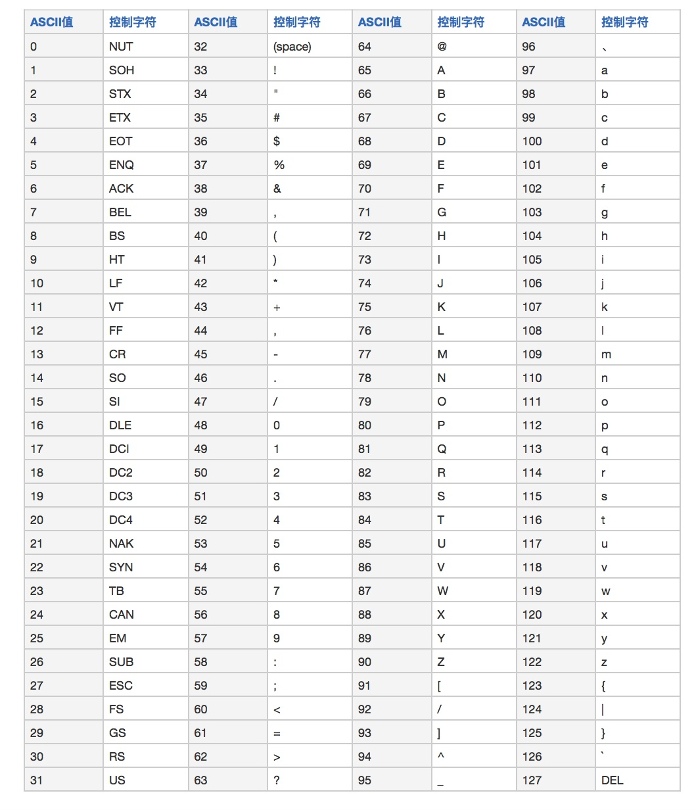

+++

title = "util"
description = "util"
tags = ["it","util"]

+++

# util

## ascii

## regex

常用正则表达式：

| 用户名                  | /^[a-z0-9_-]{3,16}$/                                         |
| ----------------------- | ------------------------------------------------------------ |
| 密码                    | /^[a-zA-Z0-9_-]{6,18}$/                                      |
| 十六进制值              | /^#?([a-f0-9]{6}\|[a-f0-9]{3})$/                             |
| 电子邮箱                | /^([a-z0-9_\.-]+)@([\da-z\.-]+)\.([a-z\.]{2,6})$/  /^[a-z\d]+(\.[a-z\d]+)*@([\da-z](-[\da-z])?)+(\.{1,2}[a-z]+)+$/ |
| URL                     | /^(https?:\/\/)?([\da-z\.-]+)\.([a-z\.]{2,6})([\/\w \.-]*)*\/?$/ |
| IP 地址                 | /((2[0-4]\d\|25[0-5]\|[01]?\d\d?)\.){3}(2[0-4]\d\|25[0-5]\|[01]?\d\d?)//^(?:(?:25[0-5]\|2[0-4][0-9]\|[01]?[0-9][0-9]?)\.){3}(?:25[0-5]\|2[0-4][0-9]\|[01]?[0-9][0-9]?)$/ |
| HTML 标签               | /^<([a-z]+)([^<]+)*(?:>(.*)<\/\1>\|\s+\/>)$/                 |
| 删除代码\\注释          | (?<!http:\|\S)//.*$                                          |
| Unicode编码中的汉字范围 | /^[\u2E80-\u9FFF]+$/                                         |

## ide

### jetBrains

代码格式化：ctrl+alt+L

抽取选中代码：ctrl+alt+M

### vscode

代码格式化：Shift+Alt+F

快速生成html代码：输入!，然后Enter

### eclipse

**常用快捷键**：

Alt+/：智能提示，输入syso直接Alt+/

Ctrl+Shift+f：所有代码缩进标准化

Ctrl+Shift+T：搜索类

F1：调出选中类或方法的帮助信息

F3：转到选中类或方法的定义处，或鼠标光标放在类或方法上按住Ctrl

Ctrl+D：删除行

alt+shift+R：同步修改

快速导包：ctrl+shift+o

生成构造方法：

生成to String：右击空白处-Generate toString

生成属性变量的set-get方法：右击空白处-Source-Generate Getters and Setters

提取方法：选中要封装方法的代码-右键-Refactor-Extract Method

导入jar包：将jar放入lib文件-右击文件-Build Path、

显示管理所有断点：Window-Show View-Other-Breakpoints-

jsp错误-右击文件夹-MyEclipse-Exclude From Validation

**字体**：

Eclipse 字体有两处，一处是控制台的字体，一处是主窗口。这里分别介绍控制台和主窗口字体的调节方法。

​    Window -> Preferences -> General -> Appearance -> Colors and Fonts -> Basic -> Text Font -> Edit 调节控制条字体大小。

​    Window -> Preferences -> General -> Appearance -> Colors and Fonts -> Java -> Java Editor Text Font -> Edit 调节主窗口字体大小

